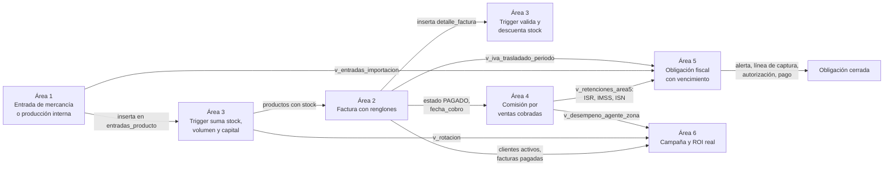

# Flujo completo de la aplicación

Cómo queda el sistema de punta a punta cuando las seis áreas terminen, y cómo la coordinación vigila que cada una vaya por donde debe. Este documento no reemplaza los contextos de área; los une.

## 1. Lo que ve el usuario

Una sola aplicación web, tema oscuro, con menú lateral de siete entradas. Cada persona entra con correo y contraseña y ve las mismas siete pantallas; lo que puede hacer en cada una depende de su rol.

```text
┌─ SIGFEVAK ───────────┬──────────────────────────────────────────────┐
│ Resumen General      │  Coordinación · KPI de las 6 áreas           │
│ Entradas             │  Área 1 · proveedores, entradas, producción  │
│ Registro Contable    │  Área 2 · clientes, facturas, cobros         │
│ Base de Productos    │  Área 3 · catálogo, kardex, conciliación     │
│ Nómina y Personal    │  Área 4 · agentes, metas, periodos, recibos  │
│ Regulación y Pagos   │  Área 5 · obligaciones, alertas, pagos       │
│ Marketing            │  Área 6 · campañas, costos, investigación    │
└──────────────────────┴──────────────────────────────────────────────┘
```

Cada pantalla de área tiene la misma forma: una fila de tarjetas KPI arriba, uno o más paneles con tabla, y en la barra superior los botones "Exportar" y "+ Nuevo registro". Los formularios de alta abren dentro de un panel o un modal. Todo con los componentes de `docs/GUIA_ESTILO.md`.

| Rol | Entra a | Puede |
| --- | --- | --- |
| ADMINISTRADOR | Todo | Todo, incluidos catálogos y usuarios |
| ALMACEN | Entradas, Base de Productos | Registrar entradas, órdenes de producción, conciliar |
| CONTADOR | Registro Contable, Regulación | Facturar, registrar cobros, declaraciones y líneas de captura |
| GERENTE_VENTAS | Nómina | Revisar y dar visto bueno al cálculo de comisiones |
| AUTORIZADOR | Nómina, Regulación | Autorizar nómina y pagos fiscales. Nunca calcula ni captura |
| COMERCIO_EXTERIOR | Regulación | Importaciones, pedimentos, fracciones |
| MARKETING | Marketing | Campañas, costos, investigación, contactos |
| CAPTURISTA | Lectura general | Capturar sin autorizar, en el área que le asigne el administrador |

## 2. El flujo de negocio de punta a punta

Este es el recorrido que se demuestra el jueves 17. Cada flecha es un dato que cruza de un área a otra, siempre por una vista o por un trigger, nunca por una tabla ajena.



En pasos, con lo que hace cada área y lo que debe verse en pantalla:

| Paso | Área | Acción | Qué cambia en la base | Qué se ve |
| --- | --- | --- | --- | --- |
| 1 | 1 | Recibe 100 unidades de un producto con costo, flete e impuestos | Fila en `entradas_producto`; el trigger del Área 3 sube `stock`, `volumen` y `capital_inversion` | KPI de capital ingresado sube; el producto aparece con stock en Base de Productos |
| 2 | 1 | Abre una orden de producción con lista de materiales, consume insumos, pasa calidad, termina | `ordenes_produccion`, `consumo_produccion`, `control_calidad`; la entrada del producto terminado usa la planta como proveedor | Orden pasa por PLANEADA, EN_PROCESO, EN_CALIDAD, TERMINADA |
| 3 | 2 | Da de alta un comercializador y le factura 30 unidades con un agente asignado | `clientes`, `facturas`, `detalle_factura`; el trigger del Área 3 valida stock y lo descuenta; el trigger del Área 2 calcula subtotal, IVA y total | Factura con folio, total correcto; el stock del producto bajó 30 |
| 4 | 2 | Intenta facturar más de lo que hay | El trigger rechaza el renglón con el mensaje de RN-A3-01 | Mensaje "stock insuficiente" sin perder lo capturado |
| 5 | 2 | Marca la factura como PAGADA | `estado_pago` y `fecha_cobro` se llenan | Desaparece de pendientes; aparece en cartera cobrada |
| 6 | 3 | Hace conciliación física y encuentra 2 unidades menos | `ajustes_inventario`; el trigger alinea `stock` | Discrepancia en el reporte de conciliación |
| 7 | 4 | Cierra el mes: calcula cumplimiento, comisión y bonos del agente | `periodos_nomina` en CALCULADO; `bonos_asignados`, `nomina_detalle` | Recibo del agente con sueldo, comisión 3 %, bonos |
| 8 | 4 | Gerente revisa, autorizador autoriza, se marca pagado | Estados REVISADO, AUTORIZADO, PAGADO; otro usuario debe autorizar | Botones se habilitan según rol; el mismo usuario no puede calcular y autorizar |
| 9 | 5 | Toma ISR e ISN del periodo desde la vista del Área 4 y el IVA desde la del Área 2; crea las obligaciones del mes | `obligaciones` en PENDIENTE con vencimiento | Calendario fiscal con los vencimientos del mes |
| 10 | 5 | El sistema genera alertas a 15, 7, 3 y 1 día; contador registra línea de captura; autorizador aprueba; se registra el pago con comprobante | Estados hasta CERRADO; `alertas`, `pagos_obligacion`, `documentos_fiscales` | Alertas en el panel; obligación cerrada con su comprobante |
| 11 | 5 | Registra una importación con fracción, IGI, DTA e IVA de importación ligada a la entrada del paso 1 | `importaciones`, `productos_importados` | Impuestos por producto; el Área 1 los lee para llenar `impuestos_unitarios` |
| 12 | 6 | Crea una campaña directa a los clientes del Área 2, registra costos, contactos y métricas | `campanas`, `costos_marketing`, `campana_clientes`, `metricas_marketing` | Presupuesto vs gasto; el trigger rechaza un costo que exceda el presupuesto |
| 13 | 6 | Ve el ROI real: facturas pagadas de esos clientes en la vigencia | Vista `v_ventas_atribuidas_campana` | ROI por campaña; productos de baja rotación como candidatos |
| 14 | Coord. | Resumen general | Lee las vistas de contrato de las seis áreas | Capital, volumen, clientes, obligaciones pendientes, nómina, marketing en una pantalla |

Si estos catorce pasos corren seguidos con el seed el miércoles 16 antes del congelamiento, el proyecto está entregable el jueves 17.

## 3. Cómo se conecta por dentro

```text
Navegador (React + Vite)
  └─ src/modules/areaN-*/        pantallas, solo componen componentes compartidos
       └─ src/services/areaN/    única capa que llama a supabase-js
            └─ API de Supabase   PostgREST + Auth, con la llave anon pública
                 └─ PostgreSQL   tablas por área · triggers · vistas v_* · RLS
```

- Las pantallas no consultan la base; llaman funciones de `services`. Así un cambio de tabla se corrige en un solo archivo.
- Las reglas de negocio críticas están en triggers: stock, totales de factura, folios, estados de nómina y de obligación, presupuesto de campaña. Si alguien inserta desde el editor SQL de Supabase, las reglas se aplican igual.
- Entre áreas solo circulan vistas. Si el Área 2 cambia una tabla, mantiene la firma de sus vistas y nadie más se rompe.
- El login lo da Supabase Auth; la tabla `usuarios` dice el rol. Las funciones de autorización comparan el usuario actual contra quien calculó o registró.

## 4. Qué entrega cada área y cuándo se sabe que va bien

| Área | Hito día 2 (lun 14) | Hito día 3 (mar 15) | Hito día 4 (mié 16) | Señal de que va mal |
| --- | --- | --- | --- | --- |
| 1 | Migraciones aditivas y tablas propias aplicadas | `v_entradas_importacion`, servicios | Entrada con flete e impuestos y orden de producción desde la app | No hay acuerdo con Davor sobre la fórmula de capital (I-01) al cierre del viernes |
| 2 | `clientes`, `facturas` ampliadas, trigger de totales | Vistas para 4, 5 y 6 | Factura con rechazo por stock y cobro con fecha automática | El trigger de totales no existe el sábado; el frontend manda `valor_total` a mano |
| 3 | Tablas núcleo, seed de 20 productos | Tres triggers, RLS, seis vistas | Conciliación con ajuste desde la app | `stock` se actualiza desde el frontend; alguien edita una migración aplicada |
| 4 | Catálogos, seed legal y de agentes | `fn_parametro`, vistas de contrato | Periodo completo con separación de funciones y recibo | Tarifas escritas en código en vez de `parametros_legales`; el mismo usuario calcula y autoriza |
| 5 | Catálogos, `parametros_fiscales`, obligaciones | Alertas, pagos, vistas de ISN | Obligación de IVA por los 9 estados e importación calculada | Estados que retroceden sin comentario; tasas inventadas; intenta integrar un banco |
| 6 | Ocho tablas, seed de canales y campañas | Vistas de resumen y ROI | Campaña directa con contactos y rechazo por presupuesto | Crea su propio schema o su tabla de roles; usa librería de gráficas |
| Coord. | Migración base, app con menú y módulos vacíos | Resumen general con datos del seed | Flujo de 14 pasos corriendo | Un área toca archivos de otra sin issue de integración |

## 5. Tablero de control de la coordinación

Cada día, en este orden, y toma menos de una hora:

1. **`ESTADO.md` de las seis áreas.** Semáforo y sección "Bloqueado". Un área sin actualización del día anterior es la primera señal de atraso.
2. **Issues abiertos por área.** Filtro por etiqueta `area:N` y `estado:bloqueado`. Más de dos bloqueados en un área: hablar con su líder ese mismo día.
3. **PRs esperando revisión más de 6 horas.** Si un líder no revisa, la coordinación revisa con `/revisar-pr`, aprueba y le avisa. La coordinación es dueña de código de respaldo en las seis áreas.
4. **Checks de CI.** `sql-lint` rojo en un PR significa migración editada, nombre mal formado o escritura directa a stock. No se mergea hasta que esté verde.
5. **Integraciones I-01 a I-13 en `docs/MODELO_DATOS.md`.** Cada una debe tener issue abierto el viernes y cerrado el domingo. La que no avance, la destraba la coordinación reuniendo a los dos líderes quince minutos.
6. **Muestreo de estilo.** Abrir una pantalla al azar de cada área y compararla con `docs/referencia-ui/App.jsx`. Colores fuera de los tokens o componentes inventados regresan al PR.

Cuando un líder va atrasado, el orden de ayuda es: primero reducir su alcance al mínimo de `docs/CRONOGRAMA.md`, después prestarle a alguien de un área que vaya adelantada por medio día, y solo al final la coordinación programa por él. Cada reasignación queda en el `EVALUACION.md` del área.

## 6. Qué no está en el flujo y no se intenta

Timbrado de CFDI con un PAC, dispersión bancaria, pago real a la autoridad, envío de correos o mensajes, integración con Meta o Google Ads, multi-almacén en el stock global, trazabilidad por número de serie individual, modo claro. Todo esto está declarado fuera de alcance en los contextos; si alguien lo propone, la respuesta es la fecha de entrega.
