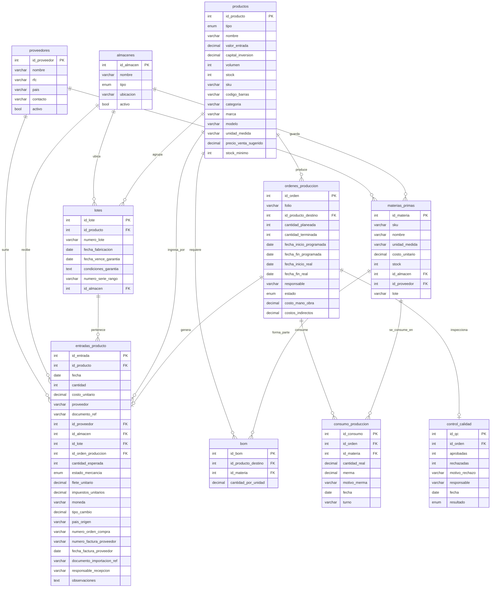
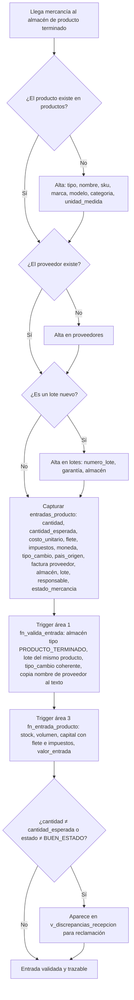
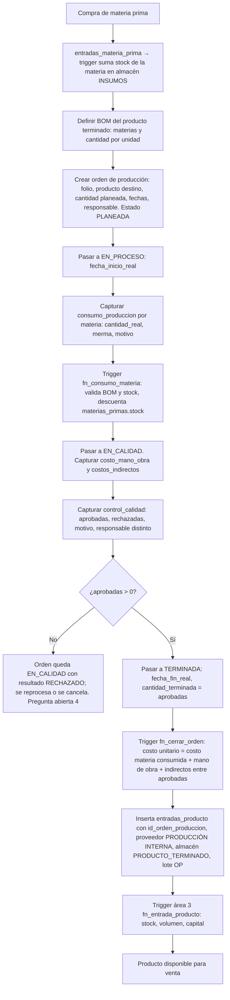

# Área 1 — Registro de entradas de productos electrónicos y manufactura nacional

> **Documento de contexto del área 1.** Fuente de verdad para el equipo y para cualquier agente de código que trabaje en esta área.
> Se alinea con `PLAN.md` (plan global) y con `docs/area3-inventario/CONTEXTO.md` (modelo de datos base, del que esta área es una ampliación aditiva).
> Ante contradicción entre este documento y el código, gana este documento. Ante contradicción con `PLAN.md`, gana `PLAN.md`. Ante contradicción con el modelo del Área 3 sobre tablas que el Área 3 posee, gana el Área 3.

| Campo | Valor |
| --- | --- |
| Proyecto | SIGFEVAK — Sistema de gestión, comercializadora nacional (México) |
| Área | 1 de 6 — Entradas de productos electrónicos y manufactura para producción nacional |
| Etiqueta de issues | `area:1-entradas` |
| Prefijo de commits | `area1:` |
| Reglas de negocio | `RN-A1-01` … `RN-A1-18` |
| Equipo | 5 personas (1 líder + 4 integrantes) |
| Plazo | Domingo 13 a jueves 17 de septiembre de 2026 (5 días de trabajo) |
| Stack | React + Vite (JavaScript), supabase-js, PostgreSQL en Supabase, pnpm (PLAN.md D-01, cerrada) |
| Versión | 1.0 |

---

## 0. Índice

1. Cómo debe usar este documento un agente
2. Contexto de negocio
3. Alcance
4. Modelo entidad-relación
5. Diccionario de datos
6. Flujos
7. Reglas de negocio
8. DDL y migraciones
9. Vistas y contratos con otras áreas
10. Ejemplo de cálculo
11. Equipo, roles y evaluación del líder
12. Cronograma de 5 días
13. Riesgos
14. Indicadores de éxito
15. Reporte final del líder
16. Preguntas abiertas
17. Glosario

---

## 1. Cómo debe usar este documento un agente

1. Este archivo es la **única fuente de verdad** del área 1. Si el código lo contradice, el código se corrige.
2. **El área 1 solo agrega, nunca cambia ni quita** (decisión D-03 de `PLAN.md`). Toda columna que agregues a `productos` o a `entradas_producto` es opcional o tiene default. Nunca modifiques ni renombres una columna que ya definió el Área 3.
3. **Nunca escribas `productos.stock`, `productos.volumen`, `productos.capital_inversion` ni `productos.valor_entrada` directamente.** Los actualiza el trigger `fn_entrada_producto` del Área 3 (RN-A3-06). El área 1 solo inserta filas en `entradas_producto`.
4. **No inventes tablas, columnas ni valores de enum.** Si falta algo, regístralo en la sección 16 y detente.
5. **No toques tablas de otras áreas** salvo las columnas aditivas listadas en la sección 5. Si necesitas algo más, es un issue `tipo:integracion`.
6. Todo cambio de esquema es una **migración nueva**, nunca se edita una aplicada.
7. Cita las reglas `RN-A1-xx` en comentarios de código, mensajes de commit y descripciones de PR.
8. Commits: `area1: <verbo> <objeto> (RN-A1-xx) #issue`. Sin ninguna mención a herramientas de IA (regla D-08 de `PLAN.md`).
9. **Documenta todo lo que hagas.** Cada decisión, cada consulta al líder, cada dato de prueba, cada acuerdo con otra área queda escrito en `ESTADO.md` o en este documento. Si mañana piden evidencia de por qué algo se hizo así, tiene que estar aquí.

---

## 2. Contexto de negocio

### 2.1 Qué cubre el área

La comercializadora recibe mercancía por **dos vías** que alimentan el mismo inventario (Área 3):

| Vía | Qué es | Ejemplo |
| --- | --- | --- |
| **A · Compra directa** | El producto llega terminado de un proveedor nacional o de una importación | 400 tabletas OEM importadas; 2,000 cables HDMI comprados a un fabricante nacional |
| **B · Manufactura nacional** | El producto se arma o fabrica internamente a partir de materias primas registradas | Un kit de bocina que se ensambla con carcasa, bocina y cable comprados por separado |

En ambos casos el resultado final es **una fila en `entradas_producto`**, que es la tabla que el Área 3 usa para actualizar stock, volumen y capital. El área 1 aporta la trazabilidad completa alrededor de esa fila: quién surtió, en qué almacén se recibió, de qué lote es, cuánto costó realmente con flete e impuestos, y si vino de una orden de producción.

### 2.2 Los tres números que el área 1 debe entregar al sistema

El enunciado pide **valor, capital de inversión y volumen de comercialización**. Así se definen en este proyecto:

| Concepto | Definición | Dónde vive | Quién lo consume |
| --- | --- | --- | --- |
| **Valor de entrada** | Costo unitario real de la última entrada de un producto: costo del proveedor + flete unitario + impuestos unitarios, convertido a pesos | `productos.valor_entrada` (Área 3) y el histórico en `entradas_producto` | Áreas 2 y 3 |
| **Capital de inversión** | Dinero acumulado inmovilizado en un producto. Por entrada: `(costo_unitario + flete_unitario + impuestos_unitarios) × cantidad × tipo_cambio` | `productos.capital_inversion` acumulado; detalle por entrada en `v_entradas_detalle` | Áreas 2 y 5, reporte financiero |
| **Volumen de comercialización** | Unidades ingresadas al inventario (real) y unidades planeadas en órdenes de producción (proyectado) | `productos.volumen` (real, Área 3); `ordenes_produccion.cantidad_planeada` (proyectado) | Áreas 4 y 6 |

**Fórmula validada con Finanzas:** el sistema no registra solo el precio de compra sino el valor real. Ejemplo: 100 unidades a $200 con flete de $20 por unidad valen $220 cada una, es decir, $22,000 de capital por el lote (sección 10). El reporte incluye IVA desglosado y referencia de factura del proveedor.

### 2.3 Métricas de volumen que apoyan la decisión logística

- **Unidades por región.** A qué región conviene dirigir el inventario. Se obtiene cruzando salidas por cliente (`v_salidas_area2` del Área 2, que trae el estado del cliente) con entradas por almacén de este documento. El área 1 publica el lado de entradas; el cruce lo hace el reporte del coordinador.
- **Rotación en días.** Cuánto tarda en venderse un lote. El modelo aprobado no liga salidas a lotes, así que en esta versión se aproxima con `v_rotacion` del Área 3 (porcentaje vendido de lo ingresado). La rotación exacta por lote es la pregunta abierta 3.

---

## 3. Alcance

### Dentro del alcance (5 días)

- Catálogos de **proveedores** y **almacenes** (al menos uno de insumos y uno de producto terminado).
- Ampliación aditiva de `productos` con identificación comercial: SKU, código de barras, categoría, marca, modelo, unidad de medida, precio de venta sugerido y stock mínimo.
- Ampliación aditiva de `entradas_producto` con datos de origen, recepción y valor: proveedor, almacén, lote, orden de producción, cantidad esperada, estado de la mercancía, flete, impuestos, moneda, tipo de cambio, país de origen, orden de compra, factura del proveedor y responsable.
- **Lotes** con fecha de fabricación y vencimiento de garantía.
- **Manufactura nacional (vía B):** materias primas con su propio stock en almacén de insumos, órdenes de producción con folio, BOM por producto terminado, consumo real con merma, control de calidad, y entrada automática del producto terminado al inventario con costo unitario de manufactura calculado.
- Pantallas: catálogo de proveedores, catálogo de almacenes, registro de entrada (vía A), alta de orden de producción con BOM, captura de consumo y control de calidad, listado de entradas con detalle.
- Vistas de contrato para las áreas 3, 5 y el reporte financiero.
- Datos de prueba que reproduzcan los dos ejemplos de la sección 10.

### Fuera del alcance (se declara explícitamente)

- **Número de serie individual por unidad física.** Se deja `lotes.numero_serie_rango` como texto opcional ("SN-1001 a SN-1100"). No hay una fila por unidad.
- **Multi-almacén en el stock global.** `productos.stock` sigue siendo un total único (modelo del Área 3). `entradas_producto.id_almacen` dice por dónde entró; `v_stock_por_almacen` es informativa y no descuenta salidas por almacén porque las salidas (`detalle_factura`) no tienen almacén.
- **Carga de archivos.** Evidencia fotográfica y documento de importación se guardan como URL o folio en `documento_ref` y `documento_importacion_ref`; no hay subida de archivos.
- **Etapas internas del proceso de transformación** (ensamble, soldadura, calibración) con tiempos estándar por etapa y máquina. Solo se registra la orden completa; el desglose por etapa es la pregunta abierta 5.
- **Órdenes de compra como documento propio.** Se registra el número de orden de compra como texto en la entrada; no existe tabla `ordenes_compra`.
- Cálculo de IVA y cuentas por pagar (Área 2), determinación de fracción arancelaria e IGI (Área 5), stock y conciliación física (Área 3).

### Tablas por nivel de acceso

| Tabla | Acceso del área 1 | Dueño |
| --- | --- | --- |
| `productos` (columnas originales: `id_producto`, `tipo`, `nombre`, `valor_entrada`, `capital_inversion`, `volumen`, `stock`) | Lectura; alta de producto nuevo con `tipo` y `nombre` | Área 3 |
| `productos` (columnas nuevas de la sección 5) | Escritura total | Área 1 |
| `entradas_producto` (columnas originales) | Inserción de filas (es la vía de entrada al inventario) | Área 3 |
| `entradas_producto` (columnas nuevas de la sección 5) | Escritura total | Área 1 |
| `proveedores`, `almacenes`, `lotes`, `materias_primas`, `ordenes_produccion`, `bom`, `consumo_produccion`, `control_calidad` | Escritura total | Área 1 |
| `ajustes_inventario`, `detalle_factura`, vistas `v_inventario_actual`, `v_kardex`, `v_rotacion`, `v_entradas_area1` | Solo lectura | Área 3 |
| `facturas`, `clientes`, `v_salidas_area2` | Solo lectura | Área 2 |
| `impuestos_licencias`, `importacion`, `producto_importado` | Solo lectura | Área 5 |

---

## 4. Modelo entidad-relación

`productos` y `entradas_producto` son del Área 3; aquí aparecen con las columnas originales más las que agrega el área 1 (marcadas en el diccionario). Todo lo demás es aportación del área 1 y es **aditivo**.



### Decisiones de diseño

1. **No hay tabla propia de entradas.** El requerimiento original proponía "Entradas de Inventario" y "Movimientos de Inventario" como tablas del área 1. No se crean: `entradas_producto` (Área 3) ya es esa tabla y `v_kardex` ya es el log de movimientos. Duplicarlas daría dos verdades y el stock del Área 3 no reflejaría lo que entró por aquí. El área 1 la **amplía** con columnas opcionales.
2. **La manufactura termina en una entrada normal.** Cuando una orden de producción pasa a `TERMINADA`, un trigger del área 1 inserta la fila en `entradas_producto` con `id_orden_produccion` lleno, proveedor "PRODUCCIÓN INTERNA" y el costo unitario de manufactura calculado. A partir de ahí el trigger del Área 3 hace lo de siempre: stock, volumen, capital. Así la vía B no necesita ningún código especial del Área 3.
3. **Las materias primas tienen su propio stock** en `materias_primas.stock`, separado del catálogo de productos terminados, porque no se venden y viven en el almacén de insumos. Lo descuenta el trigger de consumo del área 1.
4. **Los precios se guardan en la moneda original con tipo de cambio**, y el capital se calcula en pesos. Así se puede auditar una importación en dólares sin perder el dato.

---

## 5. Diccionario de datos

### `productos` — columnas que agrega el área 1 (todas opcionales o con default)

| Columna | Tipo | Nulo | Descripción y regla |
| --- | --- | --- | --- |
| `sku` | VARCHAR(50) | Sí | Código interno único. `UNIQUE` cuando no es nulo (RN-A1-01). Los productos que ya existían quedan en NULL hasta que se les asigne. |
| `codigo_barras` | VARCHAR(50) | Sí | EAN/UPC para lectura con escáner. |
| `categoria` | VARCHAR(100) | Sí | Lista controlada en la interfaz, texto en la base: "Audio > Bocinas". |
| `marca` | VARCHAR(100) | Sí | |
| `modelo` | VARCHAR(100) | Sí | |
| `unidad_medida` | VARCHAR(20) | No | Default `PIEZA`. Valores en la interfaz: `PIEZA`, `CAJA`, `KIT`. |
| `precio_venta_sugerido` | DECIMAL(12,2) | Sí | Referencia para el Área 2; no es el precio de venta real. |
| `stock_minimo` | INT | No | Default 0. Resuelve la pregunta abierta 5 del Área 3; alimenta `v_reabastecimiento`. |

Las columnas originales `tipo`, `nombre`, `valor_entrada`, `capital_inversion`, `volumen` y `stock` **no se tocan**.

### `entradas_producto` — columnas que agrega el área 1 (todas opcionales o con default)

| Columna | Tipo | Nulo | Descripción y regla |
| --- | --- | --- | --- |
| `id_proveedor` | INT FK → `proveedores` | Sí | Sustituye al texto libre `proveedor`, que **se conserva** porque `v_kardex` del Área 3 lo usa. El trigger `fn_sincroniza_proveedor` copia el nombre al texto (RN-A1-04). |
| `id_almacen` | INT FK → `almacenes` | Sí | Almacén de destino. Obligatorio en la interfaz; opcional en la base para no romper inserciones del Área 3. |
| `id_lote` | INT FK → `lotes` | Sí | El lote debe ser del mismo producto (RN-A1-05). |
| `id_orden_produccion` | INT FK → `ordenes_produccion` | Sí | NULL en vía A. En vía B lo llena el trigger de cierre de orden; una orden genera como máximo una entrada (RN-A1-12). |
| `cantidad_esperada` | INT | Sí | Según orden de compra. Si difiere de `cantidad`, la entrada aparece en `v_discrepancias_recepcion`. |
| `estado_mercancia` | ENUM `estado_mercancia` | No | `BUEN_ESTADO` (default), `DANADO`, `INCOMPLETO`. |
| `flete_unitario` | DECIMAL(12,2) | No | Default 0. En la moneda de la transacción. |
| `impuestos_unitarios` | DECIMAL(12,2) | No | Default 0. Aranceles e impuestos de importación por unidad; el Área 5 determina el monto, el área 1 lo captura aquí. |
| `moneda` | VARCHAR(3) | No | Default `MXN`. ISO 4217: `MXN`, `USD`, `EUR`, `CNY`. |
| `tipo_cambio` | DECIMAL(10,4) | No | Default 1. Obligatorio distinto de 1 si `moneda <> 'MXN'` (RN-A1-07). |
| `pais_origen` | VARCHAR(60) | Sí | Lo lee el Área 5 para aduanas. |
| `numero_orden_compra` | VARCHAR(50) | Sí | Enlace con contabilidad. |
| `numero_factura_proveedor` | VARCHAR(50) | Sí | Enlace con contabilidad (Área 2); en el reporte financiero va como referencia de factura. |
| `fecha_factura_proveedor` | DATE | Sí | |
| `documento_importacion_ref` | VARCHAR(100) | Sí | Folio de pedimento, guía o URL. Sin carga de archivos. |
| `responsable_recepcion` | VARCHAR(150) | Sí | Quién recibió. Trazabilidad. |
| `observaciones` | TEXT | Sí | Notas de recepción, reclamaciones. |

Las columnas originales `fecha`, `cantidad`, `costo_unitario`, `proveedor`, `documento_ref` **no se tocan**. `costo_unitario` sigue siendo el costo del proveedor sin flete ni impuestos.

### `proveedores`

| Columna | Tipo | Nulo | Descripción |
| --- | --- | --- | --- |
| `id_proveedor` | INT PK | No | |
| `nombre` | VARCHAR(150) | No | Razón social. Único. |
| `rfc` | VARCHAR(13) | Sí | Único si no es nulo. NULL para proveedores extranjeros. |
| `pais` | VARCHAR(60) | No | Default `México`. |
| `contacto` | VARCHAR(150) | Sí | Nombre, teléfono o correo. |
| `activo` | BOOLEAN | No | Default `true`. Un proveedor inactivo no aparece en la interfaz de captura. |

### `almacenes`

| Columna | Tipo | Nulo | Descripción |
| --- | --- | --- | --- |
| `id_almacen` | INT PK | No | |
| `nombre` | VARCHAR(100) | No | Único. |
| `tipo` | ENUM `tipo_almacen` | No | `INSUMOS` o `PRODUCTO_TERMINADO`. Las materias primas solo van a `INSUMOS`; las entradas de producto solo a `PRODUCTO_TERMINADO` (RN-A1-06). |
| `ubicacion` | VARCHAR(150) | Sí | Ciudad, dirección o nave. |
| `activo` | BOOLEAN | No | Default `true`. |

### `lotes`

| Columna | Tipo | Nulo | Descripción |
| --- | --- | --- | --- |
| `id_lote` | INT PK | No | |
| `id_producto` | INT FK → `productos` | No | |
| `numero_lote` | VARCHAR(50) | No | Único junto con `id_producto`. |
| `fecha_fabricacion` | DATE | Sí | Si el proveedor la reporta. |
| `fecha_vence_garantia` | DATE | Sí | |
| `condiciones_garantia` | TEXT | Sí | |
| `numero_serie_rango` | VARCHAR(100) | Sí | Texto libre: "SN-1001 a SN-1100". Sin trazabilidad por unidad (fuera de alcance). |
| `id_almacen` | INT FK → `almacenes` | Sí | Ubicación física del lote. |

### `materias_primas`

| Columna | Tipo | Nulo | Descripción |
| --- | --- | --- | --- |
| `id_materia` | INT PK | No | |
| `sku` | VARCHAR(50) | No | Único. Prefijo sugerido `MP-`. |
| `nombre` | VARCHAR(150) | No | |
| `unidad_medida` | VARCHAR(20) | No | `PIEZA`, `METRO`, `KILO`, `LITRO`. |
| `costo_unitario` | DECIMAL(12,2) | No | Último costo de compra. |
| `stock` | DECIMAL(12,3) | No | Default 0. Nunca negativo (RN-A1-09). Solo lo modifican `fn_entrada_materia` y `fn_consumo_materia`. |
| `id_almacen` | INT FK → `almacenes` | No | Debe ser de tipo `INSUMOS`. |
| `id_proveedor` | INT FK → `proveedores` | Sí | |
| `lote` | VARCHAR(50) | Sí | Lote de la materia prima. |

Las compras de materia prima se registran en `entradas_materia_prima` (tabla auxiliar mínima: `id_entrada_mp`, `id_materia`, `fecha`, `cantidad`, `costo_unitario`, `id_proveedor`, `documento_ref`). Su trigger suma al stock de la materia y actualiza `costo_unitario`.

### `ordenes_produccion`

| Columna | Tipo | Nulo | Descripción |
| --- | --- | --- | --- |
| `id_orden` | INT PK | No | |
| `folio` | VARCHAR(20) | No | Único. Formato `OP-AAAA-NNNN`. |
| `id_producto_destino` | INT FK → `productos` | No | Producto terminado a fabricar. Debe tener BOM (RN-A1-10). |
| `cantidad_planeada` | INT | No | > 0. Es el volumen proyectado. |
| `cantidad_terminada` | INT | Sí | La llena el cierre: unidades aprobadas por calidad. |
| `fecha_inicio_programada`, `fecha_fin_programada` | DATE | No | |
| `fecha_inicio_real`, `fecha_fin_real` | DATE | Sí | |
| `responsable` | VARCHAR(150) | No | |
| `estado` | ENUM `estado_orden` | No | `PLANEADA` → `EN_PROCESO` → `EN_CALIDAD` → `TERMINADA`; o `CANCELADA` desde cualquier estado anterior a `TERMINADA` (RN-A1-11). |
| `costo_mano_obra` | DECIMAL(12,2) | No | Default 0. Mano de obra directa de la orden. Insumo del Área 4 para bonos de productividad. |
| `costos_indirectos` | DECIMAL(12,2) | No | Default 0. |

### `bom`

| Columna | Tipo | Nulo | Descripción |
| --- | --- | --- | --- |
| `id_bom` | INT PK | No | |
| `id_producto_destino` | INT FK → `productos` | No | |
| `id_materia` | INT FK → `materias_primas` | No | Única junto con `id_producto_destino`. |
| `cantidad_por_unidad` | DECIMAL(12,3) | No | > 0. Cuánta materia lleva una unidad del producto terminado. |

### `consumo_produccion`

| Columna | Tipo | Nulo | Descripción |
| --- | --- | --- | --- |
| `id_consumo` | INT PK | No | |
| `id_orden` | INT FK → `ordenes_produccion` | No | La orden debe estar `EN_PROCESO` (RN-A1-13). |
| `id_materia` | INT FK → `materias_primas` | No | Debe estar en el BOM del producto de la orden (RN-A1-14). |
| `cantidad_real` | DECIMAL(12,3) | No | > 0. Incluye la merma. |
| `merma` | DECIMAL(12,3) | No | Default 0. ≤ `cantidad_real`. |
| `motivo_merma` | VARCHAR(255) | Sí | Obligatorio si `merma > 0`. |
| `fecha` | DATE | No | Default hoy. |
| `turno` | VARCHAR(30) | Sí | |

### `control_calidad`

| Columna | Tipo | Nulo | Descripción |
| --- | --- | --- | --- |
| `id_qc` | INT PK | No | |
| `id_orden` | INT FK → `ordenes_produccion` | No | Única: una inspección por orden. La orden debe estar `EN_CALIDAD`. |
| `aprobadas` | INT | No | ≥ 0. |
| `rechazadas` | INT | No | ≥ 0. `aprobadas + rechazadas ≤ cantidad_planeada` (RN-A1-15). |
| `motivo_rechazo` | VARCHAR(255) | Sí | Obligatorio si `rechazadas > 0`. |
| `responsable` | VARCHAR(150) | No | Distinto del responsable de la orden (RN-A1-16). |
| `fecha` | DATE | No | |
| `resultado` | ENUM `resultado_calidad` | No | `APROBADO` si `aprobadas > 0`; `RECHAZADO` si `aprobadas = 0`. |

### Valores ENUM del área 1

| Tipo | Valores |
| --- | --- |
| `estado_mercancia` | `BUEN_ESTADO`, `DANADO`, `INCOMPLETO` |
| `tipo_almacen` | `INSUMOS`, `PRODUCTO_TERMINADO` |
| `estado_orden` | `PLANEADA`, `EN_PROCESO`, `EN_CALIDAD`, `TERMINADA`, `CANCELADA` |
| `resultado_calidad` | `APROBADO`, `RECHAZADO` |

---

## 6. Flujos

### 6.1 Vía A · Entrada por compra directa



La captura es **una sola fila** en `entradas_producto`. Los efectos sobre `productos` los hace el trigger del Área 3. Una aplicación que actualice `stock` o `capital_inversion` por su cuenta duplica el incremento (RN-A3-06).

### 6.2 Vía B · Manufactura nacional



### 6.3 Estados de una orden de producción

```text
PLANEADA ──► EN_PROCESO ──► EN_CALIDAD ──► TERMINADA
    │             │              │
    └─────────────┴──────────────┴──► CANCELADA
```

`TERMINADA` y `CANCELADA` son finales. Solo `TERMINADA` genera entrada al inventario.

---

## 7. Reglas de negocio

| ID | Regla | Dónde se implementa |
| --- | --- | --- |
| **RN-A1-01** | `productos.sku` es único cuando no es nulo. Un producto nuevo dado de alta por el área 1 siempre lleva SKU. | `UNIQUE` parcial + validación de interfaz |
| **RN-A1-02** | El área 1 solo agrega columnas opcionales o con default a `productos` y `entradas_producto`. Nunca modifica ni elimina columnas del Área 3. | Revisión de migraciones (D-03) |
| **RN-A1-03** | Nadie escribe `productos.stock`, `volumen`, `capital_inversion` ni `valor_entrada`. El área 1 solo inserta en `entradas_producto`. | Convención + revisión de código (hereda RN-A3-06) |
| **RN-A1-04** | Toda entrada con `id_proveedor` copia el nombre del proveedor al texto `entradas_producto.proveedor` para que `v_kardex` siga funcionando. | Trigger `fn_valida_entrada` |
| **RN-A1-05** | El lote de una entrada pertenece al mismo producto que la entrada. | Trigger `fn_valida_entrada` |
| **RN-A1-06** | Las entradas de producto terminado solo van a almacenes `PRODUCTO_TERMINADO`; las materias primas solo a almacenes `INSUMOS`. | Trigger `fn_valida_entrada` y trigger en `materias_primas` |
| **RN-A1-07** | Si `moneda <> 'MXN'`, `tipo_cambio` debe ser distinto de 1. Si `moneda = 'MXN'`, `tipo_cambio` es 1. | `CHECK` en `entradas_producto` |
| **RN-A1-08** | El capital de una entrada es `(costo_unitario + flete_unitario + impuestos_unitarios) × cantidad × tipo_cambio`, en pesos. Lo aplica el trigger del Área 3 tras la integración I-01; para entradas sin flete ni impuestos el resultado es idéntico al anterior. | `fn_entrada_producto` (Área 3, acordado) + `v_entradas_detalle` |
| **RN-A1-09** | `materias_primas.stock` nunca queda negativo. Un consumo que lo dejaría bajo cero se rechaza. | `CHECK` + trigger `fn_consumo_materia` |
| **RN-A1-10** | Una orden de producción solo se crea para un producto que tiene al menos una fila en `bom`. | Trigger `fn_valida_orden` |
| **RN-A1-11** | El estado de una orden solo avanza en el orden `PLANEADA → EN_PROCESO → EN_CALIDAD → TERMINADA`. `CANCELADA` es alcanzable desde cualquier estado no final. Nunca se regresa. | Trigger `fn_transicion_orden` |
| **RN-A1-12** | Una orden `TERMINADA` genera exactamente una fila en `entradas_producto` con su `id_orden_produccion`. Una orden no puede terminarse dos veces. | Trigger `fn_cerrar_orden` + `UNIQUE (id_orden_produccion)` |
| **RN-A1-13** | Solo se registra consumo en órdenes `EN_PROCESO`. | Trigger `fn_consumo_materia` |
| **RN-A1-14** | Solo se consumen materias que están en el BOM del producto de la orden. Si el consumo real supera el teórico (`cantidad_por_unidad × cantidad_planeada`) en más de 20%, se registra pero se marca en `v_ordenes_produccion` como desviación. | Trigger `fn_consumo_materia` + vista |
| **RN-A1-15** | En control de calidad, `aprobadas + rechazadas ≤ cantidad_planeada`, y `motivo_rechazo` es obligatorio si `rechazadas > 0`. | `CHECK` + trigger en `control_calidad` |
| **RN-A1-16** | El responsable de control de calidad es distinto del responsable de la orden (separación de funciones). | Trigger en `control_calidad` |
| **RN-A1-17** | El costo unitario de manufactura es `(Σ cantidad_real × costo_unitario de cada materia consumida + costo_mano_obra + costos_indirectos) / aprobadas`. La merma se paga: está incluida en `cantidad_real`. | `fn_cerrar_orden` |
| **RN-A1-18** | Toda entrada y toda orden queda documentada: número de factura del proveedor u orden de compra en vía A; folio de orden en vía B. Sin documento de respaldo no se captura. | Validación de interfaz + `CHECK` (`numero_factura_proveedor IS NOT NULL OR numero_orden_compra IS NOT NULL OR id_orden_produccion IS NOT NULL`) |

---

## 8. DDL y migraciones

Estado objetivo en PostgreSQL. En el repo se divide en migraciones `AAAAMMDD_HHMM_a1_*.sql` (D-09). Todo es **aditivo** respecto al modelo del Área 3. Se aplica después de las migraciones del Área 3 que crean `productos` y `entradas_producto`.

```sql
-- ---------- TIPOS ----------
CREATE TYPE estado_mercancia  AS ENUM ('BUEN_ESTADO','DANADO','INCOMPLETO');
CREATE TYPE tipo_almacen      AS ENUM ('INSUMOS','PRODUCTO_TERMINADO');
CREATE TYPE estado_orden      AS ENUM ('PLANEADA','EN_PROCESO','EN_CALIDAD','TERMINADA','CANCELADA');
CREATE TYPE resultado_calidad AS ENUM ('APROBADO','RECHAZADO');

-- ---------- CATÁLOGOS ----------
CREATE TABLE proveedores (
    id_proveedor INT GENERATED ALWAYS AS IDENTITY PRIMARY KEY,
    nombre       VARCHAR(150) NOT NULL UNIQUE,
    rfc          VARCHAR(13) UNIQUE,
    pais         VARCHAR(60) NOT NULL DEFAULT 'México',
    contacto     VARCHAR(150),
    activo       BOOLEAN NOT NULL DEFAULT TRUE
);

CREATE TABLE almacenes (
    id_almacen INT GENERATED ALWAYS AS IDENTITY PRIMARY KEY,
    nombre     VARCHAR(100) NOT NULL UNIQUE,
    tipo       tipo_almacen NOT NULL,
    ubicacion  VARCHAR(150),
    activo     BOOLEAN NOT NULL DEFAULT TRUE
);

-- ---------- AMPLIACIÓN ADITIVA DE productos (RN-A1-01, RN-A1-02) ----------
ALTER TABLE productos
    ADD COLUMN sku                   VARCHAR(50),
    ADD COLUMN codigo_barras         VARCHAR(50),
    ADD COLUMN categoria             VARCHAR(100),
    ADD COLUMN marca                 VARCHAR(100),
    ADD COLUMN modelo                VARCHAR(100),
    ADD COLUMN unidad_medida         VARCHAR(20) NOT NULL DEFAULT 'PIEZA',
    ADD COLUMN precio_venta_sugerido DECIMAL(12,2),
    ADD COLUMN stock_minimo          INT NOT NULL DEFAULT 0 CHECK (stock_minimo >= 0);
CREATE UNIQUE INDEX uq_productos_sku ON productos(sku) WHERE sku IS NOT NULL;   -- RN-A1-01

-- ---------- LOTES ----------
CREATE TABLE lotes (
    id_lote               INT GENERATED ALWAYS AS IDENTITY PRIMARY KEY,
    id_producto           INT NOT NULL REFERENCES productos(id_producto),
    numero_lote           VARCHAR(50) NOT NULL,
    fecha_fabricacion     DATE,
    fecha_vence_garantia  DATE,
    condiciones_garantia  TEXT,
    numero_serie_rango    VARCHAR(100),
    id_almacen            INT REFERENCES almacenes(id_almacen),
    CONSTRAINT uq_lote UNIQUE (id_producto, numero_lote)
);

-- ---------- MANUFACTURA ----------
CREATE TABLE materias_primas (
    id_materia     INT GENERATED ALWAYS AS IDENTITY PRIMARY KEY,
    sku            VARCHAR(50) NOT NULL UNIQUE,
    nombre         VARCHAR(150) NOT NULL,
    unidad_medida  VARCHAR(20) NOT NULL DEFAULT 'PIEZA',
    costo_unitario DECIMAL(12,2) NOT NULL DEFAULT 0 CHECK (costo_unitario >= 0),
    stock          DECIMAL(12,3) NOT NULL DEFAULT 0,
    id_almacen     INT NOT NULL REFERENCES almacenes(id_almacen),
    id_proveedor   INT REFERENCES proveedores(id_proveedor),
    lote           VARCHAR(50),
    CONSTRAINT ck_mp_stock_no_negativo CHECK (stock >= 0)          -- RN-A1-09
);

CREATE TABLE entradas_materia_prima (
    id_entrada_mp  INT GENERATED ALWAYS AS IDENTITY PRIMARY KEY,
    id_materia     INT NOT NULL REFERENCES materias_primas(id_materia),
    fecha          DATE NOT NULL DEFAULT CURRENT_DATE,
    cantidad       DECIMAL(12,3) NOT NULL CHECK (cantidad > 0),
    costo_unitario DECIMAL(12,2) NOT NULL CHECK (costo_unitario >= 0),
    id_proveedor   INT REFERENCES proveedores(id_proveedor),
    documento_ref  VARCHAR(50)
);

CREATE TABLE ordenes_produccion (
    id_orden                 INT GENERATED ALWAYS AS IDENTITY PRIMARY KEY,
    folio                    VARCHAR(20) NOT NULL UNIQUE,
    id_producto_destino      INT NOT NULL REFERENCES productos(id_producto),
    cantidad_planeada        INT NOT NULL CHECK (cantidad_planeada > 0),
    cantidad_terminada       INT CHECK (cantidad_terminada >= 0),
    fecha_inicio_programada  DATE NOT NULL,
    fecha_fin_programada     DATE NOT NULL,
    fecha_inicio_real        DATE,
    fecha_fin_real           DATE,
    responsable              VARCHAR(150) NOT NULL,
    estado                   estado_orden NOT NULL DEFAULT 'PLANEADA',
    costo_mano_obra          DECIMAL(12,2) NOT NULL DEFAULT 0 CHECK (costo_mano_obra >= 0),
    costos_indirectos        DECIMAL(12,2) NOT NULL DEFAULT 0 CHECK (costos_indirectos >= 0),
    CONSTRAINT ck_orden_fechas CHECK (fecha_fin_programada >= fecha_inicio_programada)
);

CREATE TABLE bom (
    id_bom              INT GENERATED ALWAYS AS IDENTITY PRIMARY KEY,
    id_producto_destino INT NOT NULL REFERENCES productos(id_producto),
    id_materia          INT NOT NULL REFERENCES materias_primas(id_materia),
    cantidad_por_unidad DECIMAL(12,3) NOT NULL CHECK (cantidad_por_unidad > 0),
    CONSTRAINT uq_bom UNIQUE (id_producto_destino, id_materia)
);

CREATE TABLE consumo_produccion (
    id_consumo    INT GENERATED ALWAYS AS IDENTITY PRIMARY KEY,
    id_orden      INT NOT NULL REFERENCES ordenes_produccion(id_orden),
    id_materia    INT NOT NULL REFERENCES materias_primas(id_materia),
    cantidad_real DECIMAL(12,3) NOT NULL CHECK (cantidad_real > 0),
    merma         DECIMAL(12,3) NOT NULL DEFAULT 0,
    motivo_merma  VARCHAR(255),
    fecha         DATE NOT NULL DEFAULT CURRENT_DATE,
    turno         VARCHAR(30),
    CONSTRAINT ck_merma CHECK (merma >= 0 AND merma <= cantidad_real),
    CONSTRAINT ck_motivo_merma CHECK (merma = 0 OR motivo_merma IS NOT NULL)
);

CREATE TABLE control_calidad (
    id_qc          INT GENERATED ALWAYS AS IDENTITY PRIMARY KEY,
    id_orden       INT NOT NULL UNIQUE REFERENCES ordenes_produccion(id_orden),
    aprobadas      INT NOT NULL CHECK (aprobadas >= 0),
    rechazadas     INT NOT NULL CHECK (rechazadas >= 0),
    motivo_rechazo VARCHAR(255),
    responsable    VARCHAR(150) NOT NULL,
    fecha          DATE NOT NULL DEFAULT CURRENT_DATE,
    resultado      resultado_calidad NOT NULL,
    CONSTRAINT ck_motivo_rechazo CHECK (rechazadas = 0 OR motivo_rechazo IS NOT NULL)   -- RN-A1-15
);

-- ---------- AMPLIACIÓN ADITIVA DE entradas_producto (RN-A1-02) ----------
ALTER TABLE entradas_producto
    ADD COLUMN id_proveedor              INT REFERENCES proveedores(id_proveedor),
    ADD COLUMN id_almacen                INT REFERENCES almacenes(id_almacen),
    ADD COLUMN id_lote                   INT REFERENCES lotes(id_lote),
    ADD COLUMN id_orden_produccion       INT UNIQUE REFERENCES ordenes_produccion(id_orden),   -- RN-A1-12
    ADD COLUMN cantidad_esperada         INT CHECK (cantidad_esperada IS NULL OR cantidad_esperada > 0),
    ADD COLUMN estado_mercancia          estado_mercancia NOT NULL DEFAULT 'BUEN_ESTADO',
    ADD COLUMN flete_unitario            DECIMAL(12,2) NOT NULL DEFAULT 0 CHECK (flete_unitario >= 0),
    ADD COLUMN impuestos_unitarios       DECIMAL(12,2) NOT NULL DEFAULT 0 CHECK (impuestos_unitarios >= 0),
    ADD COLUMN moneda                    VARCHAR(3) NOT NULL DEFAULT 'MXN',
    ADD COLUMN tipo_cambio               DECIMAL(10,4) NOT NULL DEFAULT 1 CHECK (tipo_cambio > 0),
    ADD COLUMN pais_origen               VARCHAR(60),
    ADD COLUMN numero_orden_compra       VARCHAR(50),
    ADD COLUMN numero_factura_proveedor  VARCHAR(50),
    ADD COLUMN fecha_factura_proveedor   DATE,
    ADD COLUMN documento_importacion_ref VARCHAR(100),
    ADD COLUMN responsable_recepcion     VARCHAR(150),
    ADD COLUMN observaciones             TEXT,
    ADD CONSTRAINT ck_tipo_cambio_moneda CHECK (                                          -- RN-A1-07
        (moneda = 'MXN' AND tipo_cambio = 1) OR (moneda <> 'MXN' AND tipo_cambio <> 1)
    );
-- RN-A1-18 se valida en trigger (no como CHECK) para no rechazar filas históricas del Área 3.
CREATE INDEX ix_entradas_proveedor ON entradas_producto(id_proveedor);
CREATE INDEX ix_entradas_almacen   ON entradas_producto(id_almacen);
CREATE INDEX ix_entradas_lote      ON entradas_producto(id_lote);
```

### Funciones y triggers del área 1

```sql
-- RN-A1-04, RN-A1-05, RN-A1-06, RN-A1-18: validaciones al insertar una entrada
CREATE OR REPLACE FUNCTION fn_valida_entrada() RETURNS TRIGGER LANGUAGE plpgsql AS $$
DECLARE v_tipo tipo_almacen; v_prod_lote INT; v_nombre_prov VARCHAR;
BEGIN
    IF NEW.id_almacen IS NOT NULL THEN
        SELECT tipo INTO v_tipo FROM almacenes WHERE id_almacen = NEW.id_almacen;
        IF v_tipo <> 'PRODUCTO_TERMINADO' THEN
            RAISE EXCEPTION 'RN-A1-06: el almacén % no es de producto terminado', NEW.id_almacen;
        END IF;
    END IF;
    IF NEW.id_lote IS NOT NULL THEN
        SELECT id_producto INTO v_prod_lote FROM lotes WHERE id_lote = NEW.id_lote;
        IF v_prod_lote <> NEW.id_producto THEN
            RAISE EXCEPTION 'RN-A1-05: el lote % no pertenece al producto %', NEW.id_lote, NEW.id_producto;
        END IF;
    END IF;
    IF NEW.id_proveedor IS NOT NULL THEN
        SELECT nombre INTO v_nombre_prov FROM proveedores WHERE id_proveedor = NEW.id_proveedor;
        NEW.proveedor := v_nombre_prov;                                   -- RN-A1-04
    END IF;
    -- RN-A1-18: solo para filas capturadas por el área 1 (las que traen almacén)
    IF NEW.id_almacen IS NOT NULL
       AND NEW.numero_factura_proveedor IS NULL
       AND NEW.numero_orden_compra IS NULL
       AND NEW.id_orden_produccion IS NULL THEN
        RAISE EXCEPTION 'RN-A1-18: la entrada requiere factura del proveedor, orden de compra u orden de producción';
    END IF;
    RETURN NEW;
END; $$;
CREATE TRIGGER tg_valida_entrada BEFORE INSERT ON entradas_producto
FOR EACH ROW EXECUTE FUNCTION fn_valida_entrada();

-- Entrada de materia prima: suma stock y actualiza último costo
CREATE OR REPLACE FUNCTION fn_entrada_materia() RETURNS TRIGGER LANGUAGE plpgsql AS $$
BEGIN
    UPDATE materias_primas
       SET stock = stock + NEW.cantidad,
           costo_unitario = NEW.costo_unitario
     WHERE id_materia = NEW.id_materia;
    RETURN NEW;
END; $$;
CREATE TRIGGER tg_entrada_materia AFTER INSERT ON entradas_materia_prima
FOR EACH ROW EXECUTE FUNCTION fn_entrada_materia();

-- RN-A1-06 para materias primas: su almacén debe ser INSUMOS
CREATE OR REPLACE FUNCTION fn_valida_almacen_materia() RETURNS TRIGGER LANGUAGE plpgsql AS $$
DECLARE v_tipo tipo_almacen;
BEGIN
    SELECT tipo INTO v_tipo FROM almacenes WHERE id_almacen = NEW.id_almacen;
    IF v_tipo <> 'INSUMOS' THEN
        RAISE EXCEPTION 'RN-A1-06: la materia prima % debe estar en un almacén de insumos', NEW.sku;
    END IF;
    RETURN NEW;
END; $$;
CREATE TRIGGER tg_valida_almacen_materia BEFORE INSERT OR UPDATE OF id_almacen ON materias_primas
FOR EACH ROW EXECUTE FUNCTION fn_valida_almacen_materia();

-- RN-A1-10: una orden requiere BOM
CREATE OR REPLACE FUNCTION fn_valida_orden() RETURNS TRIGGER LANGUAGE plpgsql AS $$
BEGIN
    IF NOT EXISTS (SELECT 1 FROM bom WHERE id_producto_destino = NEW.id_producto_destino) THEN
        RAISE EXCEPTION 'RN-A1-10: el producto % no tiene BOM; no se puede crear la orden', NEW.id_producto_destino;
    END IF;
    RETURN NEW;
END; $$;
CREATE TRIGGER tg_valida_orden BEFORE INSERT ON ordenes_produccion
FOR EACH ROW EXECUTE FUNCTION fn_valida_orden();

-- RN-A1-11: transición de estados de la orden
CREATE OR REPLACE FUNCTION fn_transicion_orden() RETURNS TRIGGER LANGUAGE plpgsql AS $$
BEGIN
    IF OLD.estado = NEW.estado THEN RETURN NEW; END IF;
    IF OLD.estado IN ('TERMINADA','CANCELADA') THEN
        RAISE EXCEPTION 'RN-A1-11: la orden % está en estado final %', OLD.folio, OLD.estado;
    END IF;
    IF NEW.estado = 'CANCELADA' THEN RETURN NEW; END IF;
    IF NOT ((OLD.estado = 'PLANEADA'   AND NEW.estado = 'EN_PROCESO') OR
            (OLD.estado = 'EN_PROCESO' AND NEW.estado = 'EN_CALIDAD') OR
            (OLD.estado = 'EN_CALIDAD' AND NEW.estado = 'TERMINADA')) THEN
        RAISE EXCEPTION 'RN-A1-11: transición % → % no permitida', OLD.estado, NEW.estado;
    END IF;
    IF NEW.estado = 'EN_PROCESO' AND NEW.fecha_inicio_real IS NULL THEN NEW.fecha_inicio_real := CURRENT_DATE; END IF;
    IF NEW.estado = 'TERMINADA' THEN
        IF NOT EXISTS (SELECT 1 FROM control_calidad WHERE id_orden = NEW.id_orden AND aprobadas > 0) THEN
            RAISE EXCEPTION 'RN-A1-12: la orden % no tiene control de calidad con unidades aprobadas', NEW.folio;
        END IF;
        IF NEW.fecha_fin_real IS NULL THEN NEW.fecha_fin_real := CURRENT_DATE; END IF;
    END IF;
    RETURN NEW;
END; $$;
CREATE TRIGGER tg_transicion_orden BEFORE UPDATE OF estado ON ordenes_produccion
FOR EACH ROW EXECUTE FUNCTION fn_transicion_orden();

-- RN-A1-09, RN-A1-13, RN-A1-14: consumo de materia prima
CREATE OR REPLACE FUNCTION fn_consumo_materia() RETURNS TRIGGER LANGUAGE plpgsql AS $$
DECLARE v_estado estado_orden; v_prod INT; v_stock DECIMAL; v_nombre VARCHAR;
BEGIN
    SELECT estado, id_producto_destino INTO v_estado, v_prod FROM ordenes_produccion WHERE id_orden = NEW.id_orden;
    IF v_estado <> 'EN_PROCESO' THEN
        RAISE EXCEPTION 'RN-A1-13: la orden % no está EN_PROCESO', NEW.id_orden;
    END IF;
    IF NOT EXISTS (SELECT 1 FROM bom WHERE id_producto_destino = v_prod AND id_materia = NEW.id_materia) THEN
        RAISE EXCEPTION 'RN-A1-14: la materia % no está en el BOM del producto %', NEW.id_materia, v_prod;
    END IF;
    SELECT stock, nombre INTO v_stock, v_nombre FROM materias_primas WHERE id_materia = NEW.id_materia FOR UPDATE;
    IF v_stock < NEW.cantidad_real THEN
        RAISE EXCEPTION 'RN-A1-09: stock insuficiente de "%" (disponible %, solicitado %)', v_nombre, v_stock, NEW.cantidad_real;
    END IF;
    UPDATE materias_primas SET stock = stock - NEW.cantidad_real WHERE id_materia = NEW.id_materia;
    RETURN NEW;
END; $$;
CREATE TRIGGER tg_consumo_materia BEFORE INSERT ON consumo_produccion
FOR EACH ROW EXECUTE FUNCTION fn_consumo_materia();

-- RN-A1-15, RN-A1-16: control de calidad
CREATE OR REPLACE FUNCTION fn_valida_calidad() RETURNS TRIGGER LANGUAGE plpgsql AS $$
DECLARE v_estado estado_orden; v_plan INT; v_resp VARCHAR;
BEGIN
    SELECT estado, cantidad_planeada, responsable INTO v_estado, v_plan, v_resp
      FROM ordenes_produccion WHERE id_orden = NEW.id_orden;
    IF v_estado <> 'EN_CALIDAD' THEN
        RAISE EXCEPTION 'RN-A1-15: la orden % no está EN_CALIDAD', NEW.id_orden;
    END IF;
    IF NEW.aprobadas + NEW.rechazadas > v_plan THEN
        RAISE EXCEPTION 'RN-A1-15: aprobadas + rechazadas (%) supera la cantidad planeada (%)', NEW.aprobadas + NEW.rechazadas, v_plan;
    END IF;
    IF NEW.responsable = v_resp THEN
        RAISE EXCEPTION 'RN-A1-16: quien inspecciona no puede ser el responsable de la orden';
    END IF;
    NEW.resultado := CASE WHEN NEW.aprobadas > 0 THEN 'APROBADO' ELSE 'RECHAZADO' END;
    RETURN NEW;
END; $$;
CREATE TRIGGER tg_valida_calidad BEFORE INSERT ON control_calidad
FOR EACH ROW EXECUTE FUNCTION fn_valida_calidad();

-- RN-A1-12, RN-A1-17: cierre de orden → entrada al inventario
CREATE OR REPLACE FUNCTION fn_cerrar_orden() RETURNS TRIGGER LANGUAGE plpgsql AS $$
DECLARE v_aprobadas INT; v_costo_mat DECIMAL; v_costo_unit DECIMAL; v_almacen INT; v_lote INT;
BEGIN
    IF NEW.estado <> 'TERMINADA' OR OLD.estado = 'TERMINADA' THEN RETURN NEW; END IF;
    SELECT aprobadas INTO v_aprobadas FROM control_calidad WHERE id_orden = NEW.id_orden;
    SELECT COALESCE(SUM(c.cantidad_real * m.costo_unitario), 0) INTO v_costo_mat
      FROM consumo_produccion c JOIN materias_primas m USING (id_materia)
     WHERE c.id_orden = NEW.id_orden;
    v_costo_unit := ROUND((v_costo_mat + NEW.costo_mano_obra + NEW.costos_indirectos) / v_aprobadas, 2);   -- RN-A1-17
    SELECT id_almacen INTO v_almacen FROM almacenes WHERE tipo = 'PRODUCTO_TERMINADO' AND activo ORDER BY id_almacen LIMIT 1;
    INSERT INTO lotes (id_producto, numero_lote, fecha_fabricacion, id_almacen)
    VALUES (NEW.id_producto_destino, NEW.folio, COALESCE(NEW.fecha_fin_real, CURRENT_DATE), v_almacen)
    RETURNING id_lote INTO v_lote;
    INSERT INTO entradas_producto (id_producto, fecha, cantidad, costo_unitario, proveedor, documento_ref,
                                   id_almacen, id_lote, id_orden_produccion, responsable_recepcion)
    VALUES (NEW.id_producto_destino, COALESCE(NEW.fecha_fin_real, CURRENT_DATE), v_aprobadas, v_costo_unit,
            'PRODUCCIÓN INTERNA', NEW.folio, v_almacen, v_lote, NEW.id_orden, NEW.responsable);   -- RN-A1-12
    UPDATE ordenes_produccion SET cantidad_terminada = v_aprobadas WHERE id_orden = NEW.id_orden;
    RETURN NEW;
END; $$;
CREATE TRIGGER tg_cerrar_orden AFTER UPDATE OF estado ON ordenes_produccion
FOR EACH ROW EXECUTE FUNCTION fn_cerrar_orden();
```

### Cambio acordado en el trigger del Área 3 (integración I-01)

El Área 3 reemplaza en `fn_entrada_producto` la línea de capital por:

```sql
capital_inversion = capital_inversion
    + NEW.cantidad * (NEW.costo_unitario + NEW.flete_unitario + NEW.impuestos_unitarios) * NEW.tipo_cambio,
valor_entrada     = (NEW.costo_unitario + NEW.flete_unitario + NEW.impuestos_unitarios) * NEW.tipo_cambio
```

Con los defaults (flete 0, impuestos 0, tipo de cambio 1) el resultado es idéntico al actual. Lo aplica el Área 3 en su propia migración, después de que la migración del área 1 agregue las columnas.

### Row Level Security

Misma política mínima que el Área 3 en todas las tablas nuevas: `ENABLE ROW LEVEL SECURITY` y `CREATE POLICY ... FOR ALL TO authenticated USING (true) WITH CHECK (true)`. Si una consulta regresa vacío teniendo datos, el primer diagnóstico es RLS.

### Seed obligatorio

- 2 almacenes: "Insumos Planta" (`INSUMOS`) y "Producto Terminado Central" (`PRODUCTO_TERMINADO`).
- 4 proveedores: 2 nacionales con RFC, 1 extranjero sin RFC, 1 inactivo.
- 6 productos con SKU, marca, modelo y categoría; al menos 2 de tipo `MANUFACTURA`.
- 3 materias primas con stock inicial vía `entradas_materia_prima`.
- 1 BOM de 2 materias para un producto de manufactura.
- Entradas suficientes para reproducir el ejemplo 10.1 exacto (100 unidades, $200, flete $20, impuestos 0, MXN) y una importación en USD con tipo de cambio.
- 1 orden de producción recorrida hasta `TERMINADA` que reproduzca el ejemplo 10.2.

---

## 9. Vistas y contratos con otras áreas

```sql
-- Detalle de cada entrada con su capital real (RN-A1-08). Reporte financiero con IVA desglosado y factura.
CREATE OR REPLACE VIEW v_entradas_detalle AS
SELECT e.id_entrada, e.fecha, p.id_producto, p.sku, p.nombre, p.tipo, p.categoria, p.marca, p.modelo,
       pr.nombre AS proveedor, pr.rfc AS rfc_proveedor, a.nombre AS almacen, l.numero_lote,
       e.cantidad, e.cantidad_esperada, e.estado_mercancia,
       e.moneda, e.tipo_cambio, e.costo_unitario, e.flete_unitario, e.impuestos_unitarios,
       ROUND((e.costo_unitario + e.flete_unitario + e.impuestos_unitarios) * e.tipo_cambio, 2)              AS valor_unitario_mxn,
       ROUND((e.costo_unitario + e.flete_unitario + e.impuestos_unitarios) * e.tipo_cambio * e.cantidad, 2) AS capital_entrada_mxn,
       ROUND(e.costo_unitario * e.tipo_cambio * e.cantidad * 0.16, 2)                                        AS iva_estimado_mxn,
       e.numero_orden_compra, e.numero_factura_proveedor, e.fecha_factura_proveedor,
       e.pais_origen, e.documento_importacion_ref, e.id_orden_produccion, e.responsable_recepcion
FROM entradas_producto e
JOIN productos p USING (id_producto)
LEFT JOIN proveedores pr USING (id_proveedor)
LEFT JOIN almacenes a USING (id_almacen)
LEFT JOIN lotes l USING (id_lote)
ORDER BY e.fecha DESC, e.id_entrada DESC;

-- Entradas por almacén (informativa: el stock global sigue en productos.stock)
CREATE OR REPLACE VIEW v_stock_por_almacen AS
SELECT a.id_almacen, a.nombre AS almacen, p.id_producto, p.sku, p.nombre,
       SUM(e.cantidad) AS unidades_ingresadas,
       MAX(e.fecha)    AS ultima_entrada
FROM entradas_producto e JOIN almacenes a USING (id_almacen) JOIN productos p USING (id_producto)
GROUP BY a.id_almacen, a.nombre, p.id_producto, p.sku, p.nombre;

-- Discrepancias de recepción: faltantes, sobrantes y mercancía dañada
CREATE OR REPLACE VIEW v_discrepancias_recepcion AS
SELECT e.id_entrada, e.fecha, p.sku, p.nombre, pr.nombre AS proveedor,
       e.cantidad_esperada, e.cantidad, (e.cantidad - e.cantidad_esperada) AS diferencia,
       e.estado_mercancia, e.numero_factura_proveedor, e.observaciones
FROM entradas_producto e JOIN productos p USING (id_producto) LEFT JOIN proveedores pr USING (id_proveedor)
WHERE (e.cantidad_esperada IS NOT NULL AND e.cantidad <> e.cantidad_esperada)
   OR e.estado_mercancia <> 'BUEN_ESTADO';

-- Reabastecimiento: productos bajo su mínimo
CREATE OR REPLACE VIEW v_reabastecimiento AS
SELECT p.id_producto, p.sku, p.nombre, p.stock, p.stock_minimo, (p.stock_minimo - p.stock) AS faltante
FROM productos p WHERE p.stock_minimo > 0 AND p.stock < p.stock_minimo;

-- Órdenes de producción con avance, consumo teórico vs real y costo (RN-A1-14, RN-A1-17)
CREATE OR REPLACE VIEW v_ordenes_produccion AS
SELECT o.id_orden, o.folio, o.estado, p.sku, p.nombre AS producto, o.cantidad_planeada, o.cantidad_terminada,
       o.fecha_inicio_programada, o.fecha_fin_programada, o.fecha_inicio_real, o.fecha_fin_real, o.responsable,
       COALESCE(SUM(b.cantidad_por_unidad * o.cantidad_planeada * m.costo_unitario), 0) AS costo_materia_teorico,
       COALESCE((SELECT SUM(c.cantidad_real * m2.costo_unitario)
                   FROM consumo_produccion c JOIN materias_primas m2 USING (id_materia)
                  WHERE c.id_orden = o.id_orden), 0)                                     AS costo_materia_real,
       COALESCE((SELECT SUM(c.merma) FROM consumo_produccion c WHERE c.id_orden = o.id_orden), 0) AS merma_total,
       o.costo_mano_obra, o.costos_indirectos,
       CASE WHEN o.cantidad_terminada > 0 THEN
            ROUND((COALESCE((SELECT SUM(c.cantidad_real * m2.costo_unitario)
                               FROM consumo_produccion c JOIN materias_primas m2 USING (id_materia)
                              WHERE c.id_orden = o.id_orden), 0) + o.costo_mano_obra + o.costos_indirectos)
                  / o.cantidad_terminada, 2) END                                          AS costo_unitario_manufactura,
       qc.aprobadas, qc.rechazadas, qc.motivo_rechazo,
       CASE WHEN (SELECT SUM(c.cantidad_real * m2.costo_unitario)
                    FROM consumo_produccion c JOIN materias_primas m2 USING (id_materia)
                   WHERE c.id_orden = o.id_orden)
                 > 1.2 * SUM(b.cantidad_por_unidad * o.cantidad_planeada * m.costo_unitario)
            THEN TRUE ELSE FALSE END                                                       AS desviacion_consumo
FROM ordenes_produccion o
JOIN productos p ON p.id_producto = o.id_producto_destino
LEFT JOIN bom b ON b.id_producto_destino = o.id_producto_destino
LEFT JOIN materias_primas m ON m.id_materia = b.id_materia
LEFT JOIN control_calidad qc ON qc.id_orden = o.id_orden
GROUP BY o.id_orden, p.sku, p.nombre, qc.aprobadas, qc.rechazadas, qc.motivo_rechazo;

-- Capital en proceso: materia consumida en órdenes abiertas + mano de obra + indirectos
CREATE OR REPLACE VIEW v_capital_en_proceso AS
SELECT o.id_orden, o.folio, o.estado,
       COALESCE(SUM(c.cantidad_real * m.costo_unitario), 0) + o.costo_mano_obra + o.costos_indirectos AS capital_en_proceso
FROM ordenes_produccion o
LEFT JOIN consumo_produccion c USING (id_orden)
LEFT JOIN materias_primas m ON m.id_materia = c.id_materia
WHERE o.estado IN ('EN_PROCESO','EN_CALIDAD')
GROUP BY o.id_orden, o.folio, o.estado, o.costo_mano_obra, o.costos_indirectos;

-- CONTRATO CON EL ÁREA 5: entradas de importación con lo que necesita para pedimentos e impuestos (I-04)
CREATE OR REPLACE VIEW v_entradas_importacion AS
SELECT e.id_entrada, e.fecha, p.sku, p.nombre, p.tipo, pr.nombre AS proveedor, pr.pais AS pais_proveedor,
       e.pais_origen, e.documento_importacion_ref, e.numero_factura_proveedor,
       e.cantidad, e.moneda, e.tipo_cambio, e.costo_unitario,
       ROUND(e.costo_unitario * e.tipo_cambio * e.cantidad, 2) AS valor_mercancia_mxn,
       e.impuestos_unitarios, ROUND(e.impuestos_unitarios * e.tipo_cambio * e.cantidad, 2) AS impuestos_capturados_mxn
FROM entradas_producto e JOIN productos p USING (id_producto) LEFT JOIN proveedores pr USING (id_proveedor)
WHERE e.pais_origen IS NOT NULL AND e.pais_origen <> 'México';

-- CONTRATO CON EL ÁREA 4: mano de obra directa por orden terminada (bonos de productividad)
CREATE OR REPLACE VIEW v_mano_obra_produccion AS
SELECT o.id_orden, o.folio, o.responsable, o.fecha_fin_real, o.cantidad_terminada, o.costo_mano_obra,
       TO_CHAR(o.fecha_fin_real, 'YYYY-MM') AS periodo
FROM ordenes_produccion o WHERE o.estado = 'TERMINADA';
```

### Contratos de interfaz

| Área | Dirección | Qué | Vía |
| --- | --- | --- | --- |
| 3 | Área 1 **inserta** | Filas en `entradas_producto` (vía A por captura, vía B por trigger de cierre de orden) | Tabla del Área 3, por diseño |
| 3 | Área 1 **pide** | Cambio de fórmula de capital y valor de entrada en `fn_entrada_producto` para incluir flete, impuestos y tipo de cambio; que `v_entradas_area1` use la misma fórmula | Issue `tipo:integracion` **I-01** |
| 3 | Área 1 **lee** | `v_inventario_actual`, `v_kardex`, `v_rotacion`, `v_entradas_area1` | Vistas del Área 3 |
| 2 | Área 1 **entrega** | Número y fecha de factura del proveedor, orden de compra, capital por entrada con IVA estimado | `v_entradas_detalle` |
| 2 | Área 1 **lee** | Estado del cliente para "unidades por región" | `v_salidas_area2` |
| 5 | Área 1 **entrega** | País de origen, documento de importación, valor de mercancía e impuestos capturados por entrada | `v_entradas_importacion` (**I-04**) |
| 5 | Área 1 **pide** | Monto de impuestos aduanales por entrada, para llenar `impuestos_unitarios`; mientras no exista, se captura a mano | Issue `tipo:integracion` **I-04** |
| 4 | Área 1 **entrega** | Mano de obra directa por orden terminada y responsable | `v_mano_obra_produccion` |
| 6 | Área 1 **entrega** | Volumen proyectado (órdenes planeadas y en proceso) para no promocionar sin stock | `v_ordenes_produccion` + `v_reabastecimiento` |

Las otras áreas consumen **vistas, nunca tablas**.

---

## 10. Ejemplo de cálculo

### 10.1 Vía A · Entrada por compra directa (validado con Finanzas)

Entrada de 100 unidades de un producto de manufactura nacional comprado a un proveedor. Costo $200 por unidad, flete $20 por unidad, sin impuestos de importación, en pesos.

| Campo capturado | Valor |
| --- | --- |
| `cantidad` | 100 |
| `cantidad_esperada` | 100 |
| `costo_unitario` | $200.00 |
| `flete_unitario` | $20.00 |
| `impuestos_unitarios` | $0.00 |
| `moneda` / `tipo_cambio` | MXN / 1 |
| `numero_factura_proveedor` | F-4471 |

| Resultado | Cálculo | Valor |
| --- | --- | --- |
| Valor unitario real | (200 + 20 + 0) × 1 | **$220.00** |
| Capital de la entrada | 220 × 100 | **$22,000.00** |
| IVA estimado (reporte) | 200 × 100 × 16% | $3,200.00 |
| `productos.valor_entrada` después del trigger | | $220.00 |
| `productos.capital_inversion` | acumulado anterior + 22,000 | |
| `productos.volumen` | acumulado anterior + 100 | |
| `productos.stock` | anterior + 100 | |

Variante en dólares: 50 unidades a USD 40, flete USD 3, impuestos USD 5, tipo de cambio 18.50 → valor unitario (40 + 3 + 5) × 18.50 = $888.00; capital $44,400.00. La entrada aparece en `v_entradas_importacion` si `pais_origen` no es México.

### 10.2 Vía B · Orden de producción con BOM

Producto terminado: "Kit bocina portátil BT 20W" (`MANUFACTURA`). BOM por unidad: 1 carcasa ($85.00) y 1 módulo bocina ($140.00). Orden `OP-2026-0001` por 50 unidades.

| Paso | Dato | Valor |
| --- | --- | --- |
| Consumo carcasa | `cantidad_real` 52, `merma` 2 (motivo: "carcasa rayada") | 52 × 85 = $4,420.00 |
| Consumo módulo | `cantidad_real` 50, `merma` 0 | 50 × 140 = $7,000.00 |
| Costo de materia consumida | | **$11,420.00** |
| Mano de obra directa | `costo_mano_obra` | $2,500.00 |
| Costos indirectos | `costos_indirectos` | $580.00 |
| Control de calidad | `aprobadas` 48, `rechazadas` 2 (motivo: "no enciende"), responsable distinto | resultado `APROBADO` |
| Costo total de manufactura | 11,420 + 2,500 + 580 | $14,500.00 |
| **Costo unitario de manufactura** | 14,500 / 48 | **$302.08** |
| Entrada generada por `fn_cerrar_orden` | `cantidad` 48, `costo_unitario` 302.08, proveedor "PRODUCCIÓN INTERNA", lote `OP-2026-0001` | capital 48 × 302.08 = $14,499.84 |
| `materias_primas.stock` | carcasa −52, módulo −50 | |
| Volumen proyectado vs real | 50 planeadas / 48 terminadas | 96% |

Las 2 unidades rechazadas y las 2 carcasas de merma **sí costaron** y están dentro del costo unitario de las 48 buenas (RN-A1-17). La diferencia de $0.16 entre capital y costo total es por el redondeo a centavos del costo unitario.

Estos dos ejemplos son los **casos de prueba de aceptación** del área: el seed debe reproducirlos con esos números exactos.

---

## 11. Equipo, roles y evaluación del líder

### 11.1 Roles (5 personas)

| Rol | Responsabilidades | Entregable en 5 días |
| --- | --- | --- |
| Líder de área | Planeación, acuerdos con áreas 3 y 5, revisión de PRs, evaluación del equipo, reporte final | `ESTADO.md` diario, `EVALUACION.md`, `REPORTE_FINAL.md` |
| Datos / BD | Migraciones aditivas, tablas nuevas, triggers, vistas, RLS | `supabase db reset` sin errores con todo el DDL de la sección 8 |
| Lógica y servicios | `src/services/area1/`: registrar entrada, alta de proveedor, crear orden, capturar consumo y calidad, cerrar orden | Funciones que reproducen los ejemplos de la sección 10 |
| Frontend | `src/modules/area1-entradas/`: catálogos, registro de entrada, orden de producción, listado con detalle | Pantallas funcionando contra Supabase con el estilo de `docs/GUIA_ESTILO.md` |
| Documentación y pruebas | Seed, pruebas SQL en `supabase/tests/area1/`, capturas, este documento actualizado, validación con Almacén y Finanzas | Bitácora de pruebas, checklist de validación respondido |

### 11.2 Diagnóstico inicial (domingo 13)

Cada integrante llena la matriz de habilidades de `PLAN.md` sección 11.1 y resuelve una tarea corta: escribir la consulta que calcula el capital del ejemplo 10.1 a partir de una fila de `entradas_producto`. Con eso el líder confirma o ajusta los roles.

### 11.3 Evaluación continua

Al cierre de cada día, del domingo 13 al jueves 17, escala 1 a 5, matriz estándar de `PLAN.md` sección 11.2:

| Criterio | Peso |
| --- | --- |
| Cumplimiento de entregas | 30% |
| Calidad técnica | 25% |
| Comunicación y colaboración | 20% |
| Solución de problemas e iniciativa | 15% |
| Aprendizaje y adaptación | 10% |

### 11.4 Reglas para modificar tareas

- Menos de 3 en una tarea crítica, o más de medio día de retraso → el líder reasigna o pone a trabajar en pareja.
- 4.5 o más sostenido → tareas de mayor complejidad o liderar una subparte.

Cada cambio va al registro de control de cambios de `EVALUACION.md` (fecha, tarea, responsable anterior, nuevo, motivo, impacto, visto bueno).

### 11.5 Validación con Almacén y Operaciones (checklist documentado)

El requerimiento original pedía validar el flujo con el área operativa. Las respuestas se documentan en `ESTADO.md` el día 1 (domingo 13); lo que no se pueda responder se asume como se indica:

| Pregunta | Supuesto si no hay respuesta |
| --- | --- |
| ¿Almacén de insumos y de terminado separados en el sistema? | Sí, dos almacenes con `tipo` distinto |
| ¿Quién captura en cada etapa? | Recepción: responsable de almacén. Producción: responsable de la orden. Calidad: otra persona |
| ¿Mermas conocidas por producto para parametrizar? | No se parametrizan; se capturan por consumo con motivo |
| ¿Control de calidad por lote o por unidad? | Por orden completa (aprobadas/rechazadas) |
| ¿Cómo se registra hoy? | Se asume Excel; no se migran históricos |
| ¿Trazabilidad por número de serie o por lote? | Por lote; serie como rango de texto |
| ¿Qué pasa con producto rechazado? | Pregunta abierta 4 |
| ¿Normativas obligatorias (NOM, RoHS)? | Se registran en `lotes.condiciones_garantia` como texto; no hay campo obligatorio |

---

## 12. Cronograma de 5 días

Cinco días de trabajo, del domingo 13 al jueves 17 de septiembre de 2026. El sábado 12 la coordinación deja listos repo, contextos, issues y base; los equipos aún no trabajan. Las fechas y reglas globales viven en `docs/CRONOGRAMA.md`.

| Día | Fecha | Actividades del área 1 | Entregable |
| --- | --- | --- | --- |
| 1 | Dom 13 | Arranque: leer este documento con el equipo, diagnóstico de habilidades y roles, forks y PR de bienvenida. Cerrar este documento con las respuestas del checklist 11.5. Reunión con líder del Área 3: cerrar D-03 y acordar I-01. Reunión con Área 5: acordar I-04. Revisar `TAREAS.md` y asignar los issues del día 2. | Roles asignados, dos issues de integración acordados, issues del área asignados |
| 2 | Lun 14 | Base de datos: migración de tipos y catálogos (`proveedores`, `almacenes`); migración aditiva de `productos` y `entradas_producto`; migraciones de `lotes`, `materias_primas`, `entradas_materia_prima`, `ordenes_produccion`, `bom`, `consumo_produccion`, `control_calidad`. RLS. Seed de catálogos y productos. Triggers `fn_valida_entrada`, `fn_entrada_materia`, `fn_valida_orden`, `fn_transicion_orden`, `fn_consumo_materia`, `fn_valida_calidad`, `fn_cerrar_orden`. Pruebas SQL en `supabase/tests/area1/`. | `supabase db reset` levanta limpio con todas las tablas y el seed del área; ejemplo 10.1 reproducido por SQL |
| 3 | Mar 15 | Vistas de la sección 9 publicadas (incluida `v_entradas_importacion`). Servicios en `src/services/area1/`. Pantallas de captura: catálogo de proveedores, catálogo de almacenes, registro de entrada (vía A), listado de entradas con `v_entradas_detalle`. | Ejemplo 10.1 reproducido desde la app; vistas de contrato devolviendo datos del seed |
| 4 | Mié 16 | Pantallas de flujo: alta de orden con BOM, captura de consumo, control de calidad, cierre de orden. Integración: verificar que el Área 3 aplicó I-01 y que `v_entradas_area1` cuadra con `v_entradas_detalle`; Área 5 consume `v_entradas_importacion`. Pruebas de casos límite (RN-A1-05, 07, 09, 11, 15, 16). **18:00 congelamiento de alcance**; después solo correcciones. | Ejemplo 10.2 reproducido desde la app; integraciones cerradas; bitácora de pruebas |
| 5 | Jue 17 | Cierre y entrega: corrección de bugs por la mañana, evidencias en `evidencias/`, capturas, este documento actualizado, evaluación final del equipo, `REPORTE_FINAL.md` del líder antes de las 14:00. | Entrega |

---

## 13. Riesgos

| Riesgo | Probabilidad | Impacto | Respuesta |
| --- | --- | --- | --- |
| El Área 3 no aplica el cambio de fórmula (I-01) a tiempo | Media | Alto | `v_entradas_detalle` calcula el capital por su cuenta desde el día 4; el reporte del área 1 no depende de `productos.capital_inversion` |
| Alguien actualiza `productos.stock` o `capital_inversion` a mano y duplica cifras | Media | Alto | RN-A1-03; el workflow `sql-lint` busca UPDATE directos; revisión del líder |
| Confusión entre `volumen` (histórico) y `stock` (actual) al reportar | Alta | Alto | Sección 2.2 y glosario; la pantalla muestra ambos con etiqueta clara |
| Orden de migraciones: la del área 1 corre antes de que exista `productos` | Media | Alto | Nombre con timestamp posterior a las del Área 3 (D-09); se prueba con `supabase db reset` el día 2 |
| Conversión de moneda mal capturada (tipo de cambio 1 en USD) | Media | Medio | RN-A1-07 como CHECK en la base |
| Manufactura demasiado ambiciosa para 5 días | Media | Alto | Los días 3 y 4 separan vía A de vía B; si el día 4 se atrasa, la vía B se entrega solo por SQL con el ejemplo 10.2 y sin pantalla |
| Datos de impuestos aduanales inexistentes hasta que el Área 5 avance | Alta | Medio | `impuestos_unitarios` se captura a mano con default 0; I-04 lo automatiza si hay tiempo |
| Sin respuestas del checklist de Almacén | Alta | Bajo | Supuestos documentados en 11.5 |

---

## 14. Indicadores de éxito

| Indicador | Meta para la entrega |
| --- | --- |
| Ejemplo 10.1 reproducido exacto por el sistema (capital $22,000) | Sí / No |
| Ejemplo 10.2 reproducido exacto (costo unitario $302.08, entrada de 48 unidades) | Sí / No |
| Casos límite pasados (lote de otro producto, almacén incorrecto, tipo de cambio incoherente, stock de materia insuficiente, transición de estado inválida, calidad por el mismo responsable) | 6 de 6 |
| `productos.capital_inversion` del seed coincide con la suma de `v_entradas_detalle.capital_entrada_mxn` | Diferencia $0.00 |
| Vistas de contrato consumidas sin error por áreas 3, 5 y 4 | 3 de 3 |
| Discrepancias de recepción visibles en `v_discrepancias_recepcion` | Reporte funcionando |
| Documentación: checklist 11.5 respondido o con supuesto, preguntas abiertas con decisión o escaladas | 100% |

---

## 15. Reporte final del líder

Sigue la plantilla global `docs/plantillas/REPORTE_FINAL_LIDER.md`:

| Sección | Contenido |
| --- | --- |
| Resumen ejecutivo | Qué se construyó, si se cumplió el alcance de la sección 3 y la fecha |
| Resultados del módulo | Indicadores de la sección 14, pruebas, capturas |
| Evaluación del equipo | Matriz final por integrante con el promedio de los 5 días y habilidades reconocidas |
| Cambios de asignación | Registro de control de cambios: qué se movió, por qué, efecto |
| Reconocimientos | Aportaciones destacadas con evidencia (PRs, issues) |
| Desviaciones | Retrasos, riesgos ocurridos, qué quedó fuera |
| Integraciones | I-01 con Área 3, I-04 con Área 5, vistas para 2, 4 y 6: qué se acordó y qué funcionó |
| Lecciones aprendidas | Qué repetir y qué evitar |
| Anexos | Diagramas, casos de prueba, bitácora, respuestas del checklist 11.5 |

---

## 16. Preguntas abiertas

Un agente o integrante que se tope con alguna de estas **no decide por su cuenta**: la registra y la escala al líder.

1. **Impuestos de importación.** ¿Los captura el área 1 a mano en `impuestos_unitarios` cuando llega la mercancía, o los calcula el Área 5 después y se actualiza la entrada? Si es lo segundo, el capital cambia después de registrado y el trigger del Área 3 solo corre en INSERT. Propuesta: captura manual en la entrada; el Área 5 solo lee (`v_entradas_importacion`).
2. **Costo de inventario.** El Área 3 guarda último costo en `valor_entrada` (RN-A3-08). Finanzas podría requerir promedio ponderado. Afecta a `v_inventario_actual`, no al área 1, pero el área 1 tiene el histórico para calcularlo. ¿Se pide?
3. **Rotación por lote en días.** Requiere que `detalle_factura` (Área 2/3) registre de qué lote sale la mercancía. Hoy no existe. ¿Se pide como integración o se acepta la aproximación con `v_rotacion`?
4. **Producto rechazado en calidad.** ¿Se reprocesa (nueva orden con las unidades como insumo), se desecha (merma) o se devuelve materia al proveedor? Hoy las unidades rechazadas simplemente no entran al inventario y su costo se reparte entre las buenas.
5. **Etapas internas del proceso** (ensamble, soldadura, calibración) con tiempo estándar vs real y estación de trabajo. Fuera de alcance en 5 días; ¿se documenta como fase 2?
6. **Precio de venta sugerido.** ¿Lo define el área 1 al dar de alta el producto o el Área 2 / Área 6? Hoy es una columna opcional que cualquiera puede llenar.
7. **Devoluciones a proveedor.** Mercancía `DANADO` o `INCOMPLETO` que se regresa: ¿se registra como ajuste de inventario del Área 3 o necesita una tabla de devoluciones? Coincide con la pregunta abierta 3 del Área 3.
8. **Múltiples almacenes de producto terminado.** `fn_cerrar_orden` toma el primer almacén activo de tipo `PRODUCTO_TERMINADO`. Si hay varios, ¿la orden debe indicar destino?

---

## 17. Glosario

| Término | Significado en este proyecto |
| --- | --- |
| Entrada | Ingreso de mercancía al inventario. Una fila en `entradas_producto`, venga de compra (vía A) o de producción (vía B) |
| Vía A / Vía B | Compra directa de producto terminado / manufactura interna a partir de materias primas |
| Valor de entrada | Costo unitario real de la última entrada: costo + flete + impuestos, en pesos |
| Capital de inversión | Dinero acumulado inmovilizado en un producto: suma del capital de todas sus entradas |
| Capital en proceso | Materia consumida más mano de obra e indirectos de órdenes aún no terminadas |
| Volumen | Unidades ingresadas históricamente (real, `productos.volumen`) o planeadas (proyectado, `cantidad_planeada`). No es el stock |
| Stock | Existencia disponible ahora mismo. Lo administra el Área 3 |
| SKU | Código interno único de un producto terminado |
| Lote | Grupo de unidades de una misma compra o producción, con garantía y ubicación |
| Proveedor | Quien surte producto terminado o materia prima. "PRODUCCIÓN INTERNA" es el proveedor de la vía B |
| Almacén de insumos | Donde viven las materias primas. Tipo `INSUMOS` |
| Almacén de producto terminado | Donde entra lo que se vende. Tipo `PRODUCTO_TERMINADO` |
| Materia prima | Insumo con su propio stock que se consume en producción y no se vende |
| BOM | Lista de materiales: qué materias y en qué cantidad lleva una unidad de producto terminado |
| Orden de producción | Folio que autoriza fabricar N unidades; recorre PLANEADA → EN_PROCESO → EN_CALIDAD → TERMINADA |
| Consumo | Materia prima realmente usada en una orden, merma incluida |
| Merma | Parte del consumo que se desperdició; cuesta y se reparte en las unidades buenas |
| Control de calidad | Inspección de la orden: cuántas unidades se aprueban y cuántas se rechazan |
| Costo unitario de manufactura | (materia consumida + mano de obra + indirectos) / unidades aprobadas |
| Cantidad esperada | Lo que decía la orden de compra; la diferencia con lo recibido es una discrepancia de recepción |
| Tipo de cambio | Pesos por unidad de la moneda de la transacción; 1 para MXN |
| Discrepancia de recepción | Entrada con faltante, sobrante o mercancía dañada, candidata a reclamación |
| Reabastecimiento | Producto cuyo stock está por debajo de su `stock_minimo` |
