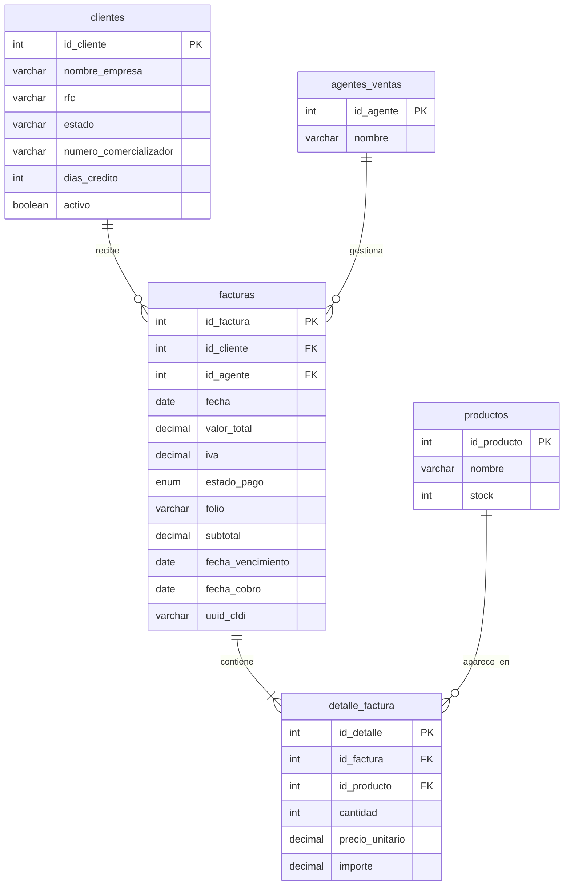
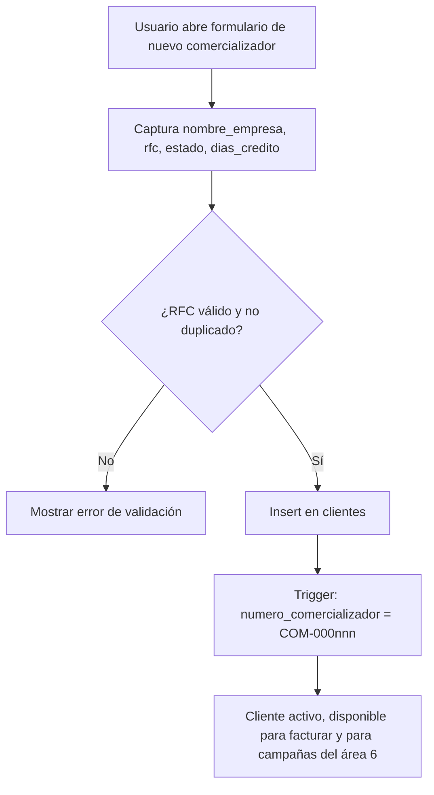
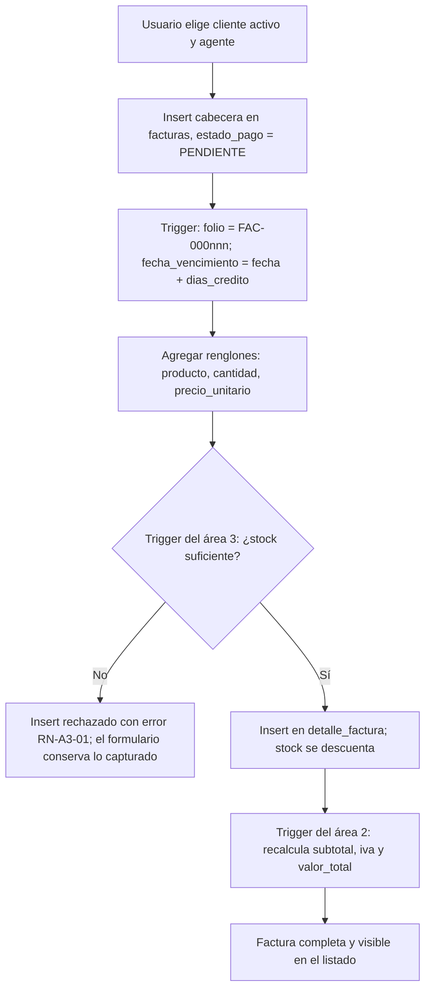
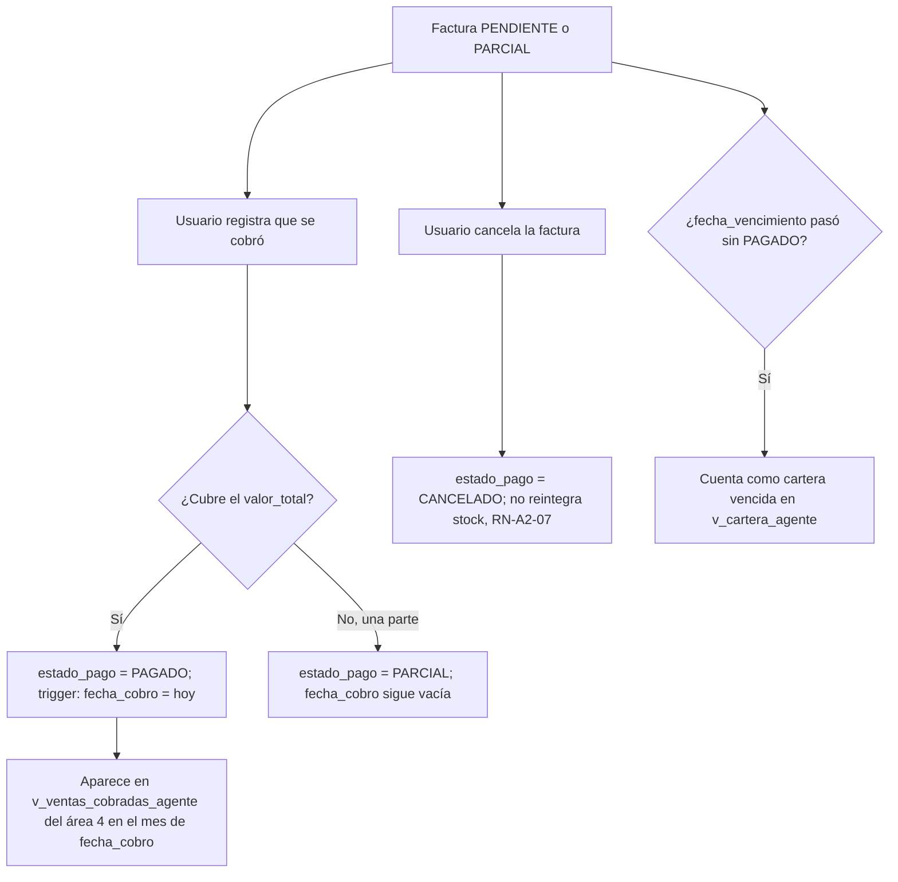

# Área 2 — Registro contable: facturación y comercializadores

> **Documento de contexto del área 2.** Fuente de verdad para el equipo y para cualquier agente de código que trabaje en esta área.
> Entregado por el equipo del área (original sin cambios en `originales/contexto_equipo.md`); aquí se alinea al formato común y se integran las columnas y vistas que las áreas 4, 5 y 6 le pidieron al área 2.
> Se alinea con `PLAN.md` (plan global) y con `docs/area3-inventario/CONTEXTO.md` (modelo de datos base). Ante contradicción entre este documento y el código, gana este documento. Ante contradicción con `PLAN.md`, gana `PLAN.md`.

| Campo | Valor |
| --- | --- |
| Proyecto | SIGFEVAK — Sistema de gestión, comercializadora nacional (México) |
| Área | 2 de 6 — Registro contable: valores en factura y comercializadores (clientes) |
| Etiqueta de issues | `area:2-contabilidad` |
| Prefijo de commits | `area2:` |
| Reglas de negocio | `RN-A2-01` … `RN-A2-12` |
| Equipo | 5 personas (1 líder + 4 integrantes) |
| Plazo | Domingo 13 a jueves 17 de septiembre de 2026 (5 días de trabajo) |
| Stack | React + Vite (JavaScript), supabase-js, PostgreSQL en Supabase, pnpm (PLAN.md D-01). Sin backend propio |
| Versión | 1.0 |

---

## 0. Índice

1. Cómo debe usar este documento un agente
2. Contexto de negocio
3. Alcance
4. Modelo entidad-relación y decisiones de diseño
5. Diccionario de datos
6. Flujos
7. Reglas de negocio
8. DDL y migraciones
9. Vistas y contratos con otras áreas
10. Ejemplo de cálculo
11. Equipo, roles y evaluación del líder
12. Cronograma de 5 días
13. Riesgos
14. Indicadores de éxito
15. Reporte final del líder
16. Preguntas abiertas
17. Glosario

---

## 1. Cómo debe usar este documento un agente

1. Este archivo es la **única fuente de verdad** del área 2. Si el código lo contradice, el código se corrige.
2. **El esquema base** de `clientes`, `facturas` y `detalle_factura` (columnas originales, tipos, constraints) vive en `docs/area3-inventario/CONTEXTO.md` secciones 5 y 10. No lo dupliques ni lo reinventes: aquí solo se documentan las **columnas aditivas** que agrega el área 2 (sección 5).
3. **No inventes columnas ni tablas** más allá de las de la sección 5. Si un issue parece requerir algo que no existe (por ejemplo una tabla de abonos), regístralo en la sección 16 y detente.
4. **Nunca escribas `productos.stock` directamente** (RN-A3-01, RN-A3-06). El área 2 solo inserta renglones en `detalle_factura`; el trigger del área 3 valida y descuenta.
5. **Nunca mandes `subtotal`, `iva` ni `valor_total` en un insert o update de `facturas`.** Los calcula el trigger `fn_recalcular_factura` (RN-A2-02, RN-A2-03). Enviarlos a mano es el bug más probable de esta área.
6. Cita las reglas `RN-A2-xx` en comentarios de código, mensajes de commit y descripciones de PR. Las tareas de `TAREAS.md` conservan entre paréntesis el identificador original del equipo (`AREA2-XX`) para trazabilidad.
7. Commits: `area2: <verbo> <objeto> (RN-A2-xx) #issue`. Sin ninguna mención a herramientas de IA (regla D-08 de `PLAN.md`).

> **Adaptado:** el equipo numeraba sus reglas como `RN-10` a `RN-16` continuando la numeración del área 3, y sus tareas como `AREA2-XX`. El proyecto numera las reglas por área (`RN-A2-xx`) para que ninguna choque entre las seis áreas, y las tareas se convierten en issues de GitHub con las etiquetas globales. El orden y el contenido de las reglas del equipo se conservan tal cual.

---

## 2. Contexto de negocio

Empresa mexicana dedicada a la comercialización a nivel nacional de productos electrónicos y de manufactura nacional. Vende a **clientes comercializadores** distribuidos por estado, a través de agentes de ventas, y cada venta se documenta como una **factura** con uno o más renglones de producto.

La necesidad oficial 2 es: *"registro contable de valores en factura y número de comercializadores (clientes)"*. Eso se traduce en dos cosas concretas:

- **Valores en factura:** subtotal, IVA y total de cada factura, calculados por el sistema y nunca capturados a mano, más su estado de cobro.
- **Número de comercializadores:** cuántos clientes hay, cuáles están activos, cuánto compra cada uno y cuánto debe. Cada comercializador recibe un folio interno único (`COM-000001`).

El sistema completo cubre seis necesidades, repartidas en seis áreas:

| # | Necesidad | Área responsable |
| --- | --- | --- |
| 1 | Registro de entradas: valor, capital de inversión, volumen de comercialización | Área 1 |
| **2** | **Registro contable de valores en factura y número de comercializadores** | **Área 2 (este documento)** |
| 3 | Base de datos de todos los productos, entradas y salidas | Área 3 |
| 4 | Salarios, sueldos y bonificaciones a agentes de ventas | Área 4 |
| 5 | Licencias, permisos, impuestos aduanales y de gobierno con pago dirigido | Área 5 |
| 6 | Costo, registro e investigación de marketing externo y directo | Área 6 |

Las seis áreas comparten **una sola base de datos**. Las fronteras son lógicas, no físicas: cualquier área puede leer todo, pero solo escribe en lo suyo.

### Lo que las otras áreas necesitan del área 2

El área 2 es la fuente de las ventas para tres áreas, y por eso recibió tres peticiones de integración antes de arrancar (registradas en `docs/MODELO_DATOS.md`):

| Integración | Quién pide | Qué | Cómo se resuelve aquí |
| --- | --- | --- | --- |
| I-02 | Área 4 (nómina) | Saber **cuándo se cobró** cada factura (las comisiones se pagan sobre ventas cobradas) y cuáles están **vencidas** (bono de cobranza sana). `id_agente` obligatorio | Columnas `fecha_cobro` (derivada del estado de pago) y `fecha_vencimiento` (fecha + días de crédito del cliente). `id_agente` ya es `NOT NULL` en el modelo base |
| I-07 | Área 5 (fiscal) | **IVA trasladado por mes** y UUID de CFDI para la obligación mensual de IVA | Vista `v_iva_trasladado_periodo` y columna opcional `uuid_cfdi` |
| I-10 | Área 6 (marketing) | **Baja lógica** de clientes (nunca borrarlos, porque las campañas los referencian) y lista de clientes activos | Columna `activo` y vista `v_clientes_activos` |

---

## 3. Alcance

### Responsabilidad

Registrar el catálogo de clientes comercializadores, generar y dar seguimiento a las facturas de venta (valor, IVA, estado de pago), y entregar visibilidad de cuántos comercializadores hay y cuánto le compran a la empresa.

### Dentro del alcance (5 días)

- Catálogo de comercializadores: alta, edición, baja lógica, folio interno, días de crédito, RFC validado.
- Facturas con cabecera y renglones; subtotal, IVA y total calculados por trigger; folio interno.
- Seguimiento de pago manual: `PENDIENTE`, `PARCIAL`, `PAGADO`, `CANCELADO`, con `fecha_cobro` automática al marcar `PAGADO` y `fecha_vencimiento` automática al crear la factura.
- Manejo del rechazo por stock insuficiente que devuelve el trigger del área 3, con mensaje legible.
- Vistas de reporte: resumen por comercializador, facturas pendientes, ventas por agente, cartera por agente, IVA trasladado por periodo, clientes activos.
- Dashboard del área: número de comercializadores, facturado del mes, pendiente de cobro, top 5 comercializadores.
- Exportar ventas por agente a CSV.
- Seed con mínimo 10 clientes, 4 agentes y 15 facturas, incluyendo casos de stock insuficiente.

### Fuera del alcance (se declara explícitamente)

- **Login y sesión.** Los provee la coordinación con Supabase Auth y la tabla global `usuarios` (`docs/MODELO_DATOS.md`). El área 2 consume la sesión; no implementa pantalla de login.
- **Tabla de abonos o pagos parciales.** Decisión del equipo: el estado de pago es manual; `PARCIAL` es un estado, no un monto. Ver pregunta abierta 3.
- **Timbrado real de CFDI.** Solo se guarda el UUID si existe (`uuid_cfdi`); no hay integración con PAC.
- **Reintegro de stock al cancelar.** Cancelar cambia el estado, no revierte renglones ni stock (RN-A2-07). Ver pregunta abierta 2.
- Trazabilidad de inventario, kardex, conciliación física → área 3. Comisiones y sueldos → área 4. Impuestos y licencias → área 5. ROI de campañas → área 6.

### Tablas por nivel de acceso

| Tabla | Acceso del área 2 | Nota |
| --- | --- | --- |
| `clientes` | **Escritura total** | Tabla núcleo. Columnas base del área 3 + columnas aditivas de la sección 5 |
| `facturas` | **Escritura total** | Tabla núcleo. Columnas base + aditivas. `subtotal`, `iva`, `valor_total`, `fecha_cobro`, `folio` los escribe el sistema, no la aplicación |
| `detalle_factura` | **Escritura compartida** | El área 2 crea el renglón (producto, cantidad, precio); el trigger del área 3 valida stock y lo descuenta (RN-A3-01); el trigger del área 2 recalcula la factura (RN-A2-02) |
| `productos` | Solo lectura | Área 3. Selector de productos con su `stock` disponible |
| `agentes_ventas` | Solo lectura | Área 4 administra, área 3 define. Selector de agente al facturar |
| `usuarios` | Solo lectura | Coordinación. Sesión activa |
| `entradas_producto`, `ajustes_inventario` | Sin acceso | Área 3 |
| `impuestos_licencias`, `obligaciones` y demás del área 5 | Sin acceso | Área 5 |
| `campanas`, `campana_clientes` y demás del área 6 | Sin acceso | Área 6 (leen `clientes` y `facturas`; el área 2 no las toca) |

---

## 4. Modelo entidad-relación y decisiones de diseño

El modelo completo y aprobado vive en `docs/area3-inventario/CONTEXTO.md` sección 4. Aquí el subconjunto que el área 2 posee o consume, ya con las columnas aditivas:



### Decisiones de diseño del equipo (se conservan)

1. **`valor_total` e `iva` no son columnas capturadas, son derivadas.** El modelo aprobado las define como columnas normales en `facturas`, a diferencia de `detalle_factura.importe` que sí es generada. Como una factura tiene varios renglones insertados en momentos distintos, la suma no puede ser una columna generada sobre la propia fila: necesita un trigger que reaccione a cambios en la tabla hija. Ver sección 8. Se agrega `subtotal` como columna derivada por el mismo trigger para no recalcularlo en cada vista.
2. **Tasa de IVA fija al 16%.** Tasa general de México. Si el proyecto requiere tasas diferenciadas (frontera, exentos), es la pregunta abierta 1. La tasa vive en una sola función `fn_tasa_iva()` para cambiarla en un solo lugar.
3. **`estado_pago` es manual, no derivado.** Nadie más que el usuario decide si una factura ya se pagó. No hay tabla de abonos. Lo único derivado es `fecha_cobro`, que el sistema llena al marcar `PAGADO` porque el área 4 la necesita (I-02).
4. **El área 2 no reintegra stock al cancelar una factura.** Cancelar solo cambia `estado_pago` a `CANCELADO`; no devuelve unidades a `productos.stock`. Pregunta abierta 2, coordinada con el área 3.

### Decisiones agregadas por integración

5. **Baja lógica de clientes.** `clientes.activo` en vez de `DELETE`, porque el área 6 referencia clientes desde sus campañas (I-10) y el área 4 desde comisiones históricas.
6. **Folios internos.** `numero_comercializador` (`COM-000001`) y `facturas.folio` (`FAC-000001`) generados por trigger, porque el enunciado pide "número de comercializadores" y un folio legible es lo que se muestra en pantalla y en reportes; el `id` entero es interno.
7. **Vencimiento por días de crédito.** `clientes.dias_credito` (default 30) y `facturas.fecha_vencimiento = fecha + dias_credito`, porque el bono de cobranza sana del área 4 necesita saber qué está vencido (I-02).

---

## 5. Diccionario de datos

### `clientes` — columnas base (área 3) y aditivas (área 2)

| Columna | Tipo | Nulo | Origen | Descripción y regla |
| --- | --- | --- | --- | --- |
| `id_cliente` | INT | No | Base | PK. Identidad generada |
| `nombre_empresa` | VARCHAR(150) | No | Base | Razón social del comercializador |
| `rfc` | VARCHAR(20) | Sí | Base | Único. Formato de RFC mexicano: 12 caracteres persona moral o 13 persona física (RN-A2-05) |
| `estado` | VARCHAR(50) | Sí | Base | Estado de la República donde opera. Insumo del área 6 para segmentar campañas |
| `numero_comercializador` | VARCHAR(20) | No | **Aditiva** | Folio interno único `COM-000001`, generado por trigger al insertar (RN-A2-11). Nunca se captura |
| `dias_credito` | INT | No | **Aditiva** | Default 30. Días de crédito para calcular `facturas.fecha_vencimiento` (RN-A2-09). ≥ 0 |
| `activo` | BOOLEAN | No | **Aditiva** | Default `true`. Baja lógica (RN-A2-10). Un cliente inactivo no aparece en selectores ni en `v_clientes_activos` |

### `facturas` — columnas base (área 3) y aditivas (área 2)

| Columna | Tipo | Nulo | Origen | Descripción y regla |
| --- | --- | --- | --- | --- |
| `id_factura` | INT | No | Base | PK |
| `id_cliente` | INT | No | Base | FK → `clientes` (RN-A2-01) |
| `id_agente` | INT | No | Base | FK → `agentes_ventas` (RN-A2-01). Obligatorio: el área 4 calcula comisiones por agente |
| `fecha` | DATE | No | Base | Default hoy |
| `valor_total` | DECIMAL(14,2) | No | Base | **No se captura.** `subtotal + iva`, recalculado por trigger (RN-A2-02) |
| `iva` | DECIMAL(12,2) | No | Base | **No se captura.** `subtotal × 0.16`, recalculado por el mismo trigger (RN-A2-03) |
| `estado_pago` | ENUM `estado_pago` | No | Base | `PENDIENTE` (default), `PARCIAL`, `PAGADO`, `CANCELADO`. Lo actualiza el usuario, no un trigger |
| `folio` | VARCHAR(20) | No | **Aditiva** | `FAC-000001`, generado por trigger (RN-A2-11) |
| `subtotal` | DECIMAL(14,2) | No | **Aditiva** | **No se captura.** Suma de `importe` de los renglones, por trigger (RN-A2-02) |
| `fecha_vencimiento` | DATE | No | **Aditiva** | Si no se manda, `fecha + dias_credito` del cliente (RN-A2-09). Base de la cartera vencida para el área 4 |
| `fecha_cobro` | DATE | Sí | **Aditiva** | **No se captura.** El trigger la llena con la fecha del día al pasar a `PAGADO` y la limpia si regresa a `PENDIENTE` o `PARCIAL` (RN-A2-08). Base de las comisiones del área 4 |
| `uuid_cfdi` | VARCHAR(36) | Sí | **Aditiva** | Único si existe. Folio fiscal del CFDI cuando la factura se timbre fuera del sistema. Opcional; lo lee el área 5 |

### `detalle_factura` (compartida con el área 3, sin cambios)

| Columna | Tipo | Quién escribe |
| --- | --- | --- |
| `id_detalle` | INT | Sistema |
| `id_factura` | INT | Área 2 |
| `id_producto` | INT | Área 2 |
| `cantidad` | INT | Área 2. El trigger del área 3 rechaza el insert si no hay stock suficiente (RN-A3-01) |
| `precio_unitario` | DECIMAL(12,2) | Área 2 |
| `importe` | DECIMAL(14,2) generada | Sistema: `cantidad × precio_unitario` |

> **Distinción importante:** el área 2 nunca calcula ni envía `subtotal`, `iva` ni `valor_total` en el insert de una factura, ni `fecha_cobro`, ni los folios. Todos los escribe el sistema. Mandarlos desde el frontend es el bug más probable de esta área, equivalente a lo que el área 3 advierte sobre escribir `stock` a mano.

### Valores ENUM usados

| Tipo | Valores | Dueño |
| --- | --- | --- |
| `estado_pago` | `PENDIENTE`, `PARCIAL`, `PAGADO`, `CANCELADO` | Área 2 (definido en el modelo base) |

No se agregan enums nuevos.

---

## 6. Flujos

### 6.1 Alta de cliente



### 6.2 Creación de factura



### 6.3 Seguimiento de pago



---

## 7. Reglas de negocio

| ID | Regla | Dónde se implementa |
| --- | --- | --- |
| **RN-A2-01** | Toda factura debe estar asociada a un `id_cliente` y un `id_agente` existentes. | Llaves foráneas (modelo base) |
| **RN-A2-02** | `facturas.subtotal` = suma de `importe` de sus renglones; `valor_total` = `subtotal + iva`. Se recalculan automáticamente al insertar, editar o borrar un renglón; ninguna aplicación los escribe a mano. | Trigger `fn_recalcular_factura` |
| **RN-A2-03** | `facturas.iva` = `subtotal × 0.16`, recalculado junto con `valor_total`. La tasa vive en `fn_tasa_iva()`. | Trigger `fn_recalcular_factura` |
| **RN-A2-04** | Una factura sin renglones tiene `valor_total = 0` y no puede marcarse como `PAGADO`. | Trigger `fn_estado_pago_factura` en la base + validación en frontend |
| **RN-A2-05** | `clientes.rfc`, cuando se captura, cumple el formato de RFC mexicano (12 caracteres persona moral, 13 persona física) y es único. | `CHECK` + `UNIQUE` en BD, regex en frontend |
| **RN-A2-06** | El área 2 nunca escribe `productos.stock`; solo inserta en `detalle_factura` y deja que el trigger del área 3 (RN-A3-01, RN-A3-06) descuente. | Convención + revisión de código |
| **RN-A2-07** | Cancelar una factura (`estado_pago = CANCELADO`) es un cambio de estado, no un borrado. Los renglones y el stock descontado **no** se revierten automáticamente. | Convención de aplicación; pendiente con área 3 (pregunta abierta 2) |
| **RN-A2-08** | `fecha_cobro` la escribe el sistema: se llena con la fecha del día cuando `estado_pago` pasa a `PAGADO` (si no venía una fecha) y se limpia si regresa a `PENDIENTE` o `PARCIAL`. Nunca se captura desde la aplicación. | Trigger `fn_estado_pago_factura` |
| **RN-A2-09** | `fecha_vencimiento` = `fecha + clientes.dias_credito` si no se indica otra al crear la factura. Una factura `PENDIENTE` o `PARCIAL` con `fecha_vencimiento < hoy` es cartera vencida. | Trigger `fn_valida_factura`; vista `v_cartera_agente` |
| **RN-A2-10** | Un cliente nunca se borra físicamente; se da de baja con `activo = false`. Un cliente inactivo no puede recibir facturas nuevas. | Trigger `fn_valida_factura`; convención (sin `DELETE` en servicios) |
| **RN-A2-11** | `clientes.numero_comercializador` (`COM-000001`) y `facturas.folio` (`FAC-000001`) los genera el sistema con una secuencia; son únicos y no se editan. | Triggers `fn_folio_cliente`, `fn_folio_factura` |
| **RN-A2-12** | Los renglones de una factura `PAGADO` o `CANCELADO` no se modifican. Cualquier corrección es una factura nueva. | Trigger `fn_bloquea_detalle_cerrado` |

> **Adaptado:** las reglas 01 a 07 son las siete del equipo (`RN-10` a `RN-16`) en su orden original. Las 08 a 12 salen de las integraciones con las áreas 4, 5 y 6 y de la convención del proyecto de que las validaciones críticas viven en la base (RN-A2-04 pasa de solo frontend a frontend más trigger).

---

## 8. DDL y migraciones

Estado objetivo en PostgreSQL. Todo es **aditivo** sobre el modelo base del área 3 (`clientes`, `facturas`, `detalle_factura` ya existen). En el repo se divide en migraciones `AAAAMMDD_HHMM_a2_*.sql` según `PLAN.md` D-09.

> **Adaptado:** el equipo proponía migraciones `0007_trigger_recalculo_factura.sql`, `0008_vistas_area2.sql`, `0009_rls_area2.sql`. El proyecto usa una sola carpeta de migraciones con nombre por fecha para que las seis áreas no choquen de número; el contenido es el mismo.

### 8.1 Columnas aditivas y secuencias

```sql
-- Área 2 · RN-A2-05, RN-A2-09, RN-A2-10, RN-A2-11
-- Qué hace: agrega a clientes y facturas las columnas que piden el enunciado y las áreas 4, 5 y 6.

CREATE SEQUENCE IF NOT EXISTS seq_comercializador START 1;
CREATE SEQUENCE IF NOT EXISTS seq_folio_factura   START 1;

ALTER TABLE clientes
    ADD COLUMN IF NOT EXISTS numero_comercializador VARCHAR(20) UNIQUE,                  -- RN-A2-11
    ADD COLUMN IF NOT EXISTS dias_credito           INT NOT NULL DEFAULT 30,             -- RN-A2-09
    ADD COLUMN IF NOT EXISTS activo                 BOOLEAN NOT NULL DEFAULT TRUE,       -- RN-A2-10
    ADD CONSTRAINT ck_dias_credito CHECK (dias_credito >= 0),
    ADD CONSTRAINT ck_rfc_formato CHECK (                                                -- RN-A2-05
        rfc IS NULL OR rfc ~ '^[A-ZÑ&]{3,4}[0-9]{6}[A-Z0-9]{3}$'
    );

ALTER TABLE facturas
    ADD COLUMN IF NOT EXISTS folio             VARCHAR(20) UNIQUE,                       -- RN-A2-11
    ADD COLUMN IF NOT EXISTS subtotal          DECIMAL(14,2) NOT NULL DEFAULT 0,         -- RN-A2-02
    ADD COLUMN IF NOT EXISTS fecha_vencimiento DATE,                                     -- RN-A2-09
    ADD COLUMN IF NOT EXISTS fecha_cobro       DATE,                                     -- RN-A2-08
    ADD COLUMN IF NOT EXISTS uuid_cfdi         VARCHAR(36) UNIQUE;                       -- I-07, opcional

CREATE INDEX IF NOT EXISTS ix_facturas_estado_pago ON facturas(estado_pago);
CREATE INDEX IF NOT EXISTS ix_facturas_fecha_cobro ON facturas(fecha_cobro);
CREATE INDEX IF NOT EXISTS ix_facturas_vencimiento ON facturas(fecha_vencimiento);
CREATE INDEX IF NOT EXISTS ix_clientes_activo      ON clientes(activo);
```

Las columnas base (`nombre_empresa`, `rfc`, `estado`, `id_cliente`, `id_agente`, `fecha`, `valor_total`, `iva`, `estado_pago`) no se tocan.

### 8.2 Tasa de IVA en un solo lugar

```sql
-- RN-A2-03: tasa general de IVA. Cambiarla aquí cambia todos los cálculos.
-- Pregunta abierta 1: si se requieren tasas diferenciadas, esta función pasa a leer parametros_fiscales (área 5).
CREATE OR REPLACE FUNCTION fn_tasa_iva() RETURNS DECIMAL(5,4)
LANGUAGE sql IMMUTABLE AS $$ SELECT 0.1600::DECIMAL(5,4); $$;
```

### 8.3 Folios (RN-A2-11)

```sql
CREATE OR REPLACE FUNCTION fn_folio_cliente() RETURNS TRIGGER LANGUAGE plpgsql AS $$
BEGIN
    IF NEW.numero_comercializador IS NULL THEN
        NEW.numero_comercializador := 'COM-' || LPAD(nextval('seq_comercializador')::TEXT, 6, '0');
    END IF;
    RETURN NEW;
END; $$;
CREATE TRIGGER tg_folio_cliente BEFORE INSERT ON clientes
FOR EACH ROW EXECUTE FUNCTION fn_folio_cliente();

CREATE OR REPLACE FUNCTION fn_folio_factura() RETURNS TRIGGER LANGUAGE plpgsql AS $$
BEGIN
    IF NEW.folio IS NULL THEN
        NEW.folio := 'FAC-' || LPAD(nextval('seq_folio_factura')::TEXT, 6, '0');
    END IF;
    RETURN NEW;
END; $$;
```

### 8.4 Antes de insertar una factura (RN-A2-09, RN-A2-10, RN-A2-11)

Dos triggers `BEFORE INSERT`; PostgreSQL los ejecuta en orden alfabético de nombre, por eso llevan prefijo `a_` y `b_`.

```sql
CREATE TRIGGER a_tg_folio_factura BEFORE INSERT ON facturas
FOR EACH ROW EXECUTE FUNCTION fn_folio_factura();                                        -- RN-A2-11

CREATE OR REPLACE FUNCTION fn_valida_factura() RETURNS TRIGGER LANGUAGE plpgsql AS $$
DECLARE v_activo BOOLEAN; v_dias INT;
BEGIN
    SELECT activo, dias_credito INTO v_activo, v_dias FROM clientes WHERE id_cliente = NEW.id_cliente;
    IF NOT v_activo THEN
        RAISE EXCEPTION 'RN-A2-10: el cliente % está dado de baja; no puede recibir facturas nuevas', NEW.id_cliente;
    END IF;
    IF NEW.fecha_vencimiento IS NULL THEN
        NEW.fecha_vencimiento := COALESCE(NEW.fecha, CURRENT_DATE) + v_dias;              -- RN-A2-09
    END IF;
    RETURN NEW;
END; $$;
CREATE TRIGGER b_tg_valida_factura BEFORE INSERT ON facturas
FOR EACH ROW EXECUTE FUNCTION fn_valida_factura();
```

### 8.5 Recalcular la factura desde sus renglones (RN-A2-02, RN-A2-03)

```sql
CREATE OR REPLACE FUNCTION fn_recalcular_factura() RETURNS TRIGGER LANGUAGE plpgsql AS $$
DECLARE v_id INT; v_sub DECIMAL(14,2); v_iva DECIMAL(12,2);
BEGIN
    -- Recalcula la factura afectada. Si un UPDATE movió el renglón de factura, recalcula las dos.
    FOR v_id IN
        SELECT DISTINCT x FROM unnest(ARRAY[
            CASE WHEN TG_OP <> 'DELETE' THEN NEW.id_factura END,
            CASE WHEN TG_OP <> 'INSERT' THEN OLD.id_factura END
        ]) AS x WHERE x IS NOT NULL
    LOOP
        SELECT COALESCE(SUM(importe), 0) INTO v_sub FROM detalle_factura WHERE id_factura = v_id;
        v_iva := ROUND(v_sub * fn_tasa_iva(), 2);                                            -- RN-A2-03
        UPDATE facturas
           SET subtotal = v_sub, iva = v_iva, valor_total = v_sub + v_iva                    -- RN-A2-02
         WHERE id_factura = v_id;
    END LOOP;
    RETURN NULL;
END; $$;

CREATE TRIGGER tg_recalcular_factura
AFTER INSERT OR UPDATE OR DELETE ON detalle_factura
FOR EACH ROW EXECUTE FUNCTION fn_recalcular_factura();
```

Orden con el área 3: `tg_salida_producto` (BEFORE INSERT, valida y descuenta stock) corre primero; si rechaza, `tg_recalcular_factura` (AFTER) no llega a ejecutarse y la factura no cambia.

### 8.6 Estado de pago y fecha de cobro (RN-A2-04, RN-A2-08)

```sql
CREATE OR REPLACE FUNCTION fn_estado_pago_factura() RETURNS TRIGGER LANGUAGE plpgsql AS $$
BEGIN
    IF NEW.estado_pago = 'PAGADO' AND NEW.valor_total = 0 THEN
        RAISE EXCEPTION 'RN-A2-04: la factura % no tiene renglones; no puede marcarse como PAGADO', NEW.folio;
    END IF;
    IF NEW.estado_pago = 'PAGADO' AND (OLD.estado_pago IS DISTINCT FROM 'PAGADO') THEN
        NEW.fecha_cobro := COALESCE(NEW.fecha_cobro, CURRENT_DATE);                          -- RN-A2-08
    ELSIF NEW.estado_pago IN ('PENDIENTE', 'PARCIAL') THEN
        NEW.fecha_cobro := NULL;                                                             -- RN-A2-08
    END IF;
    RETURN NEW;
END; $$;
CREATE TRIGGER tg_estado_pago_factura BEFORE UPDATE OF estado_pago ON facturas
FOR EACH ROW EXECUTE FUNCTION fn_estado_pago_factura();
```

### 8.7 Renglones de facturas cerradas (RN-A2-12)

```sql
CREATE OR REPLACE FUNCTION fn_bloquea_detalle_cerrado() RETURNS TRIGGER LANGUAGE plpgsql AS $$
DECLARE v_estado estado_pago; v_folio VARCHAR;
BEGIN
    SELECT estado_pago, folio INTO v_estado, v_folio
      FROM facturas WHERE id_factura = COALESCE(NEW.id_factura, OLD.id_factura);
    IF v_estado IN ('PAGADO', 'CANCELADO') THEN
        RAISE EXCEPTION 'RN-A2-12: la factura % está %; sus renglones no se modifican', v_folio, v_estado;
    END IF;
    RETURN COALESCE(NEW, OLD);
END; $$;
CREATE TRIGGER tg_bloquea_detalle_cerrado BEFORE INSERT OR UPDATE OR DELETE ON detalle_factura
FOR EACH ROW EXECUTE FUNCTION fn_bloquea_detalle_cerrado();
```

### 8.8 Row Level Security

Misma política mínima que el área 3: RLS activado y todo permitido a `authenticated`. Sin sesión no se lee ni escribe nada. Si una consulta regresa vacío teniendo datos, el primer diagnóstico es RLS.

```sql
ALTER TABLE clientes ENABLE ROW LEVEL SECURITY;
ALTER TABLE facturas ENABLE ROW LEVEL SECURITY;
-- detalle_factura ya la activa el área 3.
CREATE POLICY p_clientes_auth ON clientes FOR ALL TO authenticated USING (true) WITH CHECK (true);
CREATE POLICY p_facturas_auth ON facturas FOR ALL TO authenticated USING (true) WITH CHECK (true);
```

### 8.9 Seed obligatorio (`supabase/seed/seed_area2.sql`)

- Mínimo 10 clientes (uno inactivo, uno con `dias_credito = 15`), con RFC válidos.
- 4 agentes de referencia (coordinado con el área 4 para no duplicar su seed).
- 15 facturas con renglones variados: pagadas (con `fecha_cobro`), pendientes, una parcial, una cancelada, y al menos dos vencidas.
- Un caso preparado de stock insuficiente (renglón de 500 unidades de un producto con stock 88) para la prueba de rechazo.
- Las facturas pagadas del seed deben permitir reproducir el ejemplo de cálculo de `docs/area4-nomina/CONTEXTO.md` sección 10 (ventas cobradas sin IVA de $560,000 para un agente en el mes).

### 8.10 Pruebas SQL (`supabase/tests/area2/`)

| Archivo | Verifica |
| --- | --- |
| `recalculo_factura.sql` | RN-A2-02, RN-A2-03: insertar, editar, borrar un renglón y borrar el último dejan `subtotal`, `iva`, `valor_total` correctos |
| `estado_pago.sql` | RN-A2-04, RN-A2-08: `PAGADO` con total 0 se rechaza; `PAGADO` llena `fecha_cobro`; regresar a `PENDIENTE` la limpia |
| `folios_y_vencimiento.sql` | RN-A2-09, RN-A2-11: folios consecutivos; `fecha_vencimiento = fecha + dias_credito` |
| `baja_logica.sql` | RN-A2-10: cliente inactivo no recibe factura |
| `factura_cerrada.sql` | RN-A2-12: no se altera un renglón de factura `PAGADO` |
| `rfc.sql` | RN-A2-05: RFC inválido y duplicado se rechazan |

---

## 9. Vistas y contratos con otras áreas

```sql
-- Resumen por comercializador: cuántos hay, cuánto han comprado, cuánto deben. (Vista del equipo, ampliada)
CREATE OR REPLACE VIEW v_clientes_resumen AS
SELECT c.id_cliente, c.numero_comercializador, c.nombre_empresa, c.rfc, c.estado, c.activo, c.dias_credito,
       COUNT(DISTINCT f.id_factura) FILTER (WHERE f.estado_pago <> 'CANCELADO')                        AS numero_facturas,
       COALESCE(SUM(f.valor_total) FILTER (WHERE f.estado_pago <> 'CANCELADO'), 0)                     AS monto_total_facturado,
       COALESCE(SUM(f.valor_total) FILTER (WHERE f.estado_pago IN ('PENDIENTE','PARCIAL')), 0)         AS monto_pendiente,
       COALESCE(SUM(f.valor_total) FILTER (WHERE f.estado_pago IN ('PENDIENTE','PARCIAL')
                                             AND f.fecha_vencimiento < CURRENT_DATE), 0)              AS monto_vencido
FROM clientes c
LEFT JOIN facturas f USING (id_cliente)
GROUP BY c.id_cliente, c.numero_comercializador, c.nombre_empresa, c.rfc, c.estado, c.activo, c.dias_credito
ORDER BY monto_total_facturado DESC;

-- Facturas con cobro pendiente, para el módulo de seguimiento. (Vista del equipo, ampliada)
CREATE OR REPLACE VIEW v_facturas_pendientes AS
SELECT f.id_factura, f.folio, c.numero_comercializador, c.nombre_empresa, a.nombre AS agente,
       f.fecha, f.fecha_vencimiento,
       GREATEST(CURRENT_DATE - f.fecha_vencimiento, 0)                                                  AS dias_vencidos,
       f.subtotal, f.iva, f.valor_total, f.estado_pago
FROM facturas f
JOIN clientes c USING (id_cliente)
JOIN agentes_ventas a USING (id_agente)
WHERE f.estado_pago IN ('PENDIENTE', 'PARCIAL')
ORDER BY f.fecha_vencimiento;

-- Ventas por agente, reporte interno del área 2 (con IVA, todos los estados salvo cancelado). (Vista del equipo)
CREATE OR REPLACE VIEW v_ventas_agente AS
SELECT a.id_agente, a.nombre,
       COUNT(DISTINCT f.id_factura) FILTER (WHERE f.estado_pago <> 'CANCELADO')                        AS numero_facturas,
       COALESCE(SUM(f.valor_total) FILTER (WHERE f.estado_pago <> 'CANCELADO'), 0)                     AS monto_vendido,
       COALESCE(SUM(f.subtotal)    FILTER (WHERE f.estado_pago = 'PAGADO'), 0)                         AS monto_cobrado_sin_iva
FROM agentes_ventas a
LEFT JOIN facturas f USING (id_agente)
GROUP BY a.id_agente, a.nombre;

-- CONTRATO CON EL ÁREA 4 (I-02): cartera por agente para el bono de cobranza sana.
CREATE OR REPLACE VIEW v_cartera_agente AS
SELECT f.id_agente,
       COALESCE(SUM(f.valor_total) FILTER (WHERE f.estado_pago IN ('PENDIENTE','PARCIAL')), 0)         AS cartera_total,
       COALESCE(SUM(f.valor_total) FILTER (WHERE f.estado_pago IN ('PENDIENTE','PARCIAL')
                                             AND f.fecha_vencimiento < CURRENT_DATE), 0)              AS cartera_vencida,
       CASE WHEN COALESCE(SUM(f.valor_total) FILTER (WHERE f.estado_pago IN ('PENDIENTE','PARCIAL')), 0) = 0 THEN 0
            ELSE ROUND(SUM(f.valor_total) FILTER (WHERE f.estado_pago IN ('PENDIENTE','PARCIAL')
                                                    AND f.fecha_vencimiento < CURRENT_DATE)
                       / SUM(f.valor_total) FILTER (WHERE f.estado_pago IN ('PENDIENTE','PARCIAL')) * 100, 2)
       END                                                                                              AS pct_vencida
FROM facturas f
GROUP BY f.id_agente;

-- CONTRATO CON EL ÁREA 5 (I-07): IVA trasladado por mes para la obligación mensual de IVA.
CREATE OR REPLACE VIEW v_iva_trasladado_periodo AS
SELECT TO_CHAR(f.fecha, 'YYYY-MM')                          AS periodo,
       COUNT(*)                                             AS numero_facturas,
       COUNT(f.uuid_cfdi)                                   AS facturas_con_cfdi,
       SUM(f.subtotal)                                      AS subtotal,
       SUM(f.iva)                                           AS iva_trasladado,
       SUM(f.valor_total)                                   AS total
FROM facturas f
WHERE f.estado_pago <> 'CANCELADO'
GROUP BY periodo
ORDER BY periodo;

-- CONTRATO CON EL ÁREA 6 (I-10): clientes vigentes para campañas directas.
CREATE OR REPLACE VIEW v_clientes_activos AS
SELECT id_cliente, numero_comercializador, nombre_empresa, rfc, estado
FROM clientes
WHERE activo
ORDER BY nombre_empresa;
```

`v_salidas_area2` (unidades y monto facturado por cliente) la definió el área 3 en su sección 11 sobre `detalle_factura`, `facturas` y `clientes`; **el área 2 la mantiene** y no cambia su firma.

### Contratos de interfaz

| Área | Dirección | Qué | Vía |
| --- | --- | --- | --- |
| 3 | Área 2 **escribe** | Producto, cantidad y precio de cada renglón; el trigger del área 3 valida y descuenta stock | Insert en `detalle_factura` |
| 3 | Área 2 **mantiene** | Unidades y monto facturado por cliente | `v_salidas_area2` (definida por el área 3) |
| 4 | Área 2 **entrega** | Facturas pagadas con `fecha_cobro`, `subtotal` sin IVA e `id_agente` | Columnas de `facturas`; el área 4 las lee con su propia vista `v_ventas_cobradas_agente` (I-02) |
| 4 | Área 2 **entrega** | Cartera vencida por agente para el bono de cobranza sana | `v_cartera_agente` (I-02) |
| 4 | Área 2 **lee** | Catálogo de agentes para el selector de factura | `agentes_ventas` (solo lectura) |
| 5 | Área 2 **entrega** | IVA trasladado y facturas con CFDI por mes | `v_iva_trasladado_periodo` (I-07) |
| 6 | Área 2 **entrega** | Clientes activos con estado geográfico; baja lógica garantizada | `v_clientes_activos`, `clientes` solo lectura (I-10) |
| 6 | Área 2 **acepta** | El área 6 lee `facturas` pagadas de los clientes de una campaña para su ROI | Lectura directa de `facturas` (solo `SELECT`) |
| Coordinación | Área 2 **entrega** | Número de comercializadores, facturado del mes, pendiente | `v_clientes_resumen`, `v_facturas_pendientes` para el resumen general |

> **Adaptado:** el equipo publicaba `v_ventas_agente` como contrato con el área 4 (monto vendido con IVA, todos los estados). El área 4 calcula comisiones **sobre ventas cobradas sin IVA** con su propia vista, así que `v_ventas_agente` queda como reporte interno del área 2 (con una columna `monto_cobrado_sin_iva` para cotejar), y el contrato real con el área 4 son las columnas `fecha_cobro` y `subtotal` más `v_cartera_agente`.

Las otras áreas consumen **vistas o tablas en modo lectura; nunca escriben en las tablas del área 2.**

---

## 10. Ejemplo de cálculo

Es el **caso de prueba de aceptación** del área: el seed debe reproducirlo con estos números exactos.

### Factura con dos renglones

Cliente `COM-000003` "Distribuidora Bajío" (`dias_credito = 30`), agente Jorge Mendoza, `fecha = 2026-09-14`.

| Paso | Acción | Efecto en `facturas` |
| --- | --- | --- |
| 1 | Insert cabecera (solo `id_cliente`, `id_agente`) | `folio = FAC-000016`, `fecha_vencimiento = 2026-10-14`, `subtotal = 0`, `iva = 0`, `valor_total = 0`, `estado_pago = PENDIENTE` |
| 2 | Renglón 1: 10 × Tableta Android 10" a $1,850.00 | `importe = 18,500.00` → `subtotal = 18,500.00`, `iva = 2,960.00`, `valor_total = 21,460.00`. Stock de la tableta: 310 → 300 |
| 3 | Renglón 2: 25 × Cable HDMI 2.1 a $89.00 | `importe = 2,225.00` → `subtotal = 20,725.00`, `iva = 3,316.00`, `valor_total = 24,041.00`. Stock del cable: 2,000 → 1,975 |
| 4 | El 20 de septiembre el usuario marca `PAGADO` | `fecha_cobro = 2026-09-20`. La factura aparece en `v_ventas_cobradas_agente` del área 4 en el periodo `2026-09` con `subtotal = 20,725.00` |
| 5 | Intento de editar el renglón 2 | Rechazado: `RN-A2-12: la factura FAC-000016 está PAGADO` |

Verificación: `20,725.00 × 0.16 = 3,316.00`; `20,725.00 + 3,316.00 = 24,041.00`. El frontend nunca mandó `subtotal`, `iva` ni `valor_total`.

### Renglón rechazado por stock insuficiente

Misma factura, antes del paso 4. Renglón 3: 500 × Auriculares BT TW-55 (stock 88).

- El trigger del área 3 rechaza: `RN-A3-01: stock insuficiente para "Auriculares BT TW-55" (disponible: 88, solicitado: 500)`.
- `tg_recalcular_factura` no se ejecuta; la factura sigue en `24,041.00`. El stock de los auriculares sigue en 88.
- El frontend muestra "Stock insuficiente para Auriculares BT TW-55 (disponible: 88)" y conserva los tres renglones capturados para que el usuario corrija la cantidad.

### Factura vencida

`FAC-000009`, `fecha = 2026-08-05`, cliente con `dias_credito = 30` → `fecha_vencimiento = 2026-09-04`. Sigue `PENDIENTE` el 14 de septiembre: `v_facturas_pendientes.dias_vencidos = 10`, y su monto cuenta en `v_cartera_agente.cartera_vencida` del agente.

---

## 11. Equipo, roles y evaluación del líder

### 11.1 Roles (5 personas, propuestos por el equipo)

| Rol | Responsabilidades | Entregable en 5 días |
| --- | --- | --- |
| Líder | Coordinación, alcance, reporte final, evaluación del equipo, revisión de PRs, integraciones con áreas 3, 4, 5 y 6 | `ESTADO.md` diario, `EVALUACION.md`, `REPORTE_FINAL.md` |
| Modelador / triggers | Migración aditiva, triggers de recálculo, folios, estado de pago, RLS, seed, pruebas SQL | Migraciones aplicadas sin error; las seis pruebas SQL en verde |
| Frontend — Clientes | Módulo de comercializadores: listado, alta, edición, baja lógica, KPI | `src/modules/area2-contabilidad/clientes/` funcionando |
| Frontend — Facturación | Creación de factura con renglones, manejo del rechazo por stock, detalle, seguimiento de pago | `src/modules/area2-contabilidad/facturas/` funcionando |
| Documentación y enlace | Este documento actualizado, contratos con áreas 3, 4, 5 y 6, evidencias, exportación CSV | Preguntas abiertas resueltas; `evidencias/` completa |

### 11.2 Diagnóstico inicial (domingo 13)

Cada integrante llena la matriz de habilidades de `PLAN.md` sección 11.1 (Git, SQL, JavaScript, React, documentación, disponibilidad) y resuelve una tarea corta de prueba: escribir la consulta que devuelve subtotal, IVA y total de una factura a partir de sus renglones. Con eso el líder confirma o ajusta los roles.

### 11.3 Evaluación continua

Al cierre de cada día, del domingo 13 al jueves 17, el líder evalúa a cada integrante con la matriz estándar del proyecto, escala 1 a 5:

| Criterio | Peso | Qué observa el líder |
| --- | --- | --- |
| Cumplimiento de entregas | 30% | Entrega a tiempo y completa |
| Calidad técnica | 25% | Errores encontrados en revisión o pruebas |
| Comunicación y colaboración | 20% | Avisa bloqueos, apoya a otros, asiste a reuniones |
| Solución de problemas e iniciativa | 15% | Propone mejoras, resuelve sin esperar instrucciones |
| Aprendizaje y adaptación | 10% | Aplica la retroalimentación recibida |

### 11.4 Reglas para modificar tareas

- Menos de **3** en una tarea crítica, o más de **medio día de retraso**: el líder la reasigna o pone a otro integrante a trabajar en pareja.
- **4.5 o más** sostenido: tareas de mayor complejidad o liderar una subparte.

Cada cambio se anota en `EVALUACION.md`, sección "Registro de control de cambios": fecha, tarea, responsable anterior, nuevo responsable, motivo, impacto en cronograma, visto bueno del líder.

---

## 12. Cronograma de 5 días

Cinco días de trabajo, del domingo 13 al jueves 17 de septiembre de 2026. El sábado 12 la coordinación deja listos repo, contextos, issues y base; los equipos aún no trabajan. Los hitos del equipo se conservan y se reubican en las fechas del calendario global de `docs/CRONOGRAMA.md`.

> **Adaptado:** el día 3 del equipo decía "proyecto React + Supabase inicializado". La app React la inicializa la coordinación una sola vez para las seis áreas; el área 2 arranca su módulo dentro de esa app.

| Día | Fecha | Hito del equipo | Actividades del área 2 | Entregable |
| --- | --- | --- | --- | --- |
| 1 | Dom 13 sep | Evaluación de habilidades, alcance cerrado, roles asignados; esquema confirmado con el área 3 y contratos de vistas acordados | Arranque: leer este documento con el equipo, diagnóstico y roles, forks y PR de bienvenida. Confirmar con el área 3 que `clientes`, `facturas` y `detalle_factura` existen en la migración base. Acordar I-02 (área 4), I-07 (área 5), I-10 (área 6). Revisar `TAREAS.md` y asignar los issues del día 2. | `EVALUACION.md` inicial; tres integraciones acordadas; issues asignados |
| 2 | Lun 14 sep | CRUD de clientes en base; trigger de recálculo probado | Migración aditiva (columnas, secuencias, índices). Triggers de folios, validación de factura, recálculo, estado de pago, bloqueo de cerradas. RLS. Seed. Pruebas SQL. | `supabase db reset` sin errores; pruebas SQL en verde |
| 3 | Mar 15 sep | Vistas de reporte listas; módulo de comercializadores | Vistas (`v_clientes_resumen`, `v_facturas_pendientes`, `v_ventas_agente`, `v_cartera_agente`, `v_iva_trasladado_periodo`, `v_clientes_activos`). Servicios `clientes.js` y `facturas.js` con manejo centralizado de errores. Módulo de comercializadores: listado, alta/edición con RFC, baja lógica, `KpiCard` de número de comercializadores. | Vistas devolviendo datos del seed; clientes capturables desde la app |
| 4 | Mié 16 sep | Alta de factura con renglones; seguimiento de pago; pruebas integrales | Módulo de facturación: cabecera, renglones con subtotal en vivo, rechazo por stock, detalle, cambio de estado de pago. Listado de pendientes. Dashboard del área y exportación CSV. Pruebas de punta a punta con áreas 3, 4, 5 y 6. Casos límite: cliente inactivo, factura sin renglones, RFC duplicado, factura pagada inmutable. **18:00 congelamiento de alcance**; después solo correcciones. | Ejemplo de la sección 10 reproducido en la app; integraciones cerradas; bitácora de pruebas |
| 5 | Jue 17 sep | Documentación, entrega | Corrección de bugs por la mañana. Evidencias en `evidencias/`. Preguntas abiertas resueltas o justificadas. Evaluación final. `REPORTE_FINAL.md` antes de las 14:00. | Entrega |

---

## 13. Riesgos

| Riesgo | Probabilidad | Impacto | Respuesta |
| --- | --- | --- | --- |
| El frontend manda `subtotal`, `iva` o `valor_total` en el insert y pisa lo que calculó el trigger | Alta | Alto | Los servicios nunca incluyen esos campos; revisión de PR; prueba SQL `recalculo_factura.sql` |
| El trigger del área 3 cambia de nombre u orden y el recálculo corre antes de la validación de stock | Baja | Alto | El recálculo es `AFTER`; la validación de stock es `BEFORE`. Se prueba el rechazo en `supabase/tests/area2/` |
| El área 4 no recibe `fecha_cobro` a tiempo y calcula comisiones por fecha de factura | Media | Alto | La columna y el trigger van en la migración del día 3; el área 4 usa `COALESCE(fecha_cobro, fecha)` mientras tanto |
| Seed del área 2 y del área 4 crean agentes distintos | Media | Medio | Un solo seed de `agentes_ventas` coordinado el domingo 13; el área 2 los referencia por id |
| Datos de ventas sin agente | Baja | Alto | `id_agente NOT NULL` en el modelo base; el selector de agente es obligatorio en la cabecera |
| Un cliente borrado físicamente rompe campañas del área 6 | Baja | Alto | RN-A2-10; los servicios no exponen `DELETE`; el botón es "Dar de baja" |
| RFC de personas físicas rechazado por la regex | Media | Bajo | La regex acepta 12 y 13 caracteres; pregunta abierta 5 cubre sucursales |
| Integrante clave se retrasa | Media | Medio | Regla de reasignación (11.4) y trabajo en parejas |

---

## 14. Indicadores de éxito

| Indicador | Meta para la entrega |
| --- | --- |
| Ejemplo de la sección 10 reproducido exacto por el sistema | Sí / No |
| Pruebas SQL de `supabase/tests/area2/` | 6 de 6 en verde |
| Casos límite pasados (cliente inactivo, factura sin renglones, RFC duplicado, factura pagada inmutable, stock insuficiente) | 5 de 5 |
| Diferencia entre `valor_total` calculado por el trigger y el cálculo manual en 15 facturas del seed | $0.00 |
| KPI "número de comercializadores" coincide con `COUNT(*) FROM clientes WHERE activo` | Sí |
| Vistas de contrato consumidas por áreas 4, 5 y 6 sin errores | 4 de 4 (`v_cartera_agente`, `v_iva_trasladado_periodo`, `v_clientes_activos`, `v_salidas_area2`) |
| Preguntas abiertas resueltas o justificadas | 5 de 5 |

---

## 15. Reporte final del líder

Sigue la plantilla global `docs/plantillas/REPORTE_FINAL_LIDER.md`:

| Sección | Contenido |
| --- | --- |
| Resumen ejecutivo | Qué se construyó, si se cumplió el alcance mínimo y la fecha |
| Resultados del módulo | Pruebas SQL, casos límite, indicadores de la sección 14 |
| Evaluación del equipo | Matriz final por integrante con el promedio de los 5 días y las habilidades reconocidas |
| Cambios de asignación | Resumen del registro de control de cambios |
| Reconocimientos | Aportaciones destacadas con evidencia (PRs, issues) |
| Integraciones | Qué se acordó con áreas 3, 4, 5 y 6; qué funcionó |
| Desviaciones | Retrasos, riesgos que ocurrieron y cómo se resolvieron |
| Lecciones aprendidas | Qué repetir y qué evitar |
| Evidencias | Enlaces a PRs, capturas, vistas funcionando |

---

## 16. Preguntas abiertas

Un agente o integrante que se tope con alguna de estas **no decide por su cuenta**: la registra y la escala al líder.

1. **Tasa de IVA.** ¿Siempre 16%, o hay productos exentos o tasa fronteriza? Afecta a `fn_tasa_iva()`; si cambia, la función pasa a leer `parametros_fiscales` del área 5 por producto o por cliente.
2. **Cancelación y stock.** ¿Cancelar una factura debe reintegrar el stock descontado? Hoy no ocurre (RN-A2-07). Requiere que el área 3 defina una devolución; es también su pregunta abierta 3. Decidir con Davor el domingo 13 (día 1).
3. **Pagos parciales.** ~~¿Se registran como monto o solo como estado?~~ **Resuelta para esta versión:** solo como estado `PARCIAL`, sin tabla de abonos; `fecha_cobro` se llena únicamente al llegar a `PAGADO`. Si Finanzas exige montos parciales, se abre una tabla `pagos_cliente` en una versión posterior.
4. **Folio fiscal.** ~~¿Se requiere CFDI o es registro interno?~~ **Resuelta:** registro interno de control; se guarda `uuid_cfdi` de forma opcional cuando el timbrado ocurra fuera del sistema. El área 5 lo lee por `v_iva_trasladado_periodo`.
5. **Varios RFC por comercializador.** ¿Un mismo cliente puede tener varias sucursales con RFC distinto? El modelo asume un RFC por cliente; si se necesita, cada sucursal es un cliente con el mismo `nombre_empresa` y distinto `numero_comercializador`.
6. **Vencimiento por factura.** ¿Se permite capturar una `fecha_vencimiento` distinta a la calculada por días de crédito? Hoy sí, si se manda en el insert; si no, se calcula.
7. **Precio unitario.** ¿Se precarga desde `productos.precio_venta_sugerido` (columna que agrega el área 1) o siempre se captura? Recomendación: precargar y permitir editar.

---

## 17. Glosario

| Término | Significado en este proyecto |
| --- | --- |
| Comercializador | Cliente empresa que compra productos para revender; sinónimo de `clientes` en el modelo |
| Número de comercializador | Folio interno único `COM-000001` que identifica al cliente en pantallas y reportes |
| Factura | Documento que agrupa una o más ventas a un comercializador, con IVA y estado de pago |
| Folio | Identificador legible de la factura, `FAC-000001`, generado por el sistema |
| Renglón / detalle | Cada línea de producto dentro de una factura (`detalle_factura`) |
| Subtotal | Suma de `importe` de los renglones de una factura, antes de IVA |
| IVA | Impuesto al Valor Agregado, 16% sobre el subtotal en este proyecto |
| IVA trasladado | El IVA que la empresa cobra en sus facturas; insumo de la obligación mensual del área 5 |
| Estado de pago | `PENDIENTE`, `PARCIAL`, `PAGADO` o `CANCELADO`; lo decide el usuario |
| Fecha de cobro | Día en que la factura pasó a `PAGADO`; base de las comisiones del área 4 |
| Días de crédito | Plazo que se le da al cliente para pagar; determina la fecha de vencimiento |
| Cartera vencida | Facturas pendientes o parciales cuya fecha de vencimiento ya pasó |
| Baja lógica | Marcar `activo = false` en vez de borrar; conserva el historial y las referencias de otras áreas |
| RFC | Registro Federal de Contribuyentes, identificador fiscal mexicano del cliente |
| UUID de CFDI | Folio fiscal de la factura electrónica timbrada ante el SAT; opcional en este sistema |
