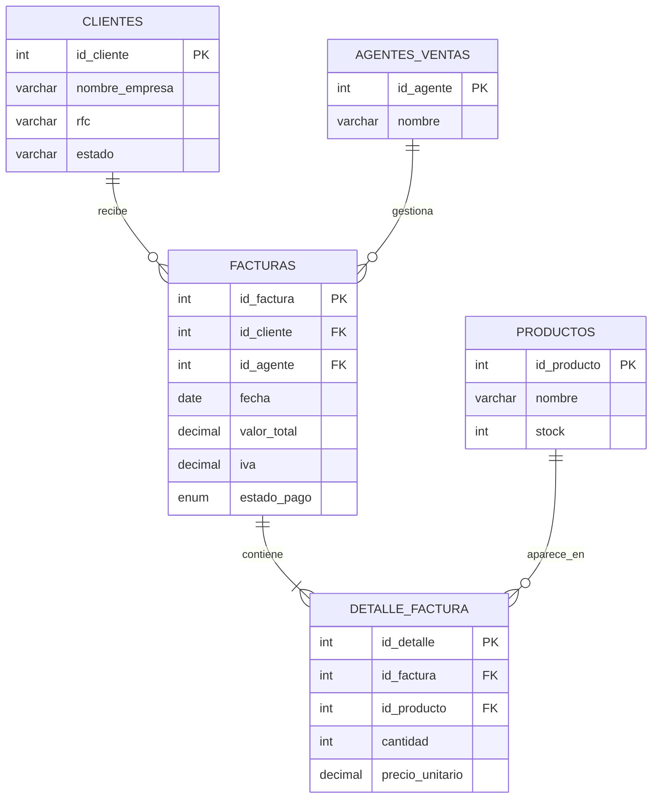
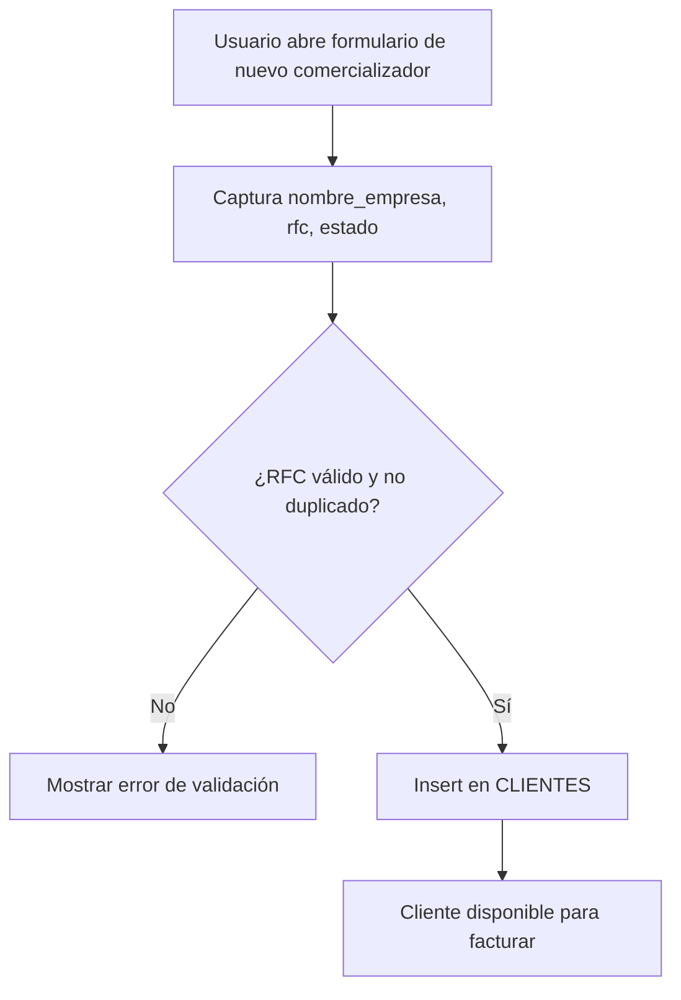
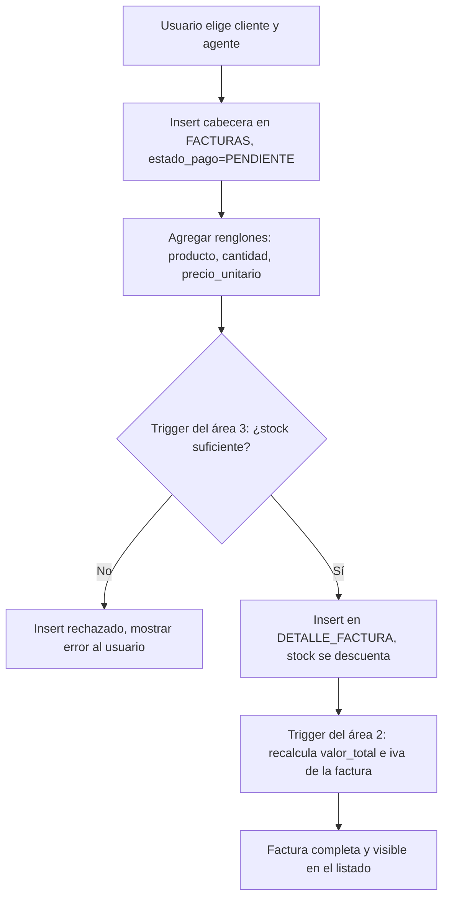
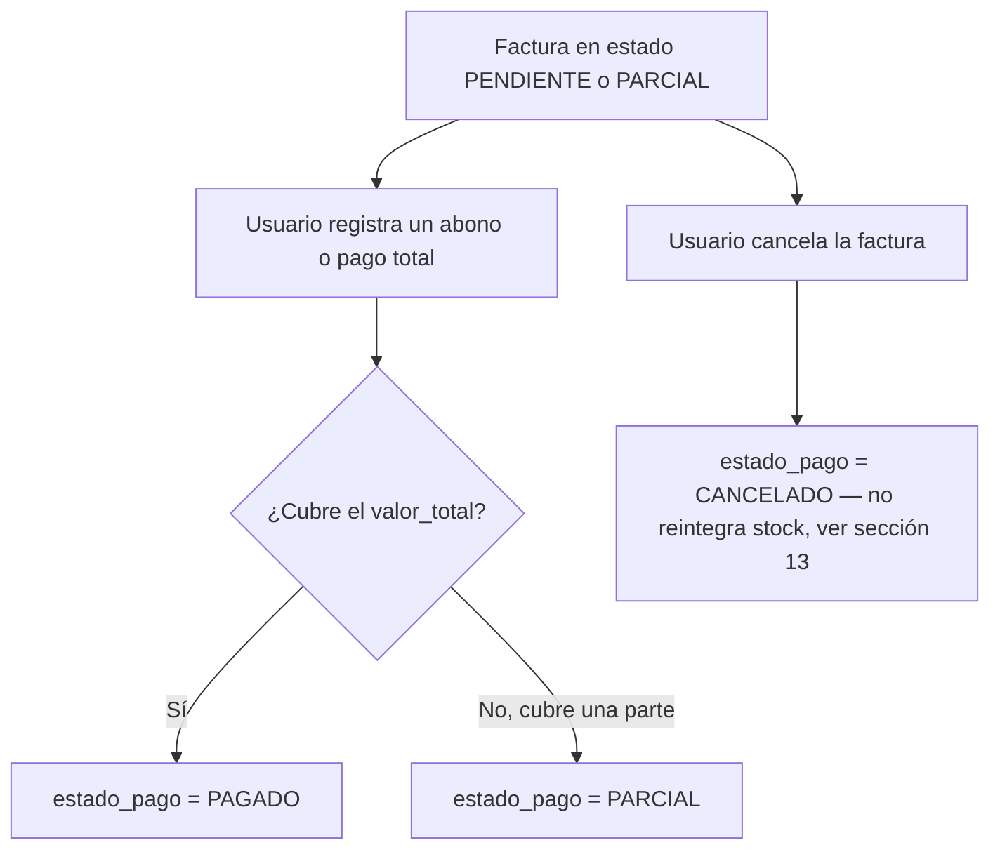

# Área 2 — Registro contable: facturación y comercializadores

> **Documento de contexto para agentes de código.**
> Complementa a `AREA3_inventario_contexto.md`, que contiene el modelo ER aprobado y es la fuente de verdad del esquema compartido.
> Ante cualquier contradicción entre este documento y `AREA3_inventario_contexto.md`, **gana el esquema de `AREA3_inventario_contexto.md`**.

| Campo | Valor |
|---|---|
| Proyecto | Sistema de gestión — Comercializadora nacional (México) |
| Área | 2 de 6 — Registro contable: valores en factura y comercializadores (clientes) |
| Motor | PostgreSQL 15 (Supabase) |
| Acceso a datos | `supabase-js` sobre PostgREST. **Sin backend propio** — el frontend en React habla directo con Supabase |
| Frontend | React (se asume Vite como bundler, por ser el stack habitual del equipo; confirmar si el proyecto ya define otro) |
| Equipo | 5 personas (1 líder + 4 integrantes) |
| Plazo | 8 días naturales |
| Versión | 1.0 |

---

## 1. Cómo debe usar este documento un agente

1. Este archivo es la fuente de verdad de los **issues y el alcance del área 2**. El esquema de tablas en sí (columnas, tipos, constraints) vive en `AREA3_inventario_contexto.md`, sección 5 y 10 — no lo dupliques ni lo reinventes aquí.
2. **No inventes columnas nuevas** en `CLIENTES`, `FACTURAS` o `DETALLE_FACTURA`. Si un issue parece requerir un campo que no existe (por ejemplo una tabla de pagos parciales), regístralo como pregunta abierta (sección 13) antes de crearlo.
3. **No toques `PRODUCTOS.stock` directamente.** Solo lo modifican los triggers del área 3 (RN-01, RN-06 en el documento del área 3). El área 2 únicamente inserta renglones en `DETALLE_FACTURA`; el trigger del área 3 se encarga de validar y descontar.
4. Cada issue de la sección 16 tiene un ID (`AREA2-XX`). Cítalo en comentarios de código, mensajes de commit y descripciones de PR.
5. Las reglas de negocio de este documento continúan la numeración del área 3 (`RN-10` en adelante) porque comparten una sola base de datos.

---

## 2. Contexto de negocio

Empresa mexicana dedicada a la comercialización a nivel nacional de productos electrónicos y de manufactura nacional. Vende a clientes comercializadores distribuidos por estado, a través de agentes de ventas, y cada venta se documenta como una factura con uno o más renglones de producto.

El sistema completo cubre seis necesidades, repartidas en seis áreas de trabajo:

| # | Necesidad | Área responsable |
|---|---|---|
| 1 | Registro de entradas: valor, capital de inversión, volumen de comercialización | Área 1 |
| **2** | **Registro contable de valores en factura y número de comercializadores** | **Área 2 (este documento)** |
| 3 | Base de datos de todos los productos, entradas y salidas | Área 3 |
| 4 | Salarios, sueldos y bonificaciones a agentes de ventas | Área 4 |
| 5 | Licencias, permisos, impuestos aduanales y de gobierno con pago dirigido | Área 5 |
| 6 | Costo, registro e investigación de marketing externo y directo | Área 6 |

Las seis áreas comparten **una sola base de datos**. Las fronteras son lógicas, no físicas: cualquier área puede leer todo, pero solo escribe en lo suyo.

---

## 3. Alcance del área 2

### Responsabilidad

Registrar el catálogo de clientes comercializadores, generar y dar seguimiento a las facturas de venta (valor, IVA, estado de pago), y entregar visibilidad de cuántos comercializadores hay y cuánto le compran a la empresa.

### Tablas por nivel de acceso

| Tabla | Acceso del área 2 | Nota |
|---|---|---|
| `CLIENTES` | **Escritura total** | Tabla núcleo del área |
| `FACTURAS` | **Escritura total** | Tabla núcleo del área |
| `DETALLE_FACTURA` | **Escritura compartida** | El área 2 crea el renglón (producto, cantidad, precio); el trigger del área 3 valida stock y lo descuenta (RN-01, doc. área 3) |
| `PRODUCTOS` | Solo lectura | Propiedad del área 3 — se usa para el selector de productos al armar una factura |
| `AGENTES_VENTAS` | Solo lectura | Propiedad del área 4 — se asigna un agente a cada factura |
| `ENTRADAS_PRODUCTO`, `AJUSTES_INVENTARIO` | Sin acceso | Fuera de alcance, propiedad del área 3 |
| `IMPUESTOS_LICENCIAS` | Sin acceso | Propiedad del área 5 |
| `MARKETING`, `CLIENTES_MARKETING` | Sin acceso | Propiedad del área 6 |

### Fuera de alcance — decir que no explícitamente

- Trazabilidad de inventario, kardex, conciliación física → área 3.
- Cálculo de comisiones y sueldos de agentes → área 4.
- Pagos de permisos, licencias e impuestos aduanales → área 5.
- Costo y ROI de campañas de marketing → área 6.

El área 2 **entrega los datos** que esas áreas necesitan mediante las vistas de la sección 11. No calcula sus indicadores.

---

## 4. Modelo entidad-relación (extracto relevante al área 2)

El modelo completo y aprobado vive en `AREA3_inventario_contexto.md`, sección 4. Aquí solo el subconjunto que el área 2 posee o consume:



---

## 5. Diccionario de datos del área 2

### CLIENTES

| Columna | Tipo | Nulo | Descripción y regla |
|---|---|---|---|
| `id_cliente` | INT | No | PK. Identidad generada. |
| `nombre_empresa` | VARCHAR(150) | No | Razón social del comercializador. |
| `rfc` | VARCHAR(20) | Sí | Único. Identifica fiscalmente al cliente; formato RFC mexicano (ver RN-14). |
| `estado` | VARCHAR(50) | Sí | Estado de la República donde opera el comercializador. Insumo del área 6 para segmentar campañas. |

### FACTURAS

| Columna | Tipo | Nulo | Descripción y regla |
|---|---|---|---|
| `id_factura` | INT | No | PK. |
| `id_cliente` | INT | No | FK → `CLIENTES`. |
| `id_agente` | INT | No | FK → `AGENTES_VENTAS`. |
| `fecha` | DATE | No | Default hoy. |
| `valor_total` | DECIMAL(14,2) | — | **No se captura a mano.** Se recalcula automáticamente por trigger a partir de `DETALLE_FACTURA` (RN-11). |
| `iva` | DECIMAL(12,2) | — | **No se captura a mano.** `valor_total_sin_iva * 0.16`, recalculado por el mismo trigger (RN-12). |
| `estado_pago` | ENUM | No | `PENDIENTE` (default) \| `PARCIAL` \| `PAGADO` \| `CANCELADO`. Lo actualiza el usuario desde la interfaz, no un trigger. |

### DETALLE_FACTURA (compartida con el área 3)

| Columna | Tipo | Quién escribe |
|---|---|---|
| `id_detalle` | INT | Sistema |
| `id_factura` | INT | Área 2 |
| `id_producto` | INT | Área 2 |
| `cantidad` | INT | Área 2 — el trigger del área 3 rechaza el insert si no hay stock suficiente |
| `precio_unitario` | DECIMAL(12,2) | Área 2 |
| `importe` (columna generada) | DECIMAL(14,2) | Sistema — `cantidad * precio_unitario` |

> **Distinción importante:** el área 2 nunca calcula ni envía `valor_total` o `iva` en el insert de una factura. Esos dos campos son responsabilidad exclusiva del trigger de recálculo (sección 10). Enviarlos manualmente desde el frontend es el bug más probable de esta área — equivalente a lo que el documento del área 3 advierte sobre escribir `stock` a mano.

---

## 6. Decisiones de diseño

1. **`valor_total` e `iva` no son columnas capturadas, son derivadas.** El modelo aprobado las define como columnas normales (no generadas) en `FACTURAS`, a diferencia de `DETALLE_FACTURA.importe` que sí es una columna generada. Como una factura puede tener varios renglones insertados en momentos distintos, la suma no puede ser una columna generada simple sobre la propia fila — necesita un trigger que reaccione a cambios en la tabla hija (`DETALLE_FACTURA`). Ver sección 10.
2. **Tasa de IVA fija al 16%.** Se asume la tasa general de México. Si el proyecto requiere tasas diferenciadas (frontera, productos exentos), es una pregunta abierta (sección 13) y no se resuelve en esta versión.
3. **`estado_pago` es manual, no derivado.** A diferencia de `valor_total`, nadie más que el usuario decide si una factura ya se pagó. No hay trigger que lo cambie automáticamente.
4. **El área 2 no reintegra stock al cancelar una factura.** Cancelar solo cambia `estado_pago` a `CANCELADO`; no hay lógica automática que le devuelva las unidades a `PRODUCTOS.stock`. Es una pregunta abierta coordinada con el área 3 (sección 13).

---

## 7. Flujo de alta de cliente



## 8. Flujo de creación de factura



## 9. Flujo de seguimiento de pago



---

## 10. Reglas de negocio

Continúan la numeración del documento del área 3 (`RN-01` a `RN-09`).

| ID | Regla | Dónde se implementa |
|---|---|---|
| **RN-10** | Toda factura debe estar asociada a un `id_cliente` y un `id_agente` existentes. | Llaves foráneas |
| **RN-11** | `FACTURAS.valor_total` = suma de `importe` de sus renglones en `DETALLE_FACTURA`, más IVA. Se recalcula automáticamente; ninguna aplicación lo escribe a mano. | Trigger `fn_recalcular_factura` |
| **RN-12** | `FACTURAS.iva` = subtotal de renglones `* 0.16`. Recalculado junto con `valor_total`. | Trigger `fn_recalcular_factura` |
| **RN-13** | Una factura sin renglones tiene `valor_total = 0` y no puede marcarse como `PAGADO`. | Validación de aplicación (frontend) |
| **RN-14** | `CLIENTES.rfc`, cuando se captura, debe cumplir el formato de RFC mexicano (persona moral: 12 caracteres) y ser único. | `CHECK` + `UNIQUE` en BD, regex en frontend |
| **RN-15** | El área 2 nunca escribe `PRODUCTOS.stock` directamente; solo inserta en `DETALLE_FACTURA` y deja que el trigger del área 3 (RN-01, RN-06) haga el descuento. | Convención + revisión de código |
| **RN-16** | Cancelar una factura (`estado_pago = CANCELADO`) es un cambio de estado, no un borrado. Los renglones y el stock descontado **no** se revierten automáticamente. | Convención de aplicación — pendiente de definir con área 3 (sección 13) |

---

## 11. Vistas de reporte y contratos con otras áreas

```sql
-- Resumen por comercializador: cuántos hay, cuánto han comprado, cuánto deben.
CREATE OR REPLACE VIEW v_clientes_resumen AS
SELECT c.id_cliente, c.nombre_empresa, c.rfc, c.estado,
       COUNT(DISTINCT f.id_factura)                                              AS numero_facturas,
       COALESCE(SUM(f.valor_total), 0)                                           AS monto_total_facturado,
       COALESCE(SUM(f.valor_total) FILTER (WHERE f.estado_pago IN ('PENDIENTE','PARCIAL')), 0) AS monto_pendiente
FROM clientes c
LEFT JOIN facturas f USING (id_cliente)
GROUP BY c.id_cliente, c.nombre_empresa, c.rfc, c.estado
ORDER BY monto_total_facturado DESC;

-- Facturas con cobro pendiente, para el módulo de seguimiento.
CREATE OR REPLACE VIEW v_facturas_pendientes AS
SELECT f.id_factura, c.nombre_empresa, f.fecha, f.valor_total, f.iva, f.estado_pago
FROM facturas f JOIN clientes c USING (id_cliente)
WHERE f.estado_pago IN ('PENDIENTE', 'PARCIAL')
ORDER BY f.fecha;

-- CONTRATO CON EL ÁREA 4: monto vendido por agente, insumo de su comisión.
CREATE OR REPLACE VIEW v_ventas_agente AS
SELECT a.id_agente, a.nombre,
       COUNT(DISTINCT f.id_factura)     AS numero_facturas,
       COALESCE(SUM(f.valor_total), 0)  AS monto_vendido
FROM agentes_ventas a
LEFT JOIN facturas f USING (id_agente)
GROUP BY a.id_agente, a.nombre;
```

### Contratos de interfaz

| Área | Qué recibe del área 2 | Vía |
|---|---|---|
| 3 | Producto, cantidad y precio de cada renglón, para validar/descontar stock | Insert directo en `detalle_factura` |
| 4 | Monto vendido por agente | `v_ventas_agente` |
| 6 | Número y estado geográfico de los comercializadores | `clientes` (solo lectura), `v_clientes_resumen` |

Las otras áreas consumen **vistas o la tabla `clientes` en modo lectura, nunca escriben en las tablas del área 2**.

---

## 12. Convenciones del repositorio

```
/supabase
  /migrations
    0001_tipos_enum.sql
    0002_tablas_base.sql                 (clientes, agentes_ventas, productos, facturas, detalle_factura)
    0003_tablas_area3.sql
    0004_triggers.sql                    (incluye fn_salida_producto, área 3)
    0005_vistas.sql
    0006_rls.sql
    0007_trigger_recalculo_factura.sql   ← área 2
    0008_vistas_area2.sql                ← área 2
    0009_rls_area2.sql                   ← área 2
/docs
  AREA2_contabilidad_contexto.md   ← este archivo
  AREA3_inventario_contexto.md
/src
  /lib/supabaseClient.js
  /services/clientes.js
  /services/facturas.js
  /components/clientes/
  /components/facturas/
  /pages/
```

- Nombres de tablas y columnas en minúsculas con guión bajo, en español — ya definidos en el esquema aprobado, no se renombran.
- Migraciones numeradas y nunca editadas después de aplicarse: un cambio es una migración nueva.
- Toda función y trigger lleva en su comentario el `RN-xx` que implementa.
- Acceso a datos siempre por `supabase-js`, nunca con SQL crudo desde el frontend.
- Commits: `area2: <verbo> <objeto>` — por ejemplo `area2: agrega trigger de recalculo de factura (RN-11)`.

### Consultas típicas con supabase-js

```js
// Alta de comercializador
await supabase.from('clientes').insert({ nombre_empresa, rfc, estado });

// Crear factura (cabecera) y luego sus renglones
const { data: factura } = await supabase
  .from('facturas')
  .insert({ id_cliente, id_agente })
  .select()
  .single();

await supabase.from('detalle_factura').insert(
  renglones.map(r => ({
    id_factura: factura.id_factura,
    id_producto: r.id_producto,
    cantidad: r.cantidad,
    precio_unitario: r.precio_unitario,
  }))
);
// valor_total e iva se recalculan solos vía trigger (RN-11, RN-12) — no los mandes en el insert.

// Panel de comercializadores
const { data } = await supabase.from('v_clientes_resumen').select('*');

// Marcar una factura como pagada
await supabase.from('facturas').update({ estado_pago: 'PAGADO' }).eq('id_factura', id);
```

---

## 13. Preguntas abiertas

1. ¿La tasa de IVA es siempre 16%, o hay productos exentos / tasa fronteriza? Afecta directamente al trigger `fn_recalcular_factura`.
2. ¿Cancelar una factura debe reintegrar el stock descontado? Hoy no ocurre (RN-16); requiere coordinación con el área 3.
3. ¿Los pagos parciales se registran como un monto o solo como el cambio de `estado_pago`? El modelo aprobado no tiene tabla de pagos/abonos.
4. ¿Se requiere folio fiscal (CFDI) o es solo un registro interno de control? Cambia el alcance de validaciones de `FACTURAS`.
5. ¿Un mismo comercializador puede tener más de un RFC (varias sucursales)? El modelo actual asume uno por cliente.

---

## 14. Equipo y plan de 8 días

| Rol | Responsabilidad | Entregable |
|---|---|---|
| Líder | Coordinación, alcance, reporte final, evaluación del equipo | Reporte y matriz de evaluación |
| Modelador / triggers | Migraciones del área 2, trigger de recálculo, RLS | Recálculo de `valor_total`/`iva` funcionando en Supabase |
| Frontend — Clientes | Módulo CRUD de comercializadores | Alta, edición y listado de clientes |
| Frontend — Facturación | Módulo de creación de factura y seguimiento de pago | Flujo completo de factura con renglones |
| Documentación y enlace | Este documento actualizado, contratos con áreas 3, 4 y 6 | Diccionario de datos y contratos firmados |

| Día | Hito |
|---|---|
| 1 | Evaluación de habilidades, alcance cerrado, roles asignados |
| 2 | Confirmación del esquema con el área 3, contratos de vistas acordados |
| 3 | Proyecto React + Supabase inicializado; CRUD de clientes funcionando |
| 4 | Alta de factura con renglones; trigger de recálculo probado (RN-11, RN-12) |
| 5 | Módulo de seguimiento de pago; vistas de reporte listas |
| 6 | Pruebas integrales. **Congelamiento de alcance: nada nuevo entra después** |
| 7 | Documentación, ensayo de la presentación |
| 8 | Entrega y presentación |

---

## 15. Glosario

| Término | Significado en este proyecto |
|---|---|
| Comercializador | Cliente empresa que compra productos para revender; sinónimo de `CLIENTES` en el modelo. |
| Factura | Documento que agrupa una o más ventas a un comercializador, con IVA y estado de pago. |
| Renglón / detalle | Cada línea de producto dentro de una factura (`DETALLE_FACTURA`). |
| Subtotal | Suma de `importe` de los renglones de una factura, antes de IVA. |
| IVA | Impuesto al Valor Agregado, 16% sobre el subtotal en este proyecto. |
| Estado de pago | `PENDIENTE`, `PARCIAL`, `PAGADO` o `CANCELADO`. |
| RFC | Registro Federal de Contribuyentes — identificador fiscal mexicano del cliente. |

---

## 16. Issues de implementación (React + Supabase, sin backend propio)

Convención de numeración: `AREA2-XX`. Etiquetas usadas: `schema`, `trigger`, `rls`, `frontend`, `reporte`, `auth`, `qa`, `docs`.

### Épica A — Base de datos (Supabase)

**AREA2-01 — Confirmar y aplicar el esquema base compartido**
- Verificar que `clientes`, `facturas`, `agentes_ventas`, `productos` y `detalle_factura` existan tal como en `AREA3_inventario_contexto.md` sección 10.
- Criterios de aceptación: las 5 tablas existen en el proyecto Supabase; los `CHECK` y `UNIQUE` del modelo aprobado están activos.
- Etiqueta: `schema`. Depende de: coordinación con área 3.

**AREA2-02 — Trigger de recálculo de `valor_total` e `iva`**
- Crear `fn_recalcular_factura()` y el trigger `tg_recalcular_factura` sobre `detalle_factura` (AFTER INSERT/UPDATE/DELETE), según sección 10 (RN-11, RN-12).
- Criterios de aceptación: insertar, editar o borrar un renglón actualiza `valor_total` e `iva` de la factura correspondiente sin intervención del frontend.
- Etiqueta: `trigger`. Depende de: AREA2-01.

**AREA2-03 — Row Level Security en `clientes` y `facturas`**
- Activar RLS y crear políticas para usuarios `authenticated`, igual que el patrón usado por el área 3.
- Criterios de aceptación: un usuario no autenticado no puede leer ni escribir; un usuario autenticado sí.
- Etiqueta: `rls`. Depende de: AREA2-01, AREA2-08 (auth).

**AREA2-04 — Vistas de reporte del área 2**
- Crear `v_clientes_resumen`, `v_facturas_pendientes` y `v_ventas_agente` (sección 11).
- Criterios de aceptación: las tres vistas regresan datos correctos contra el set de prueba (mínimo 10 clientes, 15 facturas).
- Etiqueta: `schema`. Depende de: AREA2-02.

### Épica B — Configuración del proyecto React

**AREA2-05 — Inicializar el proyecto y el cliente de Supabase**
- Crear el proyecto React, instalar `@supabase/supabase-js`, configurar `lib/supabaseClient.js` con variables de entorno (`SUPABASE_URL`, `SUPABASE_ANON_KEY`).
- Criterios de aceptación: una consulta de prueba (`select('*').limit(1)`) regresa datos desde la app.
- Etiqueta: `frontend`.

**AREA2-06 — Capa de servicios (`services/clientes.js`, `services/facturas.js`)**
- Encapsular todas las llamadas a `supabase-js` de esta área en funciones reutilizables (no llamar a `supabase` directo desde los componentes).
- Criterios de aceptación: los componentes de la Épica C y D importan funciones de `services/`, no el cliente crudo.
- Etiqueta: `frontend`. Depende de: AREA2-05.

**AREA2-07 — Manejo centralizado de errores de Supabase**
- Interceptar errores de Postgres (violación de `CHECK`, `UNIQUE`, o la excepción `RN-01` del trigger de stock) y traducirlos a mensajes legibles para el usuario.
- Criterios de aceptación: intentar facturar más unidades de las que hay en stock muestra "Stock insuficiente para <producto>" en vez de un error crudo de Postgres.
- Etiqueta: `frontend`. Depende de: AREA2-06.

### Épica C — Autenticación

**AREA2-08 — Login con Supabase Auth**
- Implementar pantalla de login (email/password) usando `supabase.auth`. Requerido porque RLS exige el rol `authenticated`.
- Criterios de aceptación: sin sesión iniciada, la app no puede leer ni escribir clientes/facturas; con sesión, sí.
- Etiqueta: `auth`. Depende de: AREA2-05.

**AREA2-09 — Persistencia de sesión y ruta protegida**
- Redirigir a login si no hay sesión activa; mantener la sesión entre recargas con `onAuthStateChange`.
- Criterios de aceptación: recargar la página no cierra la sesión; un usuario sin login no ve el dashboard.
- Etiqueta: `auth`. Depende de: AREA2-08.

### Épica D — Módulo de comercializadores (clientes)

**AREA2-10 — Listado de comercializadores**
- Tabla con nombre, RFC, estado y monto total facturado (desde `v_clientes_resumen`), con buscador por nombre.
- Criterios de aceptación: la tabla refleja los datos reales del set de prueba y se actualiza tras un alta.
- Etiqueta: `frontend`. Depende de: AREA2-04, AREA2-06.

**AREA2-11 — Alta y edición de comercializador**
- Formulario con validación de `rfc` (regex de persona moral mexicana, RN-14) antes de enviar el insert.
- Criterios de aceptación: un RFC mal formado o duplicado se rechaza en el frontend con mensaje claro, antes de tocar la BD.
- Etiqueta: `frontend`. Depende de: AREA2-06.

**AREA2-12 — Indicador de "número de comercializadores"**
- Tarjeta de KPI en el dashboard con el conteo total de clientes activos — responde directamente a la necesidad de negocio del punto 2.
- Criterios de aceptación: el número mostrado coincide con `COUNT(*) FROM clientes`.
- Etiqueta: `frontend`. Depende de: AREA2-10.

### Épica E — Módulo de facturación

**AREA2-13 — Formulario de nueva factura: cabecera**
- Selector de cliente y de agente de ventas (lectura de `clientes` y `agentes_ventas`); crea la fila en `facturas` antes de agregar renglones.
- Criterios de aceptación: no se puede continuar al paso de renglones sin cliente y agente seleccionados (RN-10).
- Etiqueta: `frontend`. Depende de: AREA2-06.

**AREA2-14 — Selector de productos y renglones de factura**
- Buscador de producto (lectura de `productos`, mostrando `stock` disponible), captura de cantidad y precio unitario, cálculo de importe en vivo antes de guardar.
- Criterios de aceptación: el usuario ve el subtotal de la factura actualizarse mientras agrega renglones, antes incluso de guardar.
- Etiqueta: `frontend`. Depende de: AREA2-13.

**AREA2-15 — Guardado de renglones y manejo del rechazo por stock**
- Insertar los renglones en `detalle_factura`; si el trigger del área 3 rechaza por stock insuficiente, mostrar el error de AREA2-07 sin perder los datos capturados.
- Criterios de aceptación: un intento fallido no borra el formulario; el usuario puede corregir la cantidad y reintentar.
- Etiqueta: `frontend`. Depende de: AREA2-14, AREA2-07.

**AREA2-16 — Vista de detalle de factura**
- Pantalla de solo lectura con cabecera, renglones, subtotal, IVA, `valor_total` y estado de pago.
- Criterios de aceptación: los montos mostrados vienen de `facturas`/`detalle_factura`, nunca recalculados en el frontend.
- Etiqueta: `frontend`. Depende de: AREA2-15.

### Épica F — Seguimiento de pagos

**AREA2-17 — Listado de facturas pendientes**
- Tabla desde `v_facturas_pendientes`, con filtro por cliente y por rango de fecha.
- Criterios de aceptación: una factura marcada `PAGADO` desaparece del listado sin recargar manualmente.
- Etiqueta: `frontend`. Depende de: AREA2-04.

**AREA2-18 — Actualizar estado de pago**
- Acción para cambiar `estado_pago` entre `PENDIENTE`, `PARCIAL`, `PAGADO` y `CANCELADO` (RN-13: no permitir `PAGADO` si `valor_total = 0`).
- Criterios de aceptación: la validación de RN-13 se aplica en el frontend antes del update.
- Etiqueta: `frontend`. Depende de: AREA2-16.

### Épica G — Reportes y dashboard

**AREA2-19 — Dashboard general del área 2**
- Página con: número de comercializadores (AREA2-12), monto total facturado del mes, monto pendiente de cobro, top 5 comercializadores por monto.
- Criterios de aceptación: todos los números provienen de `v_clientes_resumen` / `v_facturas_pendientes`, ninguno se calcula manualmente en el cliente.
- Etiqueta: `reporte`. Depende de: AREA2-04, AREA2-10.

**AREA2-20 — Exportar reporte de ventas por agente**
- Botón para exportar `v_ventas_agente` a CSV, como entregable para el área 4.
- Criterios de aceptación: el CSV generado coincide con lo que muestra la vista en Supabase.
- Etiqueta: `reporte`. Depende de: AREA2-04.

### Épica H — Pruebas

**AREA2-21 — Datos de prueba (seed)**
- Script o carga manual de al menos 10 clientes, 4 agentes de referencia y 15 facturas con renglones variados, incluyendo casos de stock insuficiente.
- Criterios de aceptación: el seed corre limpio contra una base vacía y deja el escenario listo para QA.
- Etiqueta: `qa`. Depende de: AREA2-01.

**AREA2-22 — Pruebas del trigger de recálculo**
- Casos: insertar un renglón, editar su cantidad, borrar un renglón, borrar la última línea de una factura (debe quedar `valor_total = 0`).
- Criterios de aceptación: los cuatro casos dejan `valor_total`/`iva` correctos, verificado directamente en Supabase.
- Etiqueta: `qa`. Depende de: AREA2-02.

**AREA2-23 — Pruebas end-to-end del flujo de facturación**
- Desde login hasta factura pagada, incluyendo el caso de rechazo por stock insuficiente.
- Criterios de aceptación: el flujo completo se ejecuta sin errores no controlados en la consola.
- Etiqueta: `qa`. Depende de: AREA2-15, AREA2-18.

### Épica I — Documentación y entrega

**AREA2-24 — Actualizar este documento con los acuerdos reales**
- Registrar en la sección 13 las respuestas que el equipo obtenga a las preguntas abiertas, y marcarlas como resueltas.
- Criterios de aceptación: ninguna pregunta abierta queda sin respuesta o sin justificación de por qué se pospuso.
- Etiqueta: `docs`.

**AREA2-25 — Preparar contratos de interfaz con áreas 4 y 6**
- Confirmar con esos equipos que `v_ventas_agente` y `v_clientes_resumen` cubren lo que necesitan.
- Criterios de aceptación: firma o confirmación explícita de ambos equipos sobre el contrato de la sección 11.
- Etiqueta: `docs`. Depende de: AREA2-04.
