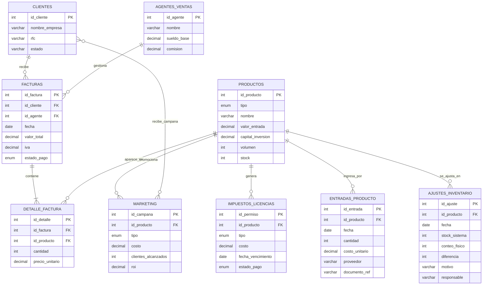
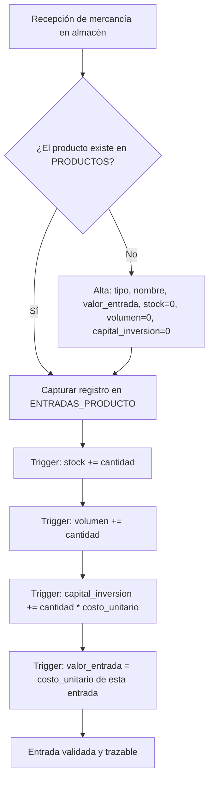
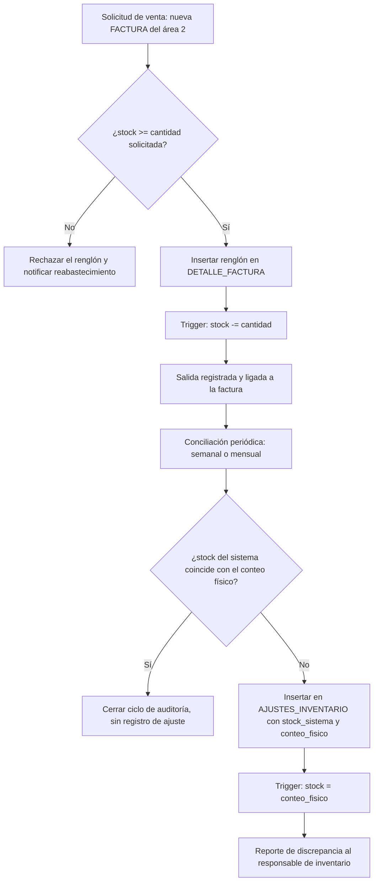

# Área 3 — Base de datos de entradas y salidas

> **Documento de contexto del área 3.** Fuente de verdad para el equipo y para cualquier agente de código.
> Entregado por el equipo del área (original sin cambios en `originales/contexto_equipo.md`); aquí se alinean numeración de reglas, convenciones del repo y fechas con `PLAN.md`.
> Ante contradicción entre este documento y el código, gana este documento. Ante contradicción con `PLAN.md`, gana `PLAN.md`.

| Campo | Valor |
|---|---|
| Proyecto | Sistema de gestión — Comercializadora nacional (México) |
| Área | 3 de 6 — Base de datos de productos, entradas y salidas |
| Motor | PostgreSQL 15 (Supabase) |
| Acceso a datos | `supabase-js` sobre PostgREST. **No se usa GraphQL** |
| Equipo | 5 personas (1 líder + 4 integrantes) |
| Plazo | Domingo 13 a jueves 17 de septiembre de 2026 (5 días de trabajo) |
| Versión | 1.0 |

---

## 1. Cómo debe usar este documento un agente

1. Este archivo es la **única fuente de verdad** del área 3. Si el código del repo contradice este documento, el documento tiene la razón y el código es el que se corrige.
2. **No inventes tablas ni columnas.** El esquema de la sección 4 está cerrado. Si una tarea parece requerir un campo que no existe, decláralo como pregunta abierta (sección 13) en lugar de crearlo.
3. **No toques tablas fuera del alcance del área 3.** La sección 3 dice exactamente cuáles son de lectura y cuáles son de escritura.
4. Todo cambio de esquema va como **archivo de migración nuevo** (sección 12), nunca editando una migración ya aplicada.
5. Las reglas de negocio están numeradas (`RN-A3-01` … `RN-A3-09`). Cítalas por su identificador en comentarios de código, mensajes de commit y descripciones de PR.

---

## 2. Contexto de negocio

Empresa mexicana dedicada a la comercialización a nivel nacional de **productos electrónicos** y de **manufactura nacional**. Compra a proveedores (incluidos importadores), mantiene inventario, y vende a clientes comercializadores distribuidos por estado mediante agentes de ventas.

El sistema completo cubre seis necesidades, repartidas en seis áreas de trabajo:

| # | Necesidad | Área responsable |
|---|---|---|
| 1 | Registro de entradas: valor, capital de inversión, volumen de comercialización | Área 1 |
| 2 | Registro contable de valores en factura y número de comercializadores | Área 2 |
| **3** | **Base de datos de todos los productos, entradas y salidas** | **Área 3 (este documento)** |
| 4 | Salarios, sueldos y bonificaciones a agentes de ventas | Área 4 |
| 5 | Licencias, permisos, impuestos aduanales y de gobierno con pago dirigido | Área 5 |
| 6 | Costo, registro e investigación de marketing externo y directo | Área 6 |

Las seis áreas comparten **una sola base de datos**. Las fronteras son lógicas, no físicas: cualquier área puede leer todo, pero solo escribe en lo suyo.

---

## 3. Alcance del área 3

### Responsabilidad

Mantener el catálogo de productos y la trazabilidad del inventario: qué entra, qué sale, cuánto hay y si lo que dice el sistema coincide con el almacén físico.

### Tablas por nivel de acceso

| Tabla | Acceso del área 3 | Nota |
|---|---|---|
| `PRODUCTOS` | **Escritura total** | Tabla núcleo del área |
| `ENTRADAS_PRODUCTO` | **Escritura total** | Propuesta del área 3 — ver sección 6 |
| `DETALLE_FACTURA` | **Escritura compartida** | El área 2 crea el renglón; el área 3 valida stock y lo descuenta |
| `AJUSTES_INVENTARIO` | **Escritura total** | Propuesta del área 3 — ver sección 6 |
| `FACTURAS` | Solo lectura | Propiedad del área 2 |
| `CLIENTES` | Solo lectura | Propiedad del área 2 |
| `AGENTES_VENTAS` | Solo lectura | Propiedad del área 4 |
| `IMPUESTOS_LICENCIAS` | Solo lectura | Propiedad del área 5 |
| `MARKETING`, `CLIENTES_MARKETING` | Solo lectura | Propiedad del área 6. Sustituidas por `campanas`, `campana_clientes` y demás (I-09, ver docs/area6-marketing/CONTEXTO.md) |

### Fuera de alcance — decir que no explícitamente

- Cálculo de IVA, cuentas por cobrar, estado de pago de facturas → área 2.
- Comisiones y sueldos de agentes → área 4.
- Pagos de permisos y aduanas → área 5.
- ROI de campañas → área 6.

El área 3 **entrega los datos** que esas áreas necesitan mediante las vistas de la sección 9. No calcula sus indicadores.

---

## 4. Modelo entidad-relación (canónico)



`ENTRADAS_PRODUCTO` y `AJUSTES_INVENTARIO` son la aportación del área 3 al modelo. Todo lo demás viene tal cual del modelo aprobado.

### Relaciones

| Entidad A | Cardinalidad | Entidad B | Nombre | Descripción |
|---|---|---|---|---|
| CLIENTES | 1 : N | FACTURAS | recibe | Un cliente recibe muchas facturas |
| AGENTES_VENTAS | 1 : N | FACTURAS | gestiona | Un agente gestiona muchas facturas |
| FACTURAS | 1 : (1..N) | DETALLE_FACTURA | contiene | Una factura contiene al menos un renglón |
| PRODUCTOS | 1 : N | DETALLE_FACTURA | aparece_en | Un producto aparece en muchos renglones |
| PRODUCTOS | 1 : N | ENTRADAS_PRODUCTO | ingresa_por | Un producto ingresa muchas veces |
| PRODUCTOS | 1 : N | AJUSTES_INVENTARIO | se_ajusta_en | Un producto se concilia periódicamente |
| PRODUCTOS | 1 : N | MARKETING | promociona | Un producto se promociona en muchas campañas |
| PRODUCTOS | 1 : N | IMPUESTOS_LICENCIAS | genera | Un producto genera permisos e impuestos |
| CLIENTES | N : M | MARKETING | recibe_campana | Resuelta con la tabla puente `CLIENTES_MARKETING` |

---

## 5. Diccionario de datos del área 3

### PRODUCTOS

| Columna | Tipo | Nulo | Descripción y regla |
|---|---|---|---|
| `id_producto` | INT | No | PK. Identidad generada. |
| `tipo` | ENUM | No | `ELECTRONICO` \| `MANUFACTURA`. Determina si aplica trámite aduanal (área 5). |
| `nombre` | VARCHAR(150) | No | Descripción comercial. Único junto con `tipo`. |
| `valor_entrada` | DECIMAL(12,2) | Sí | **Último** costo unitario de compra. Se actualiza en cada entrada. No es histórico: el histórico vive en `ENTRADAS_PRODUCTO.costo_unitario`. |
| `capital_inversion` | DECIMAL(14,2) | Sí | Acumulado invertido en el producto = suma de `cantidad * costo_unitario` de todas sus entradas. Insumo del área 1. |
| `volumen` | INT | Sí | Acumulado de unidades que han ingresado históricamente. **No es el stock.** Nunca decrece. |
| `stock` | INT | No | Existencia disponible ahora. Default 0. Nunca negativo (RN-A3-01). |

> **Distinción crítica, y la fuente de error más probable del proyecto:** `volumen` es cuánto ha entrado *en total desde siempre*; `stock` es cuánto hay *en este momento*. Una entrada de 100 piezas aumenta ambos; una venta de 30 solo reduce `stock`. Quien las confunda va a reportar cifras infladas al área 1.

### ENTRADAS_PRODUCTO

| Columna | Tipo | Nulo | Descripción |
|---|---|---|---|
| `id_entrada` | INT | No | PK. |
| `id_producto` | INT | No | FK → `PRODUCTOS`. |
| `fecha` | DATE | No | Fecha de recepción física. Default hoy. |
| `cantidad` | INT | No | Unidades recibidas. Siempre > 0 (RN-A3-04). |
| `costo_unitario` | DECIMAL(12,2) | No | Costo de compra de esta entrada específica. |
| `proveedor` | VARCHAR(150) | Sí | Nombre o razón social de quien surtió. |
| `documento_ref` | VARCHAR(50) | Sí | Folio de la factura o remisión del proveedor. Trazabilidad documental. |

### AJUSTES_INVENTARIO

| Columna | Tipo | Nulo | Descripción |
|---|---|---|---|
| `id_ajuste` | INT | No | PK. |
| `id_producto` | INT | No | FK → `PRODUCTOS`. |
| `fecha` | DATE | No | Fecha del conteo físico. |
| `stock_sistema` | INT | No | Lo que decía la base antes del ajuste. Se congela como evidencia. |
| `conteo_fisico` | INT | No | Lo que realmente había en el almacén. |
| `diferencia` | INT | — | Columna generada: `conteo_fisico - stock_sistema`. Negativa = faltante. |
| `motivo` | VARCHAR(255) | Sí | Merma, robo, error de captura, producto dañado. |
| `responsable` | VARCHAR(150) | Sí | Quién realizó el conteo. |

### DETALLE_FACTURA (compartida con el área 2)

| Columna | Tipo | Quién escribe |
|---|---|---|
| `id_detalle` | INT | Sistema |
| `id_factura` | INT | Área 2 |
| `id_producto` | INT | Área 2 |
| `cantidad` | INT | Área 2 — **el área 3 valida contra stock antes de permitirlo** |
| `precio_unitario` | DECIMAL(12,2) | Área 2 |

### Valores ENUM definidos

El modelo original dejó los `ENUM(...)` sin especificar. Estos son los valores acordados. **No agregues valores sin registrarlo en la sección 13.**

| Tipo | Valores |
|---|---|
| `tipo_producto` | `ELECTRONICO`, `MANUFACTURA` |
| `tipo_marketing` | `EXTERNO`, `DIRECTO` |
| `estado_pago` | `PENDIENTE`, `PARCIAL`, `PAGADO`, `CANCELADO` |
| `tipo_permiso` | `LICENCIA`, `PERMISO`, `ADUANAL`, `IMPUESTO` |

---

## 6. Decisión de diseño: por qué se agregaron dos tablas

El modelo aprobado resuelve las salidas con `DETALLE_FACTURA`, pero **las entradas solo se reflejan como un incremento en `PRODUCTOS.stock`**. Eso deja tres cosas imposibles, y las tres están en el enunciado del área 3:

1. **Trazabilidad de entradas.** No se puede responder cuándo entró la mercancía, cuánta, a qué costo ni de qué proveedor. El flujo del documento de proyecto dice literalmente "se registra la operación con fecha y cantidad" — sin tabla, no hay dónde registrarla.
2. **Conciliación periódica.** El flujo exige comparar sistema contra conteo físico y "generar un ajuste de inventario y reportar discrepancia". Sin tabla, el ajuste sobrescribe el stock y borra la evidencia de que hubo una diferencia.
3. **Insumo del área 1.** `capital_inversion` y `volumen` son acumulados; sin el detalle de cada entrada no hay forma de recalcularlos, auditarlos ni desglosarlos por periodo.

`ENTRADAS_PRODUCTO` y `AJUSTES_INVENTARIO` son **aditivas**: no modifican ninguna tabla, columna ni relación del modelo aprobado, así que no afectan el trabajo de las otras cinco áreas.

Se conserva `PRODUCTOS.stock` como columna (no se calcula al vuelo) porque así lo define el modelo aprobado. La consistencia se garantiza con triggers (RN-A3-06): ninguna aplicación escribe `stock` directamente.

---

## 7. Flujo de entrada de producto



La captura es de una sola fila en `ENTRADAS_PRODUCTO`. Los cuatro efectos sobre `PRODUCTOS` los ejecuta el trigger. **Una aplicación que actualice `stock` por su cuenta duplica el incremento** — ese es el bug clásico de este diseño, y el motivo de RN-A3-06.

---

## 8. Flujo de salida y conciliación



La validación de stock ocurre **dentro del trigger**, no solo en la interfaz. Una validación que vive únicamente en el frontend se salta con cualquier inserción directa desde el editor SQL de Supabase, y en este proyecto varias personas van a insertar datos desde ahí.

---

## 9. Reglas de negocio

| ID | Regla | Dónde se implementa |
|---|---|---|
| **RN-A3-01** | `PRODUCTOS.stock` nunca puede quedar negativo. Ninguna venta se completa si dejaría el stock bajo cero. | `CHECK (stock >= 0)` + trigger `fn_salida_producto` |
| **RN-A3-02** | Toda entrada y toda salida debe referirse a un `id_producto` existente. | Llaves foráneas |
| **RN-A3-03** | Una factura debe contener al menos un renglón de detalle (cardinalidad 1..N). | Validación de aplicación |
| **RN-A3-04** | `cantidad` siempre mayor que cero, tanto en entradas como en salidas. | `CHECK (cantidad > 0)` |
| **RN-A3-05** | `volumen` es acumulado histórico y nunca decrece. Solo lo incrementan las entradas. | Trigger de entrada |
| **RN-A3-06** | Ninguna aplicación escribe `PRODUCTOS.stock` directamente. Solo lo modifican los triggers de entrada, salida y ajuste. | Convención + revisión de código |
| **RN-A3-07** | Un ajuste de inventario conserva `stock_sistema` y `conteo_fisico` como evidencia. Nunca se corrige el stock sin dejar el registro del ajuste. | Trigger `fn_ajuste_inventario` |
| **RN-A3-08** | `valor_entrada` refleja el costo de la **última** entrada; el histórico de costos vive en `ENTRADAS_PRODUCTO`. | Trigger de entrada |
| **RN-A3-09** | El área 3 no modifica `FACTURAS`, `CLIENTES`, `AGENTES_VENTAS`, `MARKETING` ni `IMPUESTOS_LICENCIAS`. | Políticas RLS + revisión de código |

---

## 10. DDL — PostgreSQL / Supabase

Esquema `public`. Este bloque es el estado objetivo; en el repo se divide en migraciones numeradas (sección 12).

```sql
-- ---------- TIPOS ----------
CREATE TYPE tipo_producto  AS ENUM ('ELECTRONICO','MANUFACTURA');
CREATE TYPE tipo_marketing AS ENUM ('EXTERNO','DIRECTO');
CREATE TYPE estado_pago    AS ENUM ('PENDIENTE','PARCIAL','PAGADO','CANCELADO');
CREATE TYPE tipo_permiso   AS ENUM ('LICENCIA','PERMISO','ADUANAL','IMPUESTO');

-- ---------- TABLAS DE OTRAS ÁREAS (referencia; no las modifica el área 3) ----------
CREATE TABLE clientes (
    id_cliente     INT GENERATED ALWAYS AS IDENTITY PRIMARY KEY,
    nombre_empresa VARCHAR(150) NOT NULL,
    rfc            VARCHAR(20) UNIQUE,
    estado         VARCHAR(50)
);

CREATE TABLE agentes_ventas (
    id_agente   INT GENERATED ALWAYS AS IDENTITY PRIMARY KEY,
    nombre      VARCHAR(150) NOT NULL,
    sueldo_base DECIMAL(10,2),
    comision    DECIMAL(5,2)
);

-- ---------- NÚCLEO DEL ÁREA 3 ----------
CREATE TABLE productos (
    id_producto       INT GENERATED ALWAYS AS IDENTITY PRIMARY KEY,
    tipo              tipo_producto NOT NULL,
    nombre            VARCHAR(150) NOT NULL,
    valor_entrada     DECIMAL(12,2) DEFAULT 0,
    capital_inversion DECIMAL(14,2) DEFAULT 0,
    volumen           INT DEFAULT 0,
    stock             INT NOT NULL DEFAULT 0,
    CONSTRAINT ck_stock_no_negativo CHECK (stock >= 0),          -- RN-A3-01
    CONSTRAINT ck_volumen_no_negativo CHECK (volumen >= 0),      -- RN-A3-05
    CONSTRAINT uq_producto UNIQUE (nombre, tipo)
);

CREATE TABLE entradas_producto (
    id_entrada     INT GENERATED ALWAYS AS IDENTITY PRIMARY KEY,
    id_producto    INT NOT NULL REFERENCES productos(id_producto),
    fecha          DATE NOT NULL DEFAULT CURRENT_DATE,
    cantidad       INT NOT NULL,
    costo_unitario DECIMAL(12,2) NOT NULL,
    proveedor      VARCHAR(150),
    documento_ref  VARCHAR(50),
    CONSTRAINT ck_entrada_cantidad CHECK (cantidad > 0),         -- RN-A3-04
    CONSTRAINT ck_entrada_costo CHECK (costo_unitario >= 0)
);
CREATE INDEX ix_entradas_producto ON entradas_producto(id_producto);
CREATE INDEX ix_entradas_fecha    ON entradas_producto(fecha);

CREATE TABLE facturas (
    id_factura  INT GENERATED ALWAYS AS IDENTITY PRIMARY KEY,
    id_cliente  INT NOT NULL REFERENCES clientes(id_cliente),
    id_agente   INT NOT NULL REFERENCES agentes_ventas(id_agente),
    fecha       DATE NOT NULL DEFAULT CURRENT_DATE,
    valor_total DECIMAL(14,2) DEFAULT 0,
    iva         DECIMAL(12,2) DEFAULT 0,
    estado_pago estado_pago NOT NULL DEFAULT 'PENDIENTE'
);

CREATE TABLE detalle_factura (
    id_detalle      INT GENERATED ALWAYS AS IDENTITY PRIMARY KEY,
    id_factura      INT NOT NULL REFERENCES facturas(id_factura) ON DELETE CASCADE,
    id_producto     INT NOT NULL REFERENCES productos(id_producto),
    cantidad        INT NOT NULL,
    precio_unitario DECIMAL(12,2) NOT NULL,
    importe DECIMAL(14,2) GENERATED ALWAYS AS (cantidad * precio_unitario) STORED,
    CONSTRAINT ck_detalle_cantidad CHECK (cantidad > 0)          -- RN-A3-04
);
CREATE INDEX ix_detalle_producto ON detalle_factura(id_producto);
CREATE INDEX ix_detalle_factura  ON detalle_factura(id_factura);

CREATE TABLE ajustes_inventario (
    id_ajuste     INT GENERATED ALWAYS AS IDENTITY PRIMARY KEY,
    id_producto   INT NOT NULL REFERENCES productos(id_producto),
    fecha         DATE NOT NULL DEFAULT CURRENT_DATE,
    stock_sistema INT NOT NULL,
    conteo_fisico INT NOT NULL,
    diferencia    INT GENERATED ALWAYS AS (conteo_fisico - stock_sistema) STORED,
    motivo        VARCHAR(255),
    responsable   VARCHAR(150),
    CONSTRAINT ck_conteo_no_negativo CHECK (conteo_fisico >= 0)
);

-- ---------- TABLAS DE OTRAS ÁREAS (solo lectura para el área 3) ----------
-- NOTA DE INTEGRACIÓN I-09 (2026-09-11): `marketing` y `clientes_marketing` eran marcadores.
-- El Área 6 entregó su diseño definitivo (ocho tablas: campanas, campana_clientes, campana_productos, etc.,
-- ver docs/area6-marketing/CONTEXTO.md). Estas dos tablas NO se crean en la migración base;
-- las crea el Área 6 con su propio diseño. Se conservan aquí solo como referencia histórica.
CREATE TABLE marketing (
    id_campana          INT GENERATED ALWAYS AS IDENTITY PRIMARY KEY,
    id_producto         INT NOT NULL REFERENCES productos(id_producto),
    tipo                tipo_marketing NOT NULL,
    costo               DECIMAL(12,2),
    clientes_alcanzados INT,
    roi                 DECIMAL(6,2)
);

CREATE TABLE clientes_marketing (
    id_cliente INT NOT NULL REFERENCES clientes(id_cliente),
    id_campana INT NOT NULL REFERENCES marketing(id_campana),
    PRIMARY KEY (id_cliente, id_campana)
);

CREATE TABLE impuestos_licencias (
    id_permiso        INT GENERATED ALWAYS AS IDENTITY PRIMARY KEY,
    id_producto       INT NOT NULL REFERENCES productos(id_producto),
    tipo              tipo_permiso NOT NULL,
    costo             DECIMAL(12,2),
    fecha_vencimiento DATE,
    estado_pago       estado_pago NOT NULL DEFAULT 'PENDIENTE'
);
```

### Triggers (el corazón de la consistencia)

```sql
-- ENTRADA: actualiza stock, volumen, capital invertido y último costo (RN-A3-05, RN-A3-08)
CREATE OR REPLACE FUNCTION fn_entrada_producto()
RETURNS TRIGGER LANGUAGE plpgsql AS $$
BEGIN
    UPDATE productos
       SET stock             = stock + NEW.cantidad,
           volumen           = volumen + NEW.cantidad,
           capital_inversion = capital_inversion + (NEW.cantidad * NEW.costo_unitario),   -- I-01: pasa a (costo + flete + impuestos) × tipo_cambio cuando el Área 1 agregue sus columnas (D-03)
           valor_entrada     = NEW.costo_unitario
     WHERE id_producto = NEW.id_producto;
    RETURN NEW;
END; $$;

CREATE TRIGGER tg_entrada_producto
AFTER INSERT ON entradas_producto
FOR EACH ROW EXECUTE FUNCTION fn_entrada_producto();

-- SALIDA: valida existencia y descuenta (RN-A3-01)
CREATE OR REPLACE FUNCTION fn_salida_producto()
RETURNS TRIGGER LANGUAGE plpgsql AS $$
DECLARE
    v_stock INT;
    v_nombre VARCHAR;
BEGIN
    SELECT stock, nombre INTO v_stock, v_nombre
      FROM productos WHERE id_producto = NEW.id_producto FOR UPDATE;

    IF v_stock < NEW.cantidad THEN
        RAISE EXCEPTION 'RN-A3-01: stock insuficiente para "%" (disponible: %, solicitado: %)',
            v_nombre, v_stock, NEW.cantidad;
    END IF;

    UPDATE productos SET stock = stock - NEW.cantidad
     WHERE id_producto = NEW.id_producto;
    RETURN NEW;
END; $$;

CREATE TRIGGER tg_salida_producto
BEFORE INSERT ON detalle_factura
FOR EACH ROW EXECUTE FUNCTION fn_salida_producto();

-- AJUSTE: alinea el stock al conteo físico dejando evidencia (RN-A3-07)
CREATE OR REPLACE FUNCTION fn_ajuste_inventario()
RETURNS TRIGGER LANGUAGE plpgsql AS $$
BEGIN
    UPDATE productos SET stock = NEW.conteo_fisico
     WHERE id_producto = NEW.id_producto;
    RETURN NEW;
END; $$;

CREATE TRIGGER tg_ajuste_inventario
AFTER INSERT ON ajustes_inventario
FOR EACH ROW EXECUTE FUNCTION fn_ajuste_inventario();
```

`FOR UPDATE` en `fn_salida_producto` bloquea el renglón del producto durante la transacción. Sin eso, dos ventas simultáneas del mismo producto pueden leer el mismo stock y ambas pasar la validación.

### Row Level Security

Supabase activa RLS por defecto. **Sin políticas, toda consulta regresa vacío** y parece que el script falló. Para el alcance del proyecto basta con permitir todo a usuarios autenticados:

```sql
ALTER TABLE productos           ENABLE ROW LEVEL SECURITY;
ALTER TABLE entradas_producto   ENABLE ROW LEVEL SECURITY;
ALTER TABLE detalle_factura     ENABLE ROW LEVEL SECURITY;
ALTER TABLE ajustes_inventario  ENABLE ROW LEVEL SECURITY;

CREATE POLICY p_productos_auth ON productos
    FOR ALL TO authenticated USING (true) WITH CHECK (true);
CREATE POLICY p_entradas_auth ON entradas_producto
    FOR ALL TO authenticated USING (true) WITH CHECK (true);
CREATE POLICY p_detalle_auth ON detalle_factura
    FOR ALL TO authenticated USING (true) WITH CHECK (true);
CREATE POLICY p_ajustes_auth ON ajustes_inventario
    FOR ALL TO authenticated USING (true) WITH CHECK (true);
```

Repetir el patrón para las demás tablas. Si algo regresa cero filas teniendo datos, el diagnóstico es RLS antes que cualquier otra cosa.

---

## 11. Vistas de reporte y contratos con otras áreas

```sql
-- Inventario actual con su valor. Reporte principal del área 3.
CREATE OR REPLACE VIEW v_inventario_actual AS
SELECT p.id_producto, p.nombre, p.tipo, p.stock, p.volumen,
       p.valor_entrada, p.capital_inversion,
       (p.stock * p.valor_entrada) AS valor_inventario,
       (p.volumen - p.stock)       AS unidades_vendidas_historico
FROM productos p
ORDER BY p.nombre;

-- Kardex: entradas y salidas en una sola línea de tiempo por producto.
CREATE OR REPLACE VIEW v_kardex AS
SELECT p.id_producto, p.nombre, e.fecha, 'ENTRADA' AS movimiento,
       e.cantidad, e.costo_unitario AS precio,
       COALESCE(e.proveedor, e.documento_ref) AS referencia
FROM entradas_producto e JOIN productos p USING (id_producto)
UNION ALL
SELECT p.id_producto, p.nombre, f.fecha, 'SALIDA' AS movimiento,
       d.cantidad, d.precio_unitario AS precio,
       c.nombre_empresa AS referencia
FROM detalle_factura d
JOIN facturas f  USING (id_factura)
JOIN clientes c  USING (id_cliente)
JOIN productos p USING (id_producto)
ORDER BY id_producto, fecha;

-- Rotación de inventario: qué se mueve y qué está estancado.
CREATE OR REPLACE VIEW v_rotacion AS
SELECT p.id_producto, p.nombre, p.tipo, p.volumen, p.stock,
       (p.volumen - p.stock) AS vendido,
       CASE WHEN p.volumen = 0 THEN 0
            ELSE ROUND(((p.volumen - p.stock)::numeric / p.volumen) * 100, 1)
       END AS porcentaje_rotacion
FROM productos p
ORDER BY porcentaje_rotacion DESC;

-- Discrepancias acumuladas de conciliación.
CREATE OR REPLACE VIEW v_discrepancias AS
SELECT a.fecha, p.nombre, a.stock_sistema, a.conteo_fisico,
       a.diferencia, a.motivo, a.responsable
FROM ajustes_inventario a JOIN productos p USING (id_producto)
WHERE a.diferencia <> 0
ORDER BY a.fecha DESC;

-- CONTRATO CON EL ÁREA 1: valor, capital de inversión y volumen por periodo.
CREATE OR REPLACE VIEW v_entradas_area1 AS
SELECT TO_CHAR(e.fecha,'YYYY-MM') AS periodo, p.tipo,
       SUM(e.cantidad)                       AS volumen_comercializacion,
       SUM(e.cantidad * e.costo_unitario)    AS capital_inversion,
       ROUND(AVG(e.costo_unitario), 2)       AS valor_promedio_entrada
FROM entradas_producto e JOIN productos p USING (id_producto)
GROUP BY periodo, p.tipo ORDER BY periodo;

-- CONTRATO CON EL ÁREA 2: unidades y monto facturado por cliente.
CREATE OR REPLACE VIEW v_salidas_area2 AS
SELECT c.id_cliente, c.nombre_empresa, c.rfc, c.estado,
       COUNT(DISTINCT f.id_factura) AS numero_facturas,
       SUM(d.cantidad)              AS unidades,
       SUM(d.importe)               AS monto_facturado
FROM detalle_factura d
JOIN facturas f USING (id_factura)
JOIN clientes c USING (id_cliente)
GROUP BY c.id_cliente, c.nombre_empresa, c.rfc, c.estado;
```

### Contratos de interfaz

| Área | Qué recibe del área 3 | Vía |
|---|---|---|
| 1 | Volumen, capital de inversión y valor de entrada por periodo y tipo | `v_entradas_area1` |
| 2 | Unidades y monto facturado por cliente y por factura | `v_salidas_area2` |
| 4 | Unidades vendidas por producto (base para comisión por volumen) | `v_rotacion` |
| 6 | Productos con baja rotación, candidatos a campaña | `v_rotacion` |

Las otras áreas consumen **vistas, nunca las tablas**. Si el área 3 refactoriza una tabla, mantiene la firma de la vista y nadie más se rompe.

---

## 12. Convenciones del repositorio

> Adaptado a las convenciones globales del proyecto (`PLAN.md` secciones 5 y 8, `CONTRIBUTING.md`). El equipo proponía migraciones `0001_…` en una carpeta propia; el proyecto usa una sola carpeta de migraciones con nombre por fecha para que las seis áreas no choquen.

```text
/supabase
  /migrations
    AAAAMMDD_HHMM_a00_tipos_enum.sql        ← compartido (coordinador)
    AAAAMMDD_HHMM_a00_tablas_base.sql       ← usuarios, clientes, agentes_ventas, facturas (coordinador)
    AAAAMMDD_HHMM_a3_tablas_inventario.sql  ← productos, entradas_producto, ajustes_inventario
    AAAAMMDD_HHMM_a3_triggers.sql
    AAAAMMDD_HHMM_a3_vistas.sql
    AAAAMMDD_HHMM_a3_rls.sql
  /seed
    seed_area3.sql                          ← mínimo 20 productos y 10 movimientos
  /tests
    /area3                                  ← pruebas SQL de RN-A3-01 y RN-A3-04
/docs
  /area3-inventario
    CONTEXTO.md                             ← este archivo
/src
  /lib/supabaseClient.js                    ← único cliente (coordinador)
  /services/area3/inventario.js
  /modules/area3-inventario/
```

- Nombres de tablas y columnas en **minúsculas con guión bajo**, en español, tal como en el DDL.
- Tablas en plural (`productos`), columnas de llave en singular (`id_producto`).
- Migraciones con nombre `AAAAMMDD_HHMM_a3_descripcion.sql` y **nunca editadas después de aplicarse**: un cambio es una migración nueva. Ver `supabase/migrations/README.md`.
- Toda función y trigger lleva en su comentario el `RN-A3-xx` que implementa.
- Acceso a datos siempre por `supabase-js`, jamás con SQL crudo desde el frontend.
- Commits: `area3: <verbo> <objeto> (RN-A3-xx) #issue` — por ejemplo `area3: agrega trigger de conciliación (RN-A3-07) #42`.
- Las tablas `marketing` y `clientes_marketing` de la sección 10 **no se crean**: el Área 6 entregó su diseño definitivo (I-09).
- Las columnas que el Área 1 agrega a `productos` y `entradas_producto` (D-03, I-01) las crea el Área 1 en su propia migración; el Área 3 solo ajusta la fórmula de `fn_entrada_producto`.

### Consultas típicas con supabase-js

```js
// Existencias actuales
const { data } = await supabase.from('v_inventario_actual').select('*');

// Registrar una entrada — el trigger hace el resto, NO actualices stock (RN-A3-06)
await supabase.from('entradas_producto').insert({
  id_producto: 12, cantidad: 100, costo_unitario: 380.00,
  proveedor: 'Electrónica del Norte SA', documento_ref: 'A-5541'
});

// Kardex de un producto
await supabase.from('v_kardex').select('*').eq('id_producto', 12);

// Relaciones anidadas (esto es lo que hace innecesario GraphQL)
await supabase.from('detalle_factura')
  .select('cantidad, precio_unitario, productos(nombre, stock), facturas(fecha, clientes(nombre_empresa))');
```

---

## 13. Preguntas abiertas

Un agente que se tope con alguna de estas **no debe decidir por su cuenta**: lo registra y lo escala al líder del área.

1. ¿Se manejan varios almacenes? El modelo aprobado asume uno solo; multi-almacén exigiría agregar `id_almacen` a entradas, salidas y stock.
2. ¿El costo de inventario es último costo o promedio ponderado? Actualmente `valor_entrada` guarda el último (RN-A3-08); contabilidad podría requerir promedio.
3. ¿Se permiten devoluciones de cliente? Hoy no hay forma de regresar mercancía al stock salvo mediante un ajuste.
4. ¿Quién ejecuta la conciliación física y con qué periodicidad? El flujo dice semanal o mensual, sin definirlo.
5. ¿Se controla un stock mínimo por producto para alertar reabastecimiento? No existe la columna en el modelo aprobado.

---

## 14. Equipo y plan de 5 días

| Rol | Responsabilidad | Entregable |
|---|---|---|
| Líder | Coordinación, alcance, reporte final, evaluación del equipo | Reporte y matriz de evaluación |
| Modelador / DBA | Migraciones, triggers, RLS | Base desplegada en Supabase sin errores |
| Captura y catálogos | Datos reales de productos y entradas | Mínimo 20 productos y 10 movimientos |
| Consultas y reportes | Vistas y validación de cifras | 5 reportes con capturas |
| Documentación y enlace | Este documento actualizado, acuerdos con áreas 1 y 2 | Diccionario de datos y contratos firmados |

El sábado 12 la coordinación deja listos repo, contextos, issues y base; los equipos arrancan el domingo 13. El viernes 18 no forma parte del plan.

| Día | Fecha | Hito |
|---|---|---|
| 1 | Dom 13 sep | Arranque: el líder lee este documento con el equipo, evaluación de habilidades, roles asignados; integrantes hacen fork y PR de bienvenida; modelo ER validado; integraciones I-01 (Área 1), I-09 (Área 6) e I-11 (Área 2) acordadas; issues del día 2 asignados |
| 2 | Lun 14 sep | Base de datos: migraciones de tablas del área aplicadas en Supabase; seed con 20 productos y 10 movimientos; triggers y RLS funcionando; pruebas SQL de RN-A3-01 y RN-A3-04. Hito: `supabase db reset` limpio con los datos del área |
| 3 | Mar 15 sep | Vistas de contrato publicadas (`v_entradas_area1`, `v_salidas_area2`, `v_inventario_actual`, `v_kardex`, `v_rotacion`, `v_discrepancias`); servicios en `src/services/area3/`; pantallas de catálogo, entrada y kardex conectadas |
| 4 | Mié 16 sep | Pantalla de conciliación con ajuste; reportes de rotación y discrepancias; pruebas de punta a punta con las áreas 1 y 2. **18:00 congelamiento de alcance: nada nuevo entra después, solo correcciones** |
| 5 | Jue 17 sep | Corrección de bugs de la mañana; evidencias en `evidencias/`; contexto actualizado; `REPORTE_FINAL.md` del líder antes de las 14:00. Entrega |

Fechas y reglas del calendario en `docs/CRONOGRAMA.md`.

---

## 15. Glosario

| Término | Significado en este proyecto |
|---|---|
| Entrada | Ingreso de mercancía al inventario por compra o reabastecimiento |
| Salida | Egreso por venta, registrado como renglón de `detalle_factura` |
| Stock | Existencia disponible ahora mismo |
| Volumen | Acumulado histórico de unidades ingresadas; nunca decrece |
| Capital de inversión | Dinero acumulado invertido en un producto a lo largo de sus entradas |
| Kardex | Historial cronológico de movimientos de un producto |
| Conciliación | Comparación entre el stock del sistema y el conteo físico |
| Ajuste | Corrección del stock derivada de una conciliación, con evidencia |
| Rotación | Proporción de lo ingresado que ya se vendió |
| Comercializador | Cliente empresa que compra para revender |
