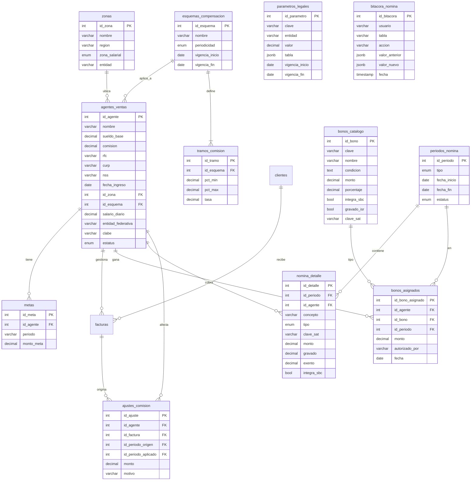
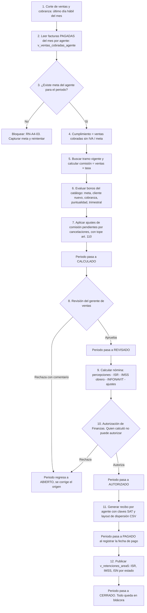

# Área 4 — Salarios, sueldos y bonificaciones a agentes de ventas

> **Documento de contexto del área 4.** Fuente de verdad para el equipo y para cualquier agente de código que trabaje en esta área.
> Se alinea con `PLAN.md` (plan global) y con `docs/area3-inventario/CONTEXTO.md` (modelo de datos base).
> Ante contradicción entre este documento y el código, gana este documento. Ante contradicción entre este documento y `PLAN.md`, gana `PLAN.md`.

| Campo | Valor |
| --- | --- |
| Proyecto | SIGFEVAK — Sistema de gestión, comercializadora nacional (México) |
| Área | 4 de 6 — Nómina, comisiones y bonos de agentes de ventas |
| Etiqueta de issues | `area:4-nomina` |
| Prefijo de commits | `area4:` |
| Reglas de negocio | `RN-A4-01` … `RN-A4-18` |
| Equipo | 5 personas (1 líder + 4 integrantes) |
| Plazo | Domingo 13 a jueves 17 de septiembre de 2026 (5 días de trabajo) |
| Stack | React + Vite, supabase-js, PostgreSQL en Supabase, pnpm (PLAN.md D-01, cerrada) |
| Versión | 1.0 |

---

## 0. Índice

1. Cómo debe usar este documento un agente
2. Contexto de negocio y marco legal
3. Alcance
4. Modelo entidad-relación
5. Diccionario de datos
6. Flujo del proceso mensual
7. Reglas de negocio
8. DDL y migraciones
9. Vistas y contratos con otras áreas
10. Ejemplo de cálculo
11. Equipo, roles y evaluación del líder
12. Cronograma de 5 días
13. Riesgos
14. Indicadores de éxito
15. Reporte final del líder
16. Preguntas abiertas
17. Glosario

---

## 1. Cómo debe usar este documento un agente

1. Este archivo es la **única fuente de verdad** del área 4. Si el código lo contradice, el código se corrige.
2. **No inventes tablas, columnas, tasas ni topes legales.** Todos los valores legales viven en la tabla `parametros_legales` (sección 5). Si necesitas un valor que no está ahí, lo registras como pregunta abierta (sección 16) y te detienes.
3. **No toques tablas de otras áreas.** La sección 3 dice cuáles son de lectura. Si necesitas una columna nueva en `facturas` o `clientes`, eso es un issue `tipo:integracion` con el área 2, no un cambio tuyo.
4. Todo cambio de esquema es una **migración nueva**, nunca se edita una aplicada.
5. Cita las reglas `RN-A4-xx` en comentarios de código, mensajes de commit y descripciones de PR.
6. Los cálculos de ISR, IMSS e ISN son los puntos donde la IA más se equivoca: **no asumas tarifas**, léelas de `parametros_legales`.
7. Commits: `area4: <verbo> <objeto> (RN-A4-xx) #issue`. Sin ninguna mención a herramientas de IA (regla D-08 de `PLAN.md`).

---

## 2. Contexto de negocio y marco legal

### 2.1 El negocio

La comercializadora vende a clientes empresa (comercializadores) en todo el país a través de **agentes de ventas** asignados por zona. El agente cobra un sueldo base fijo más una parte variable (comisiones y bonos) que depende de lo que vende **y de lo que efectivamente se cobra**.

### 2.2 Marco legal que condiciona el diseño

Los agentes de comercio que trabajan de forma permanente para la empresa son **trabajadores**, no comisionistas independientes (LFT arts. 285 a 291). El art. 84 LFT establece que las comisiones forman parte del salario. De ahí salen tres consecuencias:

| Consecuencia | Qué obliga en el sistema | Regla |
| --- | --- | --- |
| El sueldo base nunca puede quedar debajo del salario mínimo, aunque el agente no venda nada | Cada agente tiene zona salarial (general o Zona Libre de la Frontera Norte) y el sistema valida `salario_diario >= SM de su zona` | RN-A4-01 |
| Comisiones y bonos integran el Salario Base de Cotización (SBC) del IMSS; la parte variable se promedia por bimestre (LSS art. 30). Sólo los premios de puntualidad y asistencia quedan excluidos, cada uno hasta el 10% del SBC (LSS art. 27) | Cada concepto de nómina lleva la bandera `integra_sbc` | RN-A4-10, RN-A4-11 |
| Todas las comisiones y bonos pagan ISR (retención con tarifa del art. 96 LISR). Los topes de exención se calculan con la UMA | Cada concepto lleva `gravado` y `exento`; la tarifa y la UMA viven en `parametros_legales` | RN-A4-12 |

**Valores legales de referencia (investigación del equipo, septiembre 2026; se cargan en `parametros_legales`, no se escriben en código):**

| Clave | Valor | Vigencia | Fuente |
| --- | --- | --- | --- |
| `SM_GENERAL` | $315.04 diarios | 2026-01-01 | CONASAMI, aumento del 13% |
| `SM_ZLFN` | $440.87 diarios | 2026-01-01 | CONASAMI |
| `UMA_DIARIA` | $117.31 | 2026-02-01 | INEGI |
| `UMA_MENSUAL` | $3,566.22 | 2026-02-01 | INEGI |
| `TARIFA_ISR_MENSUAL` | Tabla del art. 96 LISR | 2026-01-01 | SAT |
| `CUOTA_IMSS_OBRERO` | Porcentajes por ramo | 2026-01-01 | LSS |
| `ISN_<ESTADO>` | Tasa por entidad (Chiapas 2% según área 5) | Por estado | Leyes estatales |
| `FACTOR_DIAS_MES` | 30.4 | — | Convención interna |

> El Impuesto Sobre Nómina (ISN) es **estatal** y cambia por entidad. Se calcula según el estado donde trabaja el agente, no donde está la matriz. El área 5 es dueña de la tabla de tasas; el área 4 la lee.

### 2.3 Esquema de compensación propuesto

**Sueldo base:** $350 diarios en zona general (arriba del mínimo para dar margen). En zona frontera se ajusta al mínimo de esa zona ($440.87).

**Comisión escalonada** sobre ventas **cobradas**, sin IVA y ya descontadas devoluciones y cancelaciones. La tasa depende del porcentaje de cumplimiento de la meta mensual:

| Cumplimiento de meta | Tasa de comisión |
| --- | --- |
| 0% a 69.99% | 1.0% |
| 70% a 99.99% | 2.0% |
| 100% a 119.99% | 3.0% |
| 120% o más | 3.5% |

La tasa del tramo alcanzado se aplica a **toda** la venta cobrada del mes, no sólo al excedente (RN-A4-06).

**Bonos:**

| Bono | Condición | Monto | ¿Integra SBC? | ¿Gravado ISR? |
| --- | --- | --- | --- | --- |
| Cumplimiento de meta | Llegar al 100% o más | $2,500 | Sí | Sí |
| Cliente nuevo | Cada cliente nuevo con su primera compra pagada en el mes | $500 por cliente | Sí | Sí |
| Cobranza sana | Cartera vencida del agente menor al 5% | $1,000 | Sí | Sí |
| Premio de puntualidad | Cero retardos en el periodo | 10% del sueldo base del mes | No (tope 10% del SBC) | Exento hasta el tope de UMA aplicable |
| Bono trimestral | Promedio de cumplimiento del trimestre de 110% o más | $6,000 | Sí | Sí |

**Periodicidad:** el sueldo base se paga por **quincena**; comisiones y bonos se pagan **una vez al mes**, después del corte de cobranza.

**Ajuste por cancelación:** si una factura ya comisionada se cancela o la mercancía se devuelve, la comisión se descuenta en el siguiente periodo, respetando los límites de descuento del art. 110 LFT, y queda registrada (RN-A4-08).

---

## 3. Alcance

### Dentro del alcance (5 días)

- Catálogo de agentes (ampliando `agentes_ventas` del modelo base), zonas y esquemas de compensación.
- Metas mensuales por agente.
- Cálculo de cumplimiento, comisión escalonada y bonos a partir de las facturas cobradas del área 2.
- Cálculo de nómina del periodo: percepciones, ISR, cuota obrera IMSS, INFONAVIT si aplica, deducciones por cancelación.
- Flujo de estados del periodo con separación de funciones (quien calcula no autoriza).
- Recibo de nómina por agente con claves SAT (001 sueldos, 028 comisiones, 010 puntualidad, 038 otros ingresos por salarios) en pantalla o PDF.
- Reportes: nómina del periodo, comisiones por agente y zona, cumplimiento de metas, costo de compensación sobre ventas.
- Contrato con el área 5: ISR retenido, cuotas IMSS e ISN por estado del periodo.
- Bitácora de auditoría.

### Fuera del alcance (se declara explícitamente)

- **Timbrado real del CFDI de nómina con un PAC.** Se genera la estructura del recibo con las claves SAT; el timbrado se documenta como paso manual o futuro.
- **Dispersión bancaria real (SPEI).** Se genera un layout CSV con CLABE y monto; nadie mueve dinero.
- Cálculo de PTU, aguinaldo, vacaciones, prima vacacional, finiquitos. Sólo se deja el campo `fecha_ingreso` para calcularlos después.
- Control de asistencia y retardos: el premio de puntualidad se captura como bandera manual `sin_retardos` por periodo.
- Facturación a clientes (área 2), inventario y devoluciones físicas (área 3), pago de impuestos (área 5). Esta área **consume** esos datos y les **entrega** información.

### Tablas por nivel de acceso

| Tabla | Acceso del área 4 | Dueño |
| --- | --- | --- |
| `agentes_ventas` (columnas originales `id_agente`, `nombre`, `sueldo_base`, `comision`) | Lectura y escritura compartida con área 3 (el modelo base la define ahí) | Área 3 define, **área 4 administra** |
| `agentes_ventas` (columnas nuevas de la sección 5) | Escritura total | Área 4 |
| `zonas`, `esquemas_compensacion`, `tramos_comision`, `metas`, `bonos_catalogo`, `bonos_asignados`, `periodos_nomina`, `nomina_detalle`, `ajustes_comision`, `parametros_legales`, `bitacora_nomina` | Escritura total | Área 4 |
| `facturas`, `detalle_factura`, `clientes` | Solo lectura | Área 2 |
| `productos`, vistas `v_rotacion`, `v_salidas_area2` | Solo lectura | Área 3 |
| `impuestos_licencias`, tasas de ISN | Solo lectura | Área 5 |

---

## 4. Modelo entidad-relación

`agentes_ventas`, `facturas` y `clientes` vienen del modelo base (área 3 / área 2). Todo lo demás es aportación del área 4 y es **aditivo**: no modifica nada existente.



### Decisión de diseño: no existe la tabla `VENTA_AGENTE`

El plan original del área proponía una tabla `VENTA_AGENTE` para "importar" las facturas del área 2. No se crea. `facturas` ya tiene `id_agente`, `fecha`, `valor_total`, `iva` y `estado_pago`; duplicarla en el área 4 generaría dos verdades. En su lugar el área 4 lee `facturas` a través de la vista `v_ventas_cobradas_agente` (sección 9). Lo único que falta en `facturas` es `fecha_cobro`: se pide al área 2 como issue de integración (pregunta abierta 1).

Lo mismo con "clientes nuevos": se derivan de `facturas` (primera factura pagada de cada `id_cliente`), no se capturan a mano.

---

## 5. Diccionario de datos

### `agentes_ventas` — columnas que agrega el área 4 (todas opcionales o con default)

| Columna | Tipo | Nulo | Descripción y regla |
| --- | --- | --- | --- |
| `rfc` | VARCHAR(13) | Sí | Único si no es nulo. |
| `curp` | VARCHAR(18) | Sí | |
| `nss` | VARCHAR(11) | Sí | Número de seguridad social. |
| `fecha_ingreso` | DATE | Sí | Base para antigüedad. |
| `id_zona` | INT FK → `zonas` | Sí | Determina zona salarial e ISN. |
| `id_esquema` | INT FK → `esquemas_compensacion` | Sí | Plan de pago vigente. |
| `salario_diario` | DECIMAL(10,2) | Sí | Default 350. Debe ser ≥ SM de su zona (RN-A4-01). Sustituye conceptualmente a `sueldo_base`, que se conserva por compatibilidad con el área 3 y se mantiene como `salario_diario × 30.4`. |
| `entidad_federativa` | VARCHAR(50) | Sí | Estado donde trabaja; define la tasa de ISN. |
| `clabe` | VARCHAR(18) | Sí | Para el layout de dispersión. |
| `estatus` | ENUM `estatus_agente` | No | `ACTIVO`, `BAJA`, `SUSPENDIDO`. Default `ACTIVO`. |

Las columnas originales `nombre`, `sueldo_base` y `comision` no se modifican. `comision` (la tasa fija del modelo base) queda como **tasa de respaldo** si el agente no tiene esquema asignado (RN-A4-05).

### `zonas`

| Columna | Tipo | Nulo | Descripción |
| --- | --- | --- | --- |
| `id_zona` | INT PK | No | |
| `nombre` | VARCHAR(100) | No | Ej. "Sureste", "Bajío". |
| `region` | VARCHAR(50) | Sí | Agrupador comercial. |
| `zona_salarial` | ENUM `zona_salarial` | No | `GENERAL` o `ZLFN` (Zona Libre de la Frontera Norte). |
| `entidad` | VARCHAR(50) | Sí | Estado principal de la zona. |

### `esquemas_compensacion` y `tramos_comision`

| Tabla | Columna | Tipo | Descripción |
| --- | --- | --- | --- |
| esquemas | `id_esquema` | INT PK | |
| esquemas | `nombre` | VARCHAR(100) | Ej. "Esquema 2026 general". |
| esquemas | `periodicidad` | ENUM `periodicidad` | `MENSUAL` para comisiones; el sueldo siempre es quincenal. |
| esquemas | `vigencia_inicio`, `vigencia_fin` | DATE | Sólo un esquema vigente por agente en una fecha. |
| tramos | `id_tramo` | INT PK | |
| tramos | `id_esquema` | INT FK | |
| tramos | `pct_min`, `pct_max` | DECIMAL(6,2) | Cumplimiento en %, `pct_max` NULL = sin tope. Los tramos de un esquema no se traslapan (RN-A4-04). |
| tramos | `tasa` | DECIMAL(5,4) | 0.0100 = 1%. |

### `metas`

| Columna | Tipo | Descripción |
| --- | --- | --- |
| `id_meta` | INT PK | |
| `id_agente` | INT FK | |
| `periodo` | VARCHAR(7) | `AAAA-MM`. Única con `id_agente`. |
| `monto_meta` | DECIMAL(14,2) | Ventas sin IVA. Debe existir **antes** de que inicie el mes (RN-A4-03). |

### `bonos_catalogo` y `bonos_asignados`

| Tabla | Columna | Tipo | Descripción |
| --- | --- | --- | --- |
| catálogo | `clave` | VARCHAR(30) UNIQUE | `META`, `CLIENTE_NUEVO`, `COBRANZA_SANA`, `PUNTUALIDAD`, `TRIMESTRAL`. |
| catálogo | `monto` / `porcentaje` | DECIMAL | Uno de los dos; el otro NULL. |
| catálogo | `integra_sbc`, `gravado_isr` | BOOL | Banderas legales. |
| catálogo | `clave_sat` | VARCHAR(3) | 038 para bonos, 010 puntualidad. |
| asignados | `id_periodo` | INT FK | Periodo mensual en que se ganó. |
| asignados | `monto` | DECIMAL(12,2) | Calculado; nunca se captura a mano salvo con `autorizado_por` (RN-A4-09). |

### `periodos_nomina`

| Columna | Tipo | Descripción |
| --- | --- | --- |
| `tipo` | ENUM `tipo_periodo` | `QUINCENAL` (sueldo) o `MENSUAL` (comisiones y bonos). |
| `estatus` | ENUM `estatus_periodo` | `ABIERTO` → `CALCULADO` → `REVISADO` → `AUTORIZADO` → `PAGADO` → `CERRADO`. Sólo avanza, nunca regresa, salvo `CALCULADO` → `ABIERTO` por rechazo (RN-A4-13). |

### `nomina_detalle`

| Columna | Tipo | Descripción |
| --- | --- | --- |
| `concepto` | VARCHAR(60) | `SUELDO`, `COMISION`, `BONO_META`, `BONO_CLIENTE_NUEVO`, `BONO_COBRANZA`, `PREMIO_PUNTUALIDAD`, `BONO_TRIMESTRAL`, `ISR`, `IMSS_OBRERO`, `INFONAVIT`, `AJUSTE_COMISION`. |
| `tipo` | ENUM `tipo_concepto` | `PERCEPCION` o `DEDUCCION`. |
| `clave_sat` | VARCHAR(3) | 001, 028, 010, 038, 002 (ISR), 001 deducción IMSS, etc. |
| `monto` | DECIMAL(12,2) | Siempre positivo; el signo lo da `tipo`. |
| `gravado`, `exento` | DECIMAL(12,2) | `gravado + exento = monto` para percepciones (RN-A4-12). |
| `integra_sbc` | BOOL | Copiado del catálogo al momento de calcular, para congelar la regla vigente. |

### `ajustes_comision`

Registra comisiones ya pagadas que se revierten por cancelación o devolución. `monto` negativo. `id_periodo_origen` = donde se pagó; `id_periodo_aplicado` = donde se descuenta. El descuento por periodo no puede exceder el tope del art. 110 LFT (RN-A4-08).

### `parametros_legales`

| Columna | Tipo | Descripción |
| --- | --- | --- |
| `clave` | VARCHAR(40) | `SM_GENERAL`, `SM_ZLFN`, `UMA_DIARIA`, `UMA_MENSUAL`, `TARIFA_ISR_MENSUAL`, `CUOTA_IMSS_OBRERO`, `ISN`, `FACTOR_DIAS_MES`, `TOPE_DESCUENTO_110`. |
| `entidad` | VARCHAR(50) | NULL para federales; nombre del estado para `ISN`. |
| `valor` | DECIMAL(14,4) | Para valores simples. |
| `tabla` | JSONB | Para tarifas por rangos (ISR art. 96). |
| `vigencia_inicio`, `vigencia_fin` | DATE | El cálculo siempre usa el parámetro vigente en `fecha_fin` del periodo (RN-A4-14). |

> Es la tabla más importante para que el sistema dure: cuando cambie el salario mínimo o la UMA el próximo año, se inserta un registro nuevo con vigencia y no se toca código.

### Valores ENUM del área 4

| Tipo | Valores |
| --- | --- |
| `zona_salarial` | `GENERAL`, `ZLFN` |
| `estatus_agente` | `ACTIVO`, `BAJA`, `SUSPENDIDO` |
| `periodicidad` | `QUINCENAL`, `MENSUAL` |
| `tipo_periodo` | `QUINCENAL`, `MENSUAL` |
| `estatus_periodo` | `ABIERTO`, `CALCULADO`, `REVISADO`, `AUTORIZADO`, `PAGADO`, `CERRADO` |
| `tipo_concepto` | `PERCEPCION`, `DEDUCCION` |

---

## 6. Flujo del proceso mensual



| Paso | Responsable | Control |
| --- | --- | --- |
| 1–7 | Sistema | Fecha de corte fija; sólo facturas con `estado_pago = 'PAGADO'` |
| 8 | Gerente de ventas | No puede modificar montos, sólo aprobar o rechazar con comentario |
| 9 | Sistema | Parámetros legales vigentes a la fecha de fin del periodo |
| 10 | Finanzas | Separación de funciones: quien captura o calcula no autoriza |
| 11 | Sistema | Layout con CLABE y monto; timbrado y SPEI fuera de alcance |
| 12 | Sistema | El área 5 consume la vista, no la tabla |

---

## 7. Reglas de negocio

| ID | Regla | Dónde se implementa |
| --- | --- | --- |
| **RN-A4-01** | `salario_diario` de un agente nunca es menor al salario mínimo vigente de su zona salarial. | Trigger `fn_valida_salario_minimo` en `agentes_ventas` |
| **RN-A4-02** | Un agente `ACTIVO` debe tener zona y esquema asignados para poder entrar a un cálculo. | Validación en `fn_calcular_periodo` |
| **RN-A4-03** | La meta del periodo debe existir antes de calcular. Sin meta no hay cálculo del agente. | Validación en `fn_calcular_periodo` |
| **RN-A4-04** | Los tramos de un esquema no se traslapan y cubren de 0 en adelante sin huecos. | CHECK + trigger en `tramos_comision` |
| **RN-A4-05** | Si un agente no tiene esquema, se usa la tasa fija `agentes_ventas.comision` del modelo base como respaldo, y se registra en bitácora como excepción. | `fn_calcular_periodo` |
| **RN-A4-06** | La comisión se calcula sobre ventas **cobradas** (`estado_pago = 'PAGADO'`), sin IVA, del mes de cobro, y la tasa del tramo alcanzado se aplica a toda la base, no sólo al excedente. | `v_ventas_cobradas_agente` + `fn_calcular_periodo` |
| **RN-A4-07** | Una factura facturada pero no cobrada no genera comisión; pasa al periodo en que se cobre. | Derivado de RN-A4-06 |
| **RN-A4-08** | Una factura ya comisionada que se cancela genera un `ajuste_comision` negativo que se aplica en el siguiente periodo, sin exceder el tope de descuento del art. 110 LFT; el excedente se difiere. | `fn_aplicar_ajustes` |
| **RN-A4-09** | Los bonos se calculan; un bono capturado a mano exige `autorizado_por` y queda en bitácora. | CHECK en `bonos_asignados` + trigger |
| **RN-A4-10** | Todo concepto de nómina lleva `integra_sbc`. Comisiones y bonos integran; el premio de puntualidad no integra hasta el 10% del SBC, el excedente sí. | `bonos_catalogo` + `fn_calcular_nomina` |
| **RN-A4-11** | La parte variable del SBC se promedia por bimestre para el reporte al IMSS. | Vista `v_sbc_bimestral` |
| **RN-A4-12** | Toda percepción se desglosa en `gravado + exento = monto`. Comisiones y bonos son 100% gravados; el premio de puntualidad es exento hasta el tope de UMA aplicable. | `fn_calcular_nomina` |
| **RN-A4-13** | Un periodo sólo avanza de estado en el orden definido. El único retroceso permitido es a `ABIERTO` por rechazo, con comentario obligatorio. | Trigger `fn_transicion_periodo` |
| **RN-A4-14** | Todo cálculo usa el parámetro legal vigente en la `fecha_fin` del periodo; nunca un valor escrito en código. | `fn_parametro(clave, entidad, fecha)` |
| **RN-A4-15** | Quien ejecuta el cálculo no puede autorizar el mismo periodo. | Validación en `fn_transicion_periodo` comparando usuarios |
| **RN-A4-16** | El ISN se calcula con la tasa de la entidad del agente, no de la matriz. | `fn_calcular_nomina` + `parametros_legales.entidad` |
| **RN-A4-17** | El sueldo base se paga por quincena; comisiones y bonos sólo en periodos `MENSUAL`. | `fn_calcular_periodo` según `tipo` |
| **RN-A4-18** | Un periodo `PAGADO` o `CERRADO` no se modifica. Cualquier corrección es un ajuste en el siguiente periodo. | Trigger en `nomina_detalle` |

---

## 8. DDL y migraciones

Estado objetivo en PostgreSQL. En el repo se divide en migraciones numeradas según `PLAN.md` D-09. Todo es **aditivo** respecto al modelo base.

```sql
-- ---------- TIPOS ----------
CREATE TYPE zona_salarial   AS ENUM ('GENERAL','ZLFN');
CREATE TYPE estatus_agente  AS ENUM ('ACTIVO','BAJA','SUSPENDIDO');
CREATE TYPE periodicidad    AS ENUM ('QUINCENAL','MENSUAL');
CREATE TYPE tipo_periodo    AS ENUM ('QUINCENAL','MENSUAL');
CREATE TYPE estatus_periodo AS ENUM ('ABIERTO','CALCULADO','REVISADO','AUTORIZADO','PAGADO','CERRADO');
CREATE TYPE tipo_concepto   AS ENUM ('PERCEPCION','DEDUCCION');

-- ---------- CATÁLOGOS ----------
CREATE TABLE zonas (
    id_zona       INT GENERATED ALWAYS AS IDENTITY PRIMARY KEY,
    nombre        VARCHAR(100) NOT NULL UNIQUE,
    region        VARCHAR(50),
    zona_salarial zona_salarial NOT NULL DEFAULT 'GENERAL',
    entidad       VARCHAR(50)
);

CREATE TABLE esquemas_compensacion (
    id_esquema      INT GENERATED ALWAYS AS IDENTITY PRIMARY KEY,
    nombre          VARCHAR(100) NOT NULL,
    periodicidad    periodicidad NOT NULL DEFAULT 'MENSUAL',
    vigencia_inicio DATE NOT NULL,
    vigencia_fin    DATE
);

CREATE TABLE tramos_comision (
    id_tramo   INT GENERATED ALWAYS AS IDENTITY PRIMARY KEY,
    id_esquema INT NOT NULL REFERENCES esquemas_compensacion(id_esquema) ON DELETE CASCADE,
    pct_min    DECIMAL(6,2) NOT NULL,
    pct_max    DECIMAL(6,2),                       -- NULL = sin tope
    tasa       DECIMAL(5,4) NOT NULL,
    CONSTRAINT ck_tramo_rango CHECK (pct_max IS NULL OR pct_max > pct_min),   -- RN-A4-04
    CONSTRAINT ck_tramo_tasa  CHECK (tasa >= 0 AND tasa < 1)
);

-- ---------- AMPLIACIÓN DE agentes_ventas (aditiva, RN-A4-01) ----------
ALTER TABLE agentes_ventas
    ADD COLUMN rfc                 VARCHAR(13) UNIQUE,
    ADD COLUMN curp                VARCHAR(18),
    ADD COLUMN nss                 VARCHAR(11),
    ADD COLUMN fecha_ingreso       DATE,
    ADD COLUMN id_zona             INT REFERENCES zonas(id_zona),
    ADD COLUMN id_esquema          INT REFERENCES esquemas_compensacion(id_esquema),
    ADD COLUMN salario_diario      DECIMAL(10,2) DEFAULT 350.00,
    ADD COLUMN entidad_federativa  VARCHAR(50),
    ADD COLUMN clabe               VARCHAR(18),
    ADD COLUMN estatus             estatus_agente NOT NULL DEFAULT 'ACTIVO';

-- ---------- OPERACIÓN ----------
CREATE TABLE metas (
    id_meta    INT GENERATED ALWAYS AS IDENTITY PRIMARY KEY,
    id_agente  INT NOT NULL REFERENCES agentes_ventas(id_agente),
    periodo    VARCHAR(7) NOT NULL,                -- 'AAAA-MM'
    monto_meta DECIMAL(14,2) NOT NULL CHECK (monto_meta > 0),
    CONSTRAINT uq_meta UNIQUE (id_agente, periodo)  -- RN-A4-03
);

CREATE TABLE bonos_catalogo (
    id_bono     INT GENERATED ALWAYS AS IDENTITY PRIMARY KEY,
    clave       VARCHAR(30) NOT NULL UNIQUE,
    nombre      VARCHAR(100) NOT NULL,
    condicion   TEXT,
    monto       DECIMAL(12,2),
    porcentaje  DECIMAL(5,4),
    integra_sbc BOOLEAN NOT NULL DEFAULT TRUE,     -- RN-A4-10
    gravado_isr BOOLEAN NOT NULL DEFAULT TRUE,     -- RN-A4-12
    clave_sat   VARCHAR(3) NOT NULL DEFAULT '038',
    CONSTRAINT ck_bono_monto_o_pct CHECK ((monto IS NULL) <> (porcentaje IS NULL))
);

CREATE TABLE periodos_nomina (
    id_periodo   INT GENERATED ALWAYS AS IDENTITY PRIMARY KEY,
    tipo         tipo_periodo NOT NULL,
    fecha_inicio DATE NOT NULL,
    fecha_fin    DATE NOT NULL,
    estatus      estatus_periodo NOT NULL DEFAULT 'ABIERTO',
    calculado_por  VARCHAR(150),
    revisado_por   VARCHAR(150),
    autorizado_por VARCHAR(150),                   -- RN-A4-15: distinto de calculado_por
    fecha_pago     DATE,
    comentario     TEXT,
    CONSTRAINT ck_periodo_fechas CHECK (fecha_fin >= fecha_inicio),
    CONSTRAINT uq_periodo UNIQUE (tipo, fecha_inicio)
);

CREATE TABLE bonos_asignados (
    id_bono_asignado INT GENERATED ALWAYS AS IDENTITY PRIMARY KEY,
    id_agente      INT NOT NULL REFERENCES agentes_ventas(id_agente),
    id_bono        INT NOT NULL REFERENCES bonos_catalogo(id_bono),
    id_periodo     INT NOT NULL REFERENCES periodos_nomina(id_periodo),
    monto          DECIMAL(12,2) NOT NULL CHECK (monto >= 0),
    calculado      BOOLEAN NOT NULL DEFAULT TRUE,
    autorizado_por VARCHAR(150),
    fecha          DATE NOT NULL DEFAULT CURRENT_DATE,
    CONSTRAINT ck_bono_manual CHECK (calculado OR autorizado_por IS NOT NULL)   -- RN-A4-09
);

CREATE TABLE nomina_detalle (
    id_detalle  INT GENERATED ALWAYS AS IDENTITY PRIMARY KEY,
    id_periodo  INT NOT NULL REFERENCES periodos_nomina(id_periodo),
    id_agente   INT NOT NULL REFERENCES agentes_ventas(id_agente),
    concepto    VARCHAR(60) NOT NULL,
    tipo        tipo_concepto NOT NULL,
    clave_sat   VARCHAR(3) NOT NULL,
    monto       DECIMAL(12,2) NOT NULL CHECK (monto >= 0),
    gravado     DECIMAL(12,2) NOT NULL DEFAULT 0,
    exento      DECIMAL(12,2) NOT NULL DEFAULT 0,
    integra_sbc BOOLEAN NOT NULL DEFAULT TRUE,
    CONSTRAINT ck_gravado_exento CHECK (tipo = 'DEDUCCION' OR gravado + exento = monto)   -- RN-A4-12
);
CREATE INDEX ix_nomina_periodo ON nomina_detalle(id_periodo);
CREATE INDEX ix_nomina_agente  ON nomina_detalle(id_agente);

CREATE TABLE ajustes_comision (
    id_ajuste           INT GENERATED ALWAYS AS IDENTITY PRIMARY KEY,
    id_agente           INT NOT NULL REFERENCES agentes_ventas(id_agente),
    id_factura          INT NOT NULL REFERENCES facturas(id_factura),
    id_periodo_origen   INT NOT NULL REFERENCES periodos_nomina(id_periodo),
    id_periodo_aplicado INT REFERENCES periodos_nomina(id_periodo),   -- NULL = pendiente
    monto               DECIMAL(12,2) NOT NULL CHECK (monto < 0),     -- RN-A4-08
    motivo              VARCHAR(255) NOT NULL,
    fecha               DATE NOT NULL DEFAULT CURRENT_DATE
);

CREATE TABLE parametros_legales (
    id_parametro    INT GENERATED ALWAYS AS IDENTITY PRIMARY KEY,
    clave           VARCHAR(40) NOT NULL,
    entidad         VARCHAR(50),                   -- NULL = federal
    valor           DECIMAL(14,4),
    tabla           JSONB,                          -- tarifas por rango
    vigencia_inicio DATE NOT NULL,
    vigencia_fin    DATE,
    CONSTRAINT ck_param_valor_o_tabla CHECK ((valor IS NULL) <> (tabla IS NULL))
);
CREATE INDEX ix_param_clave ON parametros_legales(clave, entidad, vigencia_inicio);

CREATE TABLE bitacora_nomina (
    id_bitacora    INT GENERATED ALWAYS AS IDENTITY PRIMARY KEY,
    usuario        VARCHAR(150) NOT NULL,
    tabla          VARCHAR(60) NOT NULL,
    accion         VARCHAR(20) NOT NULL,
    valor_anterior JSONB,
    valor_nuevo    JSONB,
    fecha          TIMESTAMP NOT NULL DEFAULT NOW()
);
```

### Funciones y triggers principales (firmas; el cuerpo se implementa en la fase de construcción)

```sql
-- RN-A4-14: parámetro legal vigente a una fecha
CREATE OR REPLACE FUNCTION fn_parametro(p_clave VARCHAR, p_entidad VARCHAR, p_fecha DATE)
RETURNS DECIMAL LANGUAGE sql STABLE AS $$
    SELECT valor FROM parametros_legales
     WHERE clave = p_clave
       AND (entidad = p_entidad OR (entidad IS NULL AND p_entidad IS NULL))
       AND vigencia_inicio <= p_fecha
       AND (vigencia_fin IS NULL OR vigencia_fin >= p_fecha)
     ORDER BY vigencia_inicio DESC LIMIT 1;
$$;

-- RN-A4-01: salario diario >= salario mínimo de la zona
CREATE OR REPLACE FUNCTION fn_valida_salario_minimo() RETURNS TRIGGER LANGUAGE plpgsql AS $$
DECLARE v_zona zona_salarial; v_sm DECIMAL;
BEGIN
    IF NEW.id_zona IS NULL OR NEW.salario_diario IS NULL THEN RETURN NEW; END IF;
    SELECT zona_salarial INTO v_zona FROM zonas WHERE id_zona = NEW.id_zona;
    v_sm := fn_parametro(CASE v_zona WHEN 'ZLFN' THEN 'SM_ZLFN' ELSE 'SM_GENERAL' END, NULL, CURRENT_DATE);
    IF NEW.salario_diario < v_sm THEN
        RAISE EXCEPTION 'RN-A4-01: salario diario % menor al mínimo % de la zona %', NEW.salario_diario, v_sm, v_zona;
    END IF;
    RETURN NEW;
END; $$;
CREATE TRIGGER tg_salario_minimo BEFORE INSERT OR UPDATE OF salario_diario, id_zona ON agentes_ventas
FOR EACH ROW EXECUTE FUNCTION fn_valida_salario_minimo();

-- RN-A4-13 y RN-A4-15: transición de estados y separación de funciones
CREATE OR REPLACE FUNCTION fn_transicion_periodo() RETURNS TRIGGER LANGUAGE plpgsql AS $$ ... $$;

-- RN-A4-02, 03, 05, 06, 17: cálculo de comisiones y bonos de un periodo
CREATE OR REPLACE FUNCTION fn_calcular_periodo(p_id_periodo INT, p_usuario VARCHAR) RETURNS VOID ...;

-- RN-A4-10, 12, 16: cálculo de nómina (percepciones, ISR, IMSS, ISN)
CREATE OR REPLACE FUNCTION fn_calcular_nomina(p_id_periodo INT) RETURNS VOID ...;

-- RN-A4-08: aplicar ajustes pendientes con tope art. 110
CREATE OR REPLACE FUNCTION fn_aplicar_ajustes(p_id_periodo INT) RETURNS VOID ...;

-- RN-A4-18: bloquear cambios en periodos pagados o cerrados
CREATE OR REPLACE FUNCTION fn_bloquea_periodo_cerrado() RETURNS TRIGGER ...;
```

### Seed obligatorio

- `parametros_legales` con los 8 valores de la sección 2.2 y la tarifa mensual del art. 96 en JSONB.
- `bonos_catalogo` con los 5 bonos de la sección 2.3.
- 1 esquema con sus 4 tramos.
- 3 zonas (una `ZLFN`).
- Mínimo 5 agentes con RFC, zona, esquema y salario; metas del mes; y datos suficientes en `facturas` (coordinado con el área 2) para que el ejemplo de la sección 10 se reproduzca exacto.

### Row Level Security

Misma política mínima que el área 3: RLS activado en todas las tablas del área 4 con `FOR ALL TO authenticated USING (true) WITH CHECK (true)`. Si una consulta regresa vacío, el primer diagnóstico es RLS.

---

## 9. Vistas y contratos con otras áreas

```sql
-- Base de comisiones: facturas cobradas por agente y mes de cobro (RN-A4-06, RN-A4-07)
CREATE OR REPLACE VIEW v_ventas_cobradas_agente AS
SELECT f.id_agente,
       TO_CHAR(COALESCE(f.fecha_cobro, f.fecha), 'YYYY-MM') AS periodo,   -- fecha_cobro: pregunta abierta 1
       f.id_factura, f.id_cliente, f.fecha, f.fecha_cobro,
       (f.valor_total - f.iva) AS subtotal
FROM facturas f
WHERE f.estado_pago = 'PAGADO';

-- Clientes nuevos: primera factura pagada de cada cliente
CREATE OR REPLACE VIEW v_clientes_nuevos_agente AS
SELECT id_agente, id_cliente, MIN(periodo) AS periodo_alta
FROM v_ventas_cobradas_agente
GROUP BY id_agente, id_cliente;

-- Cumplimiento del mes
CREATE OR REPLACE VIEW v_cumplimiento_meta AS
SELECT m.id_agente, m.periodo, m.monto_meta,
       COALESCE(SUM(v.subtotal), 0) AS ventas_cobradas,
       ROUND(COALESCE(SUM(v.subtotal), 0) / m.monto_meta * 100, 2) AS pct_cumplimiento
FROM metas m LEFT JOIN v_ventas_cobradas_agente v USING (id_agente, periodo)
GROUP BY m.id_agente, m.periodo, m.monto_meta;

-- Recibo por agente y periodo
CREATE OR REPLACE VIEW v_recibo_nomina AS
SELECT p.id_periodo, p.tipo, p.fecha_inicio, p.fecha_fin, a.id_agente, a.nombre, a.rfc,
       d.concepto, d.tipo AS tipo_concepto, d.clave_sat, d.monto, d.gravado, d.exento
FROM nomina_detalle d JOIN periodos_nomina p USING (id_periodo) JOIN agentes_ventas a USING (id_agente);

-- Totales del periodo por agente
CREATE OR REPLACE VIEW v_nomina_totales AS
SELECT id_periodo, id_agente,
       SUM(CASE WHEN tipo = 'PERCEPCION' THEN monto ELSE 0 END) AS percepciones,
       SUM(CASE WHEN tipo = 'DEDUCCION'  THEN monto ELSE 0 END) AS deducciones,
       SUM(CASE WHEN tipo = 'PERCEPCION' THEN monto ELSE -monto END) AS neto
FROM nomina_detalle GROUP BY id_periodo, id_agente;

-- CONTRATO CON EL ÁREA 5: retenciones y contribuciones del periodo por entidad
CREATE OR REPLACE VIEW v_retenciones_area5 AS
SELECT p.id_periodo, p.fecha_fin, a.entidad_federativa,
       SUM(CASE WHEN d.concepto = 'ISR'         THEN d.monto ELSE 0 END) AS isr_retenido,
       SUM(CASE WHEN d.concepto = 'IMSS_OBRERO' THEN d.monto ELSE 0 END) AS imss_obrero,
       SUM(CASE WHEN d.tipo = 'PERCEPCION' AND d.integra_sbc THEN d.monto ELSE 0 END) AS base_isn
FROM nomina_detalle d JOIN periodos_nomina p USING (id_periodo) JOIN agentes_ventas a USING (id_agente)
WHERE p.estatus IN ('AUTORIZADO','PAGADO','CERRADO')
GROUP BY p.id_periodo, p.fecha_fin, a.entidad_federativa;

-- CONTRATO CON EL ÁREA 6: desempeño por agente y zona
CREATE OR REPLACE VIEW v_desempeno_agente_zona AS
SELECT z.nombre AS zona, z.region, a.id_agente, a.nombre, c.periodo, c.pct_cumplimiento, c.ventas_cobradas
FROM v_cumplimiento_meta c JOIN agentes_ventas a USING (id_agente) LEFT JOIN zonas z USING (id_zona);

-- SBC bimestral para IMSS (RN-A4-11)
CREATE OR REPLACE VIEW v_sbc_bimestral AS
SELECT a.id_agente, DATE_TRUNC('month', p.fecha_fin) AS mes,
       a.salario_diario AS fijo_diario,
       SUM(CASE WHEN d.integra_sbc AND d.concepto <> 'SUELDO' THEN d.monto ELSE 0 END) / 60.8 AS variable_diario_bimestre
FROM nomina_detalle d JOIN periodos_nomina p USING (id_periodo) JOIN agentes_ventas a USING (id_agente)
WHERE d.tipo = 'PERCEPCION'
GROUP BY a.id_agente, mes, a.salario_diario;
```

### Contratos de interfaz

| Área | Dirección | Qué | Vía |
| --- | --- | --- | --- |
| 2 | Área 4 **lee** | Facturas pagadas por agente, con fecha de cobro; clientes | `facturas`, `clientes` (lectura) → `v_ventas_cobradas_agente` |
| 2 | Área 4 **pide** | Columna `fecha_cobro` en `facturas` y que toda factura tenga `id_agente` obligatorio | Issue `tipo:integracion` |
| 3 | Área 4 **lee** | Devoluciones que cancelan comisión | Hoy no existe tabla de devoluciones (pregunta abierta 3 del área 3); se usa `facturas.estado_pago = 'CANCELADO'` |
| 3 | Área 4 **respeta** | `agentes_ventas` original: no cambia `nombre`, `sueldo_base`, `comision` | Migración aditiva |
| 5 | Área 4 **entrega** | ISR retenido, cuotas IMSS y base de ISN por entidad y periodo | `v_retenciones_area5` |
| 5 | Área 4 **lee** | Tasa de ISN por estado | `parametros_legales` con `clave = 'ISN'`, cargada de acuerdo con el área 5 |
| 6 | Área 4 **entrega** | Desempeño por agente y zona para dirigir campañas | `v_desempeno_agente_zona` |

Las otras áreas consumen **vistas, nunca tablas**.

---

## 10. Ejemplo de cálculo (un agente, un mes)

Datos: zona general, salario diario $350, meta mensual $500,000, ventas cobradas sin IVA $560,000, 2 clientes nuevos, sin retardos, cartera vencida 3%.

| Concepto | Cálculo | Monto | Clave SAT | Integra SBC | Gravado |
| --- | --- | --- | --- | --- | --- |
| Sueldo base | $350 × 30.4 | $10,640.00 | 001 | Sí | Sí |
| Cumplimiento | 560,000 / 500,000 = 112% → tramo 100–119.99% → 3% | — | — | — | — |
| Comisión | $560,000 × 3% | $16,800.00 | 028 | Sí | Sí |
| Bono cumplimiento | ≥ 100% | $2,500.00 | 038 | Sí | Sí |
| Bono clientes nuevos | 2 × $500 | $1,000.00 | 038 | Sí | Sí |
| Bono cobranza sana | Cartera vencida 3% < 5% | $1,000.00 | 038 | Sí | Sí |
| Premio puntualidad | 10% × $10,640 | $1,064.00 | 010 | No (≤ 10% SBC) | Exento hasta tope UMA |
| **Total percepciones** | | **$33,004.00** | | | |

A ese total se le aplican la tarifa mensual del art. 96 LISR (desde `parametros_legales`), la cuota obrera del IMSS y, si el agente tiene crédito, el descuento INFONAVIT. El resultado es el neto a pagar.

Caso contrario: un agente que cobra $100,000 contra meta de $500,000 (20%) recibe los $10,640 del sueldo más $1,000 de comisión (tramo 1%), y nunca menos del mínimo legal.

Este ejemplo es el **caso de prueba de aceptación** del área: el seed debe reproducirlo con esos números exactos.

---

## 11. Equipo, roles y evaluación del líder

### 11.1 Roles (5 personas)

| Rol | Responsabilidades | Entregable en 5 días |
| --- | --- | --- |
| Líder de área | Planeación, cronograma, evaluación del equipo, control de cambios, revisión de PRs, reporte final | `ESTADO.md` diario, `EVALUACION.md`, `REPORTE_FINAL.md` |
| Analista de negocio y normativa | Reglas de comisiones y bonos, valores legales (LFT, LSS, LISR, ISN), validación de cálculos, seed de `parametros_legales` | Sección 2 y 7 de este documento validadas; seed legal; casos de prueba de cálculo |
| Diseñador de base de datos | Migraciones, triggers, vistas, RLS, integración con áreas 2, 3 y 5 | Migraciones aplicadas sin error; vistas de contrato |
| Desarrollador | Funciones de cálculo (`fn_calcular_periodo`, `fn_calcular_nomina`), servicios y pantallas | Pantallas de agentes, metas, periodo y recibo funcionando |
| QA y documentación | Casos de prueba, cálculo en paralelo contra Excel, capturas, este documento actualizado | Bitácora de pruebas, ejemplo de la sección 10 reproducido |

Si el equipo tiene 4 integrantes además del líder, QA y documentación se reparte entre el analista y el desarrollador.

### 11.2 Diagnóstico inicial (domingo 13, día 1)

Cada integrante llena la matriz de habilidades de `PLAN.md` sección 11.1 (Git, SQL, JavaScript, React, documentación, IA, disponibilidad) y resuelve una tarea corta de prueba (por ejemplo: escribir la consulta que calcula el % de cumplimiento del ejemplo de la sección 10). Con eso el líder confirma o ajusta los roles antes de arrancar.

### 11.3 Evaluación continua

Al cierre de cada día el líder evalúa a cada integrante con esta matriz, en escala de 1 a 5:

| Criterio | Peso | Qué observa el líder |
| --- | --- | --- |
| Cumplimiento de entregas | 30% | Entrega a tiempo y completa |
| Calidad técnica | 25% | Errores encontrados en revisión o pruebas |
| Comunicación y colaboración | 20% | Avisa bloqueos, apoya a otros, asiste a reuniones |
| Solución de problemas e iniciativa | 15% | Propone mejoras, resuelve sin esperar instrucciones |
| Aprendizaje y adaptación | 10% | Aplica la retroalimentación recibida |

> Esta matriz con pesos se adopta como estándar para las **seis áreas** (ver `PLAN.md` sección 11.2).

### 11.4 Reglas para modificar tareas

- Si un integrante saca **menos de 3** en una tarea crítica, o esa tarea lleva **más de 20% de retraso** (con 5 días, más de medio día), el líder la reasigna o pone a otro integrante a trabajar en pareja.
- Si alguien saca **4.5 o más** de forma sostenida, puede recibir tareas de mayor complejidad o liderar una subparte.

Cada cambio se anota en el **Registro de control de cambios** dentro de `EVALUACION.md`:

| Fecha | Tarea (issue) | Responsable anterior | Nuevo responsable | Motivo | Impacto en cronograma | Vo.Bo. líder |
| --- | --- | --- | --- | --- | --- | --- |

Ese registro es la evidencia que va al reporte final.

---

## 12. Cronograma de 5 días

El plan original del área contemplaba 8 semanas. Se comprime a 5 días de trabajo siguiendo el calendario global de `PLAN.md` sección 12.1 y `docs/CRONOGRAMA.md`. Las fases se conservan; lo que cambia es que cada una dura un día, no una semana. El sábado 12 la coordinación deja listos repo, contextos, issues y base; el equipo arranca el domingo 13. El viernes 18 no forma parte del plan.

| Día | Fecha | Fase original | Actividades del área 4 | Entregable |
| --- | --- | --- | --- | --- |
| 1 | Dom 13 | Inicio + Análisis | Diagnóstico de habilidades y roles; leer y validar este documento con el equipo; integrantes hacen fork y PR de bienvenida. Validar reglas de negocio y valores legales. Acordar con área 2 `fecha_cobro`, `fecha_vencimiento` e `id_agente` obligatorio (I-02) y seed único de agentes (I-12). Acordar con área 5 la carga de tasas ISN (I-03). Revisar `TAREAS.md` y asignar los issues del día 2. | Roles asignados, evaluación inicial en `EVALUACION.md`, `CONTEXTO.md` cerrado, issues de integración abiertos |
| 2 | Lun 14 | Diseño + BD + Construcción I | Migraciones de tipos, catálogos, ampliación de `agentes_ventas`, tablas de operación. Seed legal, de bonos, zonas, esquema y agentes. RLS. `fn_parametro`, `fn_valida_salario_minimo`, `fn_transicion_periodo`. Pruebas SQL. | `supabase db reset` sin errores con las tablas y funciones base del área 4 |
| 3 | Mar 15 | Construcción II | Vistas `v_ventas_cobradas_agente`, `v_cumplimiento_meta`, `v_retenciones_area5`, `v_desempeno_agente_zona` publicadas. Servicios en `src/services/area4/`. Pantallas de agentes, zonas, esquemas y metas. | Vistas devolviendo datos del seed; catálogos capturables desde la app; cumplimiento visible |
| 4 | Mié 16 | Construcción III + Integración | `fn_calcular_periodo` (comisiones y bonos), `fn_calcular_nomina` (ISR, IMSS, ISN), `fn_aplicar_ajustes`. Pantalla de periodo con flujo de estados y recibo. Cálculo en paralelo contra Excel con 5 agentes; casos límite: sin meta, sin esquema, cancelación, zona ZLFN, separación de funciones. Vistas validadas con áreas 5 y 6. **18:00 congelamiento de alcance; después solo correcciones.** | Ejemplo de la sección 10 reproducido en la app; bitácora de pruebas; integraciones cerradas |
| 5 | Jue 17 | Cierre | Corrección de bugs de la mañana, evidencias en `evidencias/`, contexto actualizado, evaluación final del equipo, reporte del líder. | `REPORTE_FINAL.md` antes de las 14:00. Entrega |

Lo que en el plan original era "implementación con periodo piloto y capacitación" queda fuera: se sustituye por la demostración del ejemplo de la sección 10 en la entrega.

---

## 13. Riesgos

| Riesgo | Probabilidad | Impacto | Respuesta |
| --- | --- | --- | --- |
| Error en el cálculo de ISR o IMSS | Media | Alto | Cálculo en paralelo contra Excel el día 4 (miércoles 16); tarifas sólo desde `parametros_legales`; el analista valida cada fórmula |
| Facturas sin agente asignado o sin fecha de cobro | Alta | Alto | Issue de integración con área 2 el día 1 (domingo 13); la vista excluye facturas sin agente y el reporte las lista como "sin asignar" |
| Cambio de parámetros legales | Baja en 5 días | Medio | `parametros_legales` con vigencias |
| El área 2 no termina `facturas` a tiempo | Media | Alto | El seed del área 4 incluye facturas de prueba propias (coordinadas para no chocar con el seed del área 2) |
| Integrante clave se retrasa | Media | Medio | Regla de reasignación (11.4) y trabajo en parejas |
| La IA inventa tasas o tarifas | Alta | Alto | Regla 6 de la sección 1; revisión del analista antes de merge |
| Conflicto con agentes por comisiones mal pagadas (riesgo del negocio, no del proyecto) | Media | Alto | Recibo detallado por concepto y factura; `ajustes_comision` con motivo |

---

## 14. Indicadores de éxito

| Indicador | Meta para la entrega |
| --- | --- |
| Ejemplo de la sección 10 reproducido exacto por el sistema | Sí / No |
| Casos límite pasados (sin meta, sin esquema, ZLFN, cancelación, separación de funciones) | 5 de 5 |
| Diferencia entre cálculo del sistema y cálculo manual en Excel para 5 agentes | $0.00 |
| Costo de compensación de ventas como % de ventas cobradas (reporte disponible) | Reporte funcionando |
| Porcentaje de agentes que cumplen meta (reporte disponible) | Reporte funcionando |
| Vistas de contrato consumidas por áreas 5 y 6 sin errores | 2 de 2 |

---

## 15. Reporte final del líder

Sigue la plantilla global `docs/plantillas/REPORTE_FINAL_LIDER.md`, con estas secciones:

| Sección | Contenido |
| --- | --- |
| Resumen ejecutivo | Qué se construyó, si se cumplió el alcance y la fecha |
| Resultados del módulo | Pruebas, indicadores de la sección 14 |
| Evaluación del equipo | Matriz final por integrante con el promedio de los 5 días (domingo 13 a jueves 17) y las habilidades reconocidas |
| Cambios de asignación | Resumen del registro de control de cambios: qué se movió, por qué y el efecto |
| Reconocimientos | Aportaciones destacadas de cada integrante, con evidencia concreta (PRs, issues) |
| Desviaciones | Retrasos, riesgos que ocurrieron y cómo se resolvieron |
| Integraciones | Qué se acordó con áreas 2, 3, 5 y 6; qué funcionó |
| Lecciones aprendidas | Qué repetir y qué evitar |
| Anexos | Diagramas, casos de prueba, capturas, bitácora de pruebas |

---

## 16. Preguntas abiertas

Un agente o integrante que se tope con alguna de estas **no decide por su cuenta**: la registra y la escala al líder.

1. **`fecha_cobro` en `facturas`.** El área 2 debe agregarla. Mientras no exista, `v_ventas_cobradas_agente` usa `fecha` como aproximación y el cálculo es por mes de facturación, no de cobro. Resolver el día 1.
2. **Cartera vencida.** Para el bono de cobranza sana se necesita saber qué facturas están vencidas. Requiere `fecha_vencimiento` o días de crédito en `facturas`. Si el área 2 no lo tiene, el bono se calcula con una bandera manual por agente.
3. **Devoluciones.** El área 3 no tiene tabla de devoluciones. Se usa `estado_pago = 'CANCELADO'` como único disparador de ajuste. ¿Es suficiente?
4. **INFONAVIT.** ¿Se captura el factor de descuento por agente o se omite del alcance?
5. **Tarifa ISR.** ¿Se carga la tabla mensual completa del art. 96 en JSONB, o se simplifica a un porcentaje fijo para la demostración? Recomendación: tabla completa, es una sola inserción.
6. **Tope del art. 110 LFT** para descuentos por ajuste: ¿30% del excedente del salario mínimo? El analista lo confirma y lo carga como `TOPE_DESCUENTO_110`.
7. **Bono trimestral.** Con 5 días no habrá tres periodos reales. ¿Se demuestra con seed de tres meses o se deja documentado sin ejecutar?
8. **Quincenas.** ¿Se generan las dos quincenas del mes automáticamente al abrir un periodo mensual?

---

## 17. Glosario

| Término | Significado en este proyecto |
| --- | --- |
| Agente de ventas | Trabajador de la empresa que vende a clientes comercializadores en una zona; cobra sueldo más variable |
| Zona salarial | `GENERAL` o `ZLFN` (Zona Libre de la Frontera Norte); determina el salario mínimo aplicable |
| SM | Salario mínimo diario vigente |
| UMA | Unidad de Medida y Actualización; base para topes de exención |
| SBC | Salario Base de Cotización ante el IMSS; fijo más promedio bimestral del variable |
| Meta | Monto de ventas sin IVA que el agente debe cobrar en el mes |
| Cumplimiento | Ventas cobradas / meta, en porcentaje |
| Tramo | Rango de cumplimiento con una tasa de comisión |
| Venta cobrada | Factura con `estado_pago = 'PAGADO'`; única base de comisión |
| Ajuste de comisión | Reversión de una comisión pagada por cancelación o devolución |
| Periodo | Ventana de cálculo de nómina: quincenal (sueldo) o mensual (variable) |
| Percepción / Deducción | Concepto que suma o resta al neto |
| Gravado / Exento | Parte de una percepción que paga o no ISR |
| ISN | Impuesto Sobre Nómina, estatal, tasa según la entidad del agente |
| Clave SAT | Código del catálogo de nómina del SAT para cada concepto |
| Separación de funciones | Quien calcula no autoriza; quien autoriza no captura |
