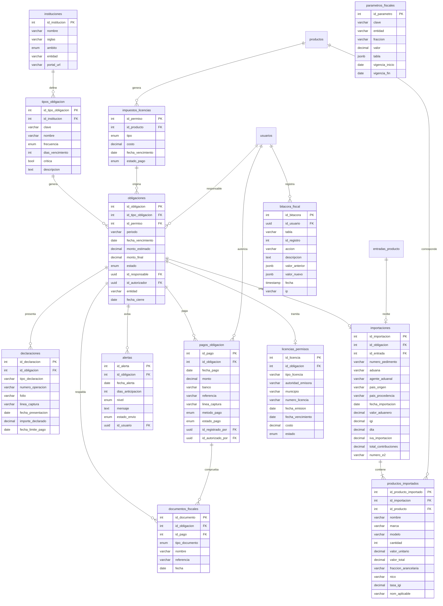
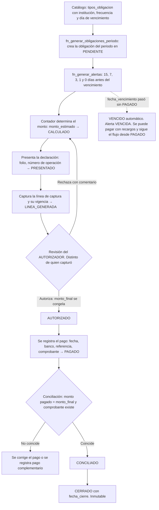
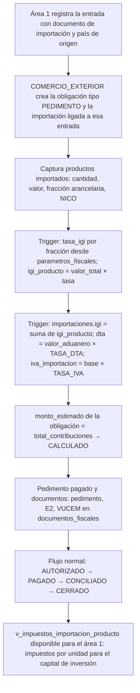
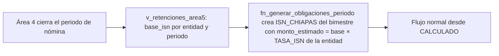

# Área 5 — Licencias, permisos, impuestos aduanales y de gobierno

> **Documento de contexto del área 5.** Fuente de verdad para el equipo y para cualquier agente de código que trabaje en esta área.
> Se alinea con `PLAN.md` (plan global), `docs/MODELO_DATOS.md` (dueños de tablas) y `docs/area3-inventario/CONTEXTO.md` (modelo de datos base).
> Ante contradicción entre este documento y el código, gana este documento. Ante contradicción entre este documento y `PLAN.md`, gana `PLAN.md`.

| Campo | Valor |
| --- | --- |
| Proyecto | SIGFEVAK — Sistema de gestión, comercializadora nacional (México) |
| Área | 5 de 6 — Control de obligaciones fiscales, aduanales, estatales y municipales, con pago dirigido |
| Etiqueta de issues | `area:5-fiscal` |
| Prefijo de commits | `area5:` |
| Reglas de negocio | `RN-A5-01` … `RN-A5-24` |
| Equipo | 5 personas (1 líder + 4 integrantes) |
| Plazo | Domingo 13 a jueves 17 de septiembre de 2026 (5 días de trabajo) |
| Stack | React + Vite (JavaScript), supabase-js, PostgreSQL en Supabase, pnpm (PLAN.md D-01). Sin backend propio |
| Versión | 2.0 (reestructurado al formato común a partir del documento original del área) |

---

## 0. Índice

1. Cómo debe usar este documento un agente
2. Contexto de negocio y marco legal
3. Alcance
4. Modelo entidad-relación
5. Diccionario de datos
6. Flujos
7. Reglas de negocio
8. DDL y migraciones
9. Vistas y contratos con otras áreas
10. Ejemplo de cálculo
11. Equipo, roles y evaluación del líder
12. Cronograma de 5 días
13. Riesgos
14. Indicadores de éxito
15. Reporte final del líder
16. Preguntas abiertas
17. Glosario

---

## 1. Cómo debe usar este documento un agente

1. Este archivo es la **única fuente de verdad** del área 5. Si el código lo contradice, el código se corrige.
2. **No inventes tablas, columnas, tasas, tarifas ni fechas de vencimiento.** Todos los valores fiscales (tasas de ISR, IVA, ISN por entidad, DTA, IGI por fracción) viven en la tabla `parametros_fiscales` con vigencia (sección 5). Si necesitas un valor que no está ahí, lo registras como pregunta abierta (sección 16) y te detienes.
3. **No toques tablas de otras áreas.** La sección 3 dice cuáles son de lectura. Si necesitas una columna nueva en `facturas`, `entradas_producto` o `agentes_ventas`, eso es un issue `tipo:integracion` con el área dueña, no un cambio tuyo.
4. Todo cambio de esquema es una **migración nueva**, nunca se edita una aplicada.
5. Cita las reglas `RN-A5-xx` en comentarios de código, mensajes de commit y descripciones de PR.
6. Los cálculos de ISR, IVA, IGI, DTA e IVA de importación son el punto donde más errores se cometen: **no asumas tasas**, léelas de `parametros_fiscales` con la función `fn_parametro_fiscal`.
7. El "pago automático" de esta área **no mueve dinero** (decisión D-04 de `PLAN.md`). Si un issue pide integrar un banco, no lo implementes: regístralo como pregunta abierta.
8. Commits: `area5: <verbo> <objeto> (RN-A5-xx) #issue`. Sin ninguna mención a herramientas de IA (regla D-08 de `PLAN.md`).

---

## 2. Contexto de negocio y marco legal

### 2.1 El negocio

La comercializadora vende productos electrónicos y de manufactura nacional en todo México y tiene su sede física en el estado de **Chiapas**. Compra a proveedores nacionales e importa mercancía. Por eso tiene obligaciones con tres niveles de gobierno: federal (impuestos y aduanas), estatal (nómina, protección civil) y municipal (uso de suelo, licencia de funcionamiento).

Hoy esas obligaciones se controlan a mano y el riesgo es concreto: pagos fuera de tiempo, multas, recargos, pérdida de acuses y comprobantes, y no saber quién autorizó qué. El módulo del área 5 centraliza el registro, el calendario, las alertas, la autorización, el pago y la evidencia documental de cada obligación.

### 2.2 Instituciones contempladas

| Institución | Siglas | Ámbito | Qué se le debe |
| --- | --- | --- | --- |
| Servicio de Administración Tributaria | SAT | Federal | ISR, IVA, declaraciones mensuales y anual, CFDI |
| Agencia Nacional de Aduanas de México | ANAM | Federal | Pedimentos, IGI, DTA, IVA de importación |
| Ventanilla Única de Comercio Exterior Mexicana | VUCEM | Federal | Documentación electrónica de comercio exterior, Manifestación de Valor E2 |
| Secretaría de Hacienda del Estado de Chiapas | Hacienda Chiapas | Estatal | Impuesto Sobre Nóminas (ISN) |
| Protección Civil del Estado de Chiapas | PC Chiapas | Estatal | Programa Interno de Protección Civil |
| Ayuntamiento del municipio sede | Ayuntamiento | Municipal | Uso de suelo, licencia de funcionamiento |
| Secretaría de Economía | SE | Federal | Padrón de Importadores, encargos conferidos |
| Sistema de Información Empresarial Mexicano | SIEM | Federal | Registro anual |

### 2.3 Objetivo general

Diseñar un sistema que permita administrar y supervisar de manera centralizada las obligaciones fiscales, aduanales y administrativas de la comercializadora, reduciendo el riesgo de incumplimiento, retrasos, pérdida de documentos o pagos fuera de tiempo.

### 2.4 Objetivos específicos

- Registrar las obligaciones fiscales de la empresa.
- Controlar fechas límite de pago y presentación.
- Generar alertas automáticas antes de los vencimientos.
- Registrar declaraciones, folios y líneas de captura.
- Registrar pagos realizados a instituciones gubernamentales.
- Mantener evidencia documental de cada trámite o pago.
- Controlar pedimentos e información relacionada con importaciones.
- Registrar fracciones arancelarias y NICO de productos importados.
- Controlar el Impuesto Sobre Nóminas del Estado de Chiapas.
- Registrar licencias y permisos municipales o estatales.
- Mantener un historial de auditoría de las operaciones realizadas.
- Permitir identificar qué usuario realizó, autorizó o modificó una operación.

### 2.5 Marco legal y cálculos que condicionan el diseño

Todos los valores de esta tabla se cargan en `parametros_fiscales` con vigencia. **Ninguno se escribe en código** (RN-A5-20).

| Contribución | Fórmula | Parámetro | Nota |
| --- | --- | --- | --- |
| ISR anual (persona moral, régimen general) | `ISR = Resultado fiscal × 30%` | `TASA_ISR_PM` = 0.30 | No se calcula sobre ventas totales. Los pagos provisionales mensuales se estiman con coeficiente de utilidad |
| IVA | `IVA a pagar = IVA trasladado − IVA acreditable`, con `IVA = base × 16%` | `TASA_IVA` = 0.16 | El IVA trasladado viene de las facturas del área 2; el acreditable de las compras del área 1 |
| ISN Chiapas | `ISN = Nómina gravada × 2%` | `TASA_ISN` con `entidad = 'Chiapas'` = 0.02 | Bimestral. La base gravable la calcula el área 4 y la entrega en `v_retenciones_area5`. El área 5 solo registra la obligación y su pago |
| IGI | `IGI = Valor en aduana × Tasa arancelaria` | `TASA_IGI` por fracción arancelaria y NICO | No existe una tasa general para electrónicos; depende de fracción, NICO, país de origen y tratados. Se registra **por producto** |
| DTA | `DTA = Valor en aduana × 0.008` (8 al millar, regla general) | `TASA_DTA` = 0.008 | Existen supuestos especiales de cuota fija; se registran como parámetro distinto cuando apliquen |
| IVA de importación | `Base = Valor en aduana + IGI + contribuciones aplicables`; `IVA importación = Base × 16%` | `TASA_IVA` | Simplificado; la base exacta puede incluir otras cuotas compensatorias |

Ejemplo de ISN: nómina gravada de $200,000 → ISN = $200,000 × 0.02 = $4,000.

### 2.6 Calendario general de obligaciones

| Obligación | Institución | Frecuencia | Vencimiento típico |
| --- | --- | --- | --- |
| ISR pago provisional | SAT | Mensual | Día 17 del mes siguiente |
| IVA | SAT | Mensual | Día 17 del mes siguiente |
| ISN Chiapas | Hacienda Chiapas | Bimestral | Día 17 del mes siguiente al bimestre |
| Declaración anual ISR | SAT | Anual | 31 de marzo |
| Registro SIEM | SIEM | Anual | Según fecha de alta |
| CFDI | SAT | Por operación | Al emitir la factura |
| Pedimento | ANAM | Por importación | Al despacho aduanal |
| Manifestación de Valor E2 | VUCEM | Por operación cuando aplique | Antes del despacho |
| Uso de suelo | Ayuntamiento | Según municipio | Según licencia |
| Licencia de funcionamiento | Ayuntamiento | Según municipio (anual típico) | Según licencia |
| Programa Interno de Protección Civil | PC Chiapas | Según vigencia aplicable | Según dictamen |

Los vencimientos exactos se cargan como `dias_vencimiento` y `frecuencia` en `tipos_obligacion`; el sistema genera las obligaciones del periodo a partir de ahí.

### 2.7 Consideraciones importantes

- El costo de la licencia de funcionamiento y del uso de suelo depende del municipio; por eso cada licencia registra su municipio.
- No todos los productos electrónicos requieren permisos sanitarios.
- No existe una única tasa de IGI para todos los productos electrónicos; la fracción arancelaria se determina por mercancía.
- Los honorarios del agente aduanal no son una tarifa gubernamental: se registran como gasto, no como contribución.
- El sistema debe permitir actualizar tasas, costos y reglas cuando cambie la legislación, sin tocar código.

---

## 3. Alcance

### Dentro del alcance (5 días)

**3.1 Licencias y permisos.** Registro y control de uso de suelo, licencia de funcionamiento, Programa Interno de Protección Civil, registro SIEM, permisos sanitarios cuando apliquen y autorizaciones administrativas de operación; con municipio, autoridad, número, fechas, costo y estado.

**3.2 Comercio exterior y aduanas.** Registro de Padrón de Importadores, encargos conferidos, pedimentos, aduana de entrada, agente aduanal, país de origen y de procedencia, valor aduanero, fracción arancelaria y NICO por producto, IGI, DTA, IVA de importación, Manifestación de Valor E2 y documentación de VUCEM.

**3.3 Obligaciones fiscales.** Control de ISR, IVA, declaraciones mensuales y anual, ISN de Chiapas, pagos provisionales, líneas de captura, acuses de presentación y comprobantes bancarios. El CFDI se lee del área 2 (UUID en `facturas`), no se captura aquí.

**3.4 Sistema de pagos dirigidos y alertas.** Fechas de vencimiento, alertas preventivas escalonadas, registro de líneas de captura, autorización de pagos con separación de funciones, registro del pago y del comprobante, conciliación, cierre e identificación automática de vencidas.

**Definición de "pago automático" (decisión D-04 de `PLAN.md`).** El sistema genera la **orden de pago** con monto, institución, línea de captura y fecha límite; la pasa por **autorización**; registra el **pago** con referencia bancaria y el **comprobante**; y concilia. **No hay integración bancaria ni transferencia real.** "Dirigido" significa que cada pago queda ligado a su institución, su obligación y su comprobante.

Además: bitácora de auditoría, reportes (sección 9) y contratos de datos con las áreas 1, 2 y 4.

### Fuera del alcance (se declara explícitamente)

- Transferencias bancarias, SPEI o conexión con portales del SAT, ANAM o VUCEM. Los folios y líneas de captura se capturan a mano.
- Cálculo contable completo del ISR (resultado fiscal con deducciones): el sistema registra el monto que determine contabilidad y lo estima con coeficiente de utilidad; no sustituye al contador.
- Cálculo del ISN: lo hace el área 4 (RN-A4-16). El área 5 registra la obligación con el monto que recibe.
- Emisión o timbrado de CFDI: es del área 2.
- Almacenamiento físico de archivos: `documentos_fiscales` guarda referencia (nombre, URL o ruta), no el binario.
- Multi-empresa: un solo RFC.

### Tablas por nivel de acceso

| Tabla | Acceso del área 5 | Dueño |
| --- | --- | --- |
| `instituciones`, `tipos_obligacion`, `obligaciones`, `declaraciones`, `pagos_obligacion`, `documentos_fiscales`, `alertas`, `importaciones`, `productos_importados`, `licencias_permisos`, `parametros_fiscales`, `bitacora_fiscal` | Escritura total | Área 5 |
| `impuestos_licencias` (modelo base: `id_permiso`, `id_producto`, `tipo`, `costo`, `fecha_vencimiento`, `estado_pago`) | Escritura total | Área 5 |
| `usuarios` (con columna `rol`) | Solo lectura | Coordinador |
| `facturas` (UUID, IVA trasladado), `clientes` | Solo lectura | Área 2 |
| `entradas_producto` (país de origen, documento de importación, impuestos), `proveedores` | Solo lectura | Área 1 |
| `productos` | Solo lectura | Área 3 |
| `agentes_ventas`, `nomina_detalle`, vista `v_retenciones_area5` | Solo lectura | Área 4 |

### Relación entre `impuestos_licencias` y `licencias_permisos`

`impuestos_licencias` viene del modelo base y liga **un producto** con un permiso, impuesto o trámite aduanal (por ejemplo: una NOM que aplica a un modelo de tableta, o el IGI de una fracción). `licencias_permisos` es la licencia **de la empresa** (uso de suelo, licencia de funcionamiento, Protección Civil, SIEM), que no depende de un producto. Ambas generan obligaciones en `obligaciones`; la primera por producto, la segunda por empresa.

---

## 4. Modelo entidad-relación

`usuarios`, `productos`, `facturas`, `entradas_producto` e `impuestos_licencias` vienen del modelo base o de otras áreas. Todo lo demás es aportación del área 5 y es **aditivo**.



### Decisiones de diseño respecto al documento original

| Original | Ahora | Por qué |
| --- | --- | --- |
| Tabla `usuario` propia | Se usa `usuarios` del coordinador, con enum global `rol_usuario` | Un solo login para las seis áreas (Supabase Auth) |
| Tabla `cfdi` | No existe; el UUID, RFC emisor y receptor, subtotal, IVA y total se leen de `facturas` del área 2 por la vista `v_iva_trasladado_periodo` | Evita dos verdades sobre la misma factura |
| Tabla `impuesto_nomina` con cálculo propio | No existe; el área 4 calcula la base gravable y el ISN y lo publica en `v_retenciones_area5`. El área 5 crea la obligación bimestral con ese monto | El área 4 es dueña de la nómina (RN-A4-16) |
| Tabla `auditoria` | `bitacora_fiscal` con el mismo contenido (usuario, tabla, registro, acción, descripción, fecha, IP) más valor anterior y nuevo en JSONB | Nombre alineado a la convención de plurales y a la bitácora del área 4 |
| Tasas escritas en el documento (30%, 16%, 2%, 0.008) | `parametros_fiscales` con vigencia | Cambian con la legislación (consideración 2.7) |
| Nombres en singular (`obligacion`, `pago`) | Plural `snake_case` (`obligaciones`, `pagos_obligacion`) | Convención global (PLAN.md 8.2) |

---

## 5. Diccionario de datos

### Roles (enum global `rol_usuario`, tabla `usuarios` del coordinador)

Mapa de los cuatro usuarios del documento original a los roles globales:

| Usuario original | Rol global | Puede |
| --- | --- | --- |
| Administrador | `ADMINISTRADOR` | Registrar usuarios, consultar todas las obligaciones, configurar instituciones y tipos de obligación, consultar auditoría, modificar parámetros generales |
| Contador | `CONTADOR` | Registrar declaraciones, consultar obligaciones fiscales, registrar montos, líneas de captura, adjuntar acuses, registrar ISR, IVA e ISN |
| Responsable de comercio exterior | `COMERCIO_EXTERIOR` | Registrar importaciones, pedimentos, productos importados, fracciones arancelarias, NICO, IGI, DTA e IVA de importación, adjuntar documentos de VUCEM y ANAM |
| Autorizador financiero | `AUTORIZADOR` | Revisar obligaciones, autorizar pagos, registrar confirmaciones, validar montos, conciliar |
| (no estaba) | `CAPTURISTA` | Registrar pagos y documentos sin autorizar |

Los demás valores del enum (`GERENTE_VENTAS`, `ALMACEN`, `MARKETING`) pertenecen a otras áreas y no tienen permisos aquí.

### `instituciones`

| Columna | Tipo | Nulo | Descripción |
| --- | --- | --- | --- |
| `id_institucion` | INT PK | No | |
| `nombre` | VARCHAR(150) | No | Único |
| `siglas` | VARCHAR(20) | Sí | SAT, ANAM, VUCEM, SIEM |
| `ambito` | ENUM `ambito_institucion` | No | `FEDERAL`, `ESTATAL`, `MUNICIPAL` |
| `entidad` | VARCHAR(50) | Sí | Estado, para las estatales y municipales |
| `portal_url` | VARCHAR(255) | Sí | Portal donde se presenta o paga |

### `tipos_obligacion`

| Columna | Tipo | Nulo | Descripción |
| --- | --- | --- | --- |
| `id_tipo_obligacion` | INT PK | No | |
| `id_institucion` | INT FK | No | RN-A5-02 |
| `clave` | VARCHAR(30) | No | Única: `ISR_PROV`, `IVA_MENSUAL`, `ISN_CHIAPAS`, `ISR_ANUAL`, `SIEM`, `PEDIMENTO`, `E2`, `USO_SUELO`, `LIC_FUNCIONAMIENTO`, `PROTECCION_CIVIL`, `PADRON_IMPORTADORES` |
| `nombre` | VARCHAR(150) | No | |
| `frecuencia` | ENUM `frecuencia_obligacion` | No | `MENSUAL`, `BIMESTRAL`, `TRIMESTRAL`, `ANUAL`, `POR_OPERACION`, `SEGUN_VIGENCIA` |
| `dias_vencimiento` | INT | Sí | Día del mes siguiente en que vence (17 para SAT). NULL si es por operación o según vigencia |
| `critica` | BOOLEAN | No | Default TRUE. Las críticas exigen autorización de `AUTORIZADOR` (RN-A5-06) |
| `descripcion` | TEXT | Sí | |

### `obligaciones` (tabla central)

| Columna | Tipo | Nulo | Descripción |
| --- | --- | --- | --- |
| `id_obligacion` | INT PK | No | |
| `id_tipo_obligacion` | INT FK | No | RN-A5-01 |
| `id_permiso` | INT FK → `impuestos_licencias` | Sí | Cuando la obligación nace de un permiso o impuesto por producto |
| `periodo` | VARCHAR(7) | Sí | `AAAA-MM` o `AAAA` según frecuencia. NULL para obligaciones por operación |
| `fecha_vencimiento` | DATE | No | RN-A5-03 |
| `monto_estimado` | DECIMAL(14,2) | Sí | Lo que se espera pagar |
| `monto_final` | DECIMAL(14,2) | Sí | Lo validado antes de pagar. Se congela al autorizar |
| `estado` | ENUM `estado_obligacion` | No | Default `PENDIENTE`. Ver flujo 6.1 |
| `id_responsable` | UUID FK → `usuarios` | Sí | Quien la prepara |
| `id_autorizador` | UUID FK → `usuarios` | Sí | Quien la autorizó. Debe ser distinto del responsable (RN-A5-18) |
| `entidad` | VARCHAR(50) | Sí | Estado o municipio al que corresponde (ISN, licencias) |
| `comentario` | TEXT | Sí | Motivo de rechazo o notas |
| `fecha_cierre` | DATE | Sí | Se llena al pasar a `CERRADO` |
| `activo` | BOOLEAN | No | Default TRUE. Baja lógica, nunca borrado físico (RN-A5-22) |

Única: (`id_tipo_obligacion`, `periodo`) cuando `periodo` no es nulo.

### `declaraciones`

| Columna | Tipo | Nulo | Descripción |
| --- | --- | --- | --- |
| `id_declaracion` | INT PK | No | |
| `id_obligacion` | INT FK | No | |
| `tipo_declaracion` | VARCHAR(50) | No | Provisional, definitiva, anual, complementaria |
| `numero_operacion` | VARCHAR(50) | Sí | Lo asigna el SAT al presentar |
| `folio` | VARCHAR(50) | Sí | Acuse |
| `linea_captura` | VARCHAR(60) | Sí | Referencia para pagar; con vigencia |
| `fecha_presentacion` | DATE | No | |
| `importe_declarado` | DECIMAL(14,2) | No | |
| `fecha_limite_pago` | DATE | Sí | Vigencia de la línea de captura |

### `pagos_obligacion`

| Columna | Tipo | Nulo | Descripción |
| --- | --- | --- | --- |
| `id_pago` | INT PK | No | |
| `id_obligacion` | INT FK | No | |
| `fecha_pago` | DATE | No | |
| `monto` | DECIMAL(14,2) | No | > 0 |
| `banco` | VARCHAR(80) | Sí | |
| `referencia` | VARCHAR(80) | No | Referencia bancaria o folio de comprobante (RN-A5-07) |
| `linea_captura` | VARCHAR(60) | Sí | Copia de la línea con la que se pagó |
| `metodo_pago` | ENUM `metodo_pago_fiscal` | No | `TRANSFERENCIA`, `SPEI`, `VENTANILLA`, `TARJETA`, `PORTAL` |
| `estado_pago` | ENUM `estado_pago` (base) | No | `PENDIENTE`, `PARCIAL`, `PAGADO`, `CANCELADO` |
| `id_registrado_por` | UUID FK → `usuarios` | No | Quien capturó |
| `id_autorizado_por` | UUID FK → `usuarios` | Sí | Quien autorizó. Distinto de quien registró (RN-A5-18) |

### `documentos_fiscales`

| Columna | Tipo | Nulo | Descripción |
| --- | --- | --- | --- |
| `id_documento` | INT PK | No | |
| `id_obligacion` | INT FK | No | |
| `id_pago` | INT FK | Sí | Cuando el documento respalda un pago específico |
| `tipo_documento` | ENUM `tipo_documento_fiscal` | No | `ACUSE_SAT`, `COMPROBANTE_BANCARIO`, `CFDI`, `PEDIMENTO`, `MANIFESTACION_E2`, `LICENCIA_FUNCIONAMIENTO`, `USO_SUELO`, `DICTAMEN_PROTECCION_CIVIL`, `REGISTRO_SIEM`, `OTRO` |
| `nombre` | VARCHAR(150) | No | |
| `referencia` | VARCHAR(255) | No | URL o ruta del archivo. No se guarda el binario |
| `fecha` | DATE | No | Default hoy |

### `alertas`

| Columna | Tipo | Nulo | Descripción |
| --- | --- | --- | --- |
| `id_alerta` | INT PK | No | |
| `id_obligacion` | INT FK | No | |
| `fecha_alerta` | DATE | No | `fecha_vencimiento − dias_anticipacion` |
| `dias_anticipacion` | INT | No | 15, 7, 3, 1, 0 o negativo si ya venció |
| `nivel` | ENUM `nivel_alerta` | No | `PREVENTIVA`, `ALTA`, `CRITICA`, `VENCIDA` |
| `mensaje` | TEXT | No | |
| `estado_envio` | ENUM `estado_envio_alerta` | No | `PENDIENTE`, `MOSTRADA`, `ATENDIDA` |
| `id_usuario` | UUID FK → `usuarios` | Sí | Destinatario; por default el responsable de la obligación |

Escala de alertas (documento original):

| Anticipación | Nivel | Acción |
| --- | --- | --- |
| 15 días | `PREVENTIVA` | Aviso inicial |
| 7 días | `PREVENTIVA` | Solicitar documentación |
| 3 días | `ALTA` | Priorizar trámite |
| 1 día | `CRITICA` | Vencimiento próximo |
| Día del vencimiento | `CRITICA` | Aviso inmediato |
| Después del vencimiento | `VENCIDA` | Marcar incumplimiento |

### `importaciones`

| Columna | Tipo | Nulo | Descripción |
| --- | --- | --- | --- |
| `id_importacion` | INT PK | No | |
| `id_obligacion` | INT FK | No | Cada importación está asociada a una obligación de tipo `PEDIMENTO` (RN-A5-08) |
| `id_entrada` | INT FK → `entradas_producto` | Sí | La entrada de inventario que generó (área 1, integración I-04) |
| `numero_pedimento` | VARCHAR(30) | No | Único |
| `aduana` | VARCHAR(100) | No | Aduana de entrada |
| `agente_aduanal` | VARCHAR(150) | Sí | Agente o agencia; sus honorarios no son contribución |
| `pais_origen` | VARCHAR(60) | No | |
| `pais_procedencia` | VARCHAR(60) | No | |
| `fecha_importacion` | DATE | No | |
| `valor_aduanero` | DECIMAL(14,2) | No | Base de IGI y DTA |
| `igi` | DECIMAL(14,2) | No | Suma de IGI de sus productos. Calculado por trigger |
| `dta` | DECIMAL(14,2) | No | `valor_aduanero × TASA_DTA` salvo cuota fija |
| `iva_importacion` | DECIMAL(14,2) | No | `(valor_aduanero + igi + dta) × TASA_IVA` |
| `total_contribuciones` | DECIMAL(14,2) | — | Generada: `igi + dta + iva_importacion` |
| `numero_e2` | VARCHAR(30) | Sí | Manifestación de Valor cuando aplique |
| `padron_importador` | VARCHAR(30) | Sí | Número en el Padrón de Importadores |
| `encargo_conferido` | VARCHAR(30) | Sí | Folio del encargo conferido al agente aduanal |

### `productos_importados`

| Columna | Tipo | Nulo | Descripción |
| --- | --- | --- | --- |
| `id_producto_importado` | INT PK | No | |
| `id_importacion` | INT FK | No | RN-A5-09 |
| `id_producto` | INT FK → `productos` | Sí | Liga al catálogo del área 3 cuando el producto ya existe |
| `nombre`, `marca`, `modelo` | VARCHAR | No / Sí / Sí | |
| `cantidad` | INT | No | > 0 |
| `valor_unitario` | DECIMAL(12,2) | No | |
| `valor_total` | DECIMAL(14,2) | — | Generada: `cantidad × valor_unitario` |
| `fraccion_arancelaria` | VARCHAR(10) | Sí | Obligatoria cuando ya fue determinada (RN-A5-10) |
| `nico` | VARCHAR(4) | Sí | Cuando corresponda (RN-A5-11) |
| `tasa_igi` | DECIMAL(6,4) | No | Por producto; se toma de `parametros_fiscales` por fracción y se congela aquí (RN-A5-13) |
| `igi_producto` | DECIMAL(14,2) | — | Generada: `valor_total × tasa_igi` |
| `nom_aplicable` | VARCHAR(30) | Sí | Norma Oficial Mexicana que aplica |

### `licencias_permisos`

| Columna | Tipo | Nulo | Descripción |
| --- | --- | --- | --- |
| `id_licencia` | INT PK | No | |
| `id_obligacion` | INT FK | Sí | Obligación de renovación o pago asociada |
| `tipo_licencia` | VARCHAR(60) | No | Uso de suelo, licencia de funcionamiento, Protección Civil, SIEM, sanitario, otra |
| `autoridad_emisora` | VARCHAR(150) | No | |
| `municipio` | VARCHAR(80) | Sí | Obligatorio para uso de suelo y licencia de funcionamiento (RN-A5-15) |
| `numero_licencia` | VARCHAR(60) | Sí | |
| `fecha_emision` | DATE | Sí | |
| `fecha_vencimiento` | DATE | Sí | |
| `costo` | DECIMAL(12,2) | Sí | Varía por municipio |
| `estado` | ENUM `estado_licencia` | No | `EN_TRAMITE`, `VIGENTE`, `POR_VENCER`, `VENCIDA` |

### `parametros_fiscales`

| Columna | Tipo | Nulo | Descripción |
| --- | --- | --- | --- |
| `id_parametro` | INT PK | No | |
| `clave` | VARCHAR(40) | No | `TASA_ISR_PM`, `TASA_IVA`, `TASA_ISN`, `TASA_DTA`, `TASA_IGI`, `COEFICIENTE_UTILIDAD`, `UMA_DIARIA`, `RECARGO_MENSUAL` |
| `entidad` | VARCHAR(50) | Sí | Para `TASA_ISN`: nombre del estado. NULL = federal |
| `fraccion` | VARCHAR(10) | Sí | Para `TASA_IGI`: fracción arancelaria |
| `valor` | DECIMAL(14,6) | Sí | |
| `tabla` | JSONB | Sí | Para tarifas por rangos |
| `vigencia_inicio`, `vigencia_fin` | DATE | No / Sí | El cálculo usa el vigente a la `fecha_vencimiento` de la obligación (RN-A5-20) |

Seed inicial: `TASA_ISR_PM` 0.30, `TASA_IVA` 0.16, `TASA_ISN` Chiapas 0.02, `TASA_DTA` 0.008, y las fracciones arancelarias de los productos del seed del área 3 con su tasa de IGI. El área 4 lee `TASA_ISN` por la vista `v_tasas_isn`.

### `bitacora_fiscal`

| Columna | Tipo | Descripción |
| --- | --- | --- |
| `id_usuario` | UUID FK → `usuarios` | Quien hizo la acción |
| `tabla`, `id_registro` | VARCHAR, INT | Registro afectado |
| `accion` | VARCHAR(20) | `INSERT`, `UPDATE`, `AUTORIZAR`, `RECHAZAR`, `CERRAR`, `BAJA` |
| `descripcion` | TEXT | |
| `valor_anterior`, `valor_nuevo` | JSONB | |
| `fecha` | TIMESTAMP | Default `now()` |
| `ip` | VARCHAR(45) | |

### Valores ENUM del área 5

| Tipo | Valores |
| --- | --- |
| `estado_obligacion` | `PENDIENTE`, `CALCULADO`, `PRESENTADO`, `LINEA_GENERADA`, `AUTORIZADO`, `PAGADO`, `CONCILIADO`, `CERRADO`, `VENCIDO` |
| `ambito_institucion` | `FEDERAL`, `ESTATAL`, `MUNICIPAL` |
| `frecuencia_obligacion` | `MENSUAL`, `BIMESTRAL`, `TRIMESTRAL`, `ANUAL`, `POR_OPERACION`, `SEGUN_VIGENCIA` |
| `nivel_alerta` | `PREVENTIVA`, `ALTA`, `CRITICA`, `VENCIDA` |
| `estado_envio_alerta` | `PENDIENTE`, `MOSTRADA`, `ATENDIDA` |
| `metodo_pago_fiscal` | `TRANSFERENCIA`, `SPEI`, `VENTANILLA`, `TARJETA`, `PORTAL` |
| `tipo_documento_fiscal` | `ACUSE_SAT`, `COMPROBANTE_BANCARIO`, `CFDI`, `PEDIMENTO`, `MANIFESTACION_E2`, `LICENCIA_FUNCIONAMIENTO`, `USO_SUELO`, `DICTAMEN_PROTECCION_CIVIL`, `REGISTRO_SIEM`, `OTRO` |
| `estado_licencia` | `EN_TRAMITE`, `VIGENTE`, `POR_VENCER`, `VENCIDA` |
| `tipo_permiso` (base) | `LICENCIA`, `PERMISO`, `ADUANAL`, `IMPUESTO` |
| `estado_pago` (base) | `PENDIENTE`, `PARCIAL`, `PAGADO`, `CANCELADO` |

---

## 6. Flujos

### 6.1 Ciclo de vida de una obligación



| Paso | Responsable (rol) | Control |
| --- | --- | --- |
| Generar obligaciones y alertas | Sistema (`fn_generar_obligaciones_periodo`, `fn_generar_alertas`) | Se ejecutan a mano desde la pantalla de administración o con `pg_cron` diario |
| CALCULADO, PRESENTADO, LINEA_GENERADA | `CONTADOR` (fiscales), `COMERCIO_EXTERIOR` (aduanales), `CAPTURISTA` (licencias) | Cada cambio queda en bitácora |
| AUTORIZADO | `AUTORIZADOR` | No puede ser quien preparó (RN-A5-18). Obligatorio si `tipos_obligacion.critica` (RN-A5-06) |
| PAGADO | `CAPTURISTA` o `CONTADOR` | Referencia obligatoria (RN-A5-07); no se llega a PAGADO sin fila en `pagos_obligacion` (RN-A5-04) |
| CONCILIADO | `AUTORIZADOR` | Suma de pagos = `monto_final` (RN-A5-05) |
| CERRADO | Sistema al conciliar, o `ADMINISTRADOR` | Inmutable (RN-A5-24) |
| VENCIDO | Sistema (`fn_marcar_vencidas`) | RN-A5-16 |

### 6.2 Importación



### 6.3 ISN bimestral (integración con el área 4)



### 6.4 Licencias y permisos

Una licencia con `fecha_vencimiento` genera, con la anticipación de su tipo, una obligación `SEGUN_VIGENCIA` para su renovación. Su estado pasa a `POR_VENCER` 30 días antes y a `VENCIDA` al día siguiente del vencimiento si no se renovó (`fn_actualizar_estado_licencias`).

---

## 7. Reglas de negocio

Las reglas 01 a 17 corresponden, en el mismo orden, a las 17 del documento original. Las 18 a 24 se agregan por el formato común y las decisiones del plan.

| ID | Regla | Dónde se implementa |
| --- | --- | --- |
| **RN-A5-01** | Una obligación debe pertenecer a un tipo de obligación. | FK `NOT NULL` |
| **RN-A5-02** | Cada tipo de obligación está relacionado con una institución. | FK `NOT NULL` |
| **RN-A5-03** | Una obligación debe tener fecha de vencimiento. | `NOT NULL` |
| **RN-A5-04** | Una obligación no puede marcarse `PAGADO` si no existe al menos un pago registrado con estado `PAGADO`. | Trigger `fn_transicion_obligacion` |
| **RN-A5-05** | Una obligación no puede marcarse `CONCILIADO` si la suma de pagos no coincide con `monto_final`. | Trigger `fn_transicion_obligacion` |
| **RN-A5-06** | Los pagos de obligaciones críticas (`tipos_obligacion.critica`) deben ser autorizados por un usuario con rol `AUTORIZADOR` o `ADMINISTRADOR`. | Trigger `fn_transicion_obligacion` + RLS |
| **RN-A5-07** | Cada pago conserva una referencia bancaria o comprobante. | `referencia NOT NULL` + documento tipo `COMPROBANTE_BANCARIO` antes de conciliar |
| **RN-A5-08** | Cada importación está asociada a una obligación (tipo `PEDIMENTO`). | FK `NOT NULL` + CHECK en trigger |
| **RN-A5-09** | Cada producto importado pertenece a una importación. | FK `NOT NULL` |
| **RN-A5-10** | Los productos importados registran su fracción arancelaria cuando ya fue determinada; sin fracción la obligación no puede pasar de `CALCULADO`. | Trigger `fn_transicion_obligacion` |
| **RN-A5-11** | El NICO se registra cuando corresponda. | Validación de aplicación; campo opcional |
| **RN-A5-12** | El sistema no asume una tasa IGI general para los productos electrónicos. | No existe `TASA_IGI` sin `fraccion` |
| **RN-A5-13** | La tasa IGI se registra por producto y se congela en `productos_importados.tasa_igi` al momento del cálculo. | Trigger `fn_calcular_igi_producto` |
| **RN-A5-14** | El ISN de Chiapas se calcula sobre la base gravable registrada por el área 4, con la tasa vigente de la entidad. | `fn_generar_obligaciones_periodo` + `v_retenciones_area5` |
| **RN-A5-15** | Las licencias de uso de suelo y funcionamiento registran municipio, porque el costo varía. | CHECK condicional en `licencias_permisos` |
| **RN-A5-16** | Las obligaciones con `fecha_vencimiento` pasada y sin estado `PAGADO`, `CONCILIADO` ni `CERRADO` cambian automáticamente a `VENCIDO`. | `fn_marcar_vencidas` (manual o `pg_cron` diario) |
| **RN-A5-17** | Toda modificación importante (montos, estados, autorizaciones, pagos, bajas) queda en `bitacora_fiscal` con usuario, valor anterior y nuevo. | Triggers `fn_bitacora` en obligaciones, pagos, importaciones, licencias |
| **RN-A5-18** | Separación de funciones: quien registra o calcula una obligación o un pago no puede autorizarlo. `id_autorizador ≠ id_responsable`; `id_autorizado_por ≠ id_registrado_por`. | Trigger `fn_transicion_obligacion` + CHECK |
| **RN-A5-19** | Los estados avanzan en el orden `PENDIENTE → CALCULADO → PRESENTADO → LINEA_GENERADA → AUTORIZADO → PAGADO → CONCILIADO → CERRADO`. El único retroceso permitido es por rechazo del autorizador, a `CALCULADO`, con comentario obligatorio. `VENCIDO` puede entrar desde cualquier estado anterior a `PAGADO` y sale solo a `PAGADO`. | Trigger `fn_transicion_obligacion` |
| **RN-A5-20** | Toda tasa, tarifa o valor legal se lee de `parametros_fiscales` vigente a la `fecha_vencimiento` de la obligación. Nunca se escribe en código. | `fn_parametro_fiscal(clave, entidad, fraccion, fecha)` |
| **RN-A5-21** | Las alertas se generan a 15, 7, 3, 1 y 0 días del vencimiento y una `VENCIDA` al día siguiente; no se duplican para la misma obligación y anticipación. | `fn_generar_alertas` + UNIQUE (`id_obligacion`, `dias_anticipacion`) |
| **RN-A5-22** | No se eliminan físicamente registros fiscales. La baja es lógica (`activo = false`) y queda en bitácora. | Trigger que convierte `DELETE` en `UPDATE` + RLS sin política de `DELETE` |
| **RN-A5-23** | `monto_final` se congela al autorizar; después de `AUTORIZADO` solo cambia por rechazo explícito que regresa a `CALCULADO`. | Trigger `fn_transicion_obligacion` |
| **RN-A5-24** | Una obligación `CERRADO` es inmutable, igual que sus pagos y documentos. | Trigger `fn_bloquea_cerradas` |

### Requerimientos funcionales (del documento original) y dónde se cubren

| RF | Requerimiento | Se cubre con |
| --- | --- | --- |
| RF-01 | Registrar usuarios | `usuarios` del coordinador (Supabase Auth) |
| RF-02 | Registrar instituciones | `instituciones` |
| RF-03 | Registrar tipos de obligación | `tipos_obligacion` |
| RF-04 | Generar obligaciones con vencimiento | `fn_generar_obligaciones_periodo` |
| RF-05 | Generar alertas de vencimiento | `fn_generar_alertas`, `alertas` |
| RF-06 | Registrar declaraciones | `declaraciones` |
| RF-07 | Registrar líneas de captura | `declaraciones.linea_captura`, `pagos_obligacion.linea_captura` |
| RF-08 | Registrar pagos | `pagos_obligacion` |
| RF-09 | Autorizar pagos | Estado `AUTORIZADO`, RN-A5-06, RN-A5-18 |
| RF-10 | Adjuntar o registrar documentos | `documentos_fiscales` |
| RF-11 | Registrar importaciones | `importaciones` |
| RF-12 | Registrar productos de cada importación | `productos_importados` |
| RF-13 | Registrar fracciones arancelarias y NICO | `productos_importados` |
| RF-14 | Calcular y registrar ISN | `fn_generar_obligaciones_periodo` con `v_retenciones_area5` |
| RF-15 | Registrar licencias y permisos | `licencias_permisos`, `impuestos_licencias` |
| RF-16 | Consultar obligaciones vencidas | `v_obligaciones_vencidas` |
| RF-17 | Consultar historial de pagos | `v_pagos_por_institucion`, `pagos_obligacion` |
| RF-18 | Bitácora de auditoría | `bitacora_fiscal` |

### Requerimientos no funcionales (del documento original)

| Tema | Requerimiento | Cómo se cumple |
| --- | --- | --- |
| Seguridad | Contraseñas con hash seguro; acceso por roles; solo funciones autorizadas; cambios críticos registrados | Supabase Auth; enum `rol_usuario`; políticas RLS por rol; `bitacora_fiscal` |
| Disponibilidad | Disponible en horario administrativo | Supabase alojado |
| Integridad | No borrar físicamente registros fiscales sin evidencia | RN-A5-22 |
| Trazabilidad | Cada pago, declaración o modificación ligada a su usuario | Columnas `id_registrado_por`, `id_autorizado_por`, `id_responsable`; bitácora |
| Respaldo | Copias periódicas | Respaldos automáticos de Supabase; migraciones y seed en el repo |
| Protección documental | Control de acceso y respaldo de archivos fiscales | `documentos_fiscales` con referencia; almacenamiento fuera del alcance |

---

## 8. DDL y migraciones

Estado objetivo en PostgreSQL. En el repo se divide en migraciones `AAAAMMDD_HHMM_a5_*.sql` (PLAN.md D-09). Todo es **aditivo** respecto al modelo base; `impuestos_licencias` no se modifica.

```sql
-- ---------- TIPOS ----------
CREATE TYPE estado_obligacion     AS ENUM ('PENDIENTE','CALCULADO','PRESENTADO','LINEA_GENERADA','AUTORIZADO','PAGADO','CONCILIADO','CERRADO','VENCIDO');
CREATE TYPE ambito_institucion    AS ENUM ('FEDERAL','ESTATAL','MUNICIPAL');
CREATE TYPE frecuencia_obligacion AS ENUM ('MENSUAL','BIMESTRAL','TRIMESTRAL','ANUAL','POR_OPERACION','SEGUN_VIGENCIA');
CREATE TYPE nivel_alerta          AS ENUM ('PREVENTIVA','ALTA','CRITICA','VENCIDA');
CREATE TYPE estado_envio_alerta   AS ENUM ('PENDIENTE','MOSTRADA','ATENDIDA');
CREATE TYPE metodo_pago_fiscal    AS ENUM ('TRANSFERENCIA','SPEI','VENTANILLA','TARJETA','PORTAL');
CREATE TYPE tipo_documento_fiscal AS ENUM ('ACUSE_SAT','COMPROBANTE_BANCARIO','CFDI','PEDIMENTO','MANIFESTACION_E2','LICENCIA_FUNCIONAMIENTO','USO_SUELO','DICTAMEN_PROTECCION_CIVIL','REGISTRO_SIEM','OTRO');
CREATE TYPE estado_licencia       AS ENUM ('EN_TRAMITE','VIGENTE','POR_VENCER','VENCIDA');

-- ---------- CATÁLOGOS ----------
CREATE TABLE instituciones (
    id_institucion INT GENERATED ALWAYS AS IDENTITY PRIMARY KEY,
    nombre         VARCHAR(150) NOT NULL UNIQUE,
    siglas         VARCHAR(20),
    ambito         ambito_institucion NOT NULL,
    entidad        VARCHAR(50),
    portal_url     VARCHAR(255)
);

CREATE TABLE tipos_obligacion (
    id_tipo_obligacion INT GENERATED ALWAYS AS IDENTITY PRIMARY KEY,
    id_institucion     INT NOT NULL REFERENCES instituciones(id_institucion),   -- RN-A5-02
    clave              VARCHAR(30) NOT NULL UNIQUE,
    nombre             VARCHAR(150) NOT NULL,
    frecuencia         frecuencia_obligacion NOT NULL,
    dias_vencimiento   INT,
    critica            BOOLEAN NOT NULL DEFAULT TRUE,                            -- RN-A5-06
    descripcion        TEXT
);

CREATE TABLE parametros_fiscales (
    id_parametro    INT GENERATED ALWAYS AS IDENTITY PRIMARY KEY,
    clave           VARCHAR(40) NOT NULL,
    entidad         VARCHAR(50),
    fraccion        VARCHAR(10),
    valor           DECIMAL(14,6),
    tabla           JSONB,
    vigencia_inicio DATE NOT NULL,
    vigencia_fin    DATE,
    CONSTRAINT ck_param_valor_o_tabla CHECK ((valor IS NULL) <> (tabla IS NULL)),
    CONSTRAINT ck_igi_con_fraccion CHECK (clave <> 'TASA_IGI' OR fraccion IS NOT NULL)   -- RN-A5-12
);
CREATE INDEX ix_param_fiscal ON parametros_fiscales(clave, entidad, fraccion, vigencia_inicio);

-- ---------- NÚCLEO ----------
CREATE TABLE obligaciones (
    id_obligacion      INT GENERATED ALWAYS AS IDENTITY PRIMARY KEY,
    id_tipo_obligacion INT NOT NULL REFERENCES tipos_obligacion(id_tipo_obligacion),   -- RN-A5-01
    id_permiso         INT REFERENCES impuestos_licencias(id_permiso),
    periodo            VARCHAR(7),
    fecha_vencimiento  DATE NOT NULL,                                                   -- RN-A5-03
    monto_estimado     DECIMAL(14,2),
    monto_final        DECIMAL(14,2),
    estado             estado_obligacion NOT NULL DEFAULT 'PENDIENTE',
    id_responsable     UUID REFERENCES usuarios(id_usuario),
    id_autorizador     UUID REFERENCES usuarios(id_usuario),
    entidad            VARCHAR(50),
    comentario         TEXT,
    fecha_cierre       DATE,
    activo             BOOLEAN NOT NULL DEFAULT TRUE,                                   -- RN-A5-22
    CONSTRAINT ck_separacion_funciones CHECK (id_autorizador IS NULL OR id_autorizador <> id_responsable)   -- RN-A5-18
);
CREATE UNIQUE INDEX uq_obligacion_periodo ON obligaciones(id_tipo_obligacion, periodo) WHERE periodo IS NOT NULL;
CREATE INDEX ix_obligaciones_vencimiento ON obligaciones(fecha_vencimiento);
CREATE INDEX ix_obligaciones_estado ON obligaciones(estado);

CREATE TABLE declaraciones (
    id_declaracion     INT GENERATED ALWAYS AS IDENTITY PRIMARY KEY,
    id_obligacion      INT NOT NULL REFERENCES obligaciones(id_obligacion),
    tipo_declaracion   VARCHAR(50) NOT NULL,
    numero_operacion   VARCHAR(50),
    folio              VARCHAR(50),
    linea_captura      VARCHAR(60),
    fecha_presentacion DATE NOT NULL,
    importe_declarado  DECIMAL(14,2) NOT NULL CHECK (importe_declarado >= 0),
    fecha_limite_pago  DATE
);

CREATE TABLE pagos_obligacion (
    id_pago           INT GENERATED ALWAYS AS IDENTITY PRIMARY KEY,
    id_obligacion     INT NOT NULL REFERENCES obligaciones(id_obligacion),
    fecha_pago        DATE NOT NULL,
    monto             DECIMAL(14,2) NOT NULL CHECK (monto > 0),
    banco             VARCHAR(80),
    referencia        VARCHAR(80) NOT NULL,                                             -- RN-A5-07
    linea_captura     VARCHAR(60),
    metodo_pago       metodo_pago_fiscal NOT NULL,
    estado_pago       estado_pago NOT NULL DEFAULT 'PAGADO',
    id_registrado_por UUID NOT NULL REFERENCES usuarios(id_usuario),
    id_autorizado_por UUID REFERENCES usuarios(id_usuario),
    CONSTRAINT ck_pago_separacion CHECK (id_autorizado_por IS NULL OR id_autorizado_por <> id_registrado_por)   -- RN-A5-18
);
CREATE INDEX ix_pagos_obligacion ON pagos_obligacion(id_obligacion);

CREATE TABLE documentos_fiscales (
    id_documento   INT GENERATED ALWAYS AS IDENTITY PRIMARY KEY,
    id_obligacion  INT NOT NULL REFERENCES obligaciones(id_obligacion),
    id_pago        INT REFERENCES pagos_obligacion(id_pago),
    tipo_documento tipo_documento_fiscal NOT NULL,
    nombre         VARCHAR(150) NOT NULL,
    referencia     VARCHAR(255) NOT NULL,
    fecha          DATE NOT NULL DEFAULT CURRENT_DATE
);

CREATE TABLE alertas (
    id_alerta         INT GENERATED ALWAYS AS IDENTITY PRIMARY KEY,
    id_obligacion     INT NOT NULL REFERENCES obligaciones(id_obligacion),
    fecha_alerta      DATE NOT NULL,
    dias_anticipacion INT NOT NULL,
    nivel             nivel_alerta NOT NULL,
    mensaje           TEXT NOT NULL,
    estado_envio      estado_envio_alerta NOT NULL DEFAULT 'PENDIENTE',
    id_usuario        UUID REFERENCES usuarios(id_usuario),
    CONSTRAINT uq_alerta UNIQUE (id_obligacion, dias_anticipacion)                    -- RN-A5-21
);

-- ---------- COMERCIO EXTERIOR ----------
CREATE TABLE importaciones (
    id_importacion      INT GENERATED ALWAYS AS IDENTITY PRIMARY KEY,
    id_obligacion       INT NOT NULL REFERENCES obligaciones(id_obligacion),         -- RN-A5-08
    id_entrada          INT REFERENCES entradas_producto(id_entrada),
    numero_pedimento    VARCHAR(30) NOT NULL UNIQUE,
    aduana              VARCHAR(100) NOT NULL,
    agente_aduanal      VARCHAR(150),
    pais_origen         VARCHAR(60) NOT NULL,
    pais_procedencia    VARCHAR(60) NOT NULL,
    fecha_importacion   DATE NOT NULL,
    valor_aduanero      DECIMAL(14,2) NOT NULL CHECK (valor_aduanero >= 0),
    igi                 DECIMAL(14,2) NOT NULL DEFAULT 0,
    dta                 DECIMAL(14,2) NOT NULL DEFAULT 0,
    iva_importacion     DECIMAL(14,2) NOT NULL DEFAULT 0,
    total_contribuciones DECIMAL(14,2) GENERATED ALWAYS AS (igi + dta + iva_importacion) STORED,
    numero_e2           VARCHAR(30),
    padron_importador   VARCHAR(30),
    encargo_conferido   VARCHAR(30)
);

CREATE TABLE productos_importados (
    id_producto_importado INT GENERATED ALWAYS AS IDENTITY PRIMARY KEY,
    id_importacion        INT NOT NULL REFERENCES importaciones(id_importacion) ON DELETE CASCADE,   -- RN-A5-09
    id_producto           INT REFERENCES productos(id_producto),
    nombre                VARCHAR(150) NOT NULL,
    marca                 VARCHAR(100),
    modelo                VARCHAR(100),
    cantidad              INT NOT NULL CHECK (cantidad > 0),
    valor_unitario        DECIMAL(12,2) NOT NULL CHECK (valor_unitario >= 0),
    valor_total           DECIMAL(14,2) GENERATED ALWAYS AS (cantidad * valor_unitario) STORED,
    fraccion_arancelaria  VARCHAR(10),
    nico                  VARCHAR(4),
    tasa_igi              DECIMAL(6,4) NOT NULL DEFAULT 0,                              -- RN-A5-13
    igi_producto          DECIMAL(14,2) GENERATED ALWAYS AS (cantidad * valor_unitario * tasa_igi) STORED,
    nom_aplicable         VARCHAR(30)
);

-- ---------- LICENCIAS ----------
CREATE TABLE licencias_permisos (
    id_licencia       INT GENERATED ALWAYS AS IDENTITY PRIMARY KEY,
    id_obligacion     INT REFERENCES obligaciones(id_obligacion),
    tipo_licencia     VARCHAR(60) NOT NULL,
    autoridad_emisora VARCHAR(150) NOT NULL,
    municipio         VARCHAR(80),
    numero_licencia   VARCHAR(60),
    fecha_emision     DATE,
    fecha_vencimiento DATE,
    costo             DECIMAL(12,2),
    estado            estado_licencia NOT NULL DEFAULT 'EN_TRAMITE',
    CONSTRAINT ck_municipio_obligatorio CHECK (
        tipo_licencia NOT IN ('USO_SUELO','LICENCIA_FUNCIONAMIENTO') OR municipio IS NOT NULL)   -- RN-A5-15
);

-- ---------- AUDITORÍA ----------
CREATE TABLE bitacora_fiscal (
    id_bitacora    INT GENERATED ALWAYS AS IDENTITY PRIMARY KEY,
    id_usuario     UUID REFERENCES usuarios(id_usuario),
    tabla          VARCHAR(60) NOT NULL,
    id_registro    INT,
    accion         VARCHAR(20) NOT NULL,
    descripcion    TEXT,
    valor_anterior JSONB,
    valor_nuevo    JSONB,
    fecha          TIMESTAMP NOT NULL DEFAULT NOW(),
    ip             VARCHAR(45)
);
```

### Funciones y triggers principales (firmas; el cuerpo se implementa en construcción)

```sql
-- RN-A5-20: parámetro fiscal vigente a una fecha
CREATE OR REPLACE FUNCTION fn_parametro_fiscal(p_clave VARCHAR, p_entidad VARCHAR, p_fraccion VARCHAR, p_fecha DATE)
RETURNS DECIMAL LANGUAGE sql STABLE AS $$
    SELECT valor FROM parametros_fiscales
     WHERE clave = p_clave
       AND (entidad  IS NOT DISTINCT FROM p_entidad)
       AND (fraccion IS NOT DISTINCT FROM p_fraccion)
       AND vigencia_inicio <= p_fecha
       AND (vigencia_fin IS NULL OR vigencia_fin >= p_fecha)
     ORDER BY vigencia_inicio DESC LIMIT 1;
$$;

-- RN-A5-04, 05, 06, 10, 18, 19, 23: máquina de estados de la obligación
CREATE OR REPLACE FUNCTION fn_transicion_obligacion() RETURNS TRIGGER LANGUAGE plpgsql AS $$ ... $$;
CREATE TRIGGER tg_transicion_obligacion BEFORE UPDATE OF estado ON obligaciones
FOR EACH ROW EXECUTE FUNCTION fn_transicion_obligacion();

-- RF-04, RN-A5-14: genera las obligaciones de un periodo a partir del catálogo (incluye ISN desde v_retenciones_area5)
CREATE OR REPLACE FUNCTION fn_generar_obligaciones_periodo(p_periodo VARCHAR) RETURNS INT ...;

-- RN-A5-21: alertas a 15, 7, 3, 1, 0 días y VENCIDA
CREATE OR REPLACE FUNCTION fn_generar_alertas() RETURNS INT ...;

-- RN-A5-16: marca vencidas
CREATE OR REPLACE FUNCTION fn_marcar_vencidas() RETURNS INT ...;

-- RN-A5-12, 13: tasa IGI por fracción y recálculo de la importación
CREATE OR REPLACE FUNCTION fn_calcular_igi_producto() RETURNS TRIGGER ...;   -- BEFORE INSERT/UPDATE ON productos_importados
CREATE OR REPLACE FUNCTION fn_recalcular_importacion() RETURNS TRIGGER ...; -- AFTER INSERT/UPDATE/DELETE ON productos_importados: igi, dta, iva_importacion

-- RN-A5-17: bitácora
CREATE OR REPLACE FUNCTION fn_bitacora_fiscal() RETURNS TRIGGER ...;        -- AFTER INSERT/UPDATE ON obligaciones, pagos_obligacion, importaciones, licencias_permisos

-- RN-A5-22: baja lógica
CREATE OR REPLACE FUNCTION fn_baja_logica_obligacion() RETURNS TRIGGER ...; -- BEFORE DELETE ON obligaciones

-- RN-A5-24: inmutabilidad de cerradas
CREATE OR REPLACE FUNCTION fn_bloquea_cerradas() RETURNS TRIGGER ...;       -- BEFORE UPDATE/DELETE ON obligaciones, pagos_obligacion, documentos_fiscales

-- 6.4: estado de licencias
CREATE OR REPLACE FUNCTION fn_actualizar_estado_licencias() RETURNS INT ...;
```

Programación opcional con `pg_cron` (si Supabase lo tiene habilitado): `fn_generar_alertas()`, `fn_marcar_vencidas()` y `fn_actualizar_estado_licencias()` una vez al día a las 06:00. Si no, hay un botón "Actualizar alertas" en la pantalla de administración que llama a las tres.

### Row Level Security

RLS activado en todas las tablas del área 5. Política mínima `FOR SELECT, INSERT, UPDATE TO authenticated USING (true) WITH CHECK (true)` para la demostración; **sin política de `DELETE`** en `obligaciones`, `pagos_obligacion` y `documentos_fiscales` (RN-A5-22). Si sobra tiempo, políticas por rol: solo `AUTORIZADOR` y `ADMINISTRADOR` pueden poner `estado = 'AUTORIZADO'` (RN-A5-06).

### Seed obligatorio

- 8 instituciones de la sección 2.2.
- 11 tipos de obligación de la sección 2.6 con frecuencia, día de vencimiento y bandera `critica`.
- `parametros_fiscales`: `TASA_ISR_PM` 0.30, `TASA_IVA` 0.16, `TASA_ISN` Chiapas 0.02, `TASA_DTA` 0.008, y `TASA_IGI` para al menos 5 fracciones arancelarias de los productos del seed del área 3.
- Obligaciones de septiembre y octubre 2026 en distintos estados, incluida una vencida.
- 2 importaciones con 3 productos cada una, que reproduzcan el ejemplo de la sección 10.
- 4 licencias (uso de suelo, funcionamiento, Protección Civil, SIEM) con municipio.
- Usuarios de prueba con los roles `ADMINISTRADOR`, `CONTADOR`, `COMERCIO_EXTERIOR`, `AUTORIZADOR` (los crea el coordinador en Supabase Auth; el seed solo referencia sus UUID).

---

## 9. Vistas y contratos con otras áreas

```sql
-- Obligaciones abiertas con días restantes
CREATE OR REPLACE VIEW v_obligaciones_pendientes AS
SELECT o.id_obligacion, t.clave, t.nombre AS obligacion, i.siglas AS institucion, i.ambito,
       o.periodo, o.fecha_vencimiento, (o.fecha_vencimiento - CURRENT_DATE) AS dias_restantes,
       o.monto_estimado, o.monto_final, o.estado, o.entidad
FROM obligaciones o
JOIN tipos_obligacion t USING (id_tipo_obligacion)
JOIN instituciones i USING (id_institucion)
WHERE o.activo AND o.estado NOT IN ('CONCILIADO','CERRADO')
ORDER BY o.fecha_vencimiento;

-- Vencidas (RF-16)
CREATE OR REPLACE VIEW v_obligaciones_vencidas AS
SELECT * FROM v_obligaciones_pendientes WHERE estado = 'VENCIDO' OR dias_restantes < 0;

-- Calendario de los próximos 30 días
CREATE OR REPLACE VIEW v_calendario_fiscal AS
SELECT * FROM v_obligaciones_pendientes
WHERE fecha_vencimiento BETWEEN CURRENT_DATE AND CURRENT_DATE + 30;

-- Historial de pagos por institución y periodo (RF-17)
CREATE OR REPLACE VIEW v_pagos_por_institucion AS
SELECT i.siglas AS institucion, i.ambito, TO_CHAR(p.fecha_pago,'YYYY-MM') AS periodo_pago,
       t.clave, COUNT(*) AS numero_pagos, SUM(p.monto) AS monto_pagado
FROM pagos_obligacion p
JOIN obligaciones o USING (id_obligacion)
JOIN tipos_obligacion t USING (id_tipo_obligacion)
JOIN instituciones i USING (id_institucion)
WHERE p.estado_pago = 'PAGADO'
GROUP BY i.siglas, i.ambito, periodo_pago, t.clave
ORDER BY periodo_pago DESC, i.siglas;

-- Alertas activas para el tablero
CREATE OR REPLACE VIEW v_alertas_activas AS
SELECT a.id_alerta, a.fecha_alerta, a.nivel, a.mensaje, a.estado_envio,
       o.id_obligacion, t.nombre AS obligacion, o.fecha_vencimiento
FROM alertas a JOIN obligaciones o USING (id_obligacion) JOIN tipos_obligacion t USING (id_tipo_obligacion)
WHERE a.estado_envio <> 'ATENDIDA' AND a.fecha_alerta <= CURRENT_DATE
ORDER BY a.nivel DESC, a.fecha_alerta;

-- Licencias próximas a vencer
CREATE OR REPLACE VIEW v_licencias_por_vencer AS
SELECT id_licencia, tipo_licencia, autoridad_emisora, municipio, numero_licencia,
       fecha_vencimiento, (fecha_vencimiento - CURRENT_DATE) AS dias_restantes, costo, estado
FROM licencias_permisos
WHERE estado IN ('VIGENTE','POR_VENCER','VENCIDA')
ORDER BY fecha_vencimiento;

-- CONTRATO CON EL ÁREA 4 (I-03): tasa de ISN vigente por entidad
CREATE OR REPLACE VIEW v_tasas_isn AS
SELECT entidad, valor AS tasa_isn, vigencia_inicio, vigencia_fin
FROM parametros_fiscales
WHERE clave = 'TASA_ISN' AND (vigencia_fin IS NULL OR vigencia_fin >= CURRENT_DATE);

-- CONTRATO CON EL ÁREA 1: impuestos de importación por producto y unidad
CREATE OR REPLACE VIEW v_impuestos_importacion_producto AS
SELECT i.id_importacion, i.numero_pedimento, i.id_entrada, i.fecha_importacion, i.pais_origen,
       pi.id_producto, pi.nombre, pi.fraccion_arancelaria, pi.nico, pi.cantidad,
       pi.tasa_igi, pi.igi_producto,
       ROUND(i.dta * pi.valor_total / NULLIF(i.valor_aduanero,0), 2) AS dta_producto,
       ROUND((pi.valor_total + pi.igi_producto + i.dta * pi.valor_total / NULLIF(i.valor_aduanero,0))
             * fn_parametro_fiscal('TASA_IVA', NULL, NULL, i.fecha_importacion), 2) AS iva_importacion_producto,
       ROUND((pi.igi_producto + i.dta * pi.valor_total / NULLIF(i.valor_aduanero,0)) / pi.cantidad, 2) AS impuestos_por_unidad_sin_iva
FROM productos_importados pi JOIN importaciones i USING (id_importacion);

-- Resumen para el tablero general (coordinador)
CREATE OR REPLACE VIEW v_resumen_fiscal AS
SELECT
  (SELECT COALESCE(SUM(COALESCE(monto_final, monto_estimado)),0) FROM v_obligaciones_pendientes) AS monto_pendiente,
  (SELECT COUNT(*) FROM v_obligaciones_pendientes) AS obligaciones_pendientes,
  (SELECT MIN(fecha_vencimiento) FROM v_obligaciones_pendientes) AS proximo_vencimiento,
  (SELECT COUNT(*) FROM v_obligaciones_vencidas) AS vencidas,
  (SELECT COALESCE(SUM(monto_pagado),0) FROM v_pagos_por_institucion WHERE periodo_pago LIKE TO_CHAR(CURRENT_DATE,'YYYY') || '%') AS pagado_en_el_anio;
```

### Reportes (del documento original) y la vista que los cubre

| Reporte | Vista |
| --- | --- |
| Obligaciones pendientes | `v_obligaciones_pendientes` |
| Obligaciones vencidas | `v_obligaciones_vencidas` |
| Pagos por institución y por periodo | `v_pagos_por_institucion` |
| Historial de ISR, IVA, ISN | `v_pagos_por_institucion` filtrada por `clave` |
| Importaciones por periodo; IGI, DTA e IVA de importación pagados | `importaciones` agrupada por mes; `v_impuestos_importacion_producto` |
| Licencias próximas a vencer | `v_licencias_por_vencer` |
| Alertas pendientes | `v_alertas_activas` |
| Auditoría de usuarios | `bitacora_fiscal` filtrada por usuario |

### Contratos de interfaz

| Área | Dirección | Qué | Vía | Integración |
| --- | --- | --- | --- | --- |
| 1 | Área 5 **lee** | Entradas con documento de importación, país de origen y proveedor para ligar el pedimento | `v_entradas_importacion` (la publica el área 1) | I-04 |
| 1 | Área 5 **entrega** | IGI, DTA e IVA de importación por producto y por unidad, para el capital de inversión | `v_impuestos_importacion_producto` | I-04 |
| 2 | Área 5 **lee** | IVA trasladado del mes y UUID de CFDI para la obligación de IVA | `v_iva_trasladado_periodo` (la publica el área 2) | I-07 (nueva) |
| 3 | Área 5 **lee** | Catálogo de productos para ligar productos importados | `productos` (lectura) | — |
| 4 | Área 5 **lee** | ISR retenido, cuotas IMSS y base de ISN por entidad y periodo | `v_retenciones_area5` | I-03 |
| 4 | Área 5 **entrega** | Tasa de ISN por entidad | `v_tasas_isn` | I-03 |
| Coordinador | Área 5 **entrega** | KPI del resumen general | `v_resumen_fiscal` | — |

Las otras áreas consumen **vistas, nunca tablas**.

---

## 10. Ejemplo de cálculo

### 10.1 Una obligación de IVA mensual, de principio a fin

Periodo septiembre 2026. Del área 2 (`v_iva_trasladado_periodo`): IVA trasladado $320,000. De las compras del área 1: IVA acreditable $210,000.

| Fecha | Evento | Estado | Alerta |
| --- | --- | --- | --- |
| 1 oct | `fn_generar_obligaciones_periodo('2026-09')` crea `IVA_MENSUAL` con vencimiento **17 oct** | `PENDIENTE` | Se programan alertas para 2, 10, 14, 16 y 17 oct |
| 2 oct | | | `PREVENTIVA` (15 días): "Aviso inicial: IVA sep vence 17 oct" |
| 8 oct | Contador captura: IVA a pagar = 320,000 − 210,000 = **$110,000** → `monto_estimado` | `CALCULADO` | |
| 10 oct | | | `PREVENTIVA` (7 días): "Solicitar documentación" |
| 12 oct | Presenta declaración en el SAT: número de operación, folio, `importe_declarado` 110,000, línea de captura vigente al 17 oct | `PRESENTADO` → `LINEA_GENERADA` | |
| 14 oct | | | `ALTA` (3 días): "Priorizar trámite" |
| 15 oct | Autorizador (distinto del contador) revisa y autoriza; `monto_final` = 110,000 se congela | `AUTORIZADO` | |
| 16 oct | Capturista registra el pago: transferencia, referencia bancaria, comprobante en `documentos_fiscales` | `PAGADO` | `CRITICA` (1 día) se marca `ATENDIDA` |
| 17 oct | Autorizador concilia: suma de pagos 110,000 = `monto_final`; existe comprobante | `CONCILIADO` → `CERRADO` con `fecha_cierre` 17 oct | La alerta del día 0 no se muestra porque ya está cerrada |

Caso contrario: si el 18 de octubre sigue en `LINEA_GENERADA`, `fn_marcar_vencidas` la pasa a `VENCIDO`, genera la alerta `VENCIDA` y queda en el reporte de incumplimiento. Al pagar con recargos (parámetro `RECARGO_MENSUAL`), pasa a `PAGADO` y sigue el flujo.

### 10.2 Una importación con IGI, DTA e IVA de importación

Importación de 200 tabletas con valor en aduana total de **$500,000** (valor unitario $2,500), fracción arancelaria con `TASA_IGI` = 15% según `parametros_fiscales`, DTA regla general, IVA 16%.

| Concepto | Fórmula | Monto |
| --- | --- | --- |
| Valor en aduana | dato del pedimento | $500,000.00 |
| IGI | 500,000 × 0.15 | $75,000.00 |
| DTA | 500,000 × 0.008 | $4,000.00 |
| Base IVA importación | 500,000 + 75,000 + 4,000 | $579,000.00 |
| IVA de importación | 579,000 × 0.16 | $92,640.00 |
| **Total contribuciones** | 75,000 + 4,000 + 92,640 | **$171,640.00** |
| Impuestos por unidad sin IVA (para el área 1) | (75,000 + 4,000) / 200 | $395.00 |

El área 1 toma esos $395 por unidad como `impuestos_unitarios` en la entrada, y el capital de inversión del lote queda en (2,500 + flete + 395) × 200.

Estos dos casos son las **pruebas de aceptación** del área: el seed debe reproducirlos con esos números exactos.

---

## 11. Equipo, roles y evaluación del líder

### 11.1 Roles (5 personas)

| Rol | Responsabilidades | Entregable en 5 días |
| --- | --- | --- |
| Líder de área | Planeación, revisión de PRs, evaluación del equipo, control de cambios, reporte final | `ESTADO.md` diario, `EVALUACION.md`, `REPORTE_FINAL.md` |
| Analista fiscal y normativo | Validar tasas, calendario y reglas; cargar `parametros_fiscales` y catálogos; casos de prueba de cálculo | Secciones 2 y 7 validadas; seed legal; pruebas SQL de los cálculos |
| Diseñador de base de datos | Migraciones, máquina de estados, alertas, triggers de importación, RLS, vistas | `supabase db reset` sin errores; vistas de contrato |
| Desarrollador | Servicios `src/services/area5/` y pantallas: obligaciones, calendario, pagos, importaciones, licencias | Pantallas funcionando contra datos reales |
| QA y documentación | Pruebas de los dos ejemplos de la sección 10, casos límite, capturas, este documento actualizado | Bitácora de pruebas, ejemplo reproducido |

Si el equipo tiene 4 integrantes además del líder, QA y documentación se reparte entre el analista y el desarrollador.

### 11.2 Diagnóstico inicial (domingo 13)

Cada integrante llena la matriz de habilidades de `docs/plantillas/EVALUACION_AREA.md` y resuelve una tarea corta de prueba: escribir la consulta que calcula el IVA a pagar del ejemplo 10.1 y la que calcula el total de contribuciones del ejemplo 10.2. Con eso el líder confirma o ajusta los roles.

### 11.3 Evaluación continua

Al cierre de cada día, escala de 1 a 5:

| Criterio | Peso | Qué observa el líder |
| --- | --- | --- |
| Cumplimiento de entregas | 30% | Entrega a tiempo y completa |
| Calidad técnica | 25% | Errores encontrados en revisión o pruebas |
| Comunicación y colaboración | 20% | Avisa bloqueos, apoya a otros, asiste a reuniones |
| Solución de problemas e iniciativa | 15% | Propone mejoras, resuelve sin esperar instrucciones |
| Aprendizaje y adaptación | 10% | Aplica la retroalimentación recibida |

### 11.4 Reglas para modificar tareas

- Menos de 3 en una tarea crítica, o más de medio día de retraso: el líder reasigna o pone a trabajar en pareja.
- 4.5 o más de forma sostenida: tareas de mayor complejidad o liderar una subparte.

Cada cambio se anota en el registro de control de cambios de `EVALUACION.md` (fecha, tarea, responsable anterior, nuevo responsable, motivo, impacto, visto bueno).

---

## 12. Cronograma de 5 días

Calendario global y reglas en `docs/CRONOGRAMA.md`. El sábado 12 la coordinación deja listos repo, contextos, issues y base; el equipo arranca el domingo 13. El viernes 18 no forma parte del plan.

| Día | Fecha | Actividades del área 5 | Entregable |
| --- | --- | --- | --- |
| 1 | Dom 13 sep | Arranque: leer este documento con el equipo, diagnóstico de habilidades y roles, fork y PR de bienvenida de cada integrante. Cerrar dudas con la coordinación. Acordar y abrir las integraciones I-03 (área 4), I-04 (área 1), I-07 (área 2) e I-08 (coordinación). Asignar los issues del día 2. | Roles asignados; issues de integración abiertos; issues del día 2 asignados |
| 2 | Lun 14 sep | Base de datos: migraciones de tipos, `instituciones`, `tipos_obligacion`, `parametros_fiscales`, `obligaciones`, `declaraciones`, `pagos_obligacion`, `documentos_fiscales`, `bitacora_fiscal`. `fn_transicion_obligacion`, `fn_bitacora_fiscal`, `fn_baja_logica`, `fn_bloquea_cerradas`. RLS. Seed de catálogos y parámetros. Pruebas SQL de la máquina de estados con el ejemplo 10.1. | `supabase db reset` limpio con las tablas del área; máquina de estados probada en SQL |
| 3 | Mar 15 sep | Vistas, servicios y captura: `alertas`, `fn_generar_obligaciones_periodo`, `fn_generar_alertas`, `fn_marcar_vencidas`. Vistas `v_obligaciones_*`, `v_calendario_fiscal`, `v_alertas_activas`, `v_pagos_por_institucion`, `v_tasas_isn` (publicada para el área 4). Servicios `src/services/area5/`. Pantallas de lista de obligaciones con KPI, calendario y alta de obligación. | Vistas de contrato publicadas; obligaciones se capturan y listan desde la app |
| 4 | Mié 16 sep | Flujos e integración: detalle de obligación con flujo de estados y autorización, registro de pago y documentos. `importaciones`, `productos_importados`, triggers de IGI y recálculo, `v_impuestos_importacion_producto`. `licencias_permisos`, `fn_actualizar_estado_licencias`, `v_licencias_por_vencer`; pantallas de importaciones y licencias. Integración: ISN desde `v_retenciones_area5`, entradas desde `v_entradas_importacion`, IVA desde `v_iva_trasladado_periodo`. Casos límite: separación de funciones, cerrada inmutable, sin fracción, vencida y pagada tarde. **18:00 congelamiento de alcance.** | Ejemplos 10.1 y 10.2 reproducidos en la app; integraciones cerradas; bitácora de pruebas |
| 5 | Jue 17 sep | Cierre y entrega: corrección de bugs de la mañana, evidencias por issue en `evidencias/`, este documento actualizado con los acuerdos reales, evaluación final del equipo, `REPORTE_FINAL.md` del líder antes de las 14:00. | `REPORTE_FINAL.md`. Entrega |

---

## 13. Riesgos

| Riesgo | Probabilidad | Impacto | Respuesta |
| --- | --- | --- | --- |
| Tasas o fechas de vencimiento incorrectas | Media | Alto | Todo en `parametros_fiscales` con vigencia; el analista valida contra fuente oficial; pruebas SQL de los dos ejemplos |
| La máquina de estados permite saltos o retrocesos indebidos | Media | Alto | Trigger único `fn_transicion_obligacion` con matriz de transiciones; casos límite el día 4 |
| El área 2 no publica `v_iva_trasladado_periodo` a tiempo | Media | Medio | El seed del área 5 incluye montos de IVA capturados a mano; la vista se conecta cuando exista |
| El área 4 no cierra un periodo de nómina a tiempo para el ISN | Media | Medio | Igual: seed con base gravable manual |
| Un usuario autoriza lo que él mismo capturó | Baja | Alto | CHECK + trigger (RN-A5-18) y bitácora |
| Se intenta "pago automático" con banco real | Baja | Alto | D-04 explícito en alcance y en la regla 7 para agentes |
| Alertas duplicadas o que no se generan | Media | Medio | UNIQUE (`id_obligacion`, `dias_anticipacion`); botón manual además de `pg_cron` |
| La IA inventa tasas o columnas | Alta | Alto | Regla 2 y 6 de la sección 1; revisión del analista antes de merge |
| Integrante clave se retrasa | Media | Medio | Regla de reasignación (11.4) y trabajo en parejas |

---

## 14. Indicadores de éxito

| Indicador | Meta para la entrega |
| --- | --- |
| Ejemplo 10.1 (IVA por los 9 estados con sus alertas) reproducido en la app | Sí / No |
| Ejemplo 10.2 (importación con IGI, DTA e IVA) reproducido exacto | $171,640.00 |
| Casos límite pasados (separación de funciones, cerrada inmutable, sin fracción, vencida automática, retroceso solo por rechazo) | 5 de 5 |
| Obligaciones del seed sin fecha de vencimiento o sin institución | 0 |
| Vistas de contrato consumidas por áreas 1 y 4 sin errores | 2 de 2 |
| Alertas generadas para el mes siguiente sin duplicados | 100% |
| Registros de bitácora por cada cambio de estado del ejemplo 10.1 | 8 de 8 |

---

## 15. Reporte final del líder

Sigue la plantilla global `docs/plantillas/REPORTE_FINAL_LIDER.md`:

| Sección | Contenido |
| --- | --- |
| Resumen ejecutivo | Qué se construyó, si se cumplió el alcance y la fecha |
| Resultados del módulo | Pruebas, indicadores de la sección 14 |
| Evaluación del equipo | Matriz final por integrante con el promedio de los 5 días y las habilidades reconocidas |
| Cambios de asignación | Resumen del registro de control de cambios |
| Reconocimientos | Aportaciones destacadas con evidencia (PR, issue) |
| Integraciones | Qué se acordó con áreas 1, 2 y 4; qué funcionó |
| Desviaciones | Retrasos, riesgos que ocurrieron, qué quedó fuera |
| Lecciones aprendidas | Qué repetir y qué evitar |
| Anexos | Diagramas, casos de prueba, capturas, bitácora de pruebas |

---

## 16. Preguntas abiertas

Un agente o integrante que se tope con alguna de estas **no decide por su cuenta**: la registra y la escala al líder.

1. **Municipio sede.** El documento original dice "el ayuntamiento correspondiente" sin nombrarlo. ¿Tuxtla Gutiérrez, Tapachula u otro? Define costos de uso de suelo y licencia de funcionamiento del seed.
2. **Pagos provisionales de ISR.** ¿Se estiman con coeficiente de utilidad (`COEFICIENTE_UTILIDAD` en parámetros) o el contador captura el monto a mano cada mes? Recomendación: captura manual con el coeficiente como sugerencia.
3. **IVA acreditable.** Para la obligación de IVA hace falta el IVA de las compras. ¿Lo publica el área 1 desde `entradas_producto.impuestos_unitarios`, o se captura a mano? Hoy el ejemplo 10.1 lo captura a mano.
4. **Recargos y actualizaciones** por pago extemporáneo: ¿se calculan (parámetro `RECARGO_MENSUAL`) o solo se registra el monto pagado con recargo incluido?
5. **`pg_cron`.** ¿Está habilitado en el proyecto de Supabase? Si no, las tres funciones diarias se disparan con el botón de administración.
6. **Cuotas compensatorias y otras contribuciones** en la base del IVA de importación: hoy la base es valor en aduana + IGI + DTA. ¿Se agrega un campo `otras_contribuciones`?
7. **Manifestación de Valor E2**: ¿aplica a todas las importaciones del seed o solo a algunas? Determina si `numero_e2` es obligatorio por tipo.
8. **Políticas RLS por rol**: ¿se implementan en los 5 días o basta la política mínima con la validación en trigger?

---

## 17. Glosario

| Término | Significado en este proyecto |
| --- | --- |
| Obligación | Deber fiscal, aduanal o administrativo con institución, periodo y fecha de vencimiento |
| Tipo de obligación | Catálogo: qué es, ante quién, con qué frecuencia, qué día vence y si es crítica |
| Línea de captura | Referencia que emite la autoridad para pagar; tiene vigencia |
| Acuse | Comprobante de presentación de una declaración |
| Declaración | Presentación ante el SAT del cálculo de un impuesto (provisional, definitiva, anual, complementaria) |
| Pago provisional | Anticipo mensual de ISR a cuenta del anual |
| Conciliación | Verificar que la suma de pagos coincide con el monto autorizado y que existe comprobante |
| Cierre | Estado final e inmutable de una obligación conciliada |
| Vencida | Obligación cuya fecha pasó sin pago; puede pagarse después con recargos |
| Alerta | Aviso generado a 15, 7, 3, 1 y 0 días del vencimiento, y al vencer |
| Separación de funciones | Quien captura o calcula no autoriza; quien autoriza no captura |
| Pedimento | Documento aduanal que ampara una importación; genera IGI, DTA e IVA de importación |
| Aduana de entrada | Punto por el que ingresa la mercancía |
| Agente aduanal | Tercero que gestiona el despacho; sus honorarios no son contribución |
| Encargo conferido | Autorización del importador al agente aduanal ante la autoridad |
| Padrón de Importadores | Registro ante el SAT que habilita a importar |
| Valor en aduana | Base sobre la que se calculan IGI y DTA |
| Fracción arancelaria | Clasificación de 8 dígitos de la mercancía; define la tasa de IGI |
| NICO | Número de Identificación Comercial, 2 dígitos que complementan la fracción |
| IGI | Impuesto General de Importación: valor en aduana × tasa de la fracción |
| DTA | Derecho de Trámite Aduanero: 8 al millar del valor en aduana en la regla general |
| IVA de importación | 16% sobre valor en aduana más IGI y contribuciones aplicables |
| Manifestación de Valor E2 | Documento de VUCEM que declara el valor de la mercancía |
| NOM | Norma Oficial Mexicana que puede exigirse a un producto importado |
| ISN | Impuesto Sobre Nóminas, estatal (2% en Chiapas), bimestral; la base la calcula el área 4 |
| Uso de suelo | Permiso municipal para operar en un predio; costo según municipio |
| Licencia de funcionamiento | Permiso municipal para operar el negocio; costo según municipio |
| Programa Interno de Protección Civil | Dictamen estatal de seguridad del inmueble |
| SIEM | Registro empresarial anual obligatorio |
| Parámetro fiscal | Tasa, tarifa o valor legal con vigencia, almacenado en `parametros_fiscales` |
| Bitácora | Registro de quién hizo qué, cuándo, con valor anterior y nuevo |
