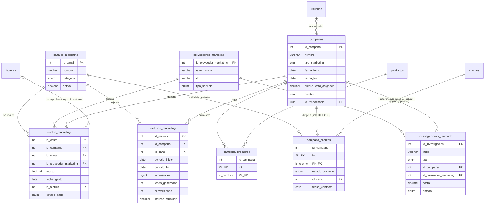
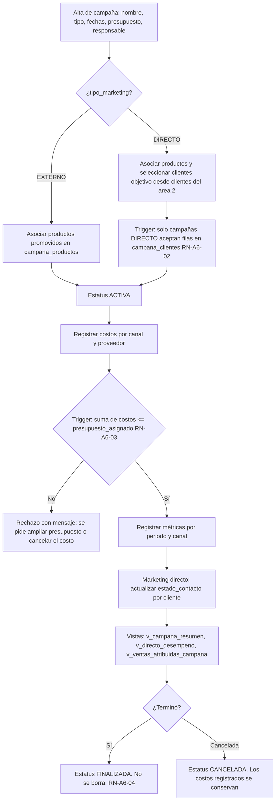

# Área 6 — Costo, registro e investigación de marketing externo y directo a clientes

> **Documento de contexto del área 6.** Fuente de verdad para el equipo y para cualquier agente de código que trabaje en esta área.
> Nace del **contrato operativo escrito por el equipo de Marketing** (`docs/area6-marketing/originales/contrato_equipo.md`, v1.0, 2026-09-11). Se conservan sus tablas, sus reglas, sus triggers, sus vistas y sus pantallas. Cada punto donde el proyecto global obligó a cambiar algo lleva una nota **Adaptado** que dice qué proponía el equipo, qué usa el proyecto y por qué.
> Ante contradicción entre este documento y el código, gana este documento. Ante contradicción con `PLAN.md`, gana `PLAN.md`.

| Campo | Valor |
| --- | --- |
| Proyecto | SIGFEVAK — Sistema de gestión, comercializadora nacional (México) |
| Área | 6 de 6 — Marketing externo y directo, costos e investigación de mercado |
| Etiqueta de issues | `area:6-marketing` |
| Prefijo de commits | `area6:` |
| Reglas de negocio | `RN-A6-01` … `RN-A6-16` |
| Equipo | 5 personas (1 líder + 4 integrantes) |
| Plazo | Domingo 13 a jueves 17 de septiembre de 2026 (5 días de trabajo) |
| Stack | React + Vite (JavaScript), supabase-js, PostgreSQL en Supabase, pnpm (PLAN.md D-01). Sin backend propio |
| Versión | 1.0 (adaptación del contrato v1.0 del equipo) |

---

## 0. Índice

1. Cómo debe usar este documento un agente
2. Contexto de negocio
3. Alcance
4. Modelo entidad-relación
5. Diccionario de datos
6. Flujos y decisión de diseño
7. Reglas de negocio
8. DDL y migraciones
9. Vistas y contratos con otras áreas
10. Ejemplo de cálculo
11. Equipo, roles y evaluación del líder
12. Cronograma de 5 días
13. Riesgos
14. Indicadores de éxito
15. Reporte final del líder
16. Preguntas abiertas
17. Glosario

---

## 1. Cómo debe usar este documento un agente

Las ocho reglas del contrato del equipo, alineadas al proyecto:

1. **Fuente única de verdad.** Este documento define esquema, reglas y alcance del área 6. Si el código lo contradice, el agente señala la discrepancia y corrige el código, nunca el documento en silencio.
2. **No inventes estructura.** Ninguna tabla, columna, relación, rol, enum o vista que no esté en las secciones 4, 5 y 9. Si una tarea lo requiere, se registra en la sección 16 y se escala al líder.
3. **Límite de escritura.** Solo escribes en las tablas que la sección 3 marca como propias del área 6. `clientes`, `facturas` (área 2), `productos` (área 3) y `usuarios` (coordinador) son de solo lectura: `SELECT`, nunca `INSERT`, `UPDATE` ni `DELETE`. Cambiar algo ahí es un issue `tipo:integracion`.
4. **El diseño se actualiza primero.** Todo cambio de esquema se refleja en las secciones 4, 5 y 7 en el mismo PR que la migración.
5. **Nombres exactos.** Los de la sección 5: español, `snake_case`, sin acentos. Sin traducciones ni sinónimos.
6. **RLS siempre activo.** Toda tabla del área nace con `ROW LEVEL SECURITY` y al menos la política mínima de la sección 8.
7. **Migraciones nuevas, nunca editadas.** Formato `AAAAMMDD_HHMM_a6_descripcion.sql`.
8. **Cita las reglas** `RN-A6-xx` en commits, comentarios y PR. Commits: `area6: <verbo> <objeto> (RN-A6-xx) #issue`. Sin ninguna mención a herramientas de IA (regla D-08 de `PLAN.md`).

> **Adaptado:** el equipo proponía "límite de escritura por schema `marketing`" y "versionado con changelog al final". El proyecto usa un solo schema `public` con límites por tabla (D-02) y el historial de cambios vive en git y en `ESTADO.md`; por eso la regla 3 habla de tablas y no de schemas, y no hay changelog en este archivo.

---

## 2. Contexto de negocio

La empresa es una **comercializadora mexicana con operación a nivel nacional**, dedicada a la compra, importación o producción y venta de productos electrónicos y de manufactura. El sistema se divide en seis áreas; ésta cubre la necesidad 6: **costo, registro e investigación de marketing externo y marketing directo a clientes**.

| # | Área | Responsable de |
| --- | --- | --- |
| 1 | Entradas y manufactura | Entradas de productos; valor, capital de inversión, volumen |
| 2 | Contabilidad y facturación | Facturas y clientes comercializadores |
| 3 | Inventario | Catálogo de productos, entradas y salidas, stock |
| 4 | Nómina de agentes | Sueldos, comisiones y bonos de agentes de venta |
| 5 | Fiscal y permisos | Licencias, permisos, impuestos aduanales y de gobierno |
| 6 | **Marketing** (este documento) | Costo, registro e investigación de marketing externo y directo |

> **Adaptado:** el contrato del equipo describía seis schemas de PostgreSQL (`inventario`, `contabilidad`, `productos`, `rh`, `cumplimiento`, `marketing`) y una tabla `public.perfiles` de roles. El proyecto usa **un solo schema `public`** con fronteras lógicas por tabla (D-02) y la tabla global `usuarios` del coordinador para roles. La separación que el equipo quería se conserva: cada tabla tiene un área dueña y las demás solo leen.

**Relación de Marketing con las otras áreas.** Marketing **lee** (nunca escribe) el catálogo de clientes del área 2 para el marketing directo, el catálogo de productos del área 3 para saber qué se promueve, y las facturas pagadas del área 2 para atribuir ventas a una campaña. Puede leer el desempeño por zona del área 4 para dirigir campañas. No tiene relación funcional con el área 1 ni con el área 5.

**Dos formas de hacer marketing, y por qué importan en el diseño:**

- **Marketing externo:** acciones dirigidas al mercado general sin identificar destinatarios (TV, radio, redes, eventos). Se mide con métricas agregadas: impresiones, alcance, clics, leads, conversiones, ingreso atribuido.
- **Marketing directo:** acciones dirigidas a clientes identificados individualmente (correo, WhatsApp, llamada, visita). Se mide por cliente: a quién se contactó, qué respondió, si compró.

La distinción no es un campo de texto: define qué tablas participan y qué vistas aplican (sección 6).

---

## 3. Alcance

### Dentro del alcance (5 días)

- Catálogos de canales y proveedores de marketing.
- Campañas con tipo (externo o directo), objetivo, fechas, presupuesto, estado y responsable.
- Costos por campaña, canal y proveedor, con validación de presupuesto en la base.
- Métricas por campaña y canal por periodo.
- Productos promovidos por campaña.
- Clientes objetivo de campañas directas con seguimiento de contacto por cliente.
- Investigaciones de mercado con ciclo de vida propio, ligadas o no a una campaña.
- Vistas: resumen de campaña con gasto, presupuesto restante y ROI; costos por canal; desempeño del marketing directo; ventas atribuidas reales desde facturas pagadas.
- Cinco pantallas descritas en la sección 6.3, construidas con los componentes compartidos de `docs/GUIA_ESTILO.md`.

### Fuera del alcance (se declara explícitamente)

- **Integración con Meta Ads, Google Ads, Mailchimp o cualquier plataforma externa.** Las métricas se capturan a mano o se importan por CSV; `fuente_dato` registra de dónde vinieron.
- **Envío real de correos, SMS o WhatsApp.** Solo se registra el contacto.
- **Carga de archivos a Supabase Storage.** `url_reporte` guarda un enlace; el archivo vive donde el equipo decida.
- Kardex y movimientos de inventario (área 3), facturación y pólizas (área 2), nómina (área 4), permisos e impuestos (área 5).

### Tablas por nivel de acceso

| Tabla | Acceso del área 6 | Dueño |
| --- | --- | --- |
| `canales_marketing`, `proveedores_marketing`, `campanas`, `costos_marketing`, `metricas_marketing`, `campana_productos`, `campana_clientes`, `investigaciones_mercado` | Escritura total | Área 6 |
| `clientes` | Solo lectura (selector de clientes objetivo; vista `v_clientes_activos` cuando exista) | Área 2 |
| `facturas` | Solo lectura (ventas atribuidas y referencia de factura de un costo) | Área 2 |
| `productos` | Solo lectura (selector de productos promovidos) | Área 3 |
| `v_rotacion` | Solo lectura (productos de baja rotación candidatos a campaña) | Área 3 |
| `v_desempeno_agente_zona` | Solo lectura (dirigir campañas por zona) | Área 4 |
| `usuarios` | Solo lectura (responsable de campaña, quién creó) | Coordinador |

> **Adaptado:** el contrato del equipo listaba `contabilidad.clientes` y `productos.productos` con FK cross-schema y "referencia suave" a facturas. En `public` las FK son reales y directas: `clientes(id_cliente)`, `productos(id_producto)`, `facturas(id_factura)`, todas de tipo `INT`. La pregunta abierta #1 del equipo (¿cuál es la PK de clientes?) queda respondida.

---

## 4. Modelo entidad-relación

Las ocho tablas del contrato del equipo, con nombres únicos en `public` y llaves enteras.



### Cardinalidades en texto

| Relación | Cardinalidad |
| --- | --- |
| `campanas` → `costos_marketing` | 1 campaña : N costos |
| `campanas` → `metricas_marketing` | 1 campaña : N métricas |
| `canales_marketing` → `costos_marketing` | 1 canal : N costos |
| `canales_marketing` → `metricas_marketing` | 1 canal : N métricas (canal opcional = métrica agregada de la campaña) |
| `proveedores_marketing` → `costos_marketing` | 1 proveedor : N costos (opcional; nulo = gasto interno) |
| `campanas` ↔ `productos` | N : M vía `campana_productos` |
| `campanas` ↔ `clientes` | N : M vía `campana_clientes`, solo campañas `DIRECTO` |
| `campanas` → `investigaciones_mercado` | 1 : N opcional; una investigación puede no tener campaña |
| `proveedores_marketing` → `investigaciones_mercado` | 1 : N opcional |
| `facturas` → `costos_marketing` | 1 : N opcional (comprobante del gasto) |

### Sustitución de las tablas marcador del modelo base

El modelo base del área 3 definió `marketing` (id_campana, id_producto, tipo, costo, clientes_alcanzados, roi) y `clientes_marketing` (id_cliente, id_campana) como **marcadores** del área 6. Este diseño las **sustituye**: `campanas` + `campana_productos` reemplazan a `marketing` (una campaña promueve N productos, no uno; el costo y el ROI se derivan, no se almacenan), y `campana_clientes` reemplaza a `clientes_marketing` (agrega estado de contacto, canal y fecha). Es la integración I-09 con el área 3: su migración base no crea esas dos tablas, o las crea con este diseño.

---

## 5. Diccionario de datos

> **Adaptado (aplica a todas las tablas):** el equipo proponía llaves `uuid` con `gen_random_uuid()` y columnas `created_at` / `updated_at`. El proyecto usa `INT GENERATED ALWAYS AS IDENTITY` con nombre `id_<entidad>` y columnas `creado_en` / `actualizado_en`, por consistencia con las otras cinco áreas (D-06). Las referencias a usuarios sí son `UUID` porque `usuarios.id_usuario` es el `id` de Supabase Auth.

### `canales_marketing`

| Columna | Tipo | Nulo | Default | Descripción |
| --- | --- | --- | --- | --- |
| `id_canal` | INT | No | identidad | PK |
| `nombre` | VARCHAR(100) | No | — | Único. TV, Radio, Redes sociales, Correo, WhatsApp, Evento, etc. |
| `categoria` | `categoria_canal` | No | — | `TRADICIONAL`, `DIGITAL`, `DIRECTO`, `EVENTOS` |
| `descripcion` | TEXT | Sí | — | Detalle libre |
| `activo` | BOOLEAN | No | `true` | Baja lógica |
| `creado_en`, `actualizado_en` | TIMESTAMPTZ | No | `now()` | Auditoría; `actualizado_en` lo mantiene un trigger (RN-A6-09) |

### `proveedores_marketing`

| Columna | Tipo | Nulo | Default | Descripción |
| --- | --- | --- | --- | --- |
| `id_proveedor_marketing` | INT | No | identidad | PK |
| `razon_social` | VARCHAR(200) | No | — | Agencia, medio o proveedor |
| `rfc` | VARCHAR(13) | Sí | — | Persona física o moral |
| `tipo_servicio` | `tipo_proveedor_marketing` | No | — | `AGENCIA`, `MEDIO`, `FREELANCER`, `PLATAFORMA_DIGITAL`, `ESTUDIO_MERCADO`, `OTRO` |
| `contacto_nombre`, `contacto_email`, `contacto_telefono` | VARCHAR | Sí | — | Datos de contacto |
| `activo` | BOOLEAN | No | `true` | Baja lógica |
| `creado_en`, `actualizado_en` | TIMESTAMPTZ | No | `now()` | Auditoría |

> **Adaptado:** el equipo la llamaba `marketing.proveedores`. El área 1 ya es dueña de `proveedores` (proveedores de mercancía) en `public`; para no chocar se llama `proveedores_marketing`.

### `campanas` (entidad central)

| Columna | Tipo | Nulo | Default | Descripción |
| --- | --- | --- | --- | --- |
| `id_campana` | INT | No | identidad | PK |
| `nombre` | VARCHAR(200) | No | — | |
| `tipo_marketing` | `tipo_marketing` | No | — | `EXTERNO` (mercado general) o `DIRECTO` (clientes identificados). Enum del modelo base |
| `objetivo` | TEXT | Sí | — | Objetivo de negocio |
| `descripcion` | TEXT | Sí | — | |
| `fecha_inicio` | DATE | No | — | |
| `fecha_fin` | DATE | Sí | — | Si existe, ≥ `fecha_inicio` (RN-A6-10) |
| `presupuesto_asignado` | DECIMAL(14,2) | No | — | Techo de gasto autorizado, ≥ 0 |
| `moneda` | CHAR(3) | No | `'MXN'` | ISO 4217 |
| `estatus` | `estatus_campana` | No | `'PLANEADA'` | `PLANEADA`, `ACTIVA`, `PAUSADA`, `FINALIZADA`, `CANCELADA` |
| `id_responsable` | UUID | Sí | — | FK → `usuarios(id_usuario)`; quien administra la campaña |
| `creado_por` | UUID | Sí | — | FK → `usuarios(id_usuario)` |
| `creado_en`, `actualizado_en` | TIMESTAMPTZ | No | `now()` | Auditoría |

### `costos_marketing`

| Columna | Tipo | Nulo | Default | Descripción |
| --- | --- | --- | --- | --- |
| `id_costo` | INT | No | identidad | PK |
| `id_campana` | INT | No | — | FK → `campanas`, `ON DELETE RESTRICT` (RN-A6-04) |
| `id_canal` | INT | No | — | FK → `canales_marketing` |
| `id_proveedor_marketing` | INT | Sí | — | FK → `proveedores_marketing`; nulo = gasto interno |
| `concepto` | VARCHAR(200) | No | — | |
| `monto` | DECIMAL(14,2) | No | — | > 0 |
| `moneda` | CHAR(3) | No | `'MXN'` | |
| `fecha_gasto` | DATE | No | — | |
| `id_factura` | INT | Sí | — | FK → `facturas(id_factura)` del área 2, solo lectura; comprobante del gasto cuando el proveedor facturó |
| `estado_pago` | `estado_pago` | No | `'PENDIENTE'` | Enum del modelo base: `PENDIENTE`, `PARCIAL`, `PAGADO`, `CANCELADO` |
| `creado_en`, `actualizado_en` | TIMESTAMPTZ | No | `now()` | Auditoría |

> **Adaptado:** el equipo dejó `referencia_factura_id uuid` como "referencia suave" porque no sabía cómo era `facturas`. En `public` es `id_factura INT` con FK real y opcional. La pregunta abierta #2 del equipo queda respondida: FK real, solo lectura, sin obligación de llenarla.

### `metricas_marketing`

| Columna | Tipo | Nulo | Default | Descripción |
| --- | --- | --- | --- | --- |
| `id_metrica` | INT | No | identidad | PK |
| `id_campana` | INT | No | — | FK → `campanas`, `ON DELETE CASCADE` |
| `id_canal` | INT | Sí | — | FK → `canales_marketing`; nulo = métrica agregada de toda la campaña |
| `periodo_inicio`, `periodo_fin` | DATE | No | — | Ventana que cubre la métrica; `fin ≥ inicio` |
| `impresiones`, `alcance`, `clics` | BIGINT | No | `0` | |
| `leads_generados`, `conversiones` | INT | No | `0` | |
| `ingreso_atribuido` | DECIMAL(14,2) | No | `0` | Ingreso estimado que el equipo atribuye a la campaña (dato capturado). La atribución **real** sale de facturas pagadas en `v_ventas_atribuidas_campana` (RN-A6-14) |
| `fuente_dato` | VARCHAR(100) | Sí | — | `Meta Ads`, `Google Analytics`, `CRM interno`, `Manual` |
| `creado_en`, `actualizado_en` | TIMESTAMPTZ | No | `now()` | Auditoría |

### `campana_productos` (unión con el área 3)

| Columna | Tipo | Nulo | Descripción |
| --- | --- | --- | --- |
| `id_campana` | INT | No | FK → `campanas`, `ON DELETE CASCADE`; parte de la PK |
| `id_producto` | INT | No | FK → `productos(id_producto)` del área 3; parte de la PK |
| `creado_en` | TIMESTAMPTZ | No | Auditoría |

### `campana_clientes` (unión con el área 2) — tabla agregada #1 del equipo

| Columna | Tipo | Nulo | Default | Descripción |
| --- | --- | --- | --- | --- |
| `id_campana` | INT | No | — | FK → `campanas`, `ON DELETE CASCADE`; parte de la PK |
| `id_cliente` | INT | No | — | FK → `clientes(id_cliente)` del área 2; parte de la PK |
| `id_canal` | INT | Sí | — | Canal usado para contactar a este cliente |
| `fecha_contacto` | DATE | Sí | — | |
| `estado_contacto` | `estado_contacto` | No | `'OBJETIVO'` | `OBJETIVO`, `CONTACTADO`, `RESPONDIO`, `CONVERTIDO`, `NO_INTERESADO` |
| `notas` | TEXT | Sí | — | |
| `creado_en`, `actualizado_en` | TIMESTAMPTZ | No | `now()` | Auditoría |

### `investigaciones_mercado` — tabla agregada #2 del equipo

| Columna | Tipo | Nulo | Default | Descripción |
| --- | --- | --- | --- | --- |
| `id_investigacion` | INT | No | identidad | PK |
| `titulo` | VARCHAR(200) | No | — | |
| `tipo` | `tipo_investigacion` | No | — | `ENCUESTA`, `FOCUS_GROUP`, `ANALISIS_MERCADO`, `BENCHMARKING_COMPETENCIA`, `ESTUDIO_SATISFACCION`, `OTRO` |
| `id_campana` | INT | Sí | — | FK → `campanas`, `ON DELETE SET NULL`; nulo = investigación independiente (RN-A6-16) |
| `objetivo`, `metodologia` | TEXT | Sí | — | |
| `tamano_muestra` | INT | Sí | — | |
| `id_proveedor_marketing` | INT | Sí | — | FK → `proveedores_marketing`, si fue tercerizada |
| `costo` | DECIMAL(14,2) | No | `0` | |
| `fecha_inicio`, `fecha_fin` | DATE | Sí | — | |
| `estado` | `estado_investigacion` | No | `'PLANEADA'` | `PLANEADA`, `EN_CURSO`, `FINALIZADA`, `CANCELADA` |
| `resumen_hallazgos` | TEXT | Sí | — | |
| `url_reporte` | TEXT | Sí | — | Enlace al reporte |
| `creado_por` | UUID | Sí | — | FK → `usuarios(id_usuario)` |
| `creado_en`, `actualizado_en` | TIMESTAMPTZ | No | `now()` | Auditoría |

### Valores ENUM del área 6

| Tipo | Valores | Origen |
| --- | --- | --- |
| `tipo_marketing` | `EXTERNO`, `DIRECTO` | Modelo base (área 3); se reutiliza |
| `estado_pago` | `PENDIENTE`, `PARCIAL`, `PAGADO`, `CANCELADO` | Modelo base (área 2); se reutiliza en `costos_marketing` |
| `categoria_canal` | `TRADICIONAL`, `DIGITAL`, `DIRECTO`, `EVENTOS` | Área 6 |
| `tipo_proveedor_marketing` | `AGENCIA`, `MEDIO`, `FREELANCER`, `PLATAFORMA_DIGITAL`, `ESTUDIO_MERCADO`, `OTRO` | Área 6 |
| `estatus_campana` | `PLANEADA`, `ACTIVA`, `PAUSADA`, `FINALIZADA`, `CANCELADA` | Área 6 |
| `estado_contacto` | `OBJETIVO`, `CONTACTADO`, `RESPONDIO`, `CONVERTIDO`, `NO_INTERESADO` | Área 6 |
| `tipo_investigacion` | `ENCUESTA`, `FOCUS_GROUP`, `ANALISIS_MERCADO`, `BENCHMARKING_COMPETENCIA`, `ESTUDIO_SATISFACCION`, `OTRO` | Área 6 |
| `estado_investigacion` | `PLANEADA`, `EN_CURSO`, `FINALIZADA`, `CANCELADA` | Área 6 |

> **Adaptado:** el equipo prefería `varchar + CHECK` en vez de enums nativos "para facilitar migraciones futuras sin `ALTER TYPE`". Es un argumento válido; el proyecto eligió enums nativos en las seis áreas por consistencia y porque `docs/MODELO_DATOS.md` los registra como contrato. Agregar un valor es una migración nueva con `ALTER TYPE ... ADD VALUE`, que sí existe y no bloquea. **No agregues valores sin registrarlos en `MODELO_DATOS.md`.**

---

## 6. Flujos y decisión de diseño

### 6.1 Ciclo de una campaña



### 6.2 Decisión de diseño del equipo: por qué se agregaron dos tablas

Texto conservado del contrato del equipo, con los nombres adaptados.

El diseño inicial "obvio" cubre solo el ciclo básico de una campaña: `canales_marketing`, `proveedores_marketing`, `campanas`, `costos_marketing`, `metricas_marketing` y `campana_productos` (seis tablas). Al analizar a fondo el requerimiento de negocio, *"costo, registro **e investigación** de marketing externo **y marketing directo a clientes**"*, se identificaron dos necesidades que ese diseño no resolvía bien.

**Tabla agregada #1: `campana_clientes`.** El requerimiento distingue explícitamente entre marketing externo (mercado general) y directo (personas identificadas). Con el diseño inicial esa distinción vivía solo en `tipo_marketing`, pero no había forma de saber a qué clientes específicos se dirigió una campaña directa ni de dar seguimiento a su respuesta individual. Se descartó guardar un arreglo de clientes en `campanas` (rompe integridad referencial, no permite estado por cliente, dificulta el reporteo) y duplicar datos del cliente (viola la fuente única de verdad: el área 2 es dueña de `clientes`). La decisión fue una tabla de unión con FK real a `clientes` y atributos propios de marketing: `estado_contacto`, `id_canal`, `fecha_contacto`, `notas`. Habilita el reporte de efectividad del marketing directo (`v_directo_desempeno`) sin invadir el dominio del área 2.

**Tabla agregada #2: `investigaciones_mercado`.** La investigación de mercado (estudios, encuestas, benchmarking) es una actividad distinta de ejecutar una campaña: tiene su propio ciclo de vida, metodología, tamaño de muestra y hallazgos, y muchas veces no está ligada a ninguna campaña (un estudio exploratorio antes de decidir si se lanza una). Se descartó agregar campos opcionales a `campanas` (infla la tabla central, mezcla dos procesos con reglas distintas) y registrar la investigación como un costo más (pierde toda la información cualitativa). La decisión fue una tabla propia con `id_campana` opcional (`ON DELETE SET NULL`).

**Nota de diseño adicional del equipo:** el responsable de una campaña referencia al usuario del sistema, no a un empleado de nómina, para no acoplar el avance de marketing al del área 4. Se conserva: `id_responsable` → `usuarios`, no `agentes_ventas`. Ver pregunta abierta 4.

### 6.3 Pantallas del módulo (sección 14 del contrato del equipo, mapeada a los componentes compartidos)

Todas las pantallas usan exclusivamente los componentes de `src/components/` y los tokens de `docs/GUIA_ESTILO.md`.

| Pantalla | Contenido | Componentes |
| --- | --- | --- |
| **1. Dashboard de marketing** | KPI: presupuesto total del periodo, gasto ejercido, % ejercido, leads, conversiones, ROI promedio. Gráfica de gasto por canal (`v_costos_por_canal`). Campañas activas vs finalizadas por tipo. Tabla de campañas recientes con nombre, tipo, estado y presupuesto restante (`v_campana_resumen`). Filtro por rango de fechas | Fila de `KpiCard`, `Panel` con la gráfica de barras del repo, `Panel` con `Table`, `Tag` para tipo y estado |
| **2. Campañas** | Listado filtrable por tipo, estado, canal y fechas; botón "+ Nueva campaña" en la topbar. Detalle por pestañas: información general; costos (tabla, alta, total vs presupuesto); métricas por periodo; clientes objetivo (solo `DIRECTO`, selector desde `clientes`, estado por cliente); productos promovidos (selector desde `productos`) | `Panel` + `Table`, formulario base de la guía, `StatusBadge` con mapa `{ACTIVA: up, PAUSADA: accent, FINALIZADA: muted, CANCELADA: down, PLANEADA: muted}` |
| **3. Costos** | Tabla global de gastos con filtros por proveedor, canal y campaña; totales por periodo | `Panel` + `Table`, `Mono` para montos |
| **4. Investigación de mercado** | Listado de estudios con tipo, estado y campaña asociada. Detalle: metodología, muestra, hallazgos, enlace al reporte | `Panel` + `Table`, `Tag` por tipo |
| **5. Catálogos** (rol `ADMINISTRADOR`) | Alta, edición y baja lógica de canales y proveedores de marketing | `Panel` + `Table` + formulario base |

---

## 7. Reglas de negocio

Las diez reglas del contrato del equipo en el mismo orden (RN-A6-01 a RN-A6-10), más seis que exige la integración con el resto del sistema.

| ID | Regla | Dónde se implementa |
| --- | --- | --- |
| **RN-A6-01** | Toda campaña declara `tipo_marketing` (`EXTERNO` o `DIRECTO`) desde su creación. | `NOT NULL` + enum |
| **RN-A6-02** | Solo campañas `DIRECTO` pueden tener filas en `campana_clientes`. Se valida con trigger, no solo por convención. | Trigger `fn_a6_validar_campana_directa` |
| **RN-A6-03** | La suma de `costos_marketing.monto` de una campaña no puede exceder `campanas.presupuesto_asignado`. Se valida al insertar o actualizar un costo. | Trigger `fn_a6_validar_presupuesto` |
| **RN-A6-04** | No se borra físicamente una campaña que ya tiene costos (`ON DELETE RESTRICT`). Para "eliminarla" se pone `estatus = 'CANCELADA'`. | FK + convención |
| **RN-A6-05** | Solo usuarios con rol `MARKETING` o `ADMINISTRADOR` crean o editan campañas, costos, métricas e investigaciones. Los demás roles solo leen. | Políticas RLS de endurecimiento (sección 8) |
| **RN-A6-06** | Solo `ADMINISTRADOR` borra registros donde el borrado está permitido y administra los catálogos de canales y proveedores. | Políticas RLS de endurecimiento |
| **RN-A6-07** | `id_producto` en `campana_productos` e `id_cliente` en `campana_clientes` deben existir en `productos` y `clientes`. | Llaves foráneas |
| **RN-A6-08** | Si el área 2 o el área 3 dan de baja un cliente o producto referenciado por marketing, usan baja lógica (`activo = false`), no `DELETE`. | Acuerdo con áreas 2 y 3 (I-10) |
| **RN-A6-09** | `actualizado_en` se mantiene por trigger; ninguna aplicación lo escribe. | Trigger `fn_a6_set_actualizado_en` |
| **RN-A6-10** | `fecha_fin` de una campaña, si existe, no es anterior a `fecha_inicio`. | `CHECK` |
| **RN-A6-11** | El costo total de una campaña es siempre la suma de sus costos; nunca se almacena en `campanas`. | Vista `v_campana_resumen` |
| **RN-A6-12** | El ROI se calcula en vista, nunca se almacena. ROI = (ingreso − gasto) / gasto; nulo si el gasto es cero. | Vista `v_campana_resumen` |
| **RN-A6-13** | Una campaña `FINALIZADA` o `CANCELADA` no acepta costos ni métricas nuevos. | Trigger `fn_a6_bloquea_campana_cerrada` |
| **RN-A6-14** | Las ventas atribuidas **reales** de una campaña `DIRECTO` son las facturas con `estado_pago = 'PAGADO'` de sus clientes objetivo, con fecha dentro de la vigencia de la campaña. `ingreso_atribuido` de métricas es el estimado del equipo; la vista muestra ambos. | Vista `v_ventas_atribuidas_campana` |
| **RN-A6-15** | Una campaña `DIRECTO` que pasa a `ACTIVA` debe tener al menos un cliente objetivo. | Trigger `fn_a6_valida_activacion` |
| **RN-A6-16** | Una investigación puede existir sin campaña; si su campaña se borra, la investigación se conserva con `id_campana` nulo. | FK `ON DELETE SET NULL` |

---

## 8. DDL y migraciones

Estado objetivo en PostgreSQL, schema `public`. En el repo se divide en migraciones `AAAAMMDD_HHMM_a6_*.sql` (sección 12). Todo es aditivo respecto al modelo base salvo la sustitución de las tablas marcador (I-09).

```sql
-- ---------- TIPOS (RN-A6-01) ----------
-- tipo_marketing y estado_pago ya existen en el modelo base; no se recrean.
CREATE TYPE categoria_canal           AS ENUM ('TRADICIONAL','DIGITAL','DIRECTO','EVENTOS');
CREATE TYPE tipo_proveedor_marketing  AS ENUM ('AGENCIA','MEDIO','FREELANCER','PLATAFORMA_DIGITAL','ESTUDIO_MERCADO','OTRO');
CREATE TYPE estatus_campana           AS ENUM ('PLANEADA','ACTIVA','PAUSADA','FINALIZADA','CANCELADA');
CREATE TYPE estado_contacto           AS ENUM ('OBJETIVO','CONTACTADO','RESPONDIO','CONVERTIDO','NO_INTERESADO');
CREATE TYPE tipo_investigacion        AS ENUM ('ENCUESTA','FOCUS_GROUP','ANALISIS_MERCADO','BENCHMARKING_COMPETENCIA','ESTUDIO_SATISFACCION','OTRO');
CREATE TYPE estado_investigacion      AS ENUM ('PLANEADA','EN_CURSO','FINALIZADA','CANCELADA');

-- ---------- CATÁLOGOS ----------
CREATE TABLE canales_marketing (
    id_canal       INT GENERATED ALWAYS AS IDENTITY PRIMARY KEY,
    nombre         VARCHAR(100) NOT NULL UNIQUE,
    categoria      categoria_canal NOT NULL,
    descripcion    TEXT,
    activo         BOOLEAN NOT NULL DEFAULT TRUE,
    creado_en      TIMESTAMPTZ NOT NULL DEFAULT NOW(),
    actualizado_en TIMESTAMPTZ NOT NULL DEFAULT NOW()
);

CREATE TABLE proveedores_marketing (
    id_proveedor_marketing INT GENERATED ALWAYS AS IDENTITY PRIMARY KEY,
    razon_social      VARCHAR(200) NOT NULL,
    rfc               VARCHAR(13),
    tipo_servicio     tipo_proveedor_marketing NOT NULL,
    contacto_nombre   VARCHAR(150),
    contacto_email    VARCHAR(150),
    contacto_telefono VARCHAR(20),
    activo            BOOLEAN NOT NULL DEFAULT TRUE,
    creado_en         TIMESTAMPTZ NOT NULL DEFAULT NOW(),
    actualizado_en    TIMESTAMPTZ NOT NULL DEFAULT NOW()
);

-- ---------- NÚCLEO ----------
CREATE TABLE campanas (
    id_campana           INT GENERATED ALWAYS AS IDENTITY PRIMARY KEY,
    nombre               VARCHAR(200) NOT NULL,
    tipo_marketing       tipo_marketing NOT NULL,                        -- RN-A6-01
    objetivo             TEXT,
    descripcion          TEXT,
    fecha_inicio         DATE NOT NULL,
    fecha_fin            DATE,
    presupuesto_asignado DECIMAL(14,2) NOT NULL CHECK (presupuesto_asignado >= 0),
    moneda               CHAR(3) NOT NULL DEFAULT 'MXN',
    estatus              estatus_campana NOT NULL DEFAULT 'PLANEADA',
    id_responsable       UUID REFERENCES usuarios(id_usuario),
    creado_por           UUID REFERENCES usuarios(id_usuario),
    creado_en            TIMESTAMPTZ NOT NULL DEFAULT NOW(),
    actualizado_en       TIMESTAMPTZ NOT NULL DEFAULT NOW(),
    CONSTRAINT ck_campana_fechas CHECK (fecha_fin IS NULL OR fecha_fin >= fecha_inicio)   -- RN-A6-10
);

CREATE TABLE costos_marketing (
    id_costo               INT GENERATED ALWAYS AS IDENTITY PRIMARY KEY,
    id_campana             INT NOT NULL REFERENCES campanas(id_campana) ON DELETE RESTRICT,   -- RN-A6-04
    id_canal               INT NOT NULL REFERENCES canales_marketing(id_canal),
    id_proveedor_marketing INT REFERENCES proveedores_marketing(id_proveedor_marketing),
    concepto               VARCHAR(200) NOT NULL,
    monto                  DECIMAL(14,2) NOT NULL CHECK (monto > 0),
    moneda                 CHAR(3) NOT NULL DEFAULT 'MXN',
    fecha_gasto            DATE NOT NULL,
    id_factura             INT REFERENCES facturas(id_factura),          -- área 2, solo lectura
    estado_pago            estado_pago NOT NULL DEFAULT 'PENDIENTE',
    creado_en              TIMESTAMPTZ NOT NULL DEFAULT NOW(),
    actualizado_en         TIMESTAMPTZ NOT NULL DEFAULT NOW()
);

CREATE TABLE metricas_marketing (
    id_metrica        INT GENERATED ALWAYS AS IDENTITY PRIMARY KEY,
    id_campana        INT NOT NULL REFERENCES campanas(id_campana) ON DELETE CASCADE,
    id_canal          INT REFERENCES canales_marketing(id_canal),
    periodo_inicio    DATE NOT NULL,
    periodo_fin       DATE NOT NULL,
    impresiones       BIGINT NOT NULL DEFAULT 0,
    alcance           BIGINT NOT NULL DEFAULT 0,
    clics             BIGINT NOT NULL DEFAULT 0,
    leads_generados   INT NOT NULL DEFAULT 0,
    conversiones      INT NOT NULL DEFAULT 0,
    ingreso_atribuido DECIMAL(14,2) NOT NULL DEFAULT 0,
    fuente_dato       VARCHAR(100),
    creado_en         TIMESTAMPTZ NOT NULL DEFAULT NOW(),
    actualizado_en    TIMESTAMPTZ NOT NULL DEFAULT NOW(),
    CONSTRAINT ck_metrica_periodo CHECK (periodo_fin >= periodo_inicio)
);

CREATE TABLE investigaciones_mercado (
    id_investigacion       INT GENERATED ALWAYS AS IDENTITY PRIMARY KEY,
    titulo                 VARCHAR(200) NOT NULL,
    tipo                   tipo_investigacion NOT NULL,
    id_campana             INT REFERENCES campanas(id_campana) ON DELETE SET NULL,   -- RN-A6-16
    objetivo               TEXT,
    metodologia            TEXT,
    tamano_muestra         INT,
    id_proveedor_marketing INT REFERENCES proveedores_marketing(id_proveedor_marketing),
    costo                  DECIMAL(14,2) NOT NULL DEFAULT 0,
    fecha_inicio           DATE,
    fecha_fin              DATE,
    estado                 estado_investigacion NOT NULL DEFAULT 'PLANEADA',
    resumen_hallazgos      TEXT,
    url_reporte            TEXT,
    creado_por             UUID REFERENCES usuarios(id_usuario),
    creado_en              TIMESTAMPTZ NOT NULL DEFAULT NOW(),
    actualizado_en         TIMESTAMPTZ NOT NULL DEFAULT NOW()
);

-- ---------- UNIONES CON OTRAS ÁREAS (RN-A6-07) ----------
CREATE TABLE campana_productos (
    id_campana  INT NOT NULL REFERENCES campanas(id_campana) ON DELETE CASCADE,
    id_producto INT NOT NULL REFERENCES productos(id_producto),          -- área 3, solo lectura
    creado_en   TIMESTAMPTZ NOT NULL DEFAULT NOW(),
    PRIMARY KEY (id_campana, id_producto)
);

CREATE TABLE campana_clientes (
    id_campana      INT NOT NULL REFERENCES campanas(id_campana) ON DELETE CASCADE,
    id_cliente      INT NOT NULL REFERENCES clientes(id_cliente),        -- área 2, solo lectura
    id_canal        INT REFERENCES canales_marketing(id_canal),
    fecha_contacto  DATE,
    estado_contacto estado_contacto NOT NULL DEFAULT 'OBJETIVO',
    notas           TEXT,
    creado_en       TIMESTAMPTZ NOT NULL DEFAULT NOW(),
    actualizado_en  TIMESTAMPTZ NOT NULL DEFAULT NOW(),
    PRIMARY KEY (id_campana, id_cliente)
);

-- ---------- ÍNDICES ----------
CREATE INDEX ix_campanas_estatus          ON campanas(estatus);
CREATE INDEX ix_campanas_tipo             ON campanas(tipo_marketing);
CREATE INDEX ix_campanas_fechas           ON campanas(fecha_inicio, fecha_fin);
CREATE INDEX ix_costos_mkt_campana        ON costos_marketing(id_campana);
CREATE INDEX ix_costos_mkt_canal          ON costos_marketing(id_canal);
CREATE INDEX ix_costos_mkt_fecha          ON costos_marketing(fecha_gasto);
CREATE INDEX ix_metricas_mkt_campana      ON metricas_marketing(id_campana);
CREATE INDEX ix_metricas_mkt_periodo      ON metricas_marketing(periodo_inicio);
CREATE INDEX ix_campana_productos_prod    ON campana_productos(id_producto);
CREATE INDEX ix_campana_clientes_cli      ON campana_clientes(id_cliente);
CREATE INDEX ix_investigaciones_campana   ON investigaciones_mercado(id_campana);
```

### Triggers

```sql
-- RN-A6-09: actualizado_en automático (conservado del contrato del equipo)
CREATE OR REPLACE FUNCTION fn_a6_set_actualizado_en()
RETURNS TRIGGER LANGUAGE plpgsql AS $$
BEGIN
    NEW.actualizado_en = NOW();
    RETURN NEW;
END; $$;

DO $$
DECLARE t TEXT;
BEGIN
    FOREACH t IN ARRAY ARRAY['canales_marketing','proveedores_marketing','campanas','costos_marketing',
                             'metricas_marketing','campana_clientes','investigaciones_mercado'] LOOP
        EXECUTE format('CREATE TRIGGER tg_%1$s_actualizado_en BEFORE UPDATE ON %1$I
                        FOR EACH ROW EXECUTE FUNCTION fn_a6_set_actualizado_en()', t);
    END LOOP;
END $$;

-- RN-A6-02: solo campañas DIRECTO aceptan clientes objetivo (conservado del contrato del equipo)
CREATE OR REPLACE FUNCTION fn_a6_validar_campana_directa()
RETURNS TRIGGER LANGUAGE plpgsql AS $$
DECLARE v_tipo tipo_marketing;
BEGIN
    SELECT tipo_marketing INTO v_tipo FROM campanas WHERE id_campana = NEW.id_campana;
    IF v_tipo IS DISTINCT FROM 'DIRECTO' THEN
        RAISE EXCEPTION 'RN-A6-02: la campaña % no es de tipo DIRECTO; no se pueden asignar clientes objetivo', NEW.id_campana;
    END IF;
    RETURN NEW;
END; $$;
CREATE TRIGGER tg_campana_clientes_valida_tipo
BEFORE INSERT ON campana_clientes
FOR EACH ROW EXECUTE FUNCTION fn_a6_validar_campana_directa();

-- RN-A6-03: los costos no exceden el presupuesto (conservado del contrato del equipo)
CREATE OR REPLACE FUNCTION fn_a6_validar_presupuesto()
RETURNS TRIGGER LANGUAGE plpgsql AS $$
DECLARE v_presupuesto DECIMAL(14,2); v_gasto DECIMAL(14,2);
BEGIN
    SELECT presupuesto_asignado INTO v_presupuesto FROM campanas WHERE id_campana = NEW.id_campana FOR UPDATE;
    SELECT COALESCE(SUM(monto), 0) INTO v_gasto FROM costos_marketing WHERE id_campana = NEW.id_campana;
    IF v_gasto > v_presupuesto THEN
        RAISE EXCEPTION 'RN-A6-03: el gasto total % excede el presupuesto asignado % de la campaña %',
            v_gasto, v_presupuesto, NEW.id_campana;
    END IF;
    RETURN NEW;
END; $$;
CREATE TRIGGER tg_costos_mkt_valida_presupuesto
AFTER INSERT OR UPDATE ON costos_marketing
FOR EACH ROW EXECUTE FUNCTION fn_a6_validar_presupuesto();

-- RN-A6-13: una campaña cerrada no acepta costos ni métricas
CREATE OR REPLACE FUNCTION fn_a6_bloquea_campana_cerrada()
RETURNS TRIGGER LANGUAGE plpgsql AS $$
DECLARE v_estatus estatus_campana;
BEGIN
    SELECT estatus INTO v_estatus FROM campanas WHERE id_campana = NEW.id_campana;
    IF v_estatus IN ('FINALIZADA','CANCELADA') THEN
        RAISE EXCEPTION 'RN-A6-13: la campaña % está %; no acepta registros nuevos', NEW.id_campana, v_estatus;
    END IF;
    RETURN NEW;
END; $$;
CREATE TRIGGER tg_costos_mkt_campana_cerrada BEFORE INSERT ON costos_marketing
FOR EACH ROW EXECUTE FUNCTION fn_a6_bloquea_campana_cerrada();
CREATE TRIGGER tg_metricas_mkt_campana_cerrada BEFORE INSERT ON metricas_marketing
FOR EACH ROW EXECUTE FUNCTION fn_a6_bloquea_campana_cerrada();

-- RN-A6-15: una campaña DIRECTO no se activa sin clientes objetivo
CREATE OR REPLACE FUNCTION fn_a6_valida_activacion()
RETURNS TRIGGER LANGUAGE plpgsql AS $$
BEGIN
    IF NEW.estatus = 'ACTIVA' AND NEW.tipo_marketing = 'DIRECTO'
       AND NOT EXISTS (SELECT 1 FROM campana_clientes WHERE id_campana = NEW.id_campana) THEN
        RAISE EXCEPTION 'RN-A6-15: la campaña DIRECTO % no tiene clientes objetivo; no se puede activar', NEW.id_campana;
    END IF;
    RETURN NEW;
END; $$;
CREATE TRIGGER tg_campanas_valida_activacion
BEFORE UPDATE OF estatus ON campanas
FOR EACH ROW EXECUTE FUNCTION fn_a6_valida_activacion();
```

> `FOR UPDATE` en `fn_a6_validar_presupuesto` bloquea la fila de la campaña durante la transacción: dos costos simultáneos no pueden pasar ambos la validación con el mismo saldo.

### Row Level Security

Punto de partida obligatorio del proyecto (todas las áreas): RLS activo con la política mínima para `authenticated`.

```sql
DO $$
DECLARE t TEXT;
BEGIN
    FOREACH t IN ARRAY ARRAY['canales_marketing','proveedores_marketing','campanas','costos_marketing',
                             'metricas_marketing','campana_productos','campana_clientes','investigaciones_mercado'] LOOP
        EXECUTE format('ALTER TABLE %I ENABLE ROW LEVEL SECURITY', t);
        EXECUTE format('CREATE POLICY p_%1$s_auth ON %1$I FOR ALL TO authenticated USING (true) WITH CHECK (true)', t);
    END LOOP;
END $$;
```

**Endurecimiento recomendado por el equipo (RN-A6-05, RN-A6-06).** Se aplica en el día 4 si el resto del sistema ya tiene `usuarios` poblada; sustituye la política mínima por políticas por rol.

```sql
-- Conservada del contrato del equipo, adaptada a la tabla global usuarios
CREATE OR REPLACE FUNCTION fn_a6_usuario_tiene_rol(roles_permitidos rol_usuario[])
RETURNS BOOLEAN LANGUAGE sql SECURITY DEFINER STABLE AS $$
    SELECT EXISTS (
        SELECT 1 FROM usuarios u
         WHERE u.id_usuario = auth.uid() AND u.rol = ANY(roles_permitidos) AND u.activo
    );
$$;

DO $$
DECLARE t TEXT;
BEGIN
    -- Transaccionales: todos leen; MARKETING y ADMINISTRADOR escriben; ADMINISTRADOR borra
    FOREACH t IN ARRAY ARRAY['campanas','costos_marketing','metricas_marketing',
                             'campana_productos','campana_clientes','investigaciones_mercado'] LOOP
        EXECUTE format('DROP POLICY IF EXISTS p_%1$s_auth ON %1$I', t);
        EXECUTE format('CREATE POLICY p_%1$s_select ON %1$I FOR SELECT TO authenticated USING (true)', t);
        EXECUTE format('CREATE POLICY p_%1$s_insert ON %1$I FOR INSERT TO authenticated
                        WITH CHECK (fn_a6_usuario_tiene_rol(ARRAY[''MARKETING'',''ADMINISTRADOR'']::rol_usuario[]))', t);
        EXECUTE format('CREATE POLICY p_%1$s_update ON %1$I FOR UPDATE TO authenticated
                        USING (fn_a6_usuario_tiene_rol(ARRAY[''MARKETING'',''ADMINISTRADOR'']::rol_usuario[]))
                        WITH CHECK (fn_a6_usuario_tiene_rol(ARRAY[''MARKETING'',''ADMINISTRADOR'']::rol_usuario[]))', t);
        EXECUTE format('CREATE POLICY p_%1$s_delete ON %1$I FOR DELETE TO authenticated
                        USING (fn_a6_usuario_tiene_rol(ARRAY[''ADMINISTRADOR'']::rol_usuario[]))', t);
    END LOOP;
    -- Catálogos: todos leen; solo ADMINISTRADOR administra
    FOREACH t IN ARRAY ARRAY['canales_marketing','proveedores_marketing'] LOOP
        EXECUTE format('DROP POLICY IF EXISTS p_%1$s_auth ON %1$I', t);
        EXECUTE format('CREATE POLICY p_%1$s_select ON %1$I FOR SELECT TO authenticated USING (true)', t);
        EXECUTE format('CREATE POLICY p_%1$s_admin ON %1$I FOR ALL TO authenticated
                        USING (fn_a6_usuario_tiene_rol(ARRAY[''ADMINISTRADOR'']::rol_usuario[]))
                        WITH CHECK (fn_a6_usuario_tiene_rol(ARRAY[''ADMINISTRADOR'']::rol_usuario[]))', t);
    END LOOP;
END $$;
```

> **Adaptado:** el equipo definía roles `marketing_admin`, `marketing_editor`, `marketing_viewer` y `admin_general` en `public.perfiles`. El proyecto tiene un solo enum `rol_usuario` para las seis áreas; `MARKETING` equivale a editor, `ADMINISTRADOR` a admin, y cualquier usuario autenticado equivale a viewer. La pregunta abierta #3 del equipo (quién gobierna los roles) queda respondida: el coordinador, en la tabla `usuarios`.

### Seed obligatorio

- 6 canales (TV, Radio, Redes sociales, Correo, WhatsApp, Evento) cubriendo las cuatro categorías.
- 3 proveedores de marketing de tipos distintos.
- 2 campañas `EXTERNO` y 2 `DIRECTO`, una de ellas `FINALIZADA`, con costos, métricas y productos.
- Clientes objetivo en las campañas `DIRECTO` con los cinco estados de contacto representados, ligados a clientes del seed del área 2.
- 2 investigaciones, una con campaña y una independiente.
- Datos suficientes para reproducir exacto el ejemplo de la sección 10.

---

## 9. Vistas y contratos con otras áreas

Las tres vistas del contrato del equipo se conservan; se agrega la de ventas atribuidas reales y una opcional sobre rotación.

```sql
-- Resumen de campaña: gasto, restante, % ejercido, métricas y ROI (RN-A6-11, RN-A6-12)
CREATE OR REPLACE VIEW v_campana_resumen AS
SELECT c.id_campana, c.nombre, c.tipo_marketing, c.estatus, c.fecha_inicio, c.fecha_fin,
       c.presupuesto_asignado,
       COALESCE(g.gasto_total, 0)                                            AS gasto_total,
       c.presupuesto_asignado - COALESCE(g.gasto_total, 0)                   AS presupuesto_restante,
       CASE WHEN c.presupuesto_asignado > 0
            THEN ROUND(COALESCE(g.gasto_total, 0) / c.presupuesto_asignado * 100, 2) ELSE 0 END AS pct_ejercido,
       COALESCE(m.leads_generados, 0)                                        AS leads_generados,
       COALESCE(m.conversiones, 0)                                           AS conversiones,
       COALESCE(m.ingreso_atribuido, 0)                                      AS ingreso_atribuido,
       CASE WHEN COALESCE(g.gasto_total, 0) > 0
            THEN ROUND((COALESCE(m.ingreso_atribuido, 0) - g.gasto_total) / g.gasto_total, 4)
            ELSE NULL END                                                    AS roi
FROM campanas c
LEFT JOIN (SELECT id_campana, SUM(monto) AS gasto_total FROM costos_marketing GROUP BY id_campana) g USING (id_campana)
LEFT JOIN (SELECT id_campana, SUM(leads_generados) AS leads_generados, SUM(conversiones) AS conversiones,
                  SUM(ingreso_atribuido) AS ingreso_atribuido
             FROM metricas_marketing GROUP BY id_campana) m USING (id_campana);

-- Gasto por canal
CREATE OR REPLACE VIEW v_costos_por_canal AS
SELECT ca.id_canal, ca.nombre AS canal, ca.categoria,
       COUNT(DISTINCT co.id_campana) AS campanas_relacionadas,
       COALESCE(SUM(co.monto), 0)    AS gasto_total
FROM canales_marketing ca
LEFT JOIN costos_marketing co USING (id_canal)
GROUP BY ca.id_canal, ca.nombre, ca.categoria
ORDER BY gasto_total DESC;

-- Desempeño del marketing directo por campaña
CREATE OR REPLACE VIEW v_directo_desempeno AS
SELECT c.id_campana, c.nombre,
       COUNT(cc.id_cliente)                                                                 AS total_objetivo,
       COUNT(cc.id_cliente) FILTER (WHERE cc.estado_contacto IN ('CONTACTADO','RESPONDIO','CONVERTIDO')) AS total_contactados,
       COUNT(cc.id_cliente) FILTER (WHERE cc.estado_contacto = 'CONVERTIDO')               AS total_convertidos,
       CASE WHEN COUNT(cc.id_cliente) > 0
            THEN ROUND(COUNT(cc.id_cliente) FILTER (WHERE cc.estado_contacto = 'CONVERTIDO')::numeric
                       / COUNT(cc.id_cliente) * 100, 2) ELSE 0 END                         AS tasa_conversion_pct
FROM campanas c
JOIN campana_clientes cc USING (id_campana)
WHERE c.tipo_marketing = 'DIRECTO'
GROUP BY c.id_campana, c.nombre;

-- Ventas atribuidas reales: facturas PAGADAS de los clientes objetivo dentro de la vigencia (RN-A6-14)
CREATE OR REPLACE VIEW v_ventas_atribuidas_campana AS
SELECT c.id_campana, c.nombre, c.tipo_marketing,
       COUNT(DISTINCT f.id_factura)          AS facturas_atribuidas,
       COALESCE(SUM(f.valor_total - f.iva), 0) AS ventas_atribuidas_sin_iva,
       COALESCE(g.gasto_total, 0)            AS gasto_total,
       CASE WHEN COALESCE(g.gasto_total, 0) > 0
            THEN ROUND((COALESCE(SUM(f.valor_total - f.iva), 0) - g.gasto_total) / g.gasto_total, 4)
            ELSE NULL END                    AS roi_real
FROM campanas c
LEFT JOIN campana_clientes cc USING (id_campana)
LEFT JOIN facturas f ON f.id_cliente = cc.id_cliente
                    AND f.estado_pago = 'PAGADO'
                    AND f.fecha >= c.fecha_inicio
                    AND f.fecha <= COALESCE(c.fecha_fin, CURRENT_DATE)
LEFT JOIN (SELECT id_campana, SUM(monto) AS gasto_total FROM costos_marketing GROUP BY id_campana) g USING (id_campana)
WHERE c.tipo_marketing = 'DIRECTO'
GROUP BY c.id_campana, c.nombre, c.tipo_marketing, g.gasto_total;

-- Opcional (si sobra tiempo): productos de baja rotación y si ya tienen campaña
CREATE OR REPLACE VIEW v_productos_baja_rotacion_campana AS
SELECT r.id_producto, r.nombre, r.tipo, r.stock, r.porcentaje_rotacion,
       COUNT(cp.id_campana) FILTER (WHERE c.estatus IN ('PLANEADA','ACTIVA')) AS campanas_vigentes
FROM v_rotacion r
LEFT JOIN campana_productos cp USING (id_producto)
LEFT JOIN campanas c USING (id_campana)
WHERE r.porcentaje_rotacion < 30
GROUP BY r.id_producto, r.nombre, r.tipo, r.stock, r.porcentaje_rotacion
ORDER BY r.porcentaje_rotacion;
```

> **Adaptado:** el equipo usaba `with (security_invoker = true)` en las vistas. Se omite mientras la política sea la mínima; se agrega en el día 4 junto con el endurecimiento de RLS, cuando las políticas por rol lo hagan relevante.

### Contratos de interfaz

| Área | Dirección | Qué | Vía |
| --- | --- | --- | --- |
| 2 | Área 6 **lee** | Clientes para campañas directas; facturas pagadas para ventas atribuidas; factura como comprobante de un costo | `clientes`, `facturas` (lectura); `v_clientes_activos` cuando el área 2 la publique |
| 2 | Área 6 **pide** | Baja lógica (`activo = false`) en `clientes`, nunca `DELETE`, por las FK de `campana_clientes` (RN-A6-08) | Integración I-10 |
| 3 | Área 6 **lee** | Productos para `campana_productos`; rotación para candidatos a campaña | `productos`, `v_rotacion` |
| 3 | Área 6 **pide** | Que la migración base no cree `marketing` ni `clientes_marketing`, o que las cree con este diseño; baja lógica en `productos` | Integración I-09 |
| 4 | Área 6 **lee** | Desempeño por agente y zona para dirigir campañas | `v_desempeno_agente_zona` (I-05) |
| Coordinador | Área 6 **entrega** | KPI de marketing para el resumen general | `v_campana_resumen`, `v_costos_por_canal` |
| Coordinador | Área 6 **lee** | Responsable y creador de campañas e investigaciones | `usuarios` |

Las otras áreas consumen **vistas, nunca tablas**.

### Ejemplos con `supabase-js`

> **Adaptado:** el equipo escribió los ejemplos en TypeScript con `.schema('marketing')` y variables de Next.js. El proyecto es JavaScript, un solo schema y Vite; el cliente único vive en `src/lib/supabaseClient.js` y las funciones de acceso a datos en `src/services/area6/`.

```js
// src/services/area6/campanas.js
import { supabase } from '../../lib/supabaseClient';

// Resumen de campañas (vista; RN-A6-11, RN-A6-12)
export async function obtenerResumenCampanas() {
  const { data, error } = await supabase
    .from('v_campana_resumen')
    .select('*')
    .order('fecha_inicio', { ascending: false });
  if (error) throw error;
  return data;
}

// Crear una campaña (RN-A6-01)
export async function crearCampana({ nombre, tipoMarketing, objetivo, fechaInicio, fechaFin, presupuesto, idResponsable }) {
  const { data, error } = await supabase
    .from('campanas')
    .insert({
      nombre,
      tipo_marketing: tipoMarketing,
      objetivo,
      fecha_inicio: fechaInicio,
      fecha_fin: fechaFin,
      presupuesto_asignado: presupuesto,
      id_responsable: idResponsable,
    })
    .select()
    .single();
  if (error) throw error;
  return data;
}

// src/services/area6/costos.js
// Registrar un costo: el trigger valida presupuesto y campaña cerrada (RN-A6-03, RN-A6-13)
export async function registrarCosto(costo) {
  const { data, error } = await supabase.from('costos_marketing').insert(costo).select().single();
  if (error) throw error; // incluye el mensaje RN-A6-03 si excede el presupuesto
  return data;
}

// src/services/area6/clientes.js
// Buscar clientes activos para una campaña directa (lectura del área 2)
export async function buscarClientesParaCampanaDirecta(texto) {
  const { data, error } = await supabase
    .from('clientes')
    .select('id_cliente, nombre_empresa, estado')
    .ilike('nombre_empresa', `%${texto}%`)
    .limit(20);
  if (error) throw error;
  return data;
}
```

---

## 10. Ejemplo de cálculo

Los dos casos son el **caso de prueba de aceptación** del área: el seed debe reproducirlos con estos números exactos.

### Caso A · Campaña EXTERNO "Lanzamiento Smartwatch Pro"

Presupuesto asignado $50,000. Tres costos y una métrica agregada.

| Concepto | Canal | Proveedor | Monto |
| --- | --- | --- | --- |
| Pauta en redes | Redes sociales | Plataforma digital | $22,000 |
| Producción de video | Redes sociales | Agencia | $15,000 |
| Spot en radio regional | Radio | Medio | $8,000 |
| **Gasto total** | | | **$45,000** |

Métricas capturadas (fuente `Meta Ads` + `Manual`): impresiones 182,400; alcance 96,000; clics 4,120; leads 310; conversiones 48; ingreso atribuido $132,000.

| Resultado en `v_campana_resumen` | Valor |
| --- | --- |
| `gasto_total` | $45,000.00 |
| `presupuesto_restante` | $5,000.00 |
| `pct_ejercido` | 90.00 |
| `roi` = (132,000 − 45,000) / 45,000 | 1.9333 |

**Intento de exceder el presupuesto.** Se registra un cuarto costo "Influencer" por $7,500. El gasto acumulado sería $52,500 > $50,000. El trigger `fn_a6_validar_presupuesto` rechaza el `INSERT` con:

```text
RN-A6-03: el gasto total 52500.00 excede el presupuesto asignado 50000.00 de la campaña 1
```

La fila no se guarda; el resumen sigue en $45,000. Para aceptarlo hay que subir `presupuesto_asignado` a $52,500 o más (edición autorizada) y volver a intentar.

### Caso B · Campaña DIRECTO "Promo revendedores agosto"

Presupuesto $15,000, vigencia del 1 al 31 de agosto de 2026. Cinco clientes objetivo contactados por WhatsApp, llamada y correo.

| Cliente | Canal | Estado de contacto |
| --- | --- | --- |
| Elektra Mayoreo | WhatsApp | CONVERTIDO |
| TechMex CDMX | Llamada | CONVERTIDO |
| Norte Digital | WhatsApp | RESPONDIO |
| Distribuidora Bajío | Correo | CONTACTADO |
| RadioShack México | Correo | NO_INTERESADO |

| Resultado en `v_directo_desempeno` | Valor |
| --- | --- |
| `total_objetivo` | 5 |
| `total_contactados` (CONTACTADO, RESPONDIO, CONVERTIDO) | 4 |
| `total_convertidos` | 2 |
| `tasa_conversion_pct` | 40.00 |

Con dos costos ($8,200 de mensajería y $3,000 de llamadas: gasto $11,200) y las facturas `PAGADO` de los cinco clientes objetivo con fecha dentro de agosto en el seed del área 2 (Elektra $147,200, TechMex $429,000, Norte Digital $72,000, Distribuidora Bajío $65,000 y RadioShack $58,000, subtotales sin IVA), como define RN-A6-14:

| Resultado en `v_ventas_atribuidas_campana` | Valor |
| --- | --- |
| `facturas_atribuidas` | 5 |
| `ventas_atribuidas_sin_iva` | $771,200.00 |
| `gasto_total` | $11,200.00 |
| `roi_real` = (771,200 − 11,200) / 11,200 | 67.8571 |

Intentar agregar un cliente objetivo a la campaña del caso A (`EXTERNO`) falla con `RN-A6-02`. Intentar activar una campaña `DIRECTO` sin clientes falla con `RN-A6-15`.

---

## 11. Equipo, roles y evaluación del líder

### 11.1 Roles (los cinco del contrato del equipo)

| Rol | Responsabilidades | Entregable en 5 días |
| --- | --- | --- |
| Líder de área (arquitecto de datos) | Dueño de este documento, del esquema del área, migraciones y RLS. Coordinación con áreas 2 y 3. Evaluación del equipo y reporte final | `ESTADO.md` diario, `EVALUACION.md`, `REPORTE_FINAL.md` |
| Desarrollador de base de datos | Triggers, vistas, seed, pruebas SQL, FK hacia clientes y productos | Migraciones aplicadas sin error; ejemplo de la sección 10 reproducido en SQL |
| Desarrollador frontend | Las cinco pantallas de la sección 6.3 con los componentes compartidos; servicios en `src/services/area6/` | Pantallas funcionando contra Supabase |
| QA y documentación | Pruebas de reglas de negocio y casos límite; evidencias en `evidencias/`; este documento actualizado | Bitácora de pruebas, capturas por issue |
| Especialista de marketing (parcial) | Valida reglas de negocio; aporta datos reales de campañas y canales para el seed | Seed con datos realistas; validación de la sección 10 |

Si el equipo tiene 4 integrantes además del líder, el especialista de marketing es el mismo QA o el propio líder.

### 11.2 Diagnóstico inicial (domingo 13)

Cada integrante llena la matriz de habilidades de `PLAN.md` sección 11.1 y resuelve una tarea corta de prueba (por ejemplo: escribir la consulta que calcula el `pct_ejercido` del caso A). Con eso el líder confirma o ajusta los roles.

### 11.3 Evaluación continua

Al cierre de cada día, escala de 1 a 5:

| Criterio | Peso | Qué observa el líder |
| --- | --- | --- |
| Cumplimiento de entregas | 30% | Entrega a tiempo y completa |
| Calidad técnica | 25% | Errores encontrados en revisión o pruebas |
| Comunicación y colaboración | 20% | Avisa bloqueos, apoya a otros, asiste a reuniones |
| Solución de problemas e iniciativa | 15% | Propone mejoras, resuelve sin esperar instrucciones |
| Aprendizaje y adaptación | 10% | Aplica la retroalimentación recibida |

### 11.4 Reglas para modificar tareas

- Menos de **3** en una tarea crítica, o más de **medio día de retraso**: el líder reasigna o pone a otro integrante a trabajar en pareja.
- **4.5 o más** sostenido: tareas de mayor complejidad o liderar una subparte.

Cada cambio va al registro de control de cambios de `EVALUACION.md`: fecha, issue, responsable anterior, nuevo responsable, motivo, impacto en cronograma, visto bueno del líder.

---

## 12. Cronograma de 5 días

El plan de 8 días del contrato del equipo, comprimido a los 5 días de trabajo del calendario global (`docs/CRONOGRAMA.md`). El sábado 12 la coordinación deja listos repo, contextos, issues y base; el equipo arranca el domingo 13. El viernes 18 no forma parte del plan.

| Día | Fecha | Enfoque (del equipo) | Actividades del área 6 | Entregable |
| --- | --- | --- | --- | --- |
| 1 | Dom 13 | Kickoff y contexto cerrado | Leer este documento con el equipo. Diagnóstico de habilidades y roles. Fork y PR de bienvenida de cada integrante. Validar con los líderes de las áreas 2 y 3 las FK a `clientes` y `productos` y la sustitución de las tablas marcador (I-09, I-10). Asignar los issues del día 2. | Roles asignados; ER y alcance confirmados; integraciones abiertas |
| 2 | Lun 14 | Tablas núcleo | Migración de enums y catálogos (`canales_marketing`, `proveedores_marketing`); migración de `campanas`, `costos_marketing`, `metricas_marketing`, `investigaciones_mercado`, uniones, índices. Triggers de presupuesto, campaña directa, campaña cerrada, activación, `actualizado_en`. RLS mínima. Seed inicial. Pruebas SQL de reglas. | `supabase db reset` sin errores con las tablas del área 6; triggers probados en SQL |
| 3 | Mar 15 | Vistas, servicios y pantallas I | Las cinco vistas. Servicios en `src/services/area6/`. Dashboard de marketing y listado de campañas con alta. | Vistas devolviendo los números de la sección 10; pantallas 1 y 2 (listado) funcionando |
| 4 | Mié 16 | Pantallas II, QA e integración | Detalle de campaña por pestañas con selectores de clientes y productos; costos; investigación; catálogos. Flujo de campaña directa de punta a punta. Casos límite (exceder presupuesto, clientes en campaña externa, activar sin clientes, campaña cerrada). Endurecimiento de RLS por rol si `usuarios` está poblada. Validar `v_ventas_atribuidas_campana` con el área 2. **18:00 congelamiento de alcance.** | Pantallas 2 (detalle), 3, 4 y 5 funcionando; bitácora de pruebas; integraciones cerradas |
| 5 | Jue 17 | Cierre | Corrección de bugs de la mañana. Evidencias en `evidencias/`. Este documento actualizado, evaluación final, `REPORTE_FINAL.md` del líder antes de las 14:00. | `REPORTE_FINAL.md`. Entrega |

---

## 13. Riesgos

| Riesgo | Probabilidad | Impacto | Respuesta |
| --- | --- | --- | --- |
| El área 2 no tiene `clientes` o `facturas` listas cuando el área 6 necesita las FK | Media | Alto | El seed del área 6 incluye clientes y facturas de prueba coordinados con el área 2 para no chocar; las FK se agregan en una migración posterior si hace falta |
| La migración base del área 3 crea `marketing` y `clientes_marketing` con el diseño viejo | Media | Medio | Integración I-09 acordada el día 1; si ya existen, una migración del área 6 las elimina (están vacías) |
| Métricas capturadas a mano inconsistentes | Alta | Bajo | `fuente_dato` obligatorio en la pantalla; el ROI real sale de facturas, no de métricas |
| Confusión entre `ingreso_atribuido` (estimado) y ventas atribuidas (reales) | Media | Medio | Ambas vistas muestran los dos con nombres distintos; la guía de la pantalla lo explica |
| Trigger de presupuesto bloquea capturas legítimas cuando el presupuesto cambió | Baja | Medio | La pantalla muestra presupuesto restante antes de capturar y ofrece editar el presupuesto |
| Endurecimiento de RLS deja sin acceso a quien no tiene rol asignado | Media | Alto | Se aplica solo el día 4 con `usuarios` poblada; hasta entonces política mínima |
| Integrante clave se retrasa | Media | Medio | Regla de reasignación (11.4) y trabajo en pareja |

---

## 14. Indicadores de éxito

| Indicador | Meta para la entrega |
| --- | --- |
| Casos A y B de la sección 10 reproducidos exactos por el sistema | Sí / No |
| Casos límite rechazados por trigger (exceder presupuesto, clientes en `EXTERNO`, activar `DIRECTO` sin clientes, costo en campaña cerrada) | 4 de 4 |
| Diferencia entre `v_campana_resumen` y cálculo manual en hoja de cálculo para 4 campañas | $0.00 |
| Las cinco pantallas construidas solo con componentes compartidos y tokens de la guía | 5 de 5 |
| Vistas consumidas por el resumen general del coordinador sin errores | 2 de 2 |
| Costo por lead y ROI visibles en el dashboard | Sí / No |

---

## 15. Reporte final del líder

Sigue la plantilla global `docs/plantillas/REPORTE_FINAL_LIDER.md`:

| Sección | Contenido |
| --- | --- |
| Resumen ejecutivo | Qué se construyó, si se cumplió el alcance mínimo y la fecha |
| Resultados del módulo | Indicadores de la sección 14; pruebas de la bitácora |
| Evaluación del equipo | Matriz final por integrante con el promedio de los 5 días y las habilidades reconocidas |
| Cambios de asignación | Resumen del registro de control de cambios |
| Reconocimientos | Aportaciones destacadas con evidencia (PRs, issues) |
| Integraciones | Qué se acordó con áreas 2, 3 y 4; qué funcionó |
| Desviaciones | Retrasos, riesgos ocurridos, qué quedó fuera |
| Lecciones aprendidas | Qué repetir y qué evitar |
| Anexos | Diagramas, casos de prueba, capturas de las cinco pantallas |

---

## 16. Preguntas abiertas

Un agente o integrante que se tope con alguna de estas **no decide por su cuenta**: la registra y la escala al líder. Las cinco del contrato del equipo, con lo que ya quedó respondido, más las nuevas.

1. **Cerrada (#106, I-10).** `clientes.activo` existe desde la migración del Área 2 y `v_clientes_activos` está publicada; `campana_clientes` referencia `clientes(id_cliente)`.
2. **Cerrada (#109).** `costos_marketing.id_factura` es FK real y opcional; la pantalla de costos permite elegir una factura existente o dejarla vacía. No se captura número libre.
3. **Gobierno del catálogo de roles.** *Respondida:* tabla `usuarios` del coordinador con enum `rol_usuario`; el área 6 usa `MARKETING` y `ADMINISTRADOR`.
4. **Cerrada (#107, I-05).** El responsable de campaña sigue siendo un usuario; el desempeño de agentes se lee de `v_desempeno_agente_zona` del Área 4 sin ligar campañas a `agentes_ventas` en esta versión.
5. **Cerrada (#109).** No hay borrado físico de costos ni investigaciones con historial (RN-A6-04, RN-A6-16); el plazo legal de conservación lo define el Área 5 y no afecta al modelo.
6. **Cerrada (#115).** Sin ventana máxima en esta versión: con `fecha_fin` nula la vista atribuye hasta hoy. La campaña del caso B tiene `fecha_fin`.
7. **Cerrada (#109).** Solo MXN en esta fase; la columna `moneda` queda con su default y no hay tipo de cambio.
8. **Cerrada (#110).** Se deja la política mínima para la demostración; `fn_a6_usuario_tiene_rol` ya existe para aplicar las políticas por rol de la sección 8 cuando se decida.

---

## 17. Glosario

Conservado del contrato del equipo.

| Término | Significado en este proyecto |
| --- | --- |
| Campaña de marketing | Conjunto planeado de acciones con objetivo, presupuesto y periodo definidos para promover productos o marca |
| Marketing externo | Acciones dirigidas al mercado general sin identificar destinatarios (TV, radio, publicidad masiva) |
| Marketing directo | Acciones dirigidas a clientes identificados individualmente (correo, WhatsApp, llamadas, visitas) |
| Canal | Medio por el que se ejecuta una acción de marketing; tiene categoría tradicional, digital, directo o eventos |
| Proveedor de marketing | Agencia, medio, freelancer o plataforma que factura un costo de campaña o ejecuta una investigación |
| Costo | Gasto registrado contra una campaña, por canal y proveedor; su suma no excede el presupuesto |
| Presupuesto asignado | Techo de gasto autorizado para una campaña |
| Métrica | Medición por periodo y canal: impresiones, alcance, clics, leads, conversiones, ingreso atribuido |
| Lead | Contacto potencial interesado, generado por una acción de marketing |
| Conversión | Momento en que un lead o cliente objetivo realiza la acción deseada (compra, registro, respuesta) |
| Cliente objetivo | Cliente del área 2 incluido en una campaña directa, con estado de contacto propio |
| Ventas atribuidas | Facturas pagadas de los clientes objetivo dentro de la vigencia de la campaña |
| ROI | Retorno de inversión: (ingreso − gasto) / gasto. Estimado con métricas; real con facturas |
| CPL | Costo por lead: gasto total entre leads generados |
| Investigación de mercado | Proceso sistemático de recolección y análisis de información sobre mercado, competencia o clientes; puede existir sin campaña |
| Comercializador / cliente | Empresa que compra a la comercializadora para revender (tabla `clientes`, área 2) |
| Kardex, stock, volumen | Términos del área 3; marketing solo los lee por vistas |
| RLS | Row Level Security de PostgreSQL; restringe qué filas ve o modifica cada usuario |
