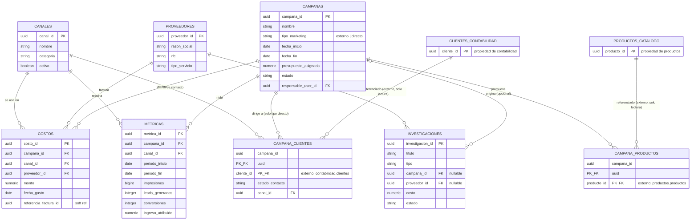

# Contrato Operativo — Módulo de Marketing

| Campo | Valor |
|---|---|
| Documento | `CONTRATO_MODULO_MARKETING.md` |
| Versión | 1.0 |
| Fecha | 2026-09-11 |
| Área responsable | Marketing (comercializadora nacional) |
| Schema PostgreSQL | `marketing` |
| Estado | Borrador para revisión de arquitectura antes de iniciar el sprint de 8 días |

> Este documento es la **fuente única de verdad** del módulo de Marketing dentro del sistema de 6 áreas de la comercializadora. Debe vivir en la raíz del repositorio (o carpeta `/marketing`) y ser leído por completo por cualquier agente de código antes de generar migraciones, código o documentación relacionada con este módulo.

## Tabla de contenido

1. [Cómo debe usar este documento un agente de código](#1-cómo-debe-usar-este-documento-un-agente-de-código)
2. [Contexto de negocio](#2-contexto-de-negocio)
3. [Alcance del área](#3-alcance-del-área)
4. [Modelo entidad-relación (canónico)](#4-modelo-entidad-relación-canónico)
5. [Diccionario de datos](#5-diccionario-de-datos-del-área)
6. [Decisión de diseño: por qué se agregaron dos tablas](#6-decisión-de-diseño-por-qué-se-agregaron-dos-tablas)
7. [Reglas de negocio](#7-reglas-de-negocio)
8. [DDL — PostgreSQL / Supabase](#8-ddl--postgresql--supabase)
9. [Vistas SQL y tabla de contratos por área](#9-vistas-sql-y-tabla-de-contratos-por-área)
10. [Convenciones del repositorio](#10-convenciones-del-repositorio)
11. [Preguntas abiertas — escalar](#11-preguntas-abiertas--escalar)
12. [Equipo y plan de 8 días](#12-equipo-y-plan-de-8-días)
13. [Glosario](#13-glosario)
14. [Contenido de la vista del módulo de Marketing](#14-contenido-de-la-vista-del-módulo-de-marketing)

---

## 1. Cómo debe usar este documento un agente de código

Reglas de uso obligatorias, en orden de prioridad:

1. **Fuente única de verdad.** Este documento define el esquema, las reglas y el alcance del módulo de Marketing. Si el código existente contradice este documento, el documento tiene prioridad — el agente debe señalar la discrepancia, no "corregirla" en silencio.
2. **No inventar estructura.** El agente **nunca** debe crear tablas, columnas, relaciones, roles o vistas que no estén definidas aquí. Si una tarea requiere algo no documentado, debe registrarse en la sección [11. Preguntas abiertas](#11-preguntas-abiertas--escalar) y escalarse — no asumirse ni improvisarse.
3. **Límite de escritura por schema.** El agente solo puede crear/alterar objetos dentro del schema `marketing`. Cualquier necesidad de tocar `inventario`, `contabilidad`, `productos`, `rh` o `cumplimiento` requiere coordinación explícita con el equipo dueño (ver sección 9, tabla de contratos) y **no debe hacerse unilateralmente**.
4. **No modificar el diseño sin actualizar el documento.** Todo cambio al esquema de `marketing` (tabla nueva, columna nueva, regla de negocio nueva) se refleja primero (o en el mismo commit) en las secciones 4, 5 y/o 7 de este documento.
5. **Nombres exactos.** Usar exactamente los nombres de tabla/columna en español y sin acentos definidos en la sección 5. No traducir a inglés, no usar sinónimos.
6. **Referencias externas son de solo lectura.** Cualquier tabla fuera de `marketing` (p. ej. `contabilidad.clientes`, `productos.productos`) solo se consulta con `SELECT`. Nunca se generan `INSERT`/`UPDATE`/`DELETE` contra esas tablas desde este módulo.
7. **RLS siempre activo.** Ninguna tabla de `marketing` se crea o se deja sin `ROW LEVEL SECURITY` habilitado. Si el agente genera una tabla nueva, debe replicar el patrón de políticas de la sección 8.
8. **Versionado.** Cambios relevantes a este contrato incrementan la versión en el encabezado y se registran en un changelog al final del archivo (agregar sección si no existe).

---

## 2. Contexto de negocio

La empresa es una **comercializadora mexicana con operación a nivel nacional**, dedicada a la compra, importación/producción y venta de productos electrónicos y de manufactura. El sistema completo se divide en **6 áreas**, cada una desarrollada por un equipo distinto y respaldada por su propio schema de PostgreSQL dentro del mismo proyecto de Supabase:

| # | Área | Responsable de | Schema |
|---|---|---|---|
| 1 | Inventario y Producción Nacional | Entradas de productos electrónicos/manufactura; valor, capital de inversión, volumen de comercialización | `inventario` |
| 2 | Contabilidad y Facturación | Registro contable de valores en factura y comercializadores (clientes) | `contabilidad` |
| 3 | Catálogo de Productos y Kardex | Base de datos de todos los productos; entradas y salidas | `productos` |
| 4 | Recursos Humanos y Nómina | Asignación de salarios, sueldos y bonificaciones a agentes de venta | `rh` |
| 5 | Cumplimiento, Aduanas e Impuestos | Registro, regulación y pago automático de licencias, permisos, impuestos aduanales y de gobierno | `cumplimiento` |
| 6 | **Marketing** ← este documento | Costo, registro e investigación de marketing externo y marketing directo a clientes | `marketing` |

Las 6 áreas comparten la misma base de datos (un único proyecto Supabase/PostgreSQL), separadas por **schemas**, con autenticación centralizada vía `auth.users` de Supabase y un catálogo de roles compartido (`public.perfiles`, ver sección 8).

**Relación de Marketing con las otras áreas:** Marketing necesita **leer** (nunca escribir) el catálogo de clientes de Contabilidad (para marketing directo) y el catálogo de productos (para saber qué se promueve). No tiene relación funcional directa con Inventario, RH ni Cumplimiento.

---

## 3. Alcance del área

### Dentro de alcance (Marketing puede escribir)

Todo el schema `marketing`:

- `marketing.canales`
- `marketing.proveedores`
- `marketing.campanas`
- `marketing.costos`
- `marketing.metricas`
- `marketing.campana_productos`
- `marketing.campana_clientes`
- `marketing.investigaciones`

### Dentro de alcance (Marketing solo lee)

- `contabilidad.clientes` — para poblar el listado de clientes objetivo en campañas directas.
- `productos.productos` — para asociar productos promovidos en una campaña.

### Fuera de alcance (Marketing no toca, ni para leer, salvo que se documente lo contrario)

- Movimientos de inventario/kardex (`productos.kardex_movimientos`, `inventario.*`).
- Facturación y contabilidad general (`contabilidad.facturas`, pólizas, catálogos contables) — solo existe una **referencia suave** (ver sección 5) mientras se define la integración formal.
- Nómina y expedientes de empleados (`rh.*`) — Marketing no gestiona sueldos ni comisiones de agentes de venta; solo referencia al usuario responsable vía `auth.users`, nunca vía `rh.empleados` (ver sección 6 y pregunta abierta #4).
- Licencias, permisos, impuestos aduanales (`cumplimiento.*`).

---

## 4. Modelo entidad-relación (canónico)



### Cardinalidades en texto (respaldo si el renderer no soporta Mermaid)

| Relación | Cardinalidad |
|---|---|
| `campanas` → `costos` | 1 campaña : N costos |
| `campanas` → `metricas` | 1 campaña : N métricas |
| `canales` → `costos` | 1 canal : N costos |
| `canales` → `metricas` | 1 canal : N métricas (nullable) |
| `proveedores` → `costos` | 1 proveedor : N costos (nullable) |
| `campanas` ↔ `productos.productos` | N : M vía `campana_productos` |
| `campanas` ↔ `contabilidad.clientes` | N : M vía `campana_clientes` (solo campañas `tipo_marketing = 'directo'`) |
| `campanas` → `investigaciones` | 1 campaña : N investigaciones (opcional; una investigación puede no tener campaña) |
| `proveedores` → `investigaciones` | 1 proveedor : N investigaciones (opcional) |

---

## 5. Diccionario de datos del área

### `marketing.canales`

| Columna | Tipo | Nulo | Default | Descripción |
|---|---|---|---|---|
| canal_id | uuid | No | `gen_random_uuid()` | PK |
| nombre | varchar(100) | No | — | Nombre único del canal (TV, Radio, Redes Sociales, Email, SMS, etc.) |
| categoria | varchar(20) | No | — | `tradicional` / `digital` / `directo` / `eventos` |
| descripcion | text | Sí | — | Detalle libre |
| activo | boolean | No | `true` | Baja lógica |
| created_at / updated_at | timestamptz | No | `now()` | Auditoría |

### `marketing.proveedores`

| Columna | Tipo | Nulo | Default | Descripción |
|---|---|---|---|---|
| proveedor_id | uuid | No | `gen_random_uuid()` | PK |
| razon_social | varchar(200) | No | — | Nombre de la agencia/medio/proveedor |
| rfc | varchar(13) | Sí | — | RFC mexicano (persona física o moral) |
| tipo_servicio | varchar(50) | No | — | `agencia` / `medio` / `freelancer` / `plataforma_digital` / `estudio_mercado` / `otro` |
| contacto_nombre / email / telefono | varchar | Sí | — | Datos de contacto |
| activo | boolean | No | `true` | Baja lógica |
| created_at / updated_at | timestamptz | No | `now()` | Auditoría |

### `marketing.campanas` (entidad central)

| Columna | Tipo | Nulo | Default | Descripción |
|---|---|---|---|---|
| campana_id | uuid | No | `gen_random_uuid()` | PK |
| nombre | varchar(200) | No | — | Nombre de la campaña |
| tipo_marketing | varchar(10) | No | — | `externo` (mercado general) o `directo` (clientes identificados) |
| objetivo | text | Sí | — | Objetivo de negocio de la campaña |
| descripcion | text | Sí | — | Detalle libre |
| fecha_inicio | date | No | — | Inicio planeado/real |
| fecha_fin | date | Sí | — | Fin planeado/real |
| presupuesto_asignado | numeric(14,2) | No | — | Techo de gasto autorizado, en `moneda` |
| moneda | char(3) | No | `'MXN'` | ISO 4217 |
| estado | varchar(20) | No | `'planeada'` | `planeada` / `activa` / `pausada` / `finalizada` / `cancelada` |
| responsable_user_id | uuid | Sí | — | FK a `auth.users(id)`, usuario que administra la campaña (ver sección 6) |
| created_by | uuid | Sí | — | FK a `auth.users(id)` |
| created_at / updated_at | timestamptz | No | `now()` | Auditoría |

### `marketing.costos`

| Columna | Tipo | Nulo | Default | Descripción |
|---|---|---|---|---|
| costo_id | uuid | No | `gen_random_uuid()` | PK |
| campana_id | uuid | No | — | FK a `campanas` |
| canal_id | uuid | No | — | FK a `canales` |
| proveedor_id | uuid | Sí | — | FK a `proveedores` (nulo si es gasto interno) |
| concepto | varchar(200) | No | — | Descripción del gasto |
| monto | numeric(14,2) | No | — | Debe ser > 0 |
| moneda | char(3) | No | `'MXN'` | ISO 4217 |
| fecha_gasto | date | No | — | Fecha del gasto |
| referencia_factura_id | uuid | Sí | — | **Referencia suave** (sin FK) a `contabilidad.facturas`; ver pregunta abierta #1 |
| estado_pago | varchar(20) | No | `'pendiente'` | `pendiente` / `pagado` / `cancelado` |
| created_at / updated_at | timestamptz | No | `now()` | Auditoría |

### `marketing.metricas`

| Columna | Tipo | Nulo | Default | Descripción |
|---|---|---|---|---|
| metrica_id | uuid | No | `gen_random_uuid()` | PK |
| campana_id | uuid | No | — | FK a `campanas` |
| canal_id | uuid | Sí | — | FK a `canales`; nulo = métrica agregada de toda la campaña |
| periodo_inicio / periodo_fin | date | No | — | Ventana de tiempo que cubre la métrica |
| impresiones | bigint | No | `0` | |
| alcance | bigint | No | `0` | Reach único |
| clics | bigint | No | `0` | |
| leads_generados | integer | No | `0` | |
| conversiones | integer | No | `0` | |
| ingreso_atribuido | numeric(14,2) | No | `0` | Ingreso estimado/atribuido a la campaña |
| fuente_dato | varchar(100) | Sí | — | Ej. `Meta Ads`, `Google Analytics`, `CRM interno`, `Manual` |
| created_at / updated_at | timestamptz | No | `now()` | Auditoría |

### `marketing.campana_productos` (junction, referencia externa)

| Columna | Tipo | Nulo | Descripción |
|---|---|---|---|
| campana_id | uuid | No | FK a `campanas`, parte de PK compuesta |
| producto_id | uuid | No | FK a `productos.productos(producto_id)` — **propiedad del área Productos**, parte de PK compuesta |
| created_at | timestamptz | No | Auditoría |

### `marketing.campana_clientes` (junction, referencia externa) — tabla agregada #1

| Columna | Tipo | Nulo | Default | Descripción |
|---|---|---|---|---|
| campana_id | uuid | No | — | FK a `campanas`, parte de PK compuesta |
| cliente_id | uuid | No | — | FK a `contabilidad.clientes(cliente_id)` — **propiedad del área Contabilidad**, parte de PK compuesta |
| canal_id | uuid | Sí | — | Canal usado para contactar a este cliente en particular |
| fecha_contacto | date | Sí | — | |
| estado_contacto | varchar(20) | No | `'objetivo'` | `objetivo` / `contactado` / `respondio` / `convertido` / `no_interesado` |
| notas | text | Sí | — | |
| created_at / updated_at | timestamptz | No | `now()` | Auditoría |

### `marketing.investigaciones` (tabla agregada #2)

| Columna | Tipo | Nulo | Default | Descripción |
|---|---|---|---|---|
| investigacion_id | uuid | No | `gen_random_uuid()` | PK |
| titulo | varchar(200) | No | — | |
| tipo | varchar(30) | No | — | `encuesta` / `focus_group` / `analisis_mercado` / `benchmarking_competencia` / `estudio_satisfaccion` / `otro` |
| campana_id | uuid | Sí | — | FK a `campanas`; nulo si es investigación independiente |
| objetivo | text | Sí | — | |
| metodologia | text | Sí | — | |
| tamano_muestra | integer | Sí | — | |
| proveedor_id | uuid | Sí | — | FK a `proveedores`, si fue tercerizada |
| costo | numeric(14,2) | No | `0` | |
| fecha_inicio / fecha_fin | date | Sí | — | |
| estado | varchar(20) | No | `'planeada'` | `planeada` / `en_curso` / `finalizada` / `cancelada` |
| resumen_hallazgos | text | Sí | — | |
| url_reporte | text | Sí | — | Link a Supabase Storage u otro repositorio |
| created_by | uuid | Sí | — | FK a `auth.users(id)` |
| created_at / updated_at | timestamptz | No | `now()` | Auditoría |

---

## 6. Decisión de diseño: por qué se agregaron dos tablas

El diseño inicial "obvio" para este módulo cubre solo el ciclo básico de una campaña: `canales`, `proveedores`, `campanas`, `costos`, `metricas` y `campana_productos` (6 tablas). Al analizar a fondo el requerimiento de negocio — *"costo, registro **e investigación** de marketing externo **y marketing directo a clientes**"* — se identificaron dos necesidades que ese diseño inicial no resolvía bien, y que dieron lugar a las dos tablas adicionales:

### Tabla agregada #1 — `marketing.campana_clientes`

**Problema:** el requerimiento distingue explícitamente entre marketing *externo* (dirigido al mercado en general) y marketing *directo a clientes* (dirigido a personas identificadas). Con el diseño inicial, esa distinción vivía únicamente en un campo `tipo_marketing` de texto en `campanas`, pero no había forma de saber **a qué clientes específicos** se dirigió una campaña directa, ni de dar seguimiento a su respuesta individual (contactado, respondió, convirtió).

**Alternativas consideradas y descartadas:**
- Guardar un arreglo (`array`) de `cliente_id` dentro de `campanas`: rompe la integridad referencial, no permite RLS por fila, no permite registrar estado de contacto por cliente, y dificulta el reporteo.
- Duplicar datos del cliente dentro de `marketing`: viola el principio de una sola fuente de verdad (Contabilidad es dueña de `clientes`) y generaría inconsistencias.

**Decisión:** una tabla de unión (`campana_clientes`) que referencia por FK a `contabilidad.clientes` (solo lectura) y agrega atributos propios de Marketing (`estado_contacto`, `canal_id`, `fecha_contacto`, `notas`). Esto habilita reporteo de efectividad de marketing directo (ver vista `v_directo_desempeno`, sección 9) sin invadir el dominio de Contabilidad.

### Tabla agregada #2 — `marketing.investigaciones`

**Problema:** "investigación de marketing" (estudios de mercado, encuestas, benchmarking de competencia) es una actividad de negocio **distinta** de ejecutar una campaña: tiene su propio ciclo de vida, metodología, tamaño de muestra y hallazgos, y en muchos casos **no está ligada a ninguna campaña concreta** (por ejemplo, un estudio de mercado exploratorio antes de decidir si se lanza una campaña).

**Alternativas consideradas y descartadas:**
- Agregar campos nullable (`metodologia`, `tamano_muestra`, `hallazgos`...) directamente a `campanas`: infla la tabla central con atributos que no aplican a la mayoría de los registros, mezcla dos procesos de negocio con reglas y aprobaciones distintas, y complica las políticas de RLS (¿quién puede editar hallazgos de investigación vs. quién administra presupuesto de campaña?).
- Registrar la investigación como un "costo" más en `costos`: pierde toda la información cualitativa (metodología, hallazgos, muestra) que sí importa para este tipo de actividad.

**Decisión:** una tabla propia `investigaciones`, con `campana_id` **opcional** (nullable, `ON DELETE SET NULL`), que puede existir de forma independiente o asociarse a una campaña cuando aplique.

> Nota de diseño adicional (no es una tabla nueva, pero es relevante): `campanas.responsable_user_id` referencia `auth.users`, **no** `rh.empleados`, para no acoplar el avance de Marketing al del equipo de RH durante el sprint de 8 días. Ver pregunta abierta #4.

---

## 7. Reglas de negocio

1. Toda campaña debe declarar `tipo_marketing` (`externo` o `directo`) desde su creación.
2. Solo campañas con `tipo_marketing = 'directo'` pueden tener filas en `campana_clientes`; se valida con trigger (sección 8), no solo con convención.
3. La suma de `costos.monto` de una campaña **no puede exceder** `campanas.presupuesto_asignado`; se valida con trigger al insertar/actualizar un costo.
4. No se permite borrado físico de una campaña que ya tiene costos asociados (`ON DELETE RESTRICT`); para "eliminarla" se usa `estado = 'cancelada'`.
5. Solo los roles `marketing_admin` y `marketing_editor` pueden crear/editar campañas, costos, métricas e investigaciones. El rol `marketing_viewer` solo tiene lectura. Ver políticas RLS en sección 8.
6. Solo `marketing_admin` puede borrar registros (donde el borrado esté permitido) y administrar los catálogos `canales`/`proveedores`.
7. `producto_id` en `campana_productos` y `cliente_id` en `campana_clientes` deben existir en sus tablas de origen (`productos.productos`, `contabilidad.clientes`); la integridad se garantiza por FK cross-schema.
8. Si Contabilidad o Productos necesitan dar de baja un cliente/producto referenciado por Marketing, se recomienda **baja lógica** (`activo = false`) en sus tablas en vez de `DELETE` físico, para no bloquearse contra las FK de Marketing (ver pregunta abierta #1).
9. Toda fila con `updated_at` se actualiza automáticamente mediante trigger; ningún cliente de la aplicación debe escribir ese campo manualmente.
10. `fecha_fin` de una campaña, si existe, no puede ser anterior a `fecha_inicio` (constraint `CHECK`).

---

## 8. DDL — PostgreSQL / Supabase

> Ejecutar en orden. Requiere que el proyecto tenga habilitada la extensión `pgcrypto` (Supabase la trae por defecto).

### 8.1 Schema y extensión

```sql
create extension if not exists pgcrypto;
create schema if not exists marketing;
```

### 8.2 Supuestos externos (no se crean aquí — propiedad de otras áreas)

```sql
-- Contabilidad debe confirmar y exponer:
--   contabilidad.clientes(cliente_id uuid primary key, razon_social text, estado text, ...)
-- Productos debe confirmar y exponer:
--   productos.productos(producto_id uuid primary key, nombre text, activo boolean, ...)
-- Ver "Preguntas abiertas #1" antes de ejecutar los FK cross-schema de la sección 8.4.
```

### 8.3 Tablas propias del área

```sql
create table marketing.canales (
    canal_id      uuid primary key default gen_random_uuid(),
    nombre        varchar(100) not null unique,
    categoria     varchar(20) not null check (categoria in ('tradicional','digital','directo','eventos')),
    descripcion   text,
    activo        boolean not null default true,
    created_at    timestamptz not null default now(),
    updated_at    timestamptz not null default now()
);

create table marketing.proveedores (
    proveedor_id      uuid primary key default gen_random_uuid(),
    razon_social      varchar(200) not null,
    rfc               varchar(13),
    tipo_servicio     varchar(50) not null check (tipo_servicio in
                        ('agencia','medio','freelancer','plataforma_digital','estudio_mercado','otro')),
    contacto_nombre   varchar(150),
    contacto_email    varchar(150),
    contacto_telefono varchar(20),
    activo            boolean not null default true,
    created_at        timestamptz not null default now(),
    updated_at        timestamptz not null default now()
);

create table marketing.campanas (
    campana_id            uuid primary key default gen_random_uuid(),
    nombre                varchar(200) not null,
    tipo_marketing        varchar(10) not null check (tipo_marketing in ('externo','directo')),
    objetivo              text,
    descripcion           text,
    fecha_inicio          date not null,
    fecha_fin             date,
    presupuesto_asignado  numeric(14,2) not null check (presupuesto_asignado >= 0),
    moneda                char(3) not null default 'MXN',
    estado                varchar(20) not null default 'planeada'
                            check (estado in ('planeada','activa','pausada','finalizada','cancelada')),
    responsable_user_id   uuid references auth.users(id),
    created_by            uuid references auth.users(id),
    created_at            timestamptz not null default now(),
    updated_at            timestamptz not null default now(),
    check (fecha_fin is null or fecha_fin >= fecha_inicio)
);

create table marketing.costos (
    costo_id                uuid primary key default gen_random_uuid(),
    campana_id              uuid not null references marketing.campanas(campana_id) on delete restrict,
    canal_id                uuid not null references marketing.canales(canal_id),
    proveedor_id            uuid references marketing.proveedores(proveedor_id),
    concepto                varchar(200) not null,
    monto                   numeric(14,2) not null check (monto > 0),
    moneda                  char(3) not null default 'MXN',
    fecha_gasto             date not null,
    referencia_factura_id   uuid, -- referencia suave a contabilidad.facturas (pregunta abierta #1)
    estado_pago             varchar(20) not null default 'pendiente'
                              check (estado_pago in ('pendiente','pagado','cancelado')),
    created_at              timestamptz not null default now(),
    updated_at              timestamptz not null default now()
);

create table marketing.metricas (
    metrica_id         uuid primary key default gen_random_uuid(),
    campana_id         uuid not null references marketing.campanas(campana_id) on delete cascade,
    canal_id           uuid references marketing.canales(canal_id),
    periodo_inicio     date not null,
    periodo_fin        date not null,
    impresiones        bigint not null default 0,
    alcance            bigint not null default 0,
    clics              bigint not null default 0,
    leads_generados    integer not null default 0,
    conversiones       integer not null default 0,
    ingreso_atribuido  numeric(14,2) not null default 0,
    fuente_dato        varchar(100),
    created_at         timestamptz not null default now(),
    updated_at         timestamptz not null default now(),
    check (periodo_fin >= periodo_inicio)
);

create table marketing.investigaciones (
    investigacion_id   uuid primary key default gen_random_uuid(),
    titulo             varchar(200) not null,
    tipo               varchar(30) not null check (tipo in
                          ('encuesta','focus_group','analisis_mercado','benchmarking_competencia','estudio_satisfaccion','otro')),
    campana_id         uuid references marketing.campanas(campana_id) on delete set null,
    objetivo           text,
    metodologia        text,
    tamano_muestra     integer,
    proveedor_id       uuid references marketing.proveedores(proveedor_id),
    costo              numeric(14,2) not null default 0,
    fecha_inicio       date,
    fecha_fin          date,
    estado             varchar(20) not null default 'planeada'
                          check (estado in ('planeada','en_curso','finalizada','cancelada')),
    resumen_hallazgos  text,
    url_reporte        text,
    created_by         uuid references auth.users(id),
    created_at         timestamptz not null default now(),
    updated_at         timestamptz not null default now()
);
```

### 8.4 Tablas de referencia cross-schema (agregadas por diseño)

```sql
-- Requiere que existan contabilidad.clientes y productos.productos (ver 8.2 y pregunta abierta #1)

create table marketing.campana_productos (
    campana_id   uuid not null references marketing.campanas(campana_id) on delete cascade,
    producto_id  uuid not null references productos.productos(producto_id),
    created_at   timestamptz not null default now(),
    primary key (campana_id, producto_id)
);

create table marketing.campana_clientes (
    campana_id       uuid not null references marketing.campanas(campana_id) on delete cascade,
    cliente_id       uuid not null references contabilidad.clientes(cliente_id),
    canal_id         uuid references marketing.canales(canal_id),
    fecha_contacto   date,
    estado_contacto  varchar(20) not null default 'objetivo'
                        check (estado_contacto in ('objetivo','contactado','respondio','convertido','no_interesado')),
    notas            text,
    created_at       timestamptz not null default now(),
    updated_at       timestamptz not null default now(),
    primary key (campana_id, cliente_id)
);
```

### 8.5 Índices

```sql
create index idx_campanas_estado         on marketing.campanas(estado);
create index idx_campanas_tipo           on marketing.campanas(tipo_marketing);
create index idx_campanas_fechas         on marketing.campanas(fecha_inicio, fecha_fin);

create index idx_costos_campana          on marketing.costos(campana_id);
create index idx_costos_canal            on marketing.costos(canal_id);
create index idx_costos_fecha            on marketing.costos(fecha_gasto);

create index idx_metricas_campana        on marketing.metricas(campana_id);
create index idx_metricas_periodo        on marketing.metricas(periodo_inicio);

create index idx_campana_productos_prod  on marketing.campana_productos(producto_id);
create index idx_campana_clientes_cli    on marketing.campana_clientes(cliente_id);
create index idx_investigaciones_campana on marketing.investigaciones(campana_id);
```

### 8.6 Triggers

**8.6.1 `updated_at` automático**

```sql
create or replace function marketing.fn_set_updated_at()
returns trigger
language plpgsql
as $$
begin
    new.updated_at = now();
    return new;
end;
$$;

do $$
declare
    t text;
    tablas text[] := array['canales','proveedores','campanas','costos','metricas',
                            'campana_clientes','investigaciones'];
begin
    foreach t in array tablas loop
        execute format(
            'create trigger trg_%1$s_updated_at before update on marketing.%1$I
             for each row execute function marketing.fn_set_updated_at()', t);
    end loop;
end $$;
```

**8.6.2 Validación: solo campañas `directo` pueden tener clientes objetivo (regla de negocio #2)**

```sql
create or replace function marketing.fn_validar_campana_directa()
returns trigger
language plpgsql
as $$
declare
    v_tipo varchar(10);
begin
    select tipo_marketing into v_tipo
    from marketing.campanas
    where campana_id = new.campana_id;

    if v_tipo is distinct from 'directo' then
        raise exception
          'La campaña % no es de tipo directo; no se puede asignar clientes objetivo.',
          new.campana_id;
    end if;

    return new;
end;
$$;

create trigger trg_campana_clientes_valida_tipo
before insert on marketing.campana_clientes
for each row execute function marketing.fn_validar_campana_directa();
```

**8.6.3 Validación: costos no exceden el presupuesto de la campaña (regla de negocio #3)**

```sql
create or replace function marketing.fn_validar_presupuesto()
returns trigger
language plpgsql
as $$
declare
    v_presupuesto numeric(14,2);
    v_gasto_total numeric(14,2);
begin
    select presupuesto_asignado into v_presupuesto
    from marketing.campanas
    where campana_id = new.campana_id;

    select coalesce(sum(monto), 0) into v_gasto_total
    from marketing.costos
    where campana_id = new.campana_id;

    if v_gasto_total > v_presupuesto then
        raise exception
          'El gasto total (% ) excede el presupuesto asignado (% ) de la campaña %.',
          v_gasto_total, v_presupuesto, new.campana_id;
    end if;

    return new;
end;
$$;

create trigger trg_costos_valida_presupuesto
after insert or update on marketing.costos
for each row execute function marketing.fn_validar_presupuesto();
```

### 8.7 Roles y RLS

Se asume un catálogo de roles compartido a nivel de proyecto (ver pregunta abierta #3):

```sql
create table if not exists public.perfiles (
    user_id  uuid primary key references auth.users(id),
    area     text,
    rol      text not null
    -- roles usados por Marketing: 'marketing_admin', 'marketing_editor',
    -- 'marketing_viewer', 'admin_general'
);

create or replace function marketing.usuario_tiene_rol(roles_permitidos text[])
returns boolean
language sql
security definer
stable
as $$
    select exists (
        select 1 from public.perfiles p
        where p.user_id = auth.uid()
        and p.rol = any(roles_permitidos)
    );
$$;
```

```sql
grant usage on schema marketing to authenticated;
grant select, insert, update on all tables in schema marketing to authenticated;

do $$
declare
    t text;
    tablas_transaccionales text[] := array['campanas','costos','metricas',
                                            'campana_productos','campana_clientes','investigaciones'];
    tablas_catalogo text[] := array['canales','proveedores'];
begin
    -- Tablas transaccionales: viewer = lectura, editor/admin = escritura, admin = borrado
    foreach t in array tablas_transaccionales loop
        execute format('alter table marketing.%I enable row level security', t);

        execute format($f$
            create policy "%1$s_select" on marketing.%1$I for select to authenticated
            using ( marketing.usuario_tiene_rol(array['marketing_admin','marketing_editor','marketing_viewer','admin_general']) )
        $f$, t);

        execute format($f$
            create policy "%1$s_insert" on marketing.%1$I for insert to authenticated
            with check ( marketing.usuario_tiene_rol(array['marketing_admin','marketing_editor']) )
        $f$, t);

        execute format($f$
            create policy "%1$s_update" on marketing.%1$I for update to authenticated
            using ( marketing.usuario_tiene_rol(array['marketing_admin','marketing_editor']) )
            with check ( marketing.usuario_tiene_rol(array['marketing_admin','marketing_editor']) )
        $f$, t);

        execute format($f$
            create policy "%1$s_delete" on marketing.%1$I for delete to authenticated
            using ( marketing.usuario_tiene_rol(array['marketing_admin']) )
        $f$, t);
    end loop;

    -- Catálogos: cualquier rol de marketing lee; solo admin administra
    foreach t in array tablas_catalogo loop
        execute format('alter table marketing.%I enable row level security', t);

        execute format($f$
            create policy "%1$s_select" on marketing.%1$I for select to authenticated
            using ( marketing.usuario_tiene_rol(array['marketing_admin','marketing_editor','marketing_viewer','admin_general']) )
        $f$, t);

        execute format($f$
            create policy "%1$s_admin_all" on marketing.%1$I for all to authenticated
            using ( marketing.usuario_tiene_rol(array['marketing_admin']) )
            with check ( marketing.usuario_tiene_rol(array['marketing_admin']) )
        $f$, t);
    end loop;
end $$;
```

> **Nota:** el rol `service_role` de Supabase omite RLS por defecto; no requiere políticas adicionales.

---

## 9. Vistas SQL y tabla de contratos por área

### 9.1 Vistas

```sql
create or replace view marketing.v_campana_resumen
with (security_invoker = true) as
select
    c.campana_id,
    c.nombre,
    c.tipo_marketing,
    c.estado,
    c.fecha_inicio,
    c.fecha_fin,
    c.presupuesto_asignado,
    coalesce(g.gasto_total, 0)                                   as gasto_total,
    c.presupuesto_asignado - coalesce(g.gasto_total, 0)          as presupuesto_restante,
    case when c.presupuesto_asignado > 0
         then round(coalesce(g.gasto_total,0) / c.presupuesto_asignado * 100, 2)
         else 0 end                                              as pct_ejercido,
    coalesce(m.leads_generados, 0)                                as leads_generados,
    coalesce(m.conversiones, 0)                                   as conversiones,
    coalesce(m.ingreso_atribuido, 0)                              as ingreso_atribuido,
    case when coalesce(g.gasto_total,0) > 0
         then round((coalesce(m.ingreso_atribuido,0) - g.gasto_total) / g.gasto_total, 4)
         else null end                                            as roi
from marketing.campanas c
left join (
    select campana_id, sum(monto) as gasto_total
    from marketing.costos group by campana_id
) g on g.campana_id = c.campana_id
left join (
    select campana_id,
           sum(leads_generados) as leads_generados,
           sum(conversiones)    as conversiones,
           sum(ingreso_atribuido) as ingreso_atribuido
    from marketing.metricas group by campana_id
) m on m.campana_id = c.campana_id;

create or replace view marketing.v_costos_por_canal
with (security_invoker = true) as
select
    ca.canal_id,
    ca.nombre as canal,
    count(distinct co.campana_id) as campanas_relacionadas,
    coalesce(sum(co.monto), 0)    as gasto_total
from marketing.canales ca
left join marketing.costos co on co.canal_id = ca.canal_id
group by ca.canal_id, ca.nombre
order by gasto_total desc nulls last;

create or replace view marketing.v_directo_desempeno
with (security_invoker = true) as
select
    c.campana_id,
    c.nombre,
    count(cc.cliente_id) as total_objetivo,
    count(cc.cliente_id) filter (where cc.estado_contacto in ('contactado','respondio','convertido')) as total_contactados,
    count(cc.cliente_id) filter (where cc.estado_contacto = 'convertido') as total_convertidos,
    case when count(cc.cliente_id) > 0
         then round(count(cc.cliente_id) filter (where cc.estado_contacto = 'convertido')::numeric
                     / count(cc.cliente_id) * 100, 2)
         else 0 end as tasa_conversion_pct
from marketing.campanas c
join marketing.campana_clientes cc on cc.campana_id = c.campana_id
where c.tipo_marketing = 'directo'
group by c.campana_id, c.nombre;

grant select on marketing.v_campana_resumen, marketing.v_costos_por_canal, marketing.v_directo_desempeno
    to authenticated;
```

> `security_invoker = true` obliga a que la vista respete el RLS del usuario que consulta, no del dueño de la vista (requiere PostgreSQL 15+, disponible en Supabase).

### 9.2 Tabla de contratos por área

| Área | Schema | Tabla(s) | Acceso desde Marketing | Notas |
|---|---|---|---|---|
| Contabilidad | `contabilidad` | `clientes` | `SELECT` (solo lectura) | FK real desde `campana_clientes`; requiere columnas confirmadas (pregunta abierta #1) |
| Contabilidad | `contabilidad` | `facturas` | Sin acceso directo (referencia suave por UUID) | Ver pregunta abierta #2 |
| Productos | `productos` | `productos` | `SELECT` (solo lectura) | FK real desde `campana_productos` |
| Productos | `productos` | `kardex_movimientos` | Ninguno | Fuera de alcance |
| RH | `rh` | `empleados`, `nomina` | Ninguno | Marketing usa `auth.users`, no `rh.empleados` (pregunta abierta #4) |
| Inventario | `inventario` | * | Ninguno | Sin relación funcional con Marketing |
| Cumplimiento | `cumplimiento` | * | Ninguno | Sin relación funcional con Marketing |
| **Marketing** | `marketing` | Las 8 tablas de la sección 5 | `SELECT`/`INSERT`/`UPDATE`/`DELETE` (control total, según rol) | Área propia |
| Compartido | `public` | `perfiles` | `SELECT` (vía función `usuario_tiene_rol`) | Tabla de roles compartida entre las 6 áreas (pregunta abierta #3) |

---

## 10. Convenciones del repositorio

### 10.1 Estructura de carpetas

```
/marketing
├── CONTRATO_MODULO_MARKETING.md      <- este documento
├── db/
│   ├── migrations/
│   │   ├── 0001_schema_marketing.sql
│   │   ├── 0002_tablas_core.sql
│   │   ├── 0003_tablas_referencia_externa.sql
│   │   ├── 0004_indices.sql
│   │   ├── 0005_triggers.sql
│   │   ├── 0006_rls.sql
│   │   └── 0007_vistas.sql
│   └── seeds/
│       └── seed_canales_proveedores.sql
├── src/
│   ├── api/
│   │   ├── campanas.ts
│   │   ├── costos.ts
│   │   ├── metricas.ts
│   │   ├── investigaciones.ts
│   │   └── referencias-externas.ts   <- lectura de clientes/productos
│   ├── components/
│   │   ├── DashboardMarketing.tsx
│   │   ├── CampanaForm.tsx
│   │   ├── CampanaDetalle.tsx
│   │   └── InvestigacionCard.tsx
│   ├── hooks/
│   │   ├── useCampanas.ts
│   │   └── useCostos.ts
│   └── types/
│       └── marketing.types.ts        <- generado con `supabase gen types typescript`
└── tests/
    ├── rls.test.ts
    └── reglas-negocio.test.ts
```

### 10.2 Convenciones de nombres

- **Base de datos:** `snake_case`, español, sin acentos. PK: `<entidad>_id`. FK: mismo nombre que la PK referenciada.
- **TypeScript:** `camelCase` para variables/funciones, `PascalCase` para componentes y tipos.
- **Enums de negocio** (`tipo_marketing`, `estado`, etc.) se mantienen como `varchar` + `CHECK` (no `ENUM` nativo) para facilitar migraciones futuras sin `ALTER TYPE`.

### 10.3 Commits (Conventional Commits)

```
feat(marketing): agrega tabla de investigaciones de mercado
fix(marketing): corrige trigger de validación de presupuesto
docs(marketing): actualiza diccionario de datos
refactor(marketing): normaliza vista v_campana_resumen
test(marketing): agrega pruebas de RLS para campana_clientes
chore(marketing): actualiza seeds de canales
```

Ramas: `marketing/feature/<nombre>`, `marketing/fix/<nombre>`.

### 10.4 Ejemplos con `supabase-js`

> Requiere agregar `marketing` (y `contabilidad` si aplica) en **Project Settings → API → Exposed schemas** de Supabase; por defecto solo `public` está expuesto vía PostgREST.

```ts
import { createClient } from '@supabase/supabase-js'

export const supabase = createClient(
  process.env.NEXT_PUBLIC_SUPABASE_URL!,
  process.env.NEXT_PUBLIC_SUPABASE_ANON_KEY!
)
```

```ts
// Listar resumen de campañas (usa la vista con RLS respetado)
export async function obtenerResumenCampanas() {
  const { data, error } = await supabase
    .schema('marketing')
    .from('v_campana_resumen')
    .select('*')
    .order('fecha_inicio', { ascending: false })

  if (error) throw error
  return data
}
```

```ts
// Crear una campaña
export async function crearCampana(payload: {
  nombre: string
  tipoMarketing: 'externo' | 'directo'
  objetivo?: string
  fechaInicio: string
  fechaFin?: string
  presupuesto: number
  responsableId?: string
}) {
  const { data, error } = await supabase
    .schema('marketing')
    .from('campanas')
    .insert({
      nombre: payload.nombre,
      tipo_marketing: payload.tipoMarketing,
      objetivo: payload.objetivo,
      fecha_inicio: payload.fechaInicio,
      fecha_fin: payload.fechaFin,
      presupuesto_asignado: payload.presupuesto,
      responsable_user_id: payload.responsableId,
    })
    .select()
    .single()

  if (error) throw error
  return data
}
```

```ts
// Registrar un costo (el trigger valida presupuesto automáticamente)
export async function registrarCosto(costo: {
  campana_id: string
  canal_id: string
  proveedor_id?: string
  concepto: string
  monto: number
  fecha_gasto: string
}) {
  const { data, error } = await supabase
    .schema('marketing')
    .from('costos')
    .insert(costo)
    .select()
    .single()

  if (error) throw error // incluye el error del trigger si excede presupuesto
  return data
}
```

```ts
// Buscar clientes activos (lectura de referencia externa, propiedad de Contabilidad)
export async function buscarClientesParaCampanaDirecta(texto: string) {
  const { data, error } = await supabase
    .schema('contabilidad')
    .from('clientes')
    .select('cliente_id, razon_social, estado')
    .ilike('razon_social', `%${texto}%`)
    .eq('estado', 'activo')
    .limit(20)

  if (error) throw error
  return data
}
```

---

## 11. Preguntas abiertas — escalar

1. **Contrato de datos con Contabilidad.** ¿Cuál es el nombre y tipo exacto de la PK de `contabilidad.clientes`? ¿Contabilidad usará baja lógica (`activo=false`) en vez de `DELETE` físico para no chocar con las FK de `campana_clientes`? — *Escalar a: líder técnico del equipo de Contabilidad, antes de correr las migraciones de la sección 8.4.*
2. **Integración con facturación real.** ¿Se requiere en esta fase vincular `marketing.costos.referencia_factura_id` con `contabilidad.facturas` mediante FK real, o basta con el campo manual actual para calcular ROI? — *Escalar a: Product Owner del proyecto.*
3. **Gobierno del catálogo de roles.** `public.perfiles` se asume compartido entre las 6 áreas. ¿Quién es dueño de esa tabla y del proceso de alta de roles (`marketing_admin`, etc.)? — *Escalar a: arquitecto general del proyecto.*
4. **Vínculo con RH.** ¿El "responsable" de una campaña debe eventualmente ligarse a `rh.empleados` (para reportes de desempeño de agentes de venta) o es suficiente con `auth.users`? — *Escalar a: líder técnico de RH + Product Owner.*
5. **Retención y auditoría fiscal.** Dado que hay gastos de marketing con factura asociada, ¿existe una política de retención/archivado exigida por obligaciones ante el SAT, y por cuánto tiempo deben conservarse `costos` e `investigaciones`? — *Escalar a: área legal/fiscal de la empresa.*

---

## 12. Equipo y plan de 8 días

### Roles

| Rol | Responsabilidad |
|---|---|
| Líder técnico / Arquitecto de datos (1) | Dueño de este contrato, del schema `marketing`, migraciones y RLS |
| Desarrollador Backend/DB (1) | Triggers, vistas, seeds, coordinación de FK cross-schema |
| Desarrollador Frontend (1) | Dashboard y formularios del módulo (sección 14) |
| QA (1, puede ser compartido) | Pruebas de RLS, reglas de negocio y casos límite |
| SME de Marketing (parcial) | Valida reglas de negocio, aporta datos reales de campañas/canales |

### Cronograma

| Día | Enfoque | Entregables |
|---|---|---|
| 1 | Kickoff; validar este contrato con líderes de Contabilidad/Productos; cerrar preguntas abiertas #1 y #3 si es posible | ER y alcance confirmados |
| 2 | Migraciones 0001–0003 (schema, tablas core y de referencia) | Base de datos creada en ambiente de desarrollo |
| 3 | Migraciones 0004–0006 (índices, triggers, RLS) + seeds de `canales`/`proveedores` | Reglas de negocio validadas con pruebas manuales |
| 4 | Migración 0007 (vistas) + capa `src/api` con `supabase-js` | Endpoints internos probados |
| 5 | Dashboard y formulario de campañas (frontend) | Vista de campañas funcional |
| 6 | Integración de referencias externas (selector de clientes/productos); vista de marketing directo | Flujo de campaña directa end-to-end |
| 7 | QA: pruebas de RLS por rol, reglas de negocio, casos límite; corrección de bugs | Suite de pruebas verde |
| 8 | Demo, documentación final, actualización de este contrato (changelog), escalamiento formal de preguntas abiertas pendientes | Módulo listo para revisión de arquitectura general |

---

## 13. Glosario

- **Stock:** cantidad de unidades disponibles de un producto en un momento dado.
- **Volumen (de comercialización):** cantidad total de unidades o valor monetario transaccionado en un periodo.
- **Kardex:** registro cronológico de entradas y salidas de un producto, usado para control de existencias (propiedad del área Productos, no de Marketing).
- **Comercializador / Cliente:** persona física o moral que compra productos a la empresa (tabla `contabilidad.clientes`).
- **Campaña de marketing:** conjunto planeado de acciones, con objetivo, presupuesto y periodo definidos, para promover productos o marca.
- **Marketing externo:** acciones dirigidas al mercado general, sin identificar individualmente a los destinatarios (TV, radio, publicidad masiva).
- **Marketing directo:** acciones dirigidas a clientes identificados individualmente (email, SMS, llamadas, correo directo).
- **Lead:** contacto potencial interesado, generado por una acción de marketing.
- **Conversión:** momento en que un lead o cliente objetivo realiza la acción deseada (compra, registro, respuesta).
- **ROI (Retorno de inversión):** relación entre la ganancia atribuida y el costo de una campaña.
- **CPL (Costo por lead):** costo total de campaña dividido entre leads generados.
- **RLS (Row Level Security):** mecanismo de PostgreSQL/Supabase para restringir qué filas puede ver o modificar cada usuario.
- **Schema:** espacio de nombres en PostgreSQL usado para separar tablas por área de negocio.
- **Investigación de mercado:** proceso sistemático de recolección y análisis de información sobre el mercado, la competencia o los clientes.

---

## 14. Contenido de la vista del módulo de Marketing

### Vista 1 — Dashboard general

- **KPIs (tarjetas):** presupuesto total del periodo, gasto ejercido, % ejercido, leads generados, conversiones, ROI promedio.
- **Gráfica de gasto por canal** (consume `v_costos_por_canal`).
- **Gráfica de campañas activas vs. finalizadas** por `tipo_marketing`.
- **Tabla de campañas recientes** con nombre, tipo, estado, presupuesto restante (consume `v_campana_resumen`).
- Filtro global por rango de fechas.

### Vista 2 — Campañas

- **Listado** filtrable por tipo (`externo`/`directo`), estado, canal y rango de fechas; botón "Nueva campaña".
- **Detalle de campaña**, por pestañas:
  - *Información general:* objetivo, fechas, presupuesto, estado, responsable.
  - *Costos:* tabla de gastos, alta de nuevo costo, total ejercido vs. presupuesto.
  - *Métricas:* impresiones, alcance, clics, leads, conversiones, ingreso atribuido por periodo.
  - *Clientes objetivo* (solo si `tipo_marketing = 'directo'`): selector de clientes (lectura de `contabilidad.clientes`), estado de contacto por cliente.
  - *Productos promovidos:* selector de productos (lectura de `productos.productos`).

### Vista 3 — Costos

- Tabla global de gastos con filtros por proveedor, canal y campaña; totales por periodo.

### Vista 4 — Investigación de mercado

- Listado de estudios (`investigaciones`) con tipo, estado y campaña asociada (si aplica).
- Detalle: metodología, tamaño de muestra, resumen de hallazgos, enlace al reporte (`url_reporte`).

### Vista 5 — Catálogos (solo `marketing_admin`)

- Administración de `canales` y `proveedores`: alta, edición, baja lógica (`activo`).

---

## Changelog

- **v1.0 (2026-09-11):** versión inicial del contrato para el sprint de 8 días del módulo de Marketing.
